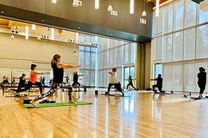

    {1}  [##LOC[OK]##](javascript:void(0);)       [**MENU](https://www.auburnwa.gov/mayor#mMenuCMS)     

 *  [City Hall](https://www.auburnwa.gov/cms/One.aspx?portalId=11470638&pageId=12521441)  
   *  [MayorMeet Auburn Mayor Nancy Backus.](https://www.auburnwa.gov/cms/One.aspx?portalId=11470638&pageId=12521655) 
     *  [Healthy Auburn for Life](https://www.auburnwa.gov/cms/One.aspx?portalId=11470638&pageId=12521662) 
     *  [Proclamation Request Form](https://www.auburnwa.gov/cms/One.aspx?portalId=11470638&pageId=17020191) 
     *  [Request the Mayor for an Event](https://www.auburnwa.gov/cms/One.aspx?portalId=11470638&pageId=16939705) 
     *  [Responsibilities of local, county & state governments](https://www.auburnwa.gov/cms/One.aspx?portalId=11470638&pageId=20488600) 
     *  [Sister Cities Program](https://www.auburnwa.gov/cms/One.aspx?portalId=11470638&pageId=12522723) 
     *  [State of the City](https://www.auburnwa.gov/cms/One.aspx?portalId=11470638&pageId=19451300) 
   *  [City CouncilmembersInformation about Auburn's seven at-large councilmembers.](https://www.auburnwa.gov/cms/One.aspx?portalId=11470638&pageId=12521708) 
     *  [Notice of Council Vacancy Recruitment](https://www.auburnwa.gov/cms/One.aspx?portalId=11470638&pageId=19177135) 
     *  [Cheryl Rakes](https://www.auburnwa.gov/cms/One.aspx?portalId=11470638&pageId=19424702) 
     *  [Kate Baldwin](https://www.auburnwa.gov/cms/One.aspx?portalId=11470638&pageId=18268118) 
     *  [Tracy Taylor-Turner](https://www.auburnwa.gov/cms/One.aspx?portalId=11470638&pageId=16316603) 
     *  [Yolanda Trout-Manuel](https://www.auburnwa.gov/cms/One.aspx?portalId=11470638&pageId=12521755) 
     *  [Clinton Taylor](https://www.auburnwa.gov/cms/One.aspx?portalId=11470638&pageId=16316622) 
     *  [Hanan Amer](https://www.auburnwa.gov/cms/One.aspx?portalId=11470638&pageId=12521769) 
     *  [Junior City Council](https://www.auburnwa.gov/cms/One.aspx?portalId=11470638&pageId=12521781) 
   *  [Agendas & MinutesRetrieve agendas and minutes from City committees, boards, and commissions.](https://www.auburnwa.gov/cms/One.aspx?portalId=11470638&pageId=12954534) 
   *  [Boards & CommissionsInformation on citizen boards and commissions and how to join.](https://www.auburnwa.gov/cms/One.aspx?portalId=11470638&pageId=12522238) 
   *  [City Attorney's OfficeThe City Attorney’s Office does not provide legal advice to residents of Auburn or members of the general public. Find other answers to frequently asked questions.](https://www.auburnwa.gov/cms/One.aspx?portalId=11470638&pageId=14857125) 
     *  [Community Court in Auburn](https://www.auburnwa.gov/cms/One.aspx?portalId=11470638&pageId=17150360) 
   *  [City ClerkApply for a passport, request a copy of a police report or public record, or file a claim for damages form.](https://www.auburnwa.gov/cms/One.aspx?portalId=11470638&pageId=12529012) 
     *  [Passport Services](https://www.auburnwa.gov/cms/One.aspx?portalId=11470638&pageId=12530405) 
     *  [Public Records Request](https://www.auburnwa.gov/cms/One.aspx?portalId=11470638&pageId=12530414) 
     *  [Criminal Justice Records Request](https://www.auburnwa.gov/cms/One.aspx?portalId=11470638&pageId=17373432) 
   *  [City Code, Ordinances, & ResolutionsLook up Auburn's municipal code, ordinances, and resolutions.](https://www.auburnwa.gov/cms/One.aspx?portalId=11470638&pageId=12522257) 
   *  [City ServicesList of City of Auburn services available online or in person with map and addresses.](https://www.auburnwa.gov/cms/One.aspx?portalId=11470638&pageId=12858735) 
   *  [Community DevelopmentThe Community Development Services Department is responsible for administration of the following programs: Long Range Planning, Building and Land Use Permitting, Business Licensing, Code Enforcement.](https://www.auburnwa.gov/cms/One.aspx?portalId=11470638&pageId=12522728) 
     *  [Building Services & Permitting](https://www.auburnwa.gov/cms/One.aspx?portalId=11470638&pageId=18146715) 
     *  [Business Licensing](https://www.auburnwa.gov/cms/One.aspx?portalId=11470638&pageId=18204202) 
     *  [Code Compliance](https://www.auburnwa.gov/cms/One.aspx?portalId=11470638&pageId=12522874) 
     *  [Community Services](https://www.auburnwa.gov/cms/One.aspx?portalId=11470638&pageId=12522571) 
     *  [Development Review Engineering](https://www.auburnwa.gov/cms/One.aspx?portalId=11470638&pageId=18146693) 
     *  [Economic Development](https://www.auburnwa.gov/cms/One.aspx?portalId=11470638&pageId=18204221) 
     *  [Planning Services](https://www.auburnwa.gov/cms/One.aspx?portalId=11470638&pageId=12522753) 
   *  [Contact UsDirectory of frequently used numbers and contacts. Find a phone number, address, or email.](https://www.auburnwa.gov/cms/One.aspx?portalId=11470638&pageId=12531109) 
   *  [CourtPlease visit the King County District Court - South Division website for information about court dates, anti-harassment orders, hearings, cases, jury duty, probation, and fines.](https://www.auburnwa.gov/cms/One.aspx?portalId=11470638&pageId=12522261) 
   *  [DepartmentsView all City departments.](https://www.auburnwa.gov/cms/One.aspx?portalId=11470638&pageId=12531098) 
   *  [Economic DevelopmentStart, Grow, or relocate your business in Auburn.](https://www.auburnwa.gov/cms/One.aspx?portalId=11470638&pageId=20685458) 
   *  [Election InformationHow to run for City Council or Mayor in Auburn.](https://www.auburnwa.gov/cms/One.aspx?portalId=11470638&pageId=19504777) 
   *  [Emergency PreparednessTraining, tips, and alerts on local hazards and how to be ready.](https://www.auburnwa.gov/cms/One.aspx?portalId=11470638&pageId=12528883) 
     *  [Alerts and Updates](https://www.auburnwa.gov/cms/One.aspx?portalId=11470638&pageId=12528905) 
     *  [Local Hazards](https://www.auburnwa.gov/cms/One.aspx?portalId=11470638&pageId=12528894) 
     *  [Training](https://www.auburnwa.gov/cms/One.aspx?portalId=11470638&pageId=12528935) 
     *  [Volunteer](https://www.auburnwa.gov/cms/One.aspx?portalId=11470638&pageId=12528943) 
   *  [EmploymentFind out more about our job openings, benefits, employment process, and more.](https://www.auburnwa.gov/cms/One.aspx?portalId=11470638&pageId=12527904) 
     *  [Benefits](https://www.auburnwa.gov/cms/One.aspx?portalId=11470638&pageId=19995326) 
     *  [How To Apply](https://www.auburnwa.gov/cms/One.aspx?portalId=11470638&pageId=20248948) 
     *  [Internal Only Openings](https://www.auburnwa.gov/cms/One.aspx?portalId=11470638&pageId=12528089) 
     *  [Job Opportunities](https://www.auburnwa.gov/cms/One.aspx?portalId=11470638&pageId=12528096) 
     *  [Police Employment](https://www.auburnwa.gov/cms/One.aspx?portalId=11470638&pageId=19195393) 
     *  [Volunteer Opportunities](https://www.auburnwa.gov/cms/One.aspx?portalId=11470638&pageId=18974928) 
   *  [Fiscal ReportsView all of Auburn's financial reports.](https://www.auburnwa.gov/cms/One.aspx?portalId=11470638&pageId=12527684) 
   *  [Human ServicesThe City of Auburn's mission with regards to human services is to reduce the number of people who are homeless or living in poverty.](https://www.auburnwa.gov/cms/One.aspx?portalId=11470638&pageId=12522603) 
     *  [Community Development Block Grants](https://www.auburnwa.gov/cms/One.aspx?portalId=11470638&pageId=16807203) 
     *  [Homelessness](https://www.auburnwa.gov/cms/One.aspx?portalId=11470638&pageId=20665890) 
     *  [Resource Center of Auburn](https://www.auburnwa.gov/cms/One.aspx?portalId=11470638&pageId=17824708) 
     *  [Resources for Auburn Residents](https://www.auburnwa.gov/cms/One.aspx?portalId=11470638&pageId=16777906) 
     *  [Resources for Service Providers](https://www.auburnwa.gov/cms/One.aspx?portalId=11470638&pageId=16777900) 
   *  [Auburn Maps & GISView Auburn maps and resources provided by our Geographic Information Services (GIS) division.](https://www.auburnwa.gov/cms/One.aspx?portalId=11470638&pageId=20321441) 
   *  [Most Requested DocumentsView a list of our most requested items. If you do not see a category below related to your document, you can also browse or search the document library or use the City Clerks contact info get help finding a document.](https://www.auburnwa.gov/cms/One.aspx?portalId=11470638&pageId=12530737) 
     *  [Auburn Magazine](https://www.auburnwa.gov/cms/One.aspx?portalId=11470638&pageId=16332057) 
     *  [City Code, Ordinances, & Resolutions](https://www.auburnwa.gov/cms/One.aspx?portalId=11470638&pageId=12628866) 
     *  [Commonly Used Forms](https://www.auburnwa.gov/cms/One.aspx?portalId=11470638&pageId=12530740) 
     *  [Fiscal Reports](https://www.auburnwa.gov/cms/One.aspx?portalId=11470638&pageId=12628876) 
     *  [Maps](https://www.auburnwa.gov/cms/One.aspx?portalId=11470638&pageId=12628900) 
     *  [Meeting Agendas & Minutes](https://www.auburnwa.gov/cms/One.aspx?portalId=11470638&pageId=12530926) 
     *  [Online Cameras](https://www.auburnwa.gov/cms/One.aspx?portalId=11470638&pageId=12530878) 
     *  [Request for Bids & Proposals](https://www.auburnwa.gov/cms/One.aspx?portalId=11470638&pageId=12530747) 
     *  [RSS Feeds](https://www.auburnwa.gov/cms/One.aspx?portalId=11470638&pageId=12530991) 
     *  [Terms of Use & Privacy Policy](https://www.auburnwa.gov/cms/One.aspx?portalId=11470638&pageId=12531008) 
     *  [TV & Video - WatchAuburn](https://www.auburnwa.gov/cms/One.aspx?portalId=11470638&pageId=12531056) 
     *  [WiFi - Access Auburn](https://www.auburnwa.gov/cms/One.aspx?portalId=11470638&pageId=12531026) 
   *  [Mountain View CemeteryUnique to the community, Mountain View Cemetery is a peaceful, quiet, beautiful setting, nestled on Auburn's west hill.](https://www.auburnwa.gov/cms/One.aspx?portalId=11470638&pageId=12530067) 
     *  [Cemetery Contact Info](https://www.auburnwa.gov/cms/One.aspx?portalId=11470638&pageId=12530215) 
     *  [Etiquette](https://www.auburnwa.gov/cms/One.aspx?portalId=11470638&pageId=12530194) 
     *  [Find a Loved One](https://www.auburnwa.gov/cms/One.aspx?portalId=11470638&pageId=13364263) 
     *  [History](https://www.auburnwa.gov/cms/One.aspx?portalId=11470638&pageId=12530204) 
     *  [Map](https://www.auburnwa.gov/cms/One.aspx?portalId=11470638&pageId=12530192) 
     *  [Cemetery Services](https://www.auburnwa.gov/cms/One.aspx?portalId=11470638&pageId=12530072) 
     *  [Photo Tour - Cemetery](https://www.auburnwa.gov/cms/One.aspx?portalId=11470638&pageId=12530207) 
     *  [Photo Tour - ForestWalk](https://www.auburnwa.gov/cms/One.aspx?portalId=11470638&pageId=12530210) 
   *  [Office of Equity, Engagement, and OutreachInclusive Auburn - Investing in Diversity, Equity and Inclusion](https://www.auburnwa.gov/cms/One.aspx?portalId=11470638&pageId=16598321) 
     *  [Neighborhood Programs](https://www.auburnwa.gov/cms/One.aspx?portalId=11470638&pageId=12522614) 
     *  [Title VI Policies and Complaint Process](https://www.auburnwa.gov/cms/One.aspx?portalId=11470638&pageId=19006587) 
   *  [Online Citizen ReportingFile an online police report or report concerns such as a pothole, homeless camps, graffiti, illegal dumping, street lighting, road signs, etc.](https://www.auburnwa.gov/cms/One.aspx?portalId=11470638&pageId=12530702) 
     *  [Police Report](https://www.auburnwa.gov/cms/One.aspx?portalId=11470638&pageId=12530712) 
     *  [Service Request](https://www.auburnwa.gov/cms/One.aspx?portalId=11470638&pageId=12530729) 
   *  [Parks, Arts, & RecreationThe City of Auburn offers a wide variety of entertainment and recreation opportunities.](https://www.auburnwa.gov/cms/One.aspx?portalId=11470638&pageId=12529031) 
     *  [Arts and Entertainment](https://www.auburnwa.gov/cms/One.aspx?portalId=11470638&pageId=12529065) 
     *  [Auburn Farmers Market](https://www.auburnwa.gov/cms/One.aspx?portalId=11470638&pageId=12529317) 
     *  [City Parks and Trails](https://www.auburnwa.gov/cms/One.aspx?portalId=11470638&pageId=12529342) 
     *  [Community Garden Program](https://www.auburnwa.gov/cms/One.aspx?portalId=11470638&pageId=12529353) 
     *  [Facility Rentals](https://www.auburnwa.gov/cms/One.aspx?portalId=11470638&pageId=12529362) 
     *  [Fitness](https://www.auburnwa.gov/cms/One.aspx?portalId=11470638&pageId=12529726) 
     *  [Golf Course](https://www.auburnwa.gov/cms/One.aspx?portalId=11470638&pageId=12529732) 
     *  [Mary Olson Farm](https://www.auburnwa.gov/cms/One.aspx?portalId=11470638&pageId=12673125) 
     *  [Party Packages](https://www.auburnwa.gov/cms/One.aspx?portalId=11470638&pageId=12529332) 
     *  [Recreation](https://www.auburnwa.gov/cms/One.aspx?portalId=11470638&pageId=12529801) 
     *  [Senior Activity Center](https://www.auburnwa.gov/cms/One.aspx?portalId=11470638&pageId=14939864) 
     *  [Special Events](https://www.auburnwa.gov/cms/One.aspx?portalId=11470638&pageId=12529890) 
     *  [Sports and Athletics](https://www.auburnwa.gov/cms/One.aspx?portalId=11470638&pageId=12529979) 
     *  [White River Valley Museum](https://www.auburnwa.gov/cms/One.aspx?portalId=11470638&pageId=12530030) 
   *  [PoliceTools for staying in contact with our accredited law enforcement agency and finding out more about employment with the Auburn Police Department.](https://www.auburnwa.gov/cms/One.aspx?portalId=11470638&pageId=12530220) 
     *  [Annual CIA Review](https://www.auburnwa.gov/cms/One.aspx?portalId=11470638&pageId=17526009) 
     *  [Annual Pursuit Analysis](https://www.auburnwa.gov/cms/One.aspx?portalId=11470638&pageId=17526013) 
     *  [Annual Use of Force Review](https://www.auburnwa.gov/cms/One.aspx?portalId=11470638&pageId=17526016) 
     *  [Active Bystandership for Law Enforcement](https://www.auburnwa.gov/cms/One.aspx?portalId=11470638&pageId=17062594) 
     *  [Animal Control Services](https://www.auburnwa.gov/cms/One.aspx?portalId=11470638&pageId=14647964) 
     *  [Business Trespass Program](https://www.auburnwa.gov/cms/One.aspx?portalId=11470638&pageId=13261825) 
     *  [Camera Registry](https://www.auburnwa.gov/cms/One.aspx?portalId=11470638&pageId=17353689) 
     *  [Community & Social Services](https://www.auburnwa.gov/cms/One.aspx?portalId=11470638&pageId=16962448) 
     *  [Community Programs](https://www.auburnwa.gov/cms/One.aspx?portalId=11470638&pageId=12530236) 
     *  [Concealed Pistol License](https://www.auburnwa.gov/cms/One.aspx?portalId=11470638&pageId=12530279) 
     *  [Dispute Resolution](https://www.auburnwa.gov/cms/One.aspx?portalId=11470638&pageId=16896606) 
     *  [Divisions](https://www.auburnwa.gov/cms/One.aspx?portalId=11470638&pageId=12530284) 
     *  [Domestic Violence](https://www.auburnwa.gov/cms/One.aspx?portalId=11470638&pageId=12530289) 
     *  [File a Police Report Online](https://www.auburnwa.gov/cms/One.aspx?portalId=11470638&pageId=13383257) 
     *  [Fingerprinting by Appointment](https://www.auburnwa.gov/cms/One.aspx?portalId=11470638&pageId=12530427) 
     *  [Firearm Dealer Licensing](https://www.auburnwa.gov/cms/One.aspx?portalId=11470638&pageId=12530435) 
     *  [Fireworks Regulations](https://www.auburnwa.gov/cms/One.aspx?portalId=11470638&pageId=12530440) 
     *  [Identity Theft](https://www.auburnwa.gov/cms/One.aspx?portalId=11470638&pageId=12530466) 
     *  [Jail - SCORE](https://www.auburnwa.gov/cms/One.aspx?portalId=11470638&pageId=12530470) 
     *  [Leadership Team](https://www.auburnwa.gov/cms/One.aspx?portalId=11470638&pageId=12530225) 
     *  [National Night Out](https://www.auburnwa.gov/cms/One.aspx?portalId=11470638&pageId=12522640) 
     *  [Police Advisory Committee](https://www.auburnwa.gov/cms/One.aspx?portalId=11470638&pageId=17032929) 
     *  [Police Employment](https://www.auburnwa.gov/cms/One.aspx?portalId=11470638&pageId=19195457) 
     *  [Property & Evidence](https://www.auburnwa.gov/cms/One.aspx?portalId=11470638&pageId=20365615) 
     *  [Protection Orders](https://www.auburnwa.gov/cms/One.aspx?portalId=11470638&pageId=12530537) 
     *  [Records](https://www.auburnwa.gov/cms/One.aspx?portalId=11470638&pageId=12530540) 
     *  [Register Residential or Business Alarm](https://www.auburnwa.gov/cms/One.aspx?portalId=11470638&pageId=12530559) 
     *  [SPIDR Tech Portal](https://www.auburnwa.gov/cms/One.aspx?portalId=11470638&pageId=19160293) 
     *  [Traffic School](https://www.auburnwa.gov/cms/One.aspx?portalId=11470638&pageId=12530568) 
   *  [Public Meetings CalendarView the schedule of City Council meetings and subcommittee meetings as well as citizen's boards and commissions.](https://www.auburnwa.gov/cms/One.aspx?portalId=11470638&pageId=13385643) 
   *  [Public Transit](https://www.auburnwa.gov/cms/One.aspx?portalId=11470638&pageId=12716172) 
   *  [Public WorksThe Public Works Department is responsible for the planning, design, construction, operations, and maintenance of the City’s potable water, sanitary sewer, storm drainage, streets and transportation systems.](https://www.auburnwa.gov/cms/One.aspx?portalId=11470638&pageId=12522963) 
     *  [Capital Projects](https://www.auburnwa.gov/cms/One.aspx?portalId=11470638&pageId=12522998) 
     *  [Standards & Publications](https://www.auburnwa.gov/cms/One.aspx?portalId=11470638&pageId=12523001) 
     *  [Transportation](https://www.auburnwa.gov/cms/One.aspx?portalId=11470638&pageId=12523055) 
     *  [Water](https://www.auburnwa.gov/cms/One.aspx?portalId=11470638&pageId=12523255) 
     *  [Sewer](https://www.auburnwa.gov/cms/One.aspx?portalId=11470638&pageId=12523285) 
     *  [Storm Drainage](https://www.auburnwa.gov/cms/One.aspx?portalId=11470638&pageId=12523351) 
     *  [Service Request](https://www.auburnwa.gov/cms/One.aspx?portalId=11470638&pageId=16335553) 
     *  [Survey](https://www.auburnwa.gov/cms/One.aspx?portalId=11470638&pageId=17860345) 
   *  [Tourism](https://www.auburnwa.gov/cms/One.aspx?portalId=11470638&pageId=12530679) 
   *  [Utility Billing Customer ServiceInformation on setting up service, rates, making payments and more.](https://www.auburnwa.gov/cms/One.aspx?portalId=11470638&pageId=12527701) 
     *  [Garbage, Recycling & Yard+Food Waste Services](https://www.auburnwa.gov/cms/One.aspx?portalId=11470638&pageId=12527715) 
   *  [Valley Regional Fire Authority](https://www.auburnwa.gov/cms/One.aspx?portalId=11470638&pageId=12530683) 
   *  c 
 *  [Residents](https://www.auburnwa.gov/cms/One.aspx?portalId=11470638&pageId=12521613)  
   *  [CalendarsView calendars grouped by type of event.](https://www.auburnwa.gov/cms/One.aspx?portalId=11470638&pageId=14535809) 
   *  [Citizen ReportingReport graffiti, a broken traffic signal, and more, all online!](https://www.auburnwa.gov/cms/One.aspx?portalId=11470638&pageId=12963823) 
   *  [Community ServicesThe Community Services Division is responsible for the Housing Repair Program which assists with minor repairs aimed at maintaining safe and affordable housing.](https://www.auburnwa.gov/cms/One.aspx?portalId=11470638&pageId=12533578) 
   *  [CourtInformation on the King County District Court at the Auburn Courthouse.](https://www.auburnwa.gov/cms/One.aspx?portalId=11470638&pageId=12963822) 
   *  [Documents](https://www.auburnwa.gov/cms/One.aspx?portalId=11470638&pageId=12533768) 
   *  [Emergency PreparednessTraining, tips, and alerts on local hazards and how to be ready.](https://www.auburnwa.gov/cms/One.aspx?portalId=11470638&pageId=12532315) 
   *  [Facility RentalsAuburn's Parks and Recreation department offers a full range of indoor facilities.](https://www.auburnwa.gov/cms/One.aspx?portalId=11470638&pageId=12532170) 
   *  [Farmers Market](https://www.auburnwa.gov/cms/One.aspx?portalId=11470638&pageId=12532239) 
   *  [Golf Course](https://www.auburnwa.gov/cms/One.aspx?portalId=11470638&pageId=12532179) 
   *  [Human ServicesThe City of Auburn's mission with regards to human services is to reduce the number of people who are living in poverty.](https://www.auburnwa.gov/cms/One.aspx?portalId=11470638&pageId=20665887) 
   *  [Mary Olson Farm](https://www.auburnwa.gov/cms/One.aspx?portalId=11470638&pageId=12532221) 
   *  [Museum](https://www.auburnwa.gov/cms/One.aspx?portalId=11470638&pageId=12532219) 
   *  [Parks, Arts, and RecreationA variety of programs, classes, events and more, for all ages and abilities.](https://www.auburnwa.gov/cms/One.aspx?portalId=11470638&pageId=14630187) 
   *  [Pay a BillMake an online payment for a utility bill, pet license, false alarm fee, etc.](https://www.auburnwa.gov/cms/One.aspx?portalId=11470638&pageId=12963775) 
   *  [Permits, Licenses, & InspectionsApply for permits or licenses.](https://www.auburnwa.gov/cms/One.aspx?portalId=11470638&pageId=12532274) 
   *  [Police / Public SafetyTools for staying in contact with our accredited law enforcement agency.](https://www.auburnwa.gov/cms/One.aspx?portalId=11470638&pageId=12534213) 
   *  [Senior Activity Center](https://www.auburnwa.gov/cms/One.aspx?portalId=11470638&pageId=12532172) 
   *  [Sister Cities Program](https://www.auburnwa.gov/cms/One.aspx?portalId=11470638&pageId=12534221) 
   *  [Special Events](https://www.auburnwa.gov/cms/One.aspx?portalId=11470638&pageId=12531170) 
   *  [TransportationInformation on street repairs, traffic signals, and online traffic cameras.](https://www.auburnwa.gov/cms/One.aspx?portalId=11470638&pageId=12532247) 
   *  [Utility Billing Customer ServicePay your bill and find info on water, sewer, storm, garbage, and recycling.](https://www.auburnwa.gov/cms/One.aspx?portalId=11470638&pageId=12533663) 
   *  [Volunteer Opportunities](https://www.auburnwa.gov/cms/One.aspx?portalId=11470638&pageId=12534223) 
   *  [Zoning & Land Use](https://www.auburnwa.gov/cms/One.aspx?portalId=11470638&pageId=12532282) 
   *  c 
 *  [Businesses](https://www.auburnwa.gov/cms/One.aspx?portalId=11470638&pageId=12521620)  
   *  [B & O TaxThe City of Auburn has a Business and Occupation (B&O) Tax which maintains the City’s general governmental services.](https://www.auburnwa.gov/cms/One.aspx?portalId=11470638&pageId=18056891) 
     *  [Tax Rates, Due Dates, Important B&O Tax Info](https://www.auburnwa.gov/cms/One.aspx?portalId=11470638&pageId=20408673) 
     *  [How To File And Pay](https://www.auburnwa.gov/cms/One.aspx?portalId=11470638&pageId=18238552) 
     *  [How To Amend A Tax Return](https://www.auburnwa.gov/cms/One.aspx?portalId=11470638&pageId=18634768) 
     *  [B&O Tax Classifications](https://www.auburnwa.gov/cms/One.aspx?portalId=11470638&pageId=18238597) 
     *  [Square Footage Tax](https://www.auburnwa.gov/cms/One.aspx?portalId=11470638&pageId=18238637) 
     *  [Credits, Exemptions, Deductions](https://www.auburnwa.gov/cms/One.aspx?portalId=11470638&pageId=18238704) 
     *  [Utility, Admission, & Gambling Tax](https://www.auburnwa.gov/cms/One.aspx?portalId=11470638&pageId=18238795) 
     *  [Commonly Asked Questions](https://www.auburnwa.gov/cms/One.aspx?portalId=11470638&pageId=18238826) 
   *  [City CodeLook up any of Auburn's current municipal code as enacted by the City council.](https://www.auburnwa.gov/cms/One.aspx?portalId=11470638&pageId=12963837) 
   *  [Comprehensive PlanOverall plan for how Auburn manages growth.](https://www.auburnwa.gov/cms/One.aspx?portalId=11470638&pageId=12963834) 
   *  [Documents](https://www.auburnwa.gov/cms/One.aspx?portalId=11470638&pageId=12534362) 
   *  [Economic DevelopmentStart, grow, or relocate your business in Auburn.](https://www.auburnwa.gov/cms/One.aspx?portalId=11470638&pageId=12534327) 
   *  [InspectionsSchedule an inspection for your project.](https://www.auburnwa.gov/cms/One.aspx?portalId=11470638&pageId=12963828) 
   *  [Permit Status - MyBuildingPermitPermit & Project Status Online.](https://www.auburnwa.gov/cms/One.aspx?portalId=11470638&pageId=12534269) 
   *  [Pay a BillMake an online payment for a utility bill, business license, false alarm fee, etc.](https://www.auburnwa.gov/cms/One.aspx?portalId=11470638&pageId=14664607) 
   *  [Permits & LicensesApply for permits or licenses.](https://www.auburnwa.gov/cms/One.aspx?portalId=11470638&pageId=12534260) 
   *  [Public WorksInformation on the division that manages streets, infrastructure, and utilities.](https://www.auburnwa.gov/cms/One.aspx?portalId=11470638&pageId=12963831) 
   *  [Request for Bids and ProposalsList of current requests for bid and proposals on City projects.](https://www.auburnwa.gov/cms/One.aspx?portalId=11470638&pageId=12534311) 
   *  [Standards & PublicationsPublic Works design and construction standards, published documents, and informational handouts.](https://www.auburnwa.gov/cms/One.aspx?portalId=11470638&pageId=12534301) 
   *  [Traffic ConditionsView roads that are impacted due to construction or other events.](https://www.auburnwa.gov/cms/One.aspx?portalId=11470638&pageId=12963830) 
   *  [Transportation Hub](https://www.auburnwa.gov/cms/One.aspx?portalId=11470638&pageId=12534342) 
   *  [Utility Billing Customer ServicePay your bill and find info on water, sewer, storm, garbage, and recycling.](https://www.auburnwa.gov/cms/One.aspx?portalId=11470638&pageId=14867349) 
   *  [Zoning & Land Use](https://www.auburnwa.gov/cms/One.aspx?portalId=11470638&pageId=12534278) 
   *  c 
 *  [Visitors](https://www.auburnwa.gov/cms/One.aspx?portalId=11470638&pageId=12521626)  
   *  [Arts and EntertainmentInformation on shows, art galleries, public art, and more.](https://www.auburnwa.gov/cms/One.aspx?portalId=11470638&pageId=12534404) 
   *  [CalendarsView calendars grouped by type of event.](https://www.auburnwa.gov/cms/One.aspx?portalId=11470638&pageId=14535868) 
   *  [CampgroundOpen year round, with fire pits, picnic tables, trails, river access, and disk golf nearby.](https://www.auburnwa.gov/cms/One.aspx?portalId=11470638&pageId=12964014) 
   *  [Community Calendar](https://www.auburnwa.gov/cms/One.aspx?portalId=11470638&pageId=12534423) 
   *  [Explore AuburnFind Auburn gems to explore or rediscover on our refreshed tourism website.](https://www.auburnwa.gov/cms/One.aspx?portalId=11470638&pageId=12534388) 
   *  [Farmers MarketInformation on Auburn's Farmers Market that runs from June-September each year.](https://www.auburnwa.gov/cms/One.aspx?portalId=11470638&pageId=12964015) 
   *  [Golf CourseLearn about the course, make a tee time, or enjoy the restaurant.](https://www.auburnwa.gov/cms/One.aspx?portalId=11470638&pageId=12534412) 
   *  [MuseumDiscover Auburn's storied history and visit the latest exhibit.](https://www.auburnwa.gov/cms/One.aspx?portalId=11470638&pageId=12964018) 
   *  [Parks & TrailsFind a park near you to relax, play, or explore.](https://www.auburnwa.gov/cms/One.aspx?portalId=11470638&pageId=12964016) 
   *  [Public ArtExplore Auburn’s Public Art Collection - the thread that joins art, people, and place.](https://www.auburnwa.gov/cms/One.aspx?portalId=11470638&pageId=12964013) 
   *  [RecreationA variety of programs, classes, and more, for all ages and abilities.](https://www.auburnwa.gov/cms/One.aspx?portalId=11470638&pageId=14892477) 
   *  [Special EventsEnjoy Auburn's award-winning events, parades, and festivals.](https://www.auburnwa.gov/cms/One.aspx?portalId=11470638&pageId=12534407) 
   *  c 
 *  [How Do I…?](https://www.auburnwa.gov/cms/One.aspx?portalId=11470638&pageId=12521630)  
   *  [Apply forApply for employment, building permits, a business license, passport, etc.](https://www.auburnwa.gov/cms/One.aspx?portalId=11470638&pageId=12534581) 
     *  [Building Permit](https://www.auburnwa.gov/cms/One.aspx?portalId=11470638&pageId=12534587) 
     *  [Business License](https://www.auburnwa.gov/cms/One.aspx?portalId=11470638&pageId=12534592) 
     *  [Concealed Pistol License](https://www.auburnwa.gov/cms/One.aspx?portalId=11470638&pageId=12534600) 
     *  [Job](https://www.auburnwa.gov/cms/One.aspx?portalId=11470638&pageId=12534609) 
     *  [Passport](https://www.auburnwa.gov/cms/One.aspx?portalId=11470638&pageId=12534612) 
     *  [Pet License](https://www.auburnwa.gov/cms/One.aspx?portalId=11470638&pageId=16309920) 
     *  [Traffic School](https://www.auburnwa.gov/cms/One.aspx?portalId=11470638&pageId=12534637) 
     *  [Volunteer Position](https://www.auburnwa.gov/cms/One.aspx?portalId=11470638&pageId=12534658) 
   *  [File A Discrimination ComplaintFind out how to file a Title VI discrimination complaint with the City of Auburn.](https://www.auburnwa.gov/cms/One.aspx?portalId=11470638&pageId=19755655) 
   *  [File A Police ReportFile an online police report for criminal or non-criminal activity including traffic/parking issues, suspicious activities, homeless/transient camp location and more.](https://www.auburnwa.gov/cms/One.aspx?portalId=11470638&pageId=16764236) 
   *  [FindWhether you’re looking for our city code or want to find tickets to the theater, here is a list of commonly requested items.](https://www.auburnwa.gov/cms/One.aspx?portalId=11470638&pageId=12535822) 
     *  [Auburn Event Tickets](https://www.auburnwa.gov/cms/One.aspx?portalId=11470638&pageId=12535827) 
     *  [Auburn Golf Tee Times](https://www.auburnwa.gov/cms/One.aspx?portalId=11470638&pageId=12535829) 
     *  [City Code](https://www.auburnwa.gov/cms/One.aspx?portalId=11470638&pageId=12535835) 
     *  [Community Calendar](https://www.auburnwa.gov/cms/One.aspx?portalId=11470638&pageId=14535752) 
     *  [Contact Info](https://www.auburnwa.gov/cms/One.aspx?portalId=11470638&pageId=12535838) 
     *  [Court Date](https://www.auburnwa.gov/cms/One.aspx?portalId=11470638&pageId=19360393) 
     *  [Crime Mapping](https://www.auburnwa.gov/cms/One.aspx?portalId=11470638&pageId=13253647) 
     *  [Documents](https://www.auburnwa.gov/cms/One.aspx?portalId=11470638&pageId=13253670) 
     *  [Public Meetings Calendar](https://www.auburnwa.gov/cms/One.aspx?portalId=11470638&pageId=14535759) 
     *  [School Zone Cameras](https://www.auburnwa.gov/cms/One.aspx?portalId=11470638&pageId=19515056) 
     *  [Use the Search Tool](https://www.auburnwa.gov/cms/One.aspx?portalId=11470638&pageId=15226059) 
   *  [Pay MyPay your utility bill, business license, or false alarm fee.](https://www.auburnwa.gov/cms/One.aspx?portalId=11470638&pageId=12534567) 
     *  [Business License](https://www.auburnwa.gov/cms/One.aspx?portalId=11470638&pageId=12534573) 
     *  [False Alarm Fee](https://www.auburnwa.gov/cms/One.aspx?portalId=11470638&pageId=12534575) 
     *  [Utility Bill](https://www.auburnwa.gov/cms/One.aspx?portalId=11470638&pageId=12534579) 
     *  [Pet License](https://www.auburnwa.gov/cms/One.aspx?portalId=11470638&pageId=13384089) 
     *  [School Zone Ticket](https://www.auburnwa.gov/cms/One.aspx?portalId=11470638&pageId=19515071) 
   *  [Register forRegister for a recreation program, sports league, art class, fitness membership, golf tee time and much more.](https://www.auburnwa.gov/cms/One.aspx?portalId=11470638&pageId=14867321) 
     *  [Recreation Programs](https://www.auburnwa.gov/cms/One.aspx?portalId=11470638&pageId=14867329) 
     *  [Preschool, Youth & Teen Programs](https://www.auburnwa.gov/cms/One.aspx?portalId=11470638&pageId=14867330) 
     *  [Adult Programs](https://www.auburnwa.gov/cms/One.aspx?portalId=11470638&pageId=14867331) 
     *  [Senior Programs](https://www.auburnwa.gov/cms/One.aspx?portalId=11470638&pageId=14867332) 
     *  [Specialized Recreation](https://www.auburnwa.gov/cms/One.aspx?portalId=11470638&pageId=14867333) 
     *  [Fitness Membership](https://www.auburnwa.gov/cms/One.aspx?portalId=11470638&pageId=14867334) 
     *  [Special Event Vendors](https://www.auburnwa.gov/cms/One.aspx?portalId=11470638&pageId=14867335) 
     *  [Sports Leagues](https://www.auburnwa.gov/cms/One.aspx?portalId=11470638&pageId=14867336) 
     *  [Golf Course Tee Time](https://www.auburnwa.gov/cms/One.aspx?portalId=11470638&pageId=14867337) 
   *  [RentA wide variety of facilities can be rented for conferences, birthdays, weddings, etc.](https://www.auburnwa.gov/cms/One.aspx?portalId=11470638&pageId=13046281) 
     *  [Athletic Fields](https://www.auburnwa.gov/cms/One.aspx?portalId=11470638&pageId=13253316) 
     *  [Campground](https://www.auburnwa.gov/cms/One.aspx?portalId=11470638&pageId=13253318) 
     *  [Meeting & Banquet Rooms](https://www.auburnwa.gov/cms/One.aspx?portalId=11470638&pageId=13253329) 
     *  [Picnic Shelters](https://www.auburnwa.gov/cms/One.aspx?portalId=11470638&pageId=13253368) 
   *  [ReportHelp us be our best by reporting issues that need our attention.](https://www.auburnwa.gov/cms/One.aspx?portalId=11470638&pageId=12534663) 
     *  [Airport Noise Complaint](https://www.auburnwa.gov/cms/One.aspx?portalId=11470638&pageId=12534669) 
     *  [Graffiti](https://www.auburnwa.gov/cms/One.aspx?portalId=11470638&pageId=12534678) 
     *  [Nuisance/Problem Property](https://www.auburnwa.gov/cms/One.aspx?portalId=11470638&pageId=12534689) 
     *  [Pothole](https://www.auburnwa.gov/cms/One.aspx?portalId=11470638&pageId=12534682) 
     *  [Traffic/Parking](https://www.auburnwa.gov/cms/One.aspx?portalId=11470638&pageId=12534711) 
     *  [Other Issue](https://www.auburnwa.gov/cms/One.aspx?portalId=11470638&pageId=12534715) 
   *  [RequestMake a request for information or assistance from staff.](https://www.auburnwa.gov/cms/One.aspx?portalId=11470638&pageId=12534725) 
     *  [A Building Inspection](https://www.auburnwa.gov/cms/One.aspx?portalId=11470638&pageId=12534730) 
     *  [Approval on Call-Before-You-Dig Location](https://www.auburnwa.gov/cms/One.aspx?portalId=11470638&pageId=12535809) 
     *  [Copy of Police Report](https://www.auburnwa.gov/cms/One.aspx?portalId=11470638&pageId=12535815) 
     *  [Different Size Garbage Cart](https://www.auburnwa.gov/cms/One.aspx?portalId=11470638&pageId=12535818) 
     *  [Extra Patrol](https://www.auburnwa.gov/cms/One.aspx?portalId=11470638&pageId=12534734) 
     *  [Facility Reservation](https://www.auburnwa.gov/cms/One.aspx?portalId=11470638&pageId=12534735) 
     *  [Fingerprinting Appointment](https://www.auburnwa.gov/cms/One.aspx?portalId=11470638&pageId=12534744) 
     *  [Public Record](https://www.auburnwa.gov/cms/One.aspx?portalId=11470638&pageId=12535813) 
     *  [The Mayor for an Event](https://www.auburnwa.gov/cms/One.aspx?portalId=11470638&pageId=15142134) 
   *  [ViewView frequently requested items such as real-time traffic cameras or public meeting agendas.](https://www.auburnwa.gov/cms/One.aspx?portalId=11470638&pageId=15225716) 
     *  [Agendas & Minutes](https://www.auburnwa.gov/cms/One.aspx?portalId=11470638&pageId=15225949) 
     *  [City Code](https://www.auburnwa.gov/cms/One.aspx?portalId=11470638&pageId=15226055) 
     *  [Council Meetings Video](https://www.auburnwa.gov/cms/One.aspx?portalId=11470638&pageId=15225984) 
     *  [Documents](https://www.auburnwa.gov/cms/One.aspx?portalId=11470638&pageId=15226041) 
     *  [Fee Schedule](https://www.auburnwa.gov/cms/One.aspx?portalId=11470638&pageId=12535831) 
     *  [Photo Enforcement Info](https://www.auburnwa.gov/cms/One.aspx?portalId=11470638&pageId=19515081) 
     *  [Public Meetings Calendar](https://www.auburnwa.gov/cms/One.aspx?portalId=11470638&pageId=15226016) 
     *  [Traffic Cameras](https://www.auburnwa.gov/cms/One.aspx?portalId=11470638&pageId=15225968) 
     *  [Upcoming Special Events](https://www.auburnwa.gov/cms/One.aspx?portalId=11470638&pageId=15226022) 
   *  c 

 *  [City Hall](https://www.auburnwa.gov/cms/One.aspx?portalId=11470638&pageId=12521441) 
   *  [Mayor](https://www.auburnwa.gov/mayor#) 
     *  [Healthy Auburn for Life](https://www.auburnwa.gov/cms/One.aspx?portalId=11470638&pageId=12521662) 
     *  [Proclamation Request Form](https://www.auburnwa.gov/cms/One.aspx?portalId=11470638&pageId=17020191) 
     *  [Request the Mayor for an Event](https://www.auburnwa.gov/cms/One.aspx?portalId=11470638&pageId=16939705) 
     *  [Responsibilities of local, county & state governments](https://www.auburnwa.gov/cms/One.aspx?portalId=11470638&pageId=20488600) 
     *  [Sister Cities Program](https://www.auburnwa.gov/cms/One.aspx?portalId=11470638&pageId=12522723) 
     *  [State of the City](https://www.auburnwa.gov/cms/One.aspx?portalId=11470638&pageId=19451300) 
   *  [City Councilmembers](https://www.auburnwa.gov/cms/One.aspx?portalId=11470638&pageId=12521708) 
     *  [Notice of Council Vacancy Recruitment](https://www.auburnwa.gov/cms/One.aspx?portalId=11470638&pageId=19177135) 
     *  [Cheryl Rakes](https://www.auburnwa.gov/cms/One.aspx?portalId=11470638&pageId=19424702) 
     *  [Kate Baldwin](https://www.auburnwa.gov/cms/One.aspx?portalId=11470638&pageId=18268118) 
     *  [Tracy Taylor-Turner](https://www.auburnwa.gov/cms/One.aspx?portalId=11470638&pageId=16316603) 
     *  [Yolanda Trout-Manuel](https://www.auburnwa.gov/cms/One.aspx?portalId=11470638&pageId=12521755) 
     *  [Clinton Taylor](https://www.auburnwa.gov/cms/One.aspx?portalId=11470638&pageId=16316622) 
     *  [Hanan Amer](https://www.auburnwa.gov/cms/One.aspx?portalId=11470638&pageId=12521769) 
     *  [Junior City Council](https://www.auburnwa.gov/cms/One.aspx?portalId=11470638&pageId=12521781) 
   *  [Agendas & Minutes](https://www.auburnwa.gov/cms/One.aspx?portalId=11470638&pageId=12954534) 
   *  [Boards & Commissions](https://www.auburnwa.gov/cms/One.aspx?portalId=11470638&pageId=12522238) 
   *  [City Attorney's Office](https://www.auburnwa.gov/cms/One.aspx?portalId=11470638&pageId=14857125) 
     *  [Community Court in Auburn](https://www.auburnwa.gov/cms/One.aspx?portalId=11470638&pageId=17150360) 
   *  [City Clerk](https://www.auburnwa.gov/cms/One.aspx?portalId=11470638&pageId=12529012) 
     *  [Passport Services](https://www.auburnwa.gov/cms/One.aspx?portalId=11470638&pageId=12530405) 
     *  [Public Records Request](https://www.auburnwa.gov/cms/One.aspx?portalId=11470638&pageId=12530414) 
     *  [Criminal Justice Records Request](https://www.auburnwa.gov/cms/One.aspx?portalId=11470638&pageId=17373432) 
   *  [City Code, Ordinances, & Resolutions](https://www.auburnwa.gov/cms/One.aspx?portalId=11470638&pageId=12522257) 
   *  [City Services](https://www.auburnwa.gov/cms/One.aspx?portalId=11470638&pageId=12858735) 
   *  [Community Development](https://www.auburnwa.gov/cms/One.aspx?portalId=11470638&pageId=12522728) 
     *  [Building Services & Permitting](https://www.auburnwa.gov/cms/One.aspx?portalId=11470638&pageId=18146715) 
     *  [Business Licensing](https://www.auburnwa.gov/cms/One.aspx?portalId=11470638&pageId=18204202) 
     *  [Code Compliance](https://www.auburnwa.gov/cms/One.aspx?portalId=11470638&pageId=12522874) 
     *  [Community Services](https://www.auburnwa.gov/cms/One.aspx?portalId=11470638&pageId=12522571) 
     *  [Development Review Engineering](https://www.auburnwa.gov/cms/One.aspx?portalId=11470638&pageId=18146693) 
     *  [Economic Development](https://www.auburnwa.gov/cms/One.aspx?portalId=11470638&pageId=18204221) 
     *  [Planning Services](https://www.auburnwa.gov/cms/One.aspx?portalId=11470638&pageId=12522753) 
   *  [Contact Us](https://www.auburnwa.gov/cms/One.aspx?portalId=11470638&pageId=12531109) 
   *  [Court](https://www.auburnwa.gov/cms/One.aspx?portalId=11470638&pageId=12522261) 
   *  [Departments](https://www.auburnwa.gov/cms/One.aspx?portalId=11470638&pageId=12531098) 
   *  [Economic Development](https://www.auburnwa.gov/cms/One.aspx?portalId=11470638&pageId=20685458) 
   *  [Election Information](https://www.auburnwa.gov/cms/One.aspx?portalId=11470638&pageId=19504777) 
   *  [Emergency Preparedness](https://www.auburnwa.gov/cms/One.aspx?portalId=11470638&pageId=12528883) 
     *  [Alerts and Updates](https://www.auburnwa.gov/cms/One.aspx?portalId=11470638&pageId=12528905) 
     *  [Local Hazards](https://www.auburnwa.gov/cms/One.aspx?portalId=11470638&pageId=12528894) 
     *  [Training](https://www.auburnwa.gov/cms/One.aspx?portalId=11470638&pageId=12528935) 
     *  [Volunteer](https://www.auburnwa.gov/cms/One.aspx?portalId=11470638&pageId=12528943) 
   *  [Employment](https://www.auburnwa.gov/cms/One.aspx?portalId=11470638&pageId=12527904) 
     *  [Benefits](https://www.auburnwa.gov/cms/One.aspx?portalId=11470638&pageId=19995326) 
     *  [How To Apply](https://www.auburnwa.gov/cms/One.aspx?portalId=11470638&pageId=20248948) 
     *  [Internal Only Openings](https://www.auburnwa.gov/cms/One.aspx?portalId=11470638&pageId=12528089) 
     *  [Job Opportunities](https://www.auburnwa.gov/cms/One.aspx?portalId=11470638&pageId=12528096) 
     *  [Police Employment](https://www.auburnwa.gov/cms/One.aspx?portalId=11470638&pageId=19195393) 
     *  [Volunteer Opportunities](https://www.auburnwa.gov/cms/One.aspx?portalId=11470638&pageId=18974928) 
   *  [Fiscal Reports](https://www.auburnwa.gov/cms/One.aspx?portalId=11470638&pageId=12527684) 
   *  [Human Services](https://www.auburnwa.gov/cms/One.aspx?portalId=11470638&pageId=12522603) 
     *  [Community Development Block Grants](https://www.auburnwa.gov/cms/One.aspx?portalId=11470638&pageId=16807203) 
     *  [Homelessness](https://www.auburnwa.gov/cms/One.aspx?portalId=11470638&pageId=20665890) 
     *  [Resource Center of Auburn](https://www.auburnwa.gov/cms/One.aspx?portalId=11470638&pageId=17824708) 
     *  [Resources for Auburn Residents](https://www.auburnwa.gov/cms/One.aspx?portalId=11470638&pageId=16777906) 
     *  [Resources for Service Providers](https://www.auburnwa.gov/cms/One.aspx?portalId=11470638&pageId=16777900) 
   *  [Auburn Maps & GIS](https://www.auburnwa.gov/cms/One.aspx?portalId=11470638&pageId=20321441) 
   *  [Most Requested Documents](https://www.auburnwa.gov/cms/One.aspx?portalId=11470638&pageId=12530737) 
     *  [Auburn Magazine](https://www.auburnwa.gov/cms/One.aspx?portalId=11470638&pageId=16332057) 
     *  [City Code, Ordinances, & Resolutions](https://www.auburnwa.gov/cms/One.aspx?portalId=11470638&pageId=12628866) 
     *  [Commonly Used Forms](https://www.auburnwa.gov/cms/One.aspx?portalId=11470638&pageId=12530740) 
     *  [Fiscal Reports](https://www.auburnwa.gov/cms/One.aspx?portalId=11470638&pageId=12628876) 
     *  [Maps](https://www.auburnwa.gov/cms/One.aspx?portalId=11470638&pageId=12628900) 
     *  [Meeting Agendas & Minutes](https://www.auburnwa.gov/cms/One.aspx?portalId=11470638&pageId=12530926) 
     *  [Online Cameras](https://www.auburnwa.gov/cms/One.aspx?portalId=11470638&pageId=12530878) 
     *  [Request for Bids & Proposals](https://www.auburnwa.gov/cms/One.aspx?portalId=11470638&pageId=12530747) 
     *  [RSS Feeds](https://www.auburnwa.gov/cms/One.aspx?portalId=11470638&pageId=12530991) 
     *  [Terms of Use & Privacy Policy](https://www.auburnwa.gov/cms/One.aspx?portalId=11470638&pageId=12531008) 
     *  [TV & Video - WatchAuburn](https://www.auburnwa.gov/cms/One.aspx?portalId=11470638&pageId=12531056) 
     *  [WiFi - Access Auburn](https://www.auburnwa.gov/cms/One.aspx?portalId=11470638&pageId=12531026) 
   *  [Mountain View Cemetery](https://www.auburnwa.gov/cms/One.aspx?portalId=11470638&pageId=12530067) 
     *  [Cemetery Contact Info](https://www.auburnwa.gov/cms/One.aspx?portalId=11470638&pageId=12530215) 
     *  [Etiquette](https://www.auburnwa.gov/cms/One.aspx?portalId=11470638&pageId=12530194) 
     *  [Find a Loved One](https://www.auburnwa.gov/cms/One.aspx?portalId=11470638&pageId=13364263) 
     *  [History](https://www.auburnwa.gov/cms/One.aspx?portalId=11470638&pageId=12530204) 
     *  [Map](https://www.auburnwa.gov/cms/One.aspx?portalId=11470638&pageId=12530192) 
     *  [Cemetery Services](https://www.auburnwa.gov/cms/One.aspx?portalId=11470638&pageId=12530072) 
     *  [Photo Tour - Cemetery](https://www.auburnwa.gov/cms/One.aspx?portalId=11470638&pageId=12530207) 
     *  [Photo Tour - ForestWalk](https://www.auburnwa.gov/cms/One.aspx?portalId=11470638&pageId=12530210) 
   *  [Office of Equity, Engagement, and Outreach](https://www.auburnwa.gov/cms/One.aspx?portalId=11470638&pageId=16598321) 
     *  [Neighborhood Programs](https://www.auburnwa.gov/cms/One.aspx?portalId=11470638&pageId=12522614) 
     *  [Title VI Policies and Complaint Process](https://www.auburnwa.gov/cms/One.aspx?portalId=11470638&pageId=19006587) 
   *  [Online Citizen Reporting](https://www.auburnwa.gov/cms/One.aspx?portalId=11470638&pageId=12530702) 
     *  [Police Report](https://www.auburnwa.gov/cms/One.aspx?portalId=11470638&pageId=12530712) 
     *  [Service Request](https://www.auburnwa.gov/cms/One.aspx?portalId=11470638&pageId=12530729) 
   *  [Parks, Arts, & Recreation](https://www.auburnwa.gov/cms/One.aspx?portalId=11470638&pageId=12529031) 
     *  [Arts and Entertainment](https://www.auburnwa.gov/cms/One.aspx?portalId=11470638&pageId=12529065) 
     *  [Auburn Farmers Market](https://www.auburnwa.gov/cms/One.aspx?portalId=11470638&pageId=12529317) 
     *  [City Parks and Trails](https://www.auburnwa.gov/cms/One.aspx?portalId=11470638&pageId=12529342) 
     *  [Community Garden Program](https://www.auburnwa.gov/cms/One.aspx?portalId=11470638&pageId=12529353) 
     *  [Facility Rentals](https://www.auburnwa.gov/cms/One.aspx?portalId=11470638&pageId=12529362) 
     *  [Fitness](https://www.auburnwa.gov/cms/One.aspx?portalId=11470638&pageId=12529726) 
     *  [Golf Course](https://www.auburnwa.gov/cms/One.aspx?portalId=11470638&pageId=12529732) 
     *  [Mary Olson Farm](https://www.auburnwa.gov/cms/One.aspx?portalId=11470638&pageId=12673125) 
     *  [Party Packages](https://www.auburnwa.gov/cms/One.aspx?portalId=11470638&pageId=12529332) 
     *  [Recreation](https://www.auburnwa.gov/cms/One.aspx?portalId=11470638&pageId=12529801) 
     *  [Senior Activity Center](https://www.auburnwa.gov/cms/One.aspx?portalId=11470638&pageId=14939864) 
     *  [Special Events](https://www.auburnwa.gov/cms/One.aspx?portalId=11470638&pageId=12529890) 
     *  [Sports and Athletics](https://www.auburnwa.gov/cms/One.aspx?portalId=11470638&pageId=12529979) 
     *  [White River Valley Museum](https://www.auburnwa.gov/cms/One.aspx?portalId=11470638&pageId=12530030) 
   *  [Police](https://www.auburnwa.gov/cms/One.aspx?portalId=11470638&pageId=12530220) 
     *  [Annual CIA Review](https://www.auburnwa.gov/cms/One.aspx?portalId=11470638&pageId=17526009) 
     *  [Annual Pursuit Analysis](https://www.auburnwa.gov/cms/One.aspx?portalId=11470638&pageId=17526013) 
     *  [Annual Use of Force Review](https://www.auburnwa.gov/cms/One.aspx?portalId=11470638&pageId=17526016) 
     *  [Active Bystandership for Law Enforcement](https://www.auburnwa.gov/cms/One.aspx?portalId=11470638&pageId=17062594) 
     *  [Animal Control Services](https://www.auburnwa.gov/cms/One.aspx?portalId=11470638&pageId=14647964) 
     *  [Business Trespass Program](https://www.auburnwa.gov/cms/One.aspx?portalId=11470638&pageId=13261825) 
     *  [Camera Registry](https://www.auburnwa.gov/cms/One.aspx?portalId=11470638&pageId=17353689) 
     *  [Community & Social Services](https://www.auburnwa.gov/cms/One.aspx?portalId=11470638&pageId=16962448) 
     *  [Community Programs](https://www.auburnwa.gov/cms/One.aspx?portalId=11470638&pageId=12530236) 
     *  [Concealed Pistol License](https://www.auburnwa.gov/cms/One.aspx?portalId=11470638&pageId=12530279) 
     *  [Dispute Resolution](https://www.auburnwa.gov/cms/One.aspx?portalId=11470638&pageId=16896606) 
     *  [Divisions](https://www.auburnwa.gov/cms/One.aspx?portalId=11470638&pageId=12530284) 
     *  [Domestic Violence](https://www.auburnwa.gov/cms/One.aspx?portalId=11470638&pageId=12530289) 
     *  [File a Police Report Online](https://www.auburnwa.gov/cms/One.aspx?portalId=11470638&pageId=13383257) 
     *  [Fingerprinting by Appointment](https://www.auburnwa.gov/cms/One.aspx?portalId=11470638&pageId=12530427) 
     *  [Firearm Dealer Licensing](https://www.auburnwa.gov/cms/One.aspx?portalId=11470638&pageId=12530435) 
     *  [Fireworks Regulations](https://www.auburnwa.gov/cms/One.aspx?portalId=11470638&pageId=12530440) 
     *  [Identity Theft](https://www.auburnwa.gov/cms/One.aspx?portalId=11470638&pageId=12530466) 
     *  [Jail - SCORE](https://www.auburnwa.gov/cms/One.aspx?portalId=11470638&pageId=12530470) 
     *  [Leadership Team](https://www.auburnwa.gov/cms/One.aspx?portalId=11470638&pageId=12530225) 
     *  [National Night Out](https://www.auburnwa.gov/cms/One.aspx?portalId=11470638&pageId=12522640) 
     *  [Police Advisory Committee](https://www.auburnwa.gov/cms/One.aspx?portalId=11470638&pageId=17032929) 
     *  [Police Employment](https://www.auburnwa.gov/cms/One.aspx?portalId=11470638&pageId=19195457) 
     *  [Property & Evidence](https://www.auburnwa.gov/cms/One.aspx?portalId=11470638&pageId=20365615) 
     *  [Protection Orders](https://www.auburnwa.gov/cms/One.aspx?portalId=11470638&pageId=12530537) 
     *  [Records](https://www.auburnwa.gov/cms/One.aspx?portalId=11470638&pageId=12530540) 
     *  [Register Residential or Business Alarm](https://www.auburnwa.gov/cms/One.aspx?portalId=11470638&pageId=12530559) 
     *  [SPIDR Tech Portal](https://www.auburnwa.gov/cms/One.aspx?portalId=11470638&pageId=19160293) 
     *  [Traffic School](https://www.auburnwa.gov/cms/One.aspx?portalId=11470638&pageId=12530568) 
   *  [Public Meetings Calendar](https://www.auburnwa.gov/cms/One.aspx?portalId=11470638&pageId=13385643) 
   *  [Public Transit](https://www.auburnwa.gov/cms/One.aspx?portalId=11470638&pageId=12716172) 
   *  [Public Works](https://www.auburnwa.gov/cms/One.aspx?portalId=11470638&pageId=12522963) 
     *  [Capital Projects](https://www.auburnwa.gov/cms/One.aspx?portalId=11470638&pageId=12522998) 
     *  [Standards & Publications](https://www.auburnwa.gov/cms/One.aspx?portalId=11470638&pageId=12523001) 
     *  [Transportation](https://www.auburnwa.gov/cms/One.aspx?portalId=11470638&pageId=12523055) 
     *  [Water](https://www.auburnwa.gov/cms/One.aspx?portalId=11470638&pageId=12523255) 
     *  [Sewer](https://www.auburnwa.gov/cms/One.aspx?portalId=11470638&pageId=12523285) 
     *  [Storm Drainage](https://www.auburnwa.gov/cms/One.aspx?portalId=11470638&pageId=12523351) 
     *  [Service Request](https://www.auburnwa.gov/cms/One.aspx?portalId=11470638&pageId=16335553) 
     *  [Survey](https://www.auburnwa.gov/cms/One.aspx?portalId=11470638&pageId=17860345) 
   *  [Tourism](https://www.auburnwa.gov/cms/One.aspx?portalId=11470638&pageId=12530679) 
   *  [Utility Billing Customer Service](https://www.auburnwa.gov/cms/One.aspx?portalId=11470638&pageId=12527701) 
     *  [Garbage, Recycling & Yard+Food Waste Services](https://www.auburnwa.gov/cms/One.aspx?portalId=11470638&pageId=12527715) 
   *  [Valley Regional Fire Authority](https://www.auburnwa.gov/cms/One.aspx?portalId=11470638&pageId=12530683) 
 *  [Residents](https://www.auburnwa.gov/cms/One.aspx?portalId=11470638&pageId=12521613) 
   *  [Calendars](https://www.auburnwa.gov/cms/One.aspx?portalId=11470638&pageId=14535809) 
   *  [Citizen Reporting](https://www.auburnwa.gov/cms/One.aspx?portalId=11470638&pageId=12963823) 
   *  [Community Services](https://www.auburnwa.gov/cms/One.aspx?portalId=11470638&pageId=12533578) 
   *  [Court](https://www.auburnwa.gov/cms/One.aspx?portalId=11470638&pageId=12963822) 
   *  [Documents](https://www.auburnwa.gov/cms/One.aspx?portalId=11470638&pageId=12533768) 
   *  [Emergency Preparedness](https://www.auburnwa.gov/cms/One.aspx?portalId=11470638&pageId=12532315) 
   *  [Facility Rentals](https://www.auburnwa.gov/cms/One.aspx?portalId=11470638&pageId=12532170) 
   *  [Farmers Market](https://www.auburnwa.gov/cms/One.aspx?portalId=11470638&pageId=12532239) 
   *  [Golf Course](https://www.auburnwa.gov/cms/One.aspx?portalId=11470638&pageId=12532179) 
   *  [Human Services](https://www.auburnwa.gov/cms/One.aspx?portalId=11470638&pageId=20665887) 
   *  [Mary Olson Farm](https://www.auburnwa.gov/cms/One.aspx?portalId=11470638&pageId=12532221) 
   *  [Museum](https://www.auburnwa.gov/cms/One.aspx?portalId=11470638&pageId=12532219) 
   *  [Parks, Arts, and Recreation](https://www.auburnwa.gov/cms/One.aspx?portalId=11470638&pageId=14630187) 
   *  [Pay a Bill](https://www.auburnwa.gov/cms/One.aspx?portalId=11470638&pageId=12963775) 
   *  [Permits, Licenses, & Inspections](https://www.auburnwa.gov/cms/One.aspx?portalId=11470638&pageId=12532274) 
   *  [Police / Public Safety](https://www.auburnwa.gov/cms/One.aspx?portalId=11470638&pageId=12534213) 
   *  [Senior Activity Center](https://www.auburnwa.gov/cms/One.aspx?portalId=11470638&pageId=12532172) 
   *  [Sister Cities Program](https://www.auburnwa.gov/cms/One.aspx?portalId=11470638&pageId=12534221) 
   *  [Special Events](https://www.auburnwa.gov/cms/One.aspx?portalId=11470638&pageId=12531170) 
   *  [Transportation](https://www.auburnwa.gov/cms/One.aspx?portalId=11470638&pageId=12532247) 
   *  [Utility Billing Customer Service](https://www.auburnwa.gov/cms/One.aspx?portalId=11470638&pageId=12533663) 
   *  [Volunteer Opportunities](https://www.auburnwa.gov/cms/One.aspx?portalId=11470638&pageId=12534223) 
   *  [Zoning & Land Use](https://www.auburnwa.gov/cms/One.aspx?portalId=11470638&pageId=12532282) 
 *  [Businesses](https://www.auburnwa.gov/cms/One.aspx?portalId=11470638&pageId=12521620) 
   *  [B & O Tax](https://www.auburnwa.gov/cms/One.aspx?portalId=11470638&pageId=18056891) 
     *  [Tax Rates, Due Dates, Important B&O Tax Info](https://www.auburnwa.gov/cms/One.aspx?portalId=11470638&pageId=20408673) 
     *  [How To File And Pay](https://www.auburnwa.gov/cms/One.aspx?portalId=11470638&pageId=18238552) 
     *  [How To Amend A Tax Return](https://www.auburnwa.gov/cms/One.aspx?portalId=11470638&pageId=18634768) 
     *  [B&O Tax Classifications](https://www.auburnwa.gov/cms/One.aspx?portalId=11470638&pageId=18238597) 
     *  [Square Footage Tax](https://www.auburnwa.gov/cms/One.aspx?portalId=11470638&pageId=18238637) 
     *  [Credits, Exemptions, Deductions](https://www.auburnwa.gov/cms/One.aspx?portalId=11470638&pageId=18238704) 
     *  [Utility, Admission, & Gambling Tax](https://www.auburnwa.gov/cms/One.aspx?portalId=11470638&pageId=18238795) 
     *  [Commonly Asked Questions](https://www.auburnwa.gov/cms/One.aspx?portalId=11470638&pageId=18238826) 
   *  [City Code](https://www.auburnwa.gov/cms/One.aspx?portalId=11470638&pageId=12963837) 
   *  [Comprehensive Plan](https://www.auburnwa.gov/cms/One.aspx?portalId=11470638&pageId=12963834) 
   *  [Documents](https://www.auburnwa.gov/cms/One.aspx?portalId=11470638&pageId=12534362) 
   *  [Economic Development](https://www.auburnwa.gov/cms/One.aspx?portalId=11470638&pageId=12534327) 
   *  [Inspections](https://www.auburnwa.gov/cms/One.aspx?portalId=11470638&pageId=12963828) 
   *  [Permit Status - MyBuildingPermit](https://www.auburnwa.gov/cms/One.aspx?portalId=11470638&pageId=12534269) 
   *  [Pay a Bill](https://www.auburnwa.gov/cms/One.aspx?portalId=11470638&pageId=14664607) 
   *  [Permits & Licenses](https://www.auburnwa.gov/cms/One.aspx?portalId=11470638&pageId=12534260) 
   *  [Public Works](https://www.auburnwa.gov/cms/One.aspx?portalId=11470638&pageId=12963831) 
   *  [Request for Bids and Proposals](https://www.auburnwa.gov/cms/One.aspx?portalId=11470638&pageId=12534311) 
   *  [Standards & Publications](https://www.auburnwa.gov/cms/One.aspx?portalId=11470638&pageId=12534301) 
   *  [Traffic Conditions](https://www.auburnwa.gov/cms/One.aspx?portalId=11470638&pageId=12963830) 
   *  [Transportation Hub](https://www.auburnwa.gov/cms/One.aspx?portalId=11470638&pageId=12534342) 
   *  [Utility Billing Customer Service](https://www.auburnwa.gov/cms/One.aspx?portalId=11470638&pageId=14867349) 
   *  [Zoning & Land Use](https://www.auburnwa.gov/cms/One.aspx?portalId=11470638&pageId=12534278) 
 *  [Visitors](https://www.auburnwa.gov/cms/One.aspx?portalId=11470638&pageId=12521626) 
   *  [Arts and Entertainment](https://www.auburnwa.gov/cms/One.aspx?portalId=11470638&pageId=12534404) 
   *  [Calendars](https://www.auburnwa.gov/cms/One.aspx?portalId=11470638&pageId=14535868) 
   *  [Campground](https://www.auburnwa.gov/cms/One.aspx?portalId=11470638&pageId=12964014) 
   *  [Community Calendar](https://www.auburnwa.gov/cms/One.aspx?portalId=11470638&pageId=12534423) 
   *  [Explore Auburn](https://www.auburnwa.gov/cms/One.aspx?portalId=11470638&pageId=12534388) 
   *  [Farmers Market](https://www.auburnwa.gov/cms/One.aspx?portalId=11470638&pageId=12964015) 
   *  [Golf Course](https://www.auburnwa.gov/cms/One.aspx?portalId=11470638&pageId=12534412) 
   *  [Museum](https://www.auburnwa.gov/cms/One.aspx?portalId=11470638&pageId=12964018) 
   *  [Parks & Trails](https://www.auburnwa.gov/cms/One.aspx?portalId=11470638&pageId=12964016) 
   *  [Public Art](https://www.auburnwa.gov/cms/One.aspx?portalId=11470638&pageId=12964013) 
   *  [Recreation](https://www.auburnwa.gov/cms/One.aspx?portalId=11470638&pageId=14892477) 
   *  [Special Events](https://www.auburnwa.gov/cms/One.aspx?portalId=11470638&pageId=12534407) 
 *  [How Do I…?](https://www.auburnwa.gov/cms/One.aspx?portalId=11470638&pageId=12521630) 
   *  [Apply for](https://www.auburnwa.gov/cms/One.aspx?portalId=11470638&pageId=12534581) 
     *  [Building Permit](https://www.auburnwa.gov/cms/One.aspx?portalId=11470638&pageId=12534587) 
     *  [Business License](https://www.auburnwa.gov/cms/One.aspx?portalId=11470638&pageId=12534592) 
     *  [Concealed Pistol License](https://www.auburnwa.gov/cms/One.aspx?portalId=11470638&pageId=12534600) 
     *  [Job](https://www.auburnwa.gov/cms/One.aspx?portalId=11470638&pageId=12534609) 
     *  [Passport](https://www.auburnwa.gov/cms/One.aspx?portalId=11470638&pageId=12534612) 
     *  [Pet License](https://www.auburnwa.gov/cms/One.aspx?portalId=11470638&pageId=16309920) 
     *  [Traffic School](https://www.auburnwa.gov/cms/One.aspx?portalId=11470638&pageId=12534637) 
     *  [Volunteer Position](https://www.auburnwa.gov/cms/One.aspx?portalId=11470638&pageId=12534658) 
   *  [File A Discrimination Complaint](https://www.auburnwa.gov/cms/One.aspx?portalId=11470638&pageId=19755655) 
   *  [File A Police Report](https://www.auburnwa.gov/cms/One.aspx?portalId=11470638&pageId=16764236) 
   *  [Find](https://www.auburnwa.gov/cms/One.aspx?portalId=11470638&pageId=12535822) 
     *  [Auburn Event Tickets](https://www.auburnwa.gov/cms/One.aspx?portalId=11470638&pageId=12535827) 
     *  [Auburn Golf Tee Times](https://www.auburnwa.gov/cms/One.aspx?portalId=11470638&pageId=12535829) 
     *  [City Code](https://www.auburnwa.gov/cms/One.aspx?portalId=11470638&pageId=12535835) 
     *  [Community Calendar](https://www.auburnwa.gov/cms/One.aspx?portalId=11470638&pageId=14535752) 
     *  [Contact Info](https://www.auburnwa.gov/cms/One.aspx?portalId=11470638&pageId=12535838) 
     *  [Court Date](https://www.auburnwa.gov/cms/One.aspx?portalId=11470638&pageId=19360393) 
     *  [Crime Mapping](https://www.auburnwa.gov/cms/One.aspx?portalId=11470638&pageId=13253647) 
     *  [Documents](https://www.auburnwa.gov/cms/One.aspx?portalId=11470638&pageId=13253670) 
     *  [Public Meetings Calendar](https://www.auburnwa.gov/cms/One.aspx?portalId=11470638&pageId=14535759) 
     *  [School Zone Cameras](https://www.auburnwa.gov/cms/One.aspx?portalId=11470638&pageId=19515056) 
     *  [Use the Search Tool](https://www.auburnwa.gov/cms/One.aspx?portalId=11470638&pageId=15226059) 
   *  [Pay My](https://www.auburnwa.gov/cms/One.aspx?portalId=11470638&pageId=12534567) 
     *  [Business License](https://www.auburnwa.gov/cms/One.aspx?portalId=11470638&pageId=12534573) 
     *  [False Alarm Fee](https://www.auburnwa.gov/cms/One.aspx?portalId=11470638&pageId=12534575) 
     *  [Utility Bill](https://www.auburnwa.gov/cms/One.aspx?portalId=11470638&pageId=12534579) 
     *  [Pet License](https://www.auburnwa.gov/cms/One.aspx?portalId=11470638&pageId=13384089) 
     *  [School Zone Ticket](https://www.auburnwa.gov/cms/One.aspx?portalId=11470638&pageId=19515071) 
   *  [Register for](https://www.auburnwa.gov/cms/One.aspx?portalId=11470638&pageId=14867321) 
     *  [Recreation Programs](https://www.auburnwa.gov/cms/One.aspx?portalId=11470638&pageId=14867329) 
     *  [Preschool, Youth & Teen Programs](https://www.auburnwa.gov/cms/One.aspx?portalId=11470638&pageId=14867330) 
     *  [Adult Programs](https://www.auburnwa.gov/cms/One.aspx?portalId=11470638&pageId=14867331) 
     *  [Senior Programs](https://www.auburnwa.gov/cms/One.aspx?portalId=11470638&pageId=14867332) 
     *  [Specialized Recreation](https://www.auburnwa.gov/cms/One.aspx?portalId=11470638&pageId=14867333) 
     *  [Fitness Membership](https://www.auburnwa.gov/cms/One.aspx?portalId=11470638&pageId=14867334) 
     *  [Special Event Vendors](https://www.auburnwa.gov/cms/One.aspx?portalId=11470638&pageId=14867335) 
     *  [Sports Leagues](https://www.auburnwa.gov/cms/One.aspx?portalId=11470638&pageId=14867336) 
     *  [Golf Course Tee Time](https://www.auburnwa.gov/cms/One.aspx?portalId=11470638&pageId=14867337) 
   *  [Rent](https://www.auburnwa.gov/cms/One.aspx?portalId=11470638&pageId=13046281) 
     *  [Athletic Fields](https://www.auburnwa.gov/cms/One.aspx?portalId=11470638&pageId=13253316) 
     *  [Campground](https://www.auburnwa.gov/cms/One.aspx?portalId=11470638&pageId=13253318) 
     *  [Meeting & Banquet Rooms](https://www.auburnwa.gov/cms/One.aspx?portalId=11470638&pageId=13253329) 
     *  [Picnic Shelters](https://www.auburnwa.gov/cms/One.aspx?portalId=11470638&pageId=13253368) 
   *  [Report](https://www.auburnwa.gov/cms/One.aspx?portalId=11470638&pageId=12534663) 
     *  [Airport Noise Complaint](https://www.auburnwa.gov/cms/One.aspx?portalId=11470638&pageId=12534669) 
     *  [Graffiti](https://www.auburnwa.gov/cms/One.aspx?portalId=11470638&pageId=12534678) 
     *  [Nuisance/Problem Property](https://www.auburnwa.gov/cms/One.aspx?portalId=11470638&pageId=12534689) 
     *  [Pothole](https://www.auburnwa.gov/cms/One.aspx?portalId=11470638&pageId=12534682) 
     *  [Traffic/Parking](https://www.auburnwa.gov/cms/One.aspx?portalId=11470638&pageId=12534711) 
     *  [Other Issue](https://www.auburnwa.gov/cms/One.aspx?portalId=11470638&pageId=12534715) 
   *  [Request](https://www.auburnwa.gov/cms/One.aspx?portalId=11470638&pageId=12534725) 
     *  [A Building Inspection](https://www.auburnwa.gov/cms/One.aspx?portalId=11470638&pageId=12534730) 
     *  [Approval on Call-Before-You-Dig Location](https://www.auburnwa.gov/cms/One.aspx?portalId=11470638&pageId=12535809) 
     *  [Copy of Police Report](https://www.auburnwa.gov/cms/One.aspx?portalId=11470638&pageId=12535815) 
     *  [Different Size Garbage Cart](https://www.auburnwa.gov/cms/One.aspx?portalId=11470638&pageId=12535818) 
     *  [Extra Patrol](https://www.auburnwa.gov/cms/One.aspx?portalId=11470638&pageId=12534734) 
     *  [Facility Reservation](https://www.auburnwa.gov/cms/One.aspx?portalId=11470638&pageId=12534735) 
     *  [Fingerprinting Appointment](https://www.auburnwa.gov/cms/One.aspx?portalId=11470638&pageId=12534744) 
     *  [Public Record](https://www.auburnwa.gov/cms/One.aspx?portalId=11470638&pageId=12535813) 
     *  [The Mayor for an Event](https://www.auburnwa.gov/cms/One.aspx?portalId=11470638&pageId=15142134) 
   *  [View](https://www.auburnwa.gov/cms/One.aspx?portalId=11470638&pageId=15225716) 
     *  [Agendas & Minutes](https://www.auburnwa.gov/cms/One.aspx?portalId=11470638&pageId=15225949) 
     *  [City Code](https://www.auburnwa.gov/cms/One.aspx?portalId=11470638&pageId=15226055) 
     *  [Council Meetings Video](https://www.auburnwa.gov/cms/One.aspx?portalId=11470638&pageId=15225984) 
     *  [Documents](https://www.auburnwa.gov/cms/One.aspx?portalId=11470638&pageId=15226041) 
     *  [Fee Schedule](https://www.auburnwa.gov/cms/One.aspx?portalId=11470638&pageId=12535831) 
     *  [Photo Enforcement Info](https://www.auburnwa.gov/cms/One.aspx?portalId=11470638&pageId=19515081) 
     *  [Public Meetings Calendar](https://www.auburnwa.gov/cms/One.aspx?portalId=11470638&pageId=15226016) 
     *  [Traffic Cameras](https://www.auburnwa.gov/cms/One.aspx?portalId=11470638&pageId=15225968) 
     *  [Upcoming Special Events](https://www.auburnwa.gov/cms/One.aspx?portalId=11470638&pageId=15226022) 
 I would like to... 

 *  [* Facebook*](https://www.facebook.com/auburnwa) 
 *  [* Twitter*](https://twitter.com/auburn_wa) 
 *  [* Youtube*](https://www.auburnwa.gov/city_hall/documents/tv_video/watchauburn/) 
 *  [* RSS*](https://www.auburnwa.gov/city_hall/documents/rss_feeds/) 
 *  [* Email Updates*](https://public.govdelivery.com/accounts/WAAUBURN/subscriber/new) 
 *  [* Contact Us*](https://www.auburnwa.gov/city_hall/contact_us) 
  [City of Auburn](https://www.auburnwa.gov/cms/One.aspx?portalId=11470638)  »  [City Hall](https://www.auburnwa.gov/cms/One.aspx?portalId=11470638&pageId=12521441)  »  Mayor 

 *  ) 
 *  [Share this page](https://www.auburnwa.gov/mayor#) 

 *  [A-]() 
 *  [A+]() 
    

The Parks Department manages nearly 1,000 acres of park land and over 20 linear miles of trails.

    

The Auburn Farmers Market runs seasonally from June-September each year at Les Gove Park.

    

Auburn Parks, Arts & Recreation features a variety of options for kids to get out and play.

    

The Auburn Community & Event Center features a robust Community Fitness Program with dozens of classes, open gym, and equipment and weight room.

  [Skip Sidebar Navigation](https://www.auburnwa.gov/mayor#ctl00_ContentPlaceHolder1_ctl06_linkLastNav)   [Mayor](https://www.auburnwa.gov/city_hall/mayor/)   [City Hall](https://www.auburnwa.gov/city_hall/)   [Mayor](https://www.auburnwa.gov/city_hall/mayor/)   [Healthy Auburn for Life](https://www.auburnwa.gov/city_hall/mayor/healthy_auburn_for_life/)   [Proclamation Request Form](https://www.auburnwa.gov/city_hall/mayor/proclamation_request/)   [Request the Mayor for an Event](https://www.auburnwa.gov/city_hall/mayor/requestmayor/)   [Responsibilities of local, county & state governments](https://www.auburnwa.gov/city_hall/mayor/responsibilities_of_local_county_and_state/)   [Sister Cities Program](https://www.auburnwa.gov/city_hall/mayor/sister_cities_program/)   [State of the City](https://www.auburnwa.gov/city_hall/mayor/state_of_the_city/)   [Last item for navigation](https://www.auburnwa.gov/portlets/#)  Mayor 

  

Nancy Backus, Auburn's first female mayor since its 1891 incorporation, began her mayoral term in 2014. Prior, she spent a decade as an Auburn city councilmember and 25 years as a financial manager at Boeing. Holding an accounting degree, she's a dedicated wife and mother to a high-achieving daughter who graduated from Evergreen State College.

Committed to community service and women's empowerment, Backus received awards like Soroptimist International's Women Helping Women (2002), Miss Auburn Scholarship Program's Lifetime Achievement (2013), and the 2014 BPW Woman of Achievement. Her accolades also include Boeing's BCFP Manager of the Year (2011) and the AMA Dr. Nathan Davis Award for Outstanding Government Service.

Known for regional consensus-building, Backus co-convened One Table with King County Executive Dow Constantine and former Seattle Mayor Jenny Durkan. One Table unites various stakeholders to address homelessness and housing affordability issues.

She's active on boards and committees advocating for Auburn's interests, including:

 *  __All Home Coordinating Board__ Member 
 *  __Association of Washington Cities__   

Large City Advisory Committee  

Legislative Committee
 *  __Cities & Schools__    

Member
 *  __Greater Seattle Partners__    

Leadership Board Vice Chair
 *  __I-405/SR 167 Executive Advisory Group__   

Member 
 *  __King County Flood Control District Advisory Committee__   

Member 
 *  __National League of Cities__   

Race, Equity & Leadership Council  

Community & Economic Development Committee 
 *  __Puget Sound Regional Council__    

Executive Board
 *  __Regional Policy Committee__   

Member 
 *  __Regional Homeless Governance Authority__   

Member
 *  __Sound Cities Association__   

Board of Directors  

Public Issues Committee  

Events Committee  

Legislative Priorities Committee
 *  __South Sound Affordable Housing Partners (SSHAP)__   

Member
 *  __Sound Transit__   

Board of Directors  

System Expansion Committee   

Finance & Audit Committee Chair
 *  __South Correctional Entity Regional Jail (SCORE) __   

Board of Directors
 *  __South King Housing & Homeless Partners (SKHHP)__   

Chair
 *  __U.S. Conference of Mayors__   

Tourism, Arts, Parks, Entertainment & Sports Committee;   

Community Development & Housing  

Veterans Affairs Taskforce
 *  __Valley Communications Center__   

Board of Directors  
 *  __Valley Regional Fire Authority (VRFA)__   

Board of Governance  

Finance Committee 

Current term began: Jan. 1, 2022

Current term ends: Dec. 31, 2025

### CONTACT:

Mayor Nancy Backus

City of Auburn

25 West Main St.

Auburn, WA 98001

253-931-3041 (p)

253-288-3132 (f)

 [Email Mayor Nancy Backus](https://www.auburnwa.gov/cdn-cgi/l/email-protection#0d636f6c6e66787e4d6c786f787f637a6c236a627b) (e)

 [Podcast - That's So Auburn!](https://auburnwa-podcast.libsyn.com/) 

***

## Stay in the loop with the Mayor's Updates:

***

 Mayor Duties 

The mayor is the chief executive and administrative officer of the city, in charge of all departments and employees, with authority to designate assistants and department heads (In accordance with [Chapter 2.30 ACC](https://auburn.municipal.codes/ACC/2.03).) Other duties include:

 * Sees that all laws and ordinances are faithfully enforced and that law and order is maintained in the city;
 * Has general supervision of the administration of city government and all city interests;
 * Negotiates the terms of and/or award contracts falling within the scope of the mayor’s authority pursuant to ACC 3.10.020 (Purchasing Policy) and sees that all contracts and agreements made with the city or for its use and benefit are faithfully kept and performed;
 * Negotiates agreements to complete the acquisition of real property pursuant to ACC 3.10.020;
 * Presides over all meetings of the city council, when present, but shall have a vote only in the case of a tie in the votes of the council members;
 * Makes recommendations for council consideration and action;
 * Prepares and submit to the council a proposed budget, as required by Chapter 35A.33 RCW;
 * Has the power to veto ordinances passed by the council and submitted to the mayor as provided in RCW 35A.12.130;
 * Develops and brings to the city council for approval pilot programs that promote and encourage the city council’s goal of sustainability, seeking to balance and support the needs of the community, the environment, the economy, and the needs of future generations (As stated in Resolution No. 4368);
 * Appoints, and at their pleasure may remove, all city appointive officers, subject to the provisions of any applicable law, rule or regulation pertaining to civil service, state law or city ordinances;
 * Has power to administer oaths and affirmations, take affidavits and certify them;
 * Signs all conveyances made by the city and all instruments which require the city seal. (Ord. 6191 § 2, 2008; 1957 code § 1.03.050.);
 * Has general supervision over the several departments of the city government and over all its interests;
 * Has general administrative and investigative authority provided by state statutes, city ordinances and as not in conflict with state law;
 * Has authority to approve expenditures in accordance with ACC 3.10.020 and/or as otherwise provided. (Ord. 5778 § 1, 2003; 1957 code § 1.03.080.);
 * Is responsible for the coordination of the activities of the various city departments, boards and commissions to eliminate waste and duplication of efforts;
 * Is responsible for the preparation of agendas for the meetings of the council and of the various boards, commissions and committees of the city for consideration by the council;
 * Ensures the timely publishing of notices for meetings and for public hearings for the meetings of the council and the various boards, commissions and committees of the city, and for setting the dates and times for said public hearings, (Ord. 6532 § 1, 2014; Ord. 6405 § 1, 2012; Ord. 5761 § 1, 2003.)  

 
    25 W Main Street, Auburn, WA 98001  [Contact Us](https://www.auburnwa.gov/city_hall/contact_us)  

 *  [* Facebook*](https://www.facebook.com/auburnwa?v=wall) 
 *  [* Twitter*](https://twitter.com/auburn_wa) 
 *  [* Youtube*](https://www.auburnwa.gov/city_hall/documents/tv_video/watchauburn/) 
 *  [* RSS*](https://www.auburnwa.gov/city_hall/documents/rss_feeds/) 
 *  [* Email Updates*](https://public.govdelivery.com/accounts/WAAUBURN/subscriber/new) 
 *  [* Contact Us*](https://www.auburnwa.gov/city_hall/contact_us) 

### City Hall

 [Departments](https://www.auburnwa.gov/cms/One.aspx?portalId=11470638&pageId=12531098)  [Fiscal Reports](https://www.auburnwa.gov/cms/One.aspx?portalId=11470638&pageId=12527684)  [Records](https://www.auburnwa.gov/cms/one.aspx?portalId=11470638&pageId=12530414)  [City Code](https://www.auburnwa.gov/cms/One.aspx?portalId=11470638&pageId=12529012) 

### Residents

 [Pay My Bill](https://www.auburnwa.gov/cms/One.aspx?portalId=11470638&pageId=12534567)  [Public Safety](https://www.auburnwa.gov/cms/one.aspx?portalId=11470638&pageId=12530220)  [Things To Do](https://www.auburnwa.gov/cms/one.aspx?portalId=11470638&pageId=12529031)  [Traffic Cameras](https://www.auburnwa.gov/cms/One.aspx?portalId=11470638&pageId=13477896) 

### Business

 [Permits and Licenses](https://www.auburnwa.gov/cms/one.aspx?portalId=11470638&pageId=12522732)  [Road Construction](https://www.auburnwa.gov/cms/One.aspx?portalId=11470638&pageId=12523071)  [Request for Bids & Proposals](https://www.auburnwa.gov/cms/one.aspx?portalId=11470638&pageId=12530747)  [Economic Development](https://www.auburnwa.gov/cms/one.aspx?portalId=11470638&pageId=12528192) 

### Visitors

 [Explore Auburn](https://www.auburnwa.gov/cms/One.aspx?portalId=11470638&pageId=12534388)  [Special Events](https://www.auburnwa.gov/cms/one.aspx?portalId=11470638&pageId=12529890)  [Golf Course](https://www.auburnwa.gov/cms/One.aspx?portalId=11470638&pageId=12534412)  [Arts & Entertainment](https://www.auburnwa.gov/cms/one.aspx?portalId=11470638&pageId=12529065) 
  [Terms of Use & Privacy Policy](https://www.auburnwa.gov/city_hall/documents/terms_of_use_privacy_policy)  |  [Website Feedback Form](https://auburn.seamlessdocs.com/f/WebsiteFeedback) | Powered by Civiclive [Language / Translation](https://www-auburnwa-gov.translate.goog/?_x_tr_sl=en&_x_tr_tl=es&_x_tr_hl=en&_x_tr_pto=wapp)  

© 2025 City of Auburn |  Employee Portal |  [Sitemap](https://www.auburnwa.gov/sitemap)  

 *   **  Language 
   *  [View Original](javascript:TranslateTo('original');) 
   *  [Spanish](http://translate.google.com/translate?hl=en&sl=en&tl=es&u=http%3A%2F%2Fwww.auburnwa.gov) 
   *  [Chinese (Simplified)](http://translate.google.com/translate?hl=en&sl=en&tl=zh-CN&u=http%3A%2F%2Fwww.auburnwa.gov) 
   *  [Chinese (Traditional)](http://translate.google.com/translate?hl=en&sl=en&tl=zh-TW&u=http%3A%2F%2Fwww.auburnwa.gov) 
   *  [French](http://translate.google.com/translate?hl=en&sl=en&tl=fr&u=http%3A%2F%2Fwww.auburnwa.gov) 
   *  [German](http://translate.google.com/translate?hl=en&sl=en&tl=de&u=http%3A%2F%2Fwww.auburnwa.gov) 
   *  [Italian](http://translate.google.com/translate?hl=en&sl=en&tl=it&u=http%3A%2F%2Fwww.auburnwa.gov) 
   *  [Tagalog](http://translate.google.com/translate?hl=en&sl=en&tl=tl&u=http%3A%2F%2Fwww.auburnwa.gov) 
   *  [Japanese](http://translate.google.com/translate?hl=en&sl=en&tl=ja&u=http%3A%2F%2Fwww.auburnwa.gov) 
   *  [Vietnamese](http://translate.google.com/translate?hl=en&sl=en&tl=vi&u=http%3A%2F%2Fwww.auburnwa.gov) 
   *  [Korean](http://translate.google.com/translate?hl=en&sl=en&tl=ko&u=http%3A%2F%2Fwww.auburnwa.gov) 
   *  [Russian](http://translate.google.com/translate?hl=en&sl=en&tl=ru&u=http%3A%2F%2Fwww.auburnwa.gov) 
   *  [Ukrainian](http://translate.google.com/translate?hl=en&sl=en&tl=uk&u=http%3A%2F%2Fwww.auburnwa.gov) 
   *  [Hindi](http://translate.google.com/translate?hl=en&sl=en&tl=hi&u=http%3A%2F%2Fwww.auburnwa.gov) 
 *   [Login](https://www.auburnwa.gov/gateway/Login.aspx?returnUrl=%2fcms%2fone.aspx%3fpageid%3d12521655%26portalid%3d11470638) 
 