  [Skip to Main Content](https://www.bothellwa.gov/CivicAlerts.aspx?AID=444#contentarea)  

 [Create a Website Account](https://www.bothellwa.gov/MyAccount/ProfileCreate)  - Manage notification subscriptions, save form progress and more.    

 *  [Website Sign In](https://www.bothellwa.gov/MyAccount) 
    

 1.  [Your Government](https://www.bothellwa.gov/27/Your-Government) 
 1.  [City Services](https://www.bothellwa.gov/101/City-Services) 
 1.  [Doing Business](https://www.bothellwa.gov/35/Doing-Business) 
 1.  [Your Community](https://www.bothellwa.gov/148/Your-Community) 
 1.  [How Do I...](https://www.bothellwa.gov/9/How-Do-I) 
   Search 

 1.  [Home](https://www.bothellwa.gov/) 
 1. News Flash

### Module Search

 Enter Search Terms All categoriesCity of Bothell NewsPolice NewsDiversity, Equity and Inclusion News

### Tools

 1.  [RSS](https://www.bothellwa.gov/rss.aspx#rssCivicAlerts) 
 1.  [Notify Me](https://www.bothellwa.gov/civicalerts.aspx?Mode=Subscribe) 
 1.   [View Archived](https://www.bothellwa.gov/CivicAlerts.aspx?ARC=L&What=2&CC=2&ItemID=444&From=AID%3d444)  

### Categories

 1.  [All Categories](https://www.bothellwa.gov/CivicAlerts.aspx) 
 1.  [City of Bothell News](https://www.bothellwa.gov/CivicAlerts.aspx?CID=1) 
 1.  [Police News](https://www.bothellwa.gov/CivicAlerts.aspx?CID=5) 
 1.  [Diversity, Equity and Inclusion News](https://www.bothellwa.gov/CivicAlerts.aspx?CID=24) 

# News Flash

## City of Bothell News

 Posted on: July 20, 2022 

### Councilmembers Awarded Certificate of Municipal Leadership

  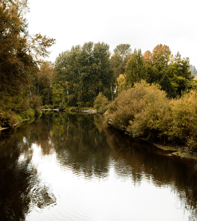  

City of Bothell Councilmembers, Jeanne Zornes, Ben Mahnkey and Jenne Alderks, __ __ recently earned a Certificate of Municipal Leadership from the Association of Washington Cities (AWC). 

 AWC’s Certificate of Municipal Leadership program recognizes city and town elected officials for accomplishing training in five core areas:

 * Roles, responsibilities, and legal requirements
 * Public sector resource management
 * Community planning and development
 * Effective local leadership
 * Diversity, equity, and inclusion

“Being a city leader in Washington is a complex job,” said AWC CEO Deanna Dawson. “Through our CML program we are providing our elected officials with the knowledge they need to effectively operate within the law, plan for the future, secure and manage funds, foster strong relationships, and work to build more equitable communities.” 

As passionate stewards of the community, Zornes, Mahnkey and Alderks have all been elected to serve on Bothell City Council through the 2025 term. Councilmember Zornes has been active in public education as well as neighborhood and city issues for the last ten years and previously served on Bothell's Planning Commission and Campus Traffic Advisory Committee. Councilmember Mahnkey has been on a number of local boards and commissions as well including the City’s Civil Service Commission, Council Salary Commission, LEOFF 1 Board, and the Snohomish County Ethics Commission. Councilmember  Alderks was a previously a member of the City's Planning Commission and is part of Anti-Racist Communities of Bothell (ARC) as well as the Black Lives Matter (BLM) Run Club. Learn more about all of Bothell's current Councilmembers by [visiting the City Council webpage.](http://www.ci.bothell.wa.us/261/City-Council) 

AWC serves its members through advocacy, education, and services. Founded in 1933, AWC is a private, nonprofit, nonpartisan corporation that represents Washington's 281 cities and towns before the state legislature, the state executive branch, and with regulatory agencies. AWC also provides training, data and publications, and programs such as the AWC Employee Benefit Trust, AWC Risk Management Service Agency, AWC Workers’ Comp Retro, AWC Drug and Alcohol Consortium, and AWC GIS Consortium.

         [⇐PreviousSenator Cantwell Visits Bothell in Celebration of $19M Grant](https://www.bothellwa.gov/CivicAlerts.aspx?AID=447)  [Next⇒Council Meetings Move to Hybrid Format](https://www.bothellwa.gov/CivicAlerts.aspx?AID=441)  

## Other News in City of Bothell News

   

###  [Call to Local Artists]() 

 Posted on: March 17, 2025   

###  [Mental and Behavioral Health Services RFP](https://www.bothellwa.gov/DocumentCenter/View/21674/City-of-Bothell---Mental-and-Behavioral-Health-RFP) 

 Posted on: March 11, 2025  [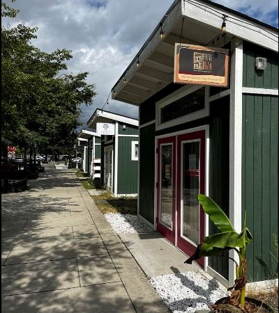](https://www.bothellwa.gov/2410/Apply-to-be-a-Pop-Shop) 

###  [Apply for Pop Shops on Main](https://www.bothellwa.gov/CivicAlerts.aspx?AID=625) 

 Posted on: March 6, 2025  [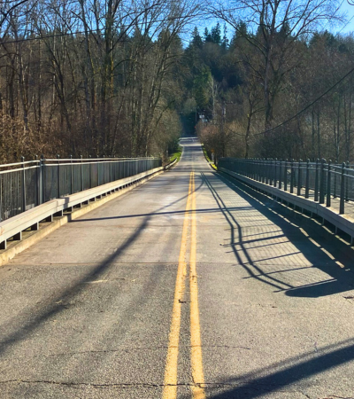](https://bothellwa.gov/764/Traffic-Alerts-Road-Construction) 

###  [102nd Ave NE Bridge Is Open](https://bothellwa.gov/764/Traffic-Alerts-Road-Construction) 

 Posted on: October 22, 2024  [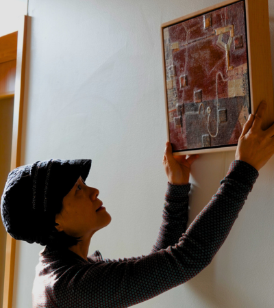](https://www.bothellwa.gov/1773/Bothell-City-Hall-Gallery) 

###  [Bothell City Hall Art Gallery Welcomes Sherry Ruden](https://www.bothellwa.gov/CivicAlerts.aspx?AID=624) 

 Posted on: February 24, 2025  [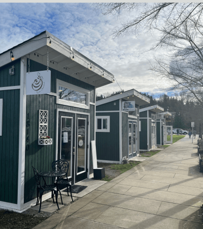](https://bothellwa.gov/2372/Lot-EFG-temporary-activation) 

###  [Temporary Activation of Downtown Lot](https://www.bothellwa.gov/CivicAlerts.aspx?AID=621) 

 Posted on: January 3, 2025  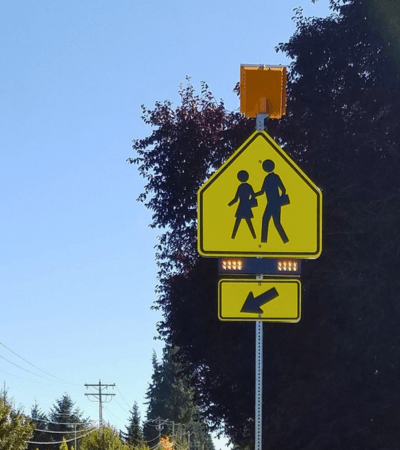  

###  [NE 185th St and 101st Ave NE Traffic Revision](https://www.bothellwa.gov/CivicAlerts.aspx?AID=616) 

 Posted on: October 31, 2024   

###  [Lights at the Landing](https://www.bothellwa.gov/2377/Lights-at-the-Landing) 

 Posted on: December 10, 2024  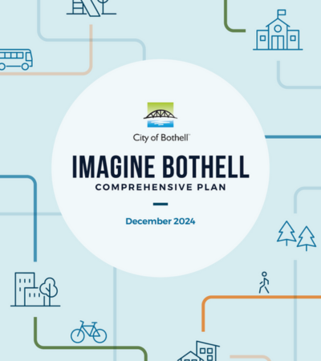  

###  [City Council Passes Comprehensive Plan](https://www.bothellwa.gov/CivicAlerts.aspx?AID=620) 

 Posted on: December 11, 2024  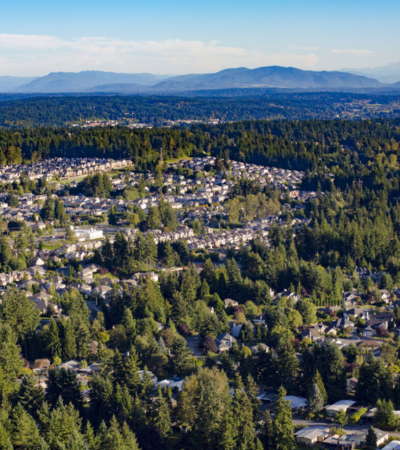  

###  [Council Considers the 2025-2026 Biennial City Budget](https://www.bothellwa.gov/CivicAlerts.aspx?AID=610) 

 Posted on: October 9, 2024  [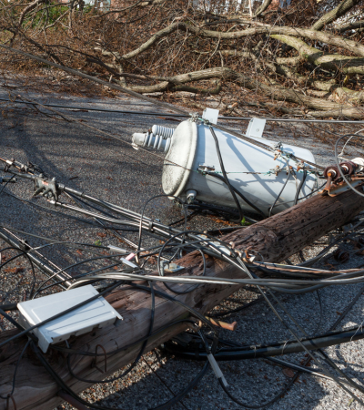](https://bothellwa.gov/1030/Wind) 

###  [Storm Alert: Service Updates & Community Resources](https://bothellwa.gov/1030/Wind) 

 Posted on: November 20, 2024  [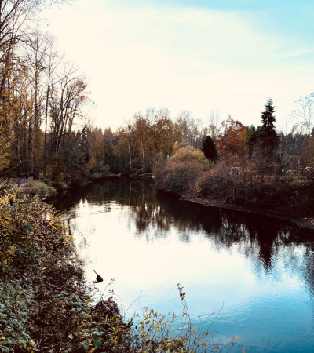](https://engagebothell.com/en/projects/climate-action-plan) 

###  [Climate Action Plan Advisory Committee Applications Now Open](https://engagebothell.com/en/projects/climate-action-plan) 

 Posted on: November 19, 2024   

###  [Requesting Proposals for Outdoor Event Series](https://www.bothellwa.gov/bids.aspx?bidID=161) 

 Posted on: October 18, 2024  [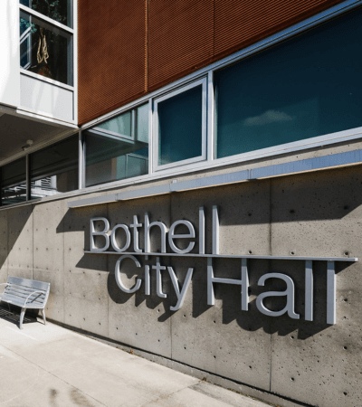](https://bothellwa.gov/2353/33059/Human-Services-Needs-Assessment) 

###  [Human Services Needs Assessment Project Results](https://bothellwa.gov/2353/33059/Human-Services-Needs-Assessment) 

 Posted on: October 18, 2024 | Last Modified on: October 18, 2024    

###  [City Considers Residential Renter Protection Measures](https://www.bothellwa.gov/CivicAlerts.aspx?AID=611) 

 Posted on: October 15, 2024    

###  [Free Concert Oct. 12: Soul Revolution! Rhymes, Beats, and Dance](https://www.bothellwa.gov/CivicAlerts.aspx?AID=609) 

 Posted on: October 7, 2024    

###  [Meet Artist Stephanie Krimmel at the Bothell Art Walk | Oct. 10](https://www.bothellwa.gov/CivicAlerts.aspx?AID=606) 

 Posted on: October 1, 2024  [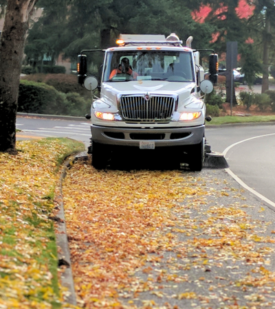](http://www.bothellwa.gov/streetsweepers) 

###  [Name Our Street Sweepers!](http://www.bothellwa.gov/streetsweepers) 

 Posted on: September 26, 2024    

###  [Sustainamania | Saturday, September 28](https://www.bothellwa.gov/CivicAlerts.aspx?AID=604) 

 Posted on: September 19, 2024    

###  [Bothell Business Owners, Share Your Experience](https://www.bothellwa.gov/CivicAlerts.aspx?AID=601) 

 Posted on: August 29, 2024  [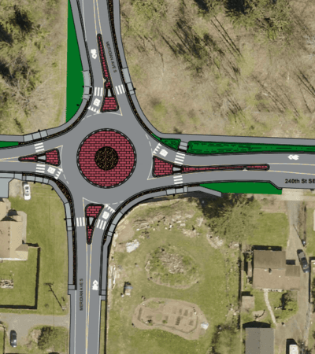](https://bothellwa.gov/2001/Meridian-Ave-S-and-240th-St-SE-Roundabou) 

###  [Meridian Ave S and 240th St SE Roundabout](https://bothellwa.gov/2001/Meridian-Ave-S-and-240th-St-SE-Roundabou) 

 Posted on: August 19, 2024  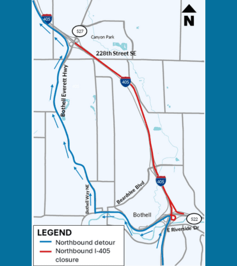  

###  [Full Closure of Northbound I-405 in Bothell for Paving, Sept. 20-23](https://www.bothellwa.gov/CivicAlerts.aspx?AID=603) 

 Posted on: September 16, 2024 | Last Modified on: September 16, 2024    

###  [Community Budget Survey Results](https://www.bothellwa.gov/CivicAlerts.aspx?AID=599) 

 Posted on: August 9, 2024 | Last Modified on: August 9, 2024    

###  [Sustainamania Vendor Applications Now Open](https://www.bothellwa.gov/CivicAlerts.aspx?AID=596) 

 Posted on: July 5, 2024    

###  [Eastside Cities Partner to Encourage Reusable Cup Use](https://www.bothellwa.gov/CivicAlerts.aspx?AID=595) 

 Posted on: June 28, 2024    

###  [Bothell Signs Interlocal Agreement with Shoreline Fire for Fire Service Administration](https://www.bothellwa.gov/CivicAlerts.aspx?AID=591) 

 Posted on: June 13, 2024   

###  [Hot Weather Resources](https://www.bothellwa.gov/2062/Hot-Weather-Safety) 

 Posted on: July 8, 2024 | Last Modified on: July 8, 2024   

###  [National Night Out | Tuesday, August 6](https://www.bothellwa.gov/1834/National-Night-Out) 

 Posted on: July 26, 2024    

###  [Fireworks Are Illegal in Bothell](https://www.bothellwa.gov/CivicAlerts.aspx?AID=593) 

 Posted on: June 24, 2024    

###  [Celebrating Community Spirit: Honoring Dave Monahan as the 2024 Fourth of July Parade Grand Marshal](https://www.bothellwa.gov/CivicAlerts.aspx?AID=592) 

 Posted on: June 14, 2024   

###  [Creative Arts Grant Recipients & Their Upcoming Events](https://www.bothellwa.gov/2200/Creative-Arts-Grant-Program) 

 Posted on: June 12, 2024  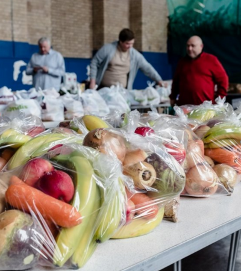  

###  [Take the Human Services Community Survey by June 18](https://www.bothellwa.gov/CivicAlerts.aspx?AID=589) 

 Posted on: May 30, 2024   

###  [New Art Show at City Hall Gallery Space](https://www.bothellwa.gov/1773/Bothell-City-Hall-Gallery) 

 Posted on: May 23, 2024    

###  [The Northshore Parks and Recreation Service Area Needs Your Input!](https://www.bothellwa.gov/CivicAlerts.aspx?AID=587) 

 Posted on: May 22, 2024  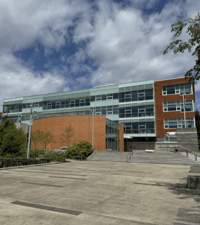  

###  [City of Bothell Human Services Grant Application Period Now Open](https://www.bothellwa.gov/CivicAlerts.aspx?AID=585) 

 Posted on: May 17, 2024  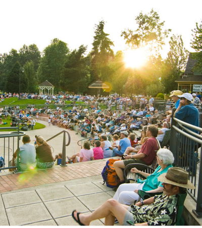  

###  [City of Bothell Pride in the Park | May 31](https://www.bothellwa.gov/CivicAlerts.aspx?AID=583) 

 Posted on: May 14, 2024  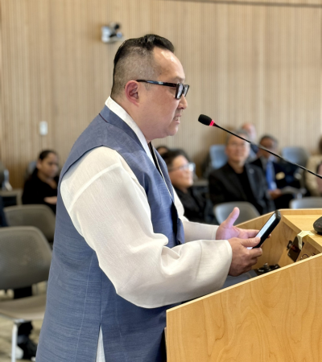  

###  [Bothell Celebrates AANHPI Heritage Month](https://www.bothellwa.gov/CivicAlerts.aspx?AID=584) 

 Posted on: May 15, 2024  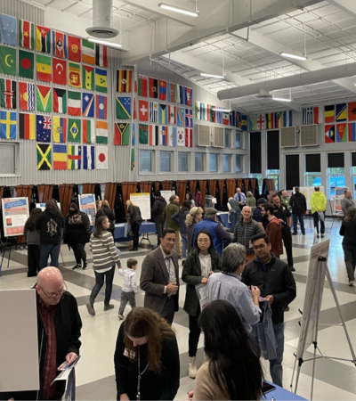  

###  [Comprehensive Plan Event: Planting Seeds for Bothell’s Future!](https://www.bothellwa.gov/CivicAlerts.aspx?AID=576) 

 Posted on: April 17, 2024    

###  [Bothell’s Fourth of July Parade and Pancake Breakfast](https://www.bothellwa.gov/CivicAlerts.aspx?AID=574) 

 Posted on: April 9, 2024   

###  [Bothell Small Business Workshops April 11 - May 2](https://www.bothellwa.gov/CivicAlerts.aspx?AID=573) 

 Posted on: March 29, 2024   

###  [Creative Arts Grant Program - Application Open](https://www.bothellwa.gov/CivicAlerts.aspx?AID=569) 

 Posted on: March 11, 2024    

###  [Community Survey Underway](https://www.bothellwa.gov/CivicAlerts.aspx?AID=567) 

 Posted on: March 5, 2024  [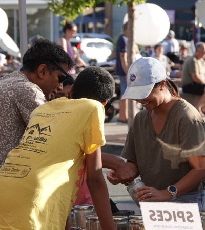](https://www.bothellwa.gov/2032/Summer-Nights-in-Bothell) 

###  [Vendor Application Now Open for Summer Nights in Bothell!](https://www.bothellwa.gov/CivicAlerts.aspx?AID=566) 

 Posted on: February 29, 2024   

###  [City Hall Gallery featuring Kristin Frost](https://www.bothellwa.gov/CivicAlerts.aspx?AID=564) 

 Posted on: February 15, 2024   

###  [Pop Shops on Main Welcomes Four New Businesses](https://www.bothellwa.gov/CivicAlerts.aspx?AID=563) 

 Posted on: February 7, 2024  [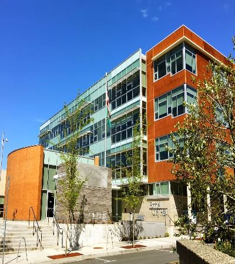](https://www.bothellwa.gov/1249/Current-Openings-and-Application) 

###  [Apply for Board or Commission](https://www.bothellwa.gov/CivicAlerts.aspx?AID=559) 

 Posted on: January 17, 2024   

###  [Winter Weather Preparedness](https://www.bothellwa.gov/997/Winter-Weather) 

 Posted on: October 27, 2023  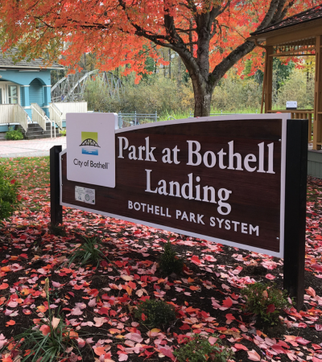  

###  [Park at Bothell Landing](https://www.bothellwa.gov/CivicAlerts.aspx?AID=557) 

 Posted on: January 12, 2024  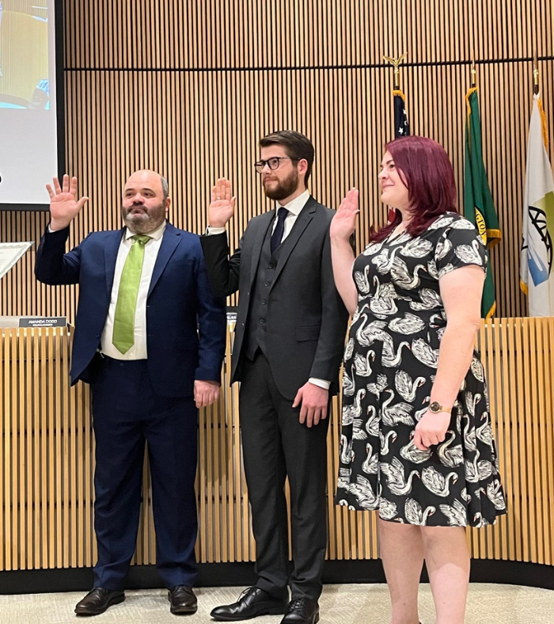  

###  [New Councilmember Terms](https://www.bothellwa.gov/CivicAlerts.aspx?AID=555) 

 Posted on: January 3, 2024   

###  [Rain and Flooding Updates](https://www.bothellwa.gov/983/Rain-and-Flooding) 

 Posted on: December 5, 2023    

###  [New Art Exhibition at Bothell City Hall](https://www.bothellwa.gov/CivicAlerts.aspx?AID=552) 

 Posted on: December 4, 2023    

###  [Communities Shining Bright](https://www.bothellwa.gov/CivicAlerts.aspx?AID=551) 

 Posted on: November 20, 2023  [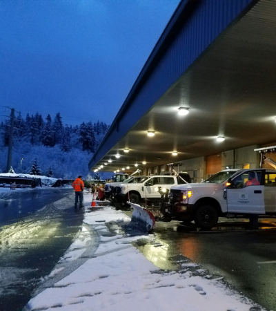](https://www.surveymonkey.com/r/CRVTZQL) 

###  [Name a Bothell Snowplow!](https://www.surveymonkey.com/r/CRVTZQL) 

 Posted on: November 9, 2023  [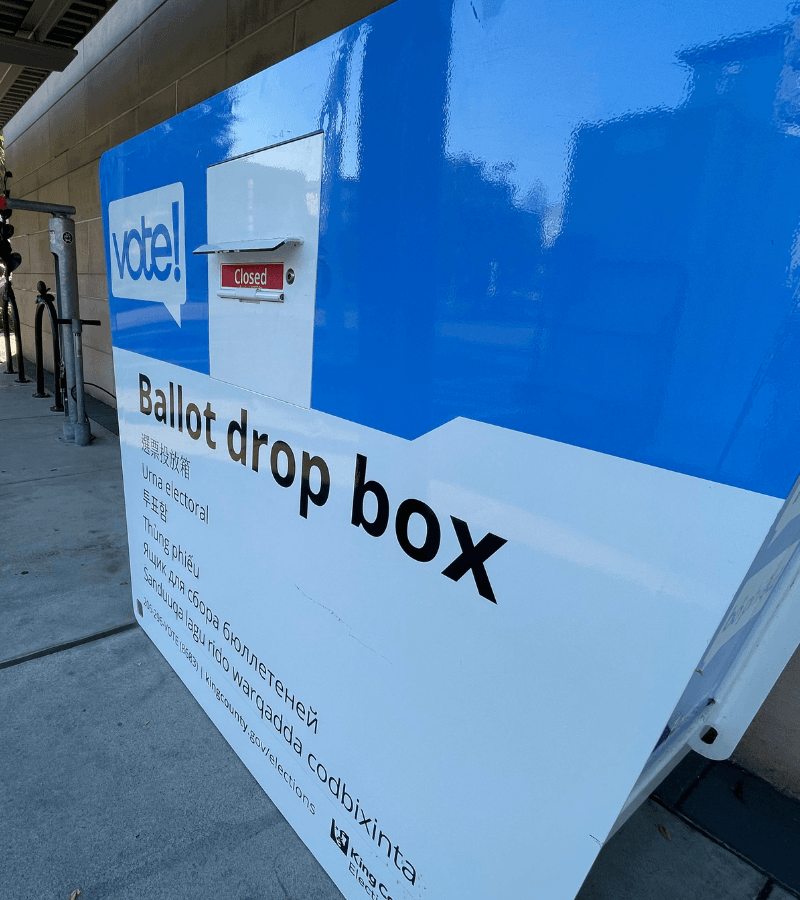](https://kingcounty.gov/en/legacy/depts/elections/how-to-vote/ballots/returning-my-ballot/ballot-drop-boxes) 

###  [Ballot Drop Box Moved to Bothell Library](https://kingcounty.gov/en/legacy/depts/elections/how-to-vote/ballots/returning-my-ballot/ballot-drop-boxes) 

 Posted on: October 23, 2023  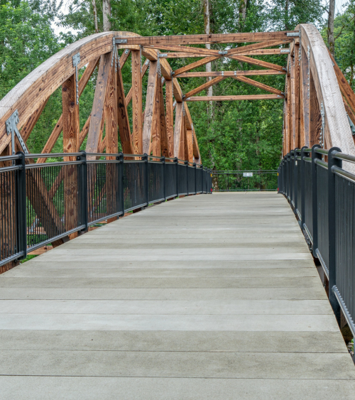  

###  [The Israel-Palestine Crisis, A Statement from the Mayor](https://www.bothellwa.gov/CivicAlerts.aspx?AID=542) 

 Posted on: October 18, 2023  [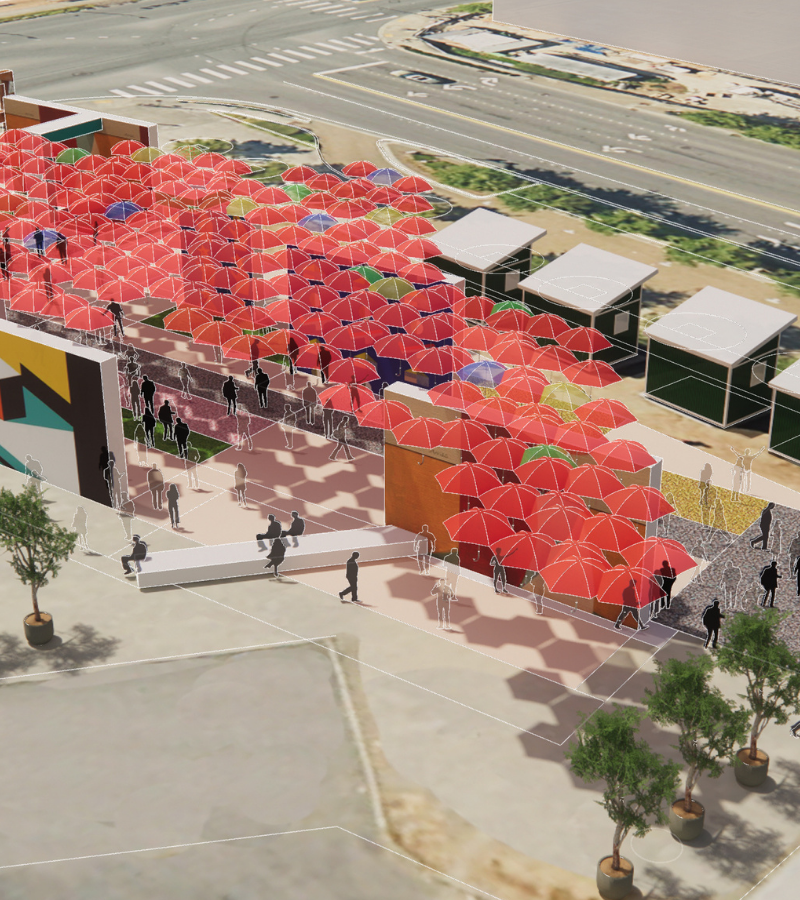](https://www.surveymonkey.com/r/CMD92ZN) 

###  [Take the Lot EFG Survey](https://www.surveymonkey.com/r/CMD92ZN) 

 Posted on: October 16, 2023  [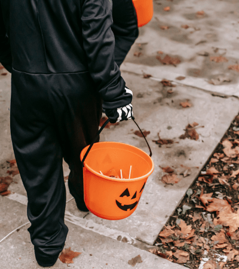](https://www.bothellwa.gov/1203/Trick-or-Treat-on-Main-Street) 

###  [Trick-or-Treat on Main Street](https://www.bothellwa.gov/1203/Trick-or-Treat-on-Main-Street) 

 Posted on: October 10, 2023  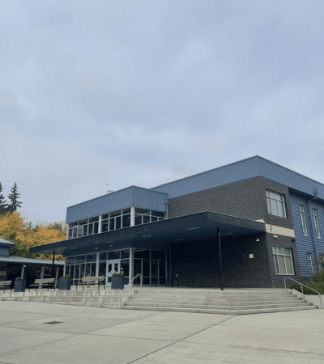  

###  [October 26 Comprehensive Plan Open House](https://www.bothellwa.gov/CivicAlerts.aspx?AID=539) 

 Posted on: October 4, 2023  [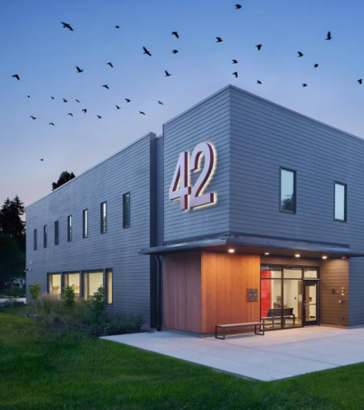](https://www.bothellwa.gov/Calendar.aspx?EID=1854) 

###  [Save the Date, Fire Prevention Month Open House](https://www.bothellwa.gov/Calendar.aspx?EID=1854) 

 Posted on: September 21, 2023    

###  [Bothell Water Customers Asked to Voluntarily Reduce Water Use](https://www.bothellwa.gov/CivicAlerts.aspx?AID=532) 

 Posted on: September 21, 2023  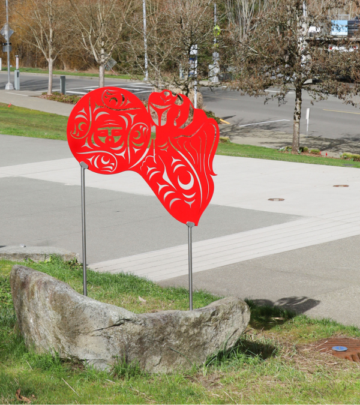  

###  [Indigenous People's Day Event](https://www.bothellwa.gov/CivicAlerts.aspx?AID=536) 

 Posted on: September 27, 2023  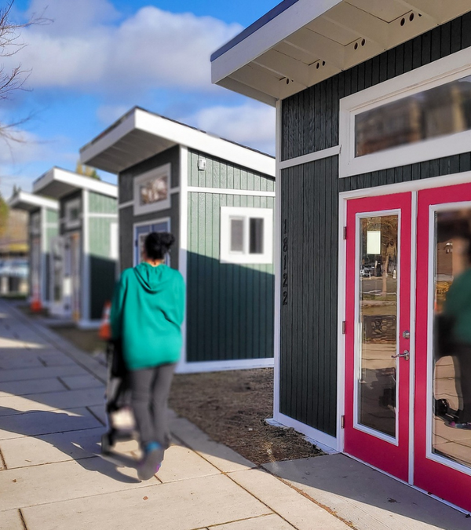  

###  [Now Accepting Applications for Pop Shops on Main](https://www.bothellwa.gov/CivicAlerts.aspx?AID=531) 

 Posted on: September 13, 2023   

###  [Businesses Invited to Participate in Free Workshop Series, Register Today](https://www.eventbrite.com/e/bothell-small-business-workshops-series-tickets-710434527797?aff=oddtdtcreator) 

 Posted on: September 11, 2023  [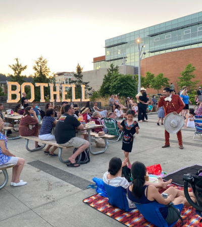](https://www.bothellwa.gov/2221/Welcoming-Week#:~:text=The%20City%20of%20Bothell%20is,September%208th%20through%2016th%202023!) 

###  [Join us in Celebrating Welcoming Week](https://www.bothellwa.gov/2221/Welcoming-Week#:~:text=The%20City%20of%20Bothell%20is,September%208th%20through%2016th%202023!) 

 Posted on: September 11, 2023   

###  [Participate in Community Visioning Sessions, Happening Sept. 11, 13 and 14](https://www.kirklandwa.gov/Government/City-Managers-Office/The-Regional-Crisis-Response-Agency) 

 Posted on: September 11, 2023  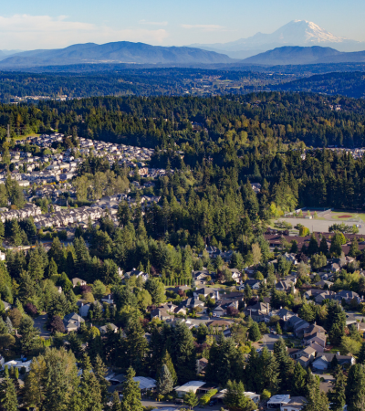  

###  [Imagine Bothell Comprehensive Plan Update](https://www.bothellwa.gov/CivicAlerts.aspx?AID=505) 

 Posted on: May 26, 2023    

###  [City of Bothell Welcomes Anand Manthripragada as Human Services Coordinator](https://www.bothellwa.gov/CivicAlerts.aspx?AID=526) 

 Posted on: September 5, 2023    

###  [City Hall Art Gallery Now Featuring "Face Time."](https://www.bothellwa.gov/CivicAlerts.aspx?AID=527) 

 Posted on: September 7, 2023  [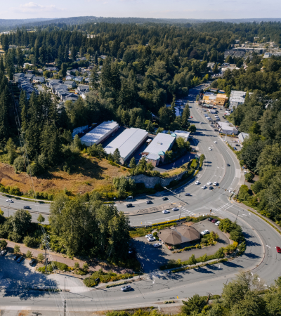](https://engagebothell.com/en/) 

###  [Help Shape Future Transportation in Bothell](https://engagebothell.com/en/) 

 Posted on: August 25, 2023    

###  [Arts Grant Application Now Available](https://www.bothellwa.gov/CivicAlerts.aspx?AID=518) 

 Posted on: July 10, 2023    

###  [Bothell Welcomes Diversity, Equity and Inclusion Coordinator, Gabi Cuna](https://www.bothellwa.gov/CivicAlerts.aspx?AID=519) 

 Posted on: July 19, 2023  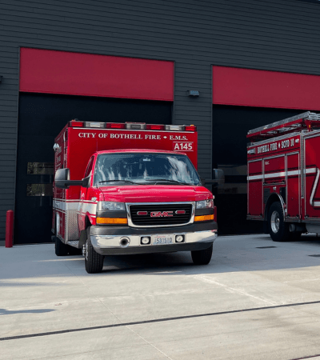  

###  [Save the Date, Aid Unit 145 Ribbon Cutting](https://www.bothellwa.gov/CivicAlerts.aspx?AID=523) 

 Posted on: August 3, 2023   

###  [Heat Warning in Effect](https://www.bothellwa.gov/1899/Extreme-Heat) 

 Posted on: May 12, 2023  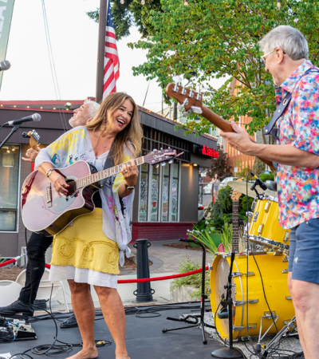  

###  [Summer Nights in Bothell Event Series](https://www.bothellwa.gov/CivicAlerts.aspx?AID=516) 

 Posted on: July 6, 2023  [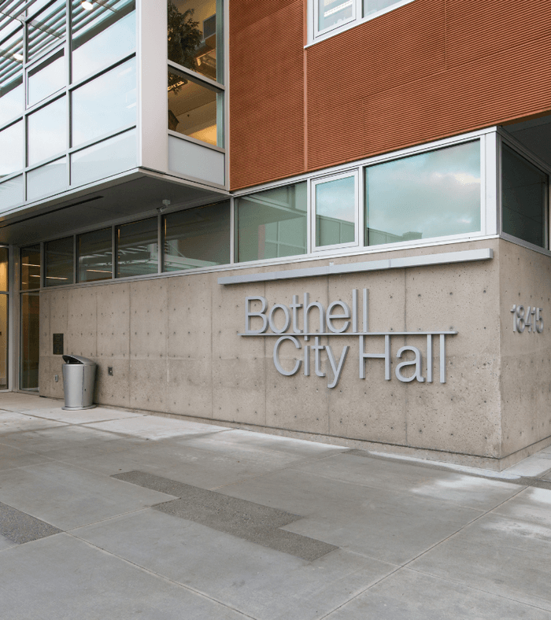](https://www.bothellwa.gov/DocumentCenter/View/18536/2023-Public-Notice---EMS-District-Sno-County-Pro-Con-Committees) 

###  [Now Seeking Ballot Measure Committee Members](https://www.bothellwa.gov/DocumentCenter/View/18536/2023-Public-Notice---EMS-District-Sno-County-Pro-Con-Committees) 

 Posted on: June 22, 2023  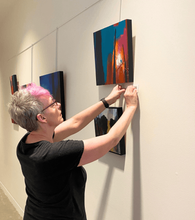  

###  [Bothell City Hall Gallery Featuring Artist Caryn Vainio](https://www.bothellwa.gov/CivicAlerts.aspx?AID=508) 

 Posted on: June 14, 2023  [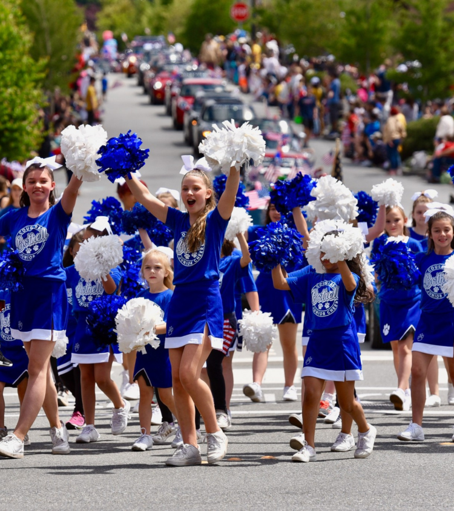](https://www.bothellwa.gov/269/Fourthof-July-Parade-Pancake-Breakfast) 

###  [Bothell's Annual Fourth of July Hometown Celebration](https://www.bothellwa.gov/269/Fourthof-July-Parade-Pancake-Breakfast) 

 Posted on: April 6, 2023  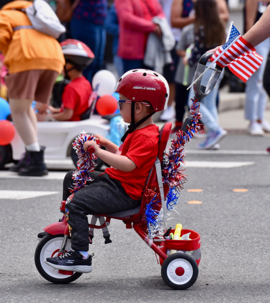  

###  [Fourth of July Parade and Pancake Breakfast](https://www.bothellwa.gov/CivicAlerts.aspx?AID=513) 

 Posted on: June 27, 2023  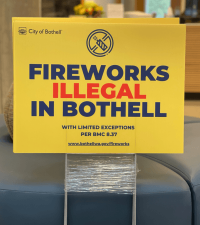  

###  [Fireworks Illegal in Bothell this Fourth of July](https://www.bothellwa.gov/CivicAlerts.aspx?AID=510) 

 Posted on: June 20, 2023  [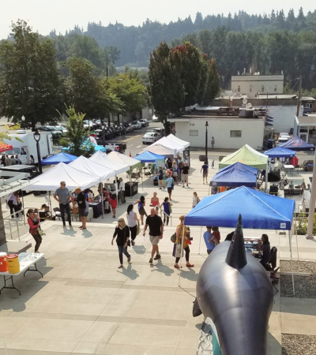](https://www.bothellwa.gov/227/Sustainamania) 

###  [Sustainamania 2023](https://www.bothellwa.gov/227/Sustainamania) 

 Posted on: May 11, 2023  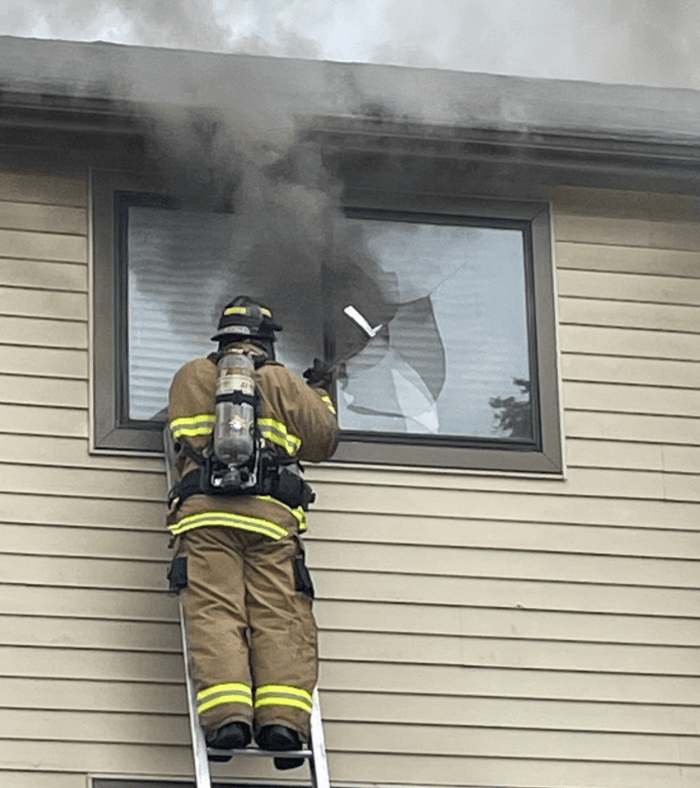  

###  [Live Fire Training, June 13-16](https://www.bothellwa.gov/CivicAlerts.aspx?AID=507) 

 Posted on: June 14, 2023    

###  [Celebrating Juneteenth](https://www.bothellwa.gov/CivicAlerts.aspx?AID=509) 

 Posted on: June 15, 2023  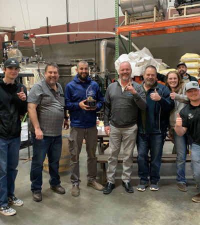  

###  [City of Bothell Judged Best Tasting Water in King County](https://www.bothellwa.gov/CivicAlerts.aspx?AID=491) 

 Posted on: April 4, 2023   

###  [Sidewalk Survey](https://survey.alchemer.com/s3/7302114/Bothell-Sidewalk-Survey-2023) 

 Posted on: April 27, 2023    

###  [City of Bothell Welcomes Interim Fire Chief](https://www.bothellwa.gov/CivicAlerts.aspx?AID=497) 

 Posted on: April 20, 2023  [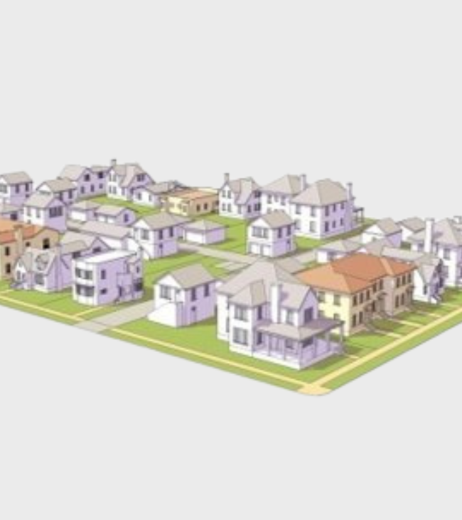](http://www.ci.bothell.wa.us/Calendar.aspx?EID=1792) 

###  [Join us for the Middle Housing Community Forum](http://www.ci.bothell.wa.us/Calendar.aspx?EID=1792) 

 Posted on: April 19, 2023  [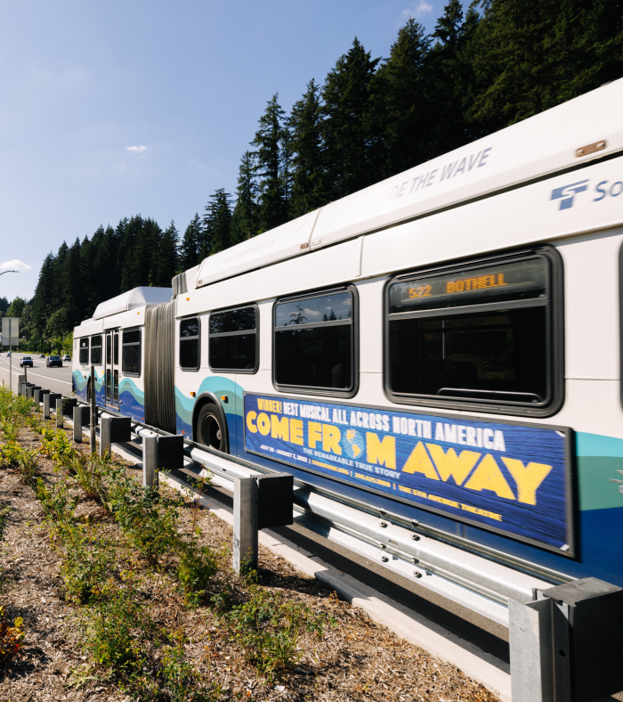](https://stridebrt.participate.online/) 

###  [April 25 Stride BRT Meeting](https://stridebrt.participate.online/) 

 Posted on: April 13, 2023    

###  [Quarterly Council Update Featuring Benjamin Mahnkey](https://www.bothellwa.gov/CivicAlerts.aspx?AID=495) 

 Posted on: April 18, 2023    

###  [Regional Crisis Response Agency Welcomes New Executive Director](https://www.bothellwa.gov/CivicAlerts.aspx?AID=487) 

 Posted on: March 21, 2023  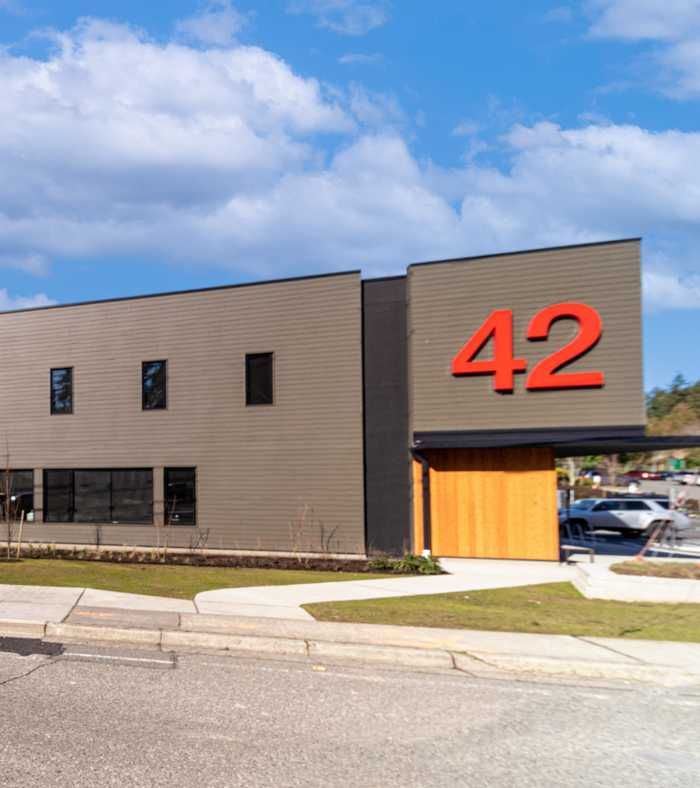  

###  [Save the Date for the Fire Station 42 Ribbon Cutting and Open House](https://www.bothellwa.gov/CivicAlerts.aspx?AID=486) 

 Posted on: March 9, 2023    

###  [New Crisis Response Center in Kirkland to Serve North King County](https://www.bothellwa.gov/CivicAlerts.aspx?AID=485) 

 Posted on: March 8, 2023   

###  [City Council Adopts 2040 Vision for Bothell](https://www.bothellwa.gov/2161/2040-Council-Vision) 

 Posted on: March 8, 2023  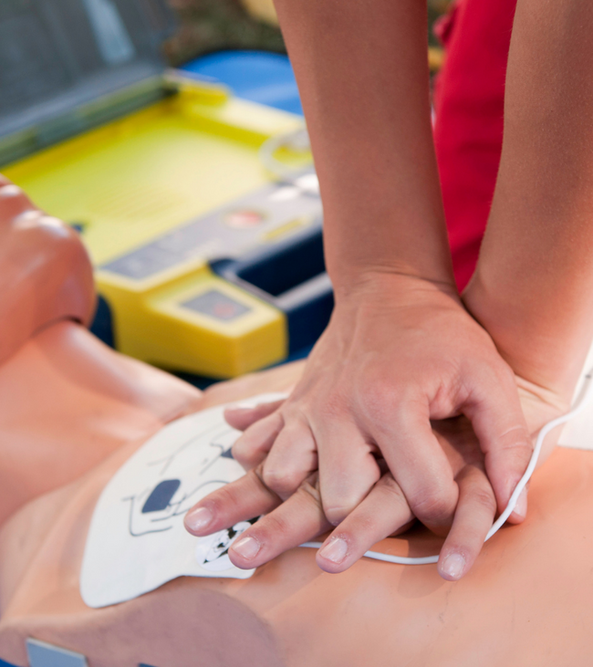  

###  [Bothell Fire Department Offers CPR/AED and First Aid Classes to the Community](https://www.bothellwa.gov/CivicAlerts.aspx?AID=483) 

 Posted on: March 2, 2023    

###  [Bothell City Hall Gallery Showcases New Exhibit](https://www.bothellwa.gov/CivicAlerts.aspx?AID=482) 

 Posted on: February 22, 2023  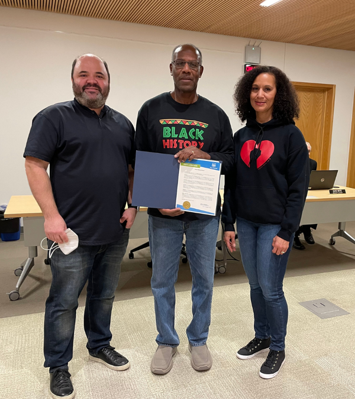  

###  [Bringing Communities Together](https://www.bothellwa.gov/CivicAlerts.aspx?AID=480) 

 Posted on: February 15, 2023    

###  [Join Bothell in Celebrating Black History Month](https://www.bothellwa.gov/CivicAlerts.aspx?AID=479) 

 Posted on: February 2, 2023  [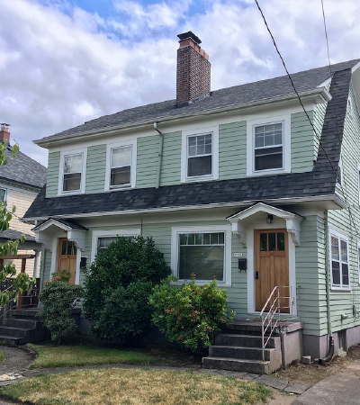](http://www.ci.bothell.wa.us/2018/Middle-Housing) 

###  [Middle Housing Updates](http://www.ci.bothell.wa.us/2018/Middle-Housing) 

 Posted on: January 5, 2023    

###  [Welcoming Finance Director Kwan Wong](https://www.bothellwa.gov/CivicAlerts.aspx?AID=474) 

 Posted on: January 4, 2023    

###  [Amanda Dodd's Journey to Joining Council](https://www.bothellwa.gov/CivicAlerts.aspx?AID=473) 

 Posted on: December 29, 2022    

###  [Holiday Health and Wellness](https://www.bothellwa.gov/CivicAlerts.aspx?AID=472) 

 Posted on: December 19, 2022    

###  [Quarterly Council Update](https://www.bothellwa.gov/CivicAlerts.aspx?AID=470) 

 Posted on: December 14, 2022  [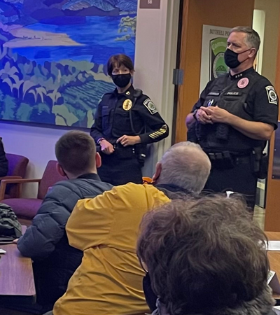](https://www.bothellwa.gov/2120/Bothell-Police-Community-Advisory-Commit) 

###  [Bothell Police Seeks Advisory Committee Volunteers](https://www.bothellwa.gov/CivicAlerts.aspx?AID=471) 

 Posted on: December 14, 2022    

###  [Bothell City Council Adopts 2023-2024 Budget](https://www.bothellwa.gov/CivicAlerts.aspx?AID=469) 

 Posted on: December 8, 2022    

###  [Toni Call Joins City of Bothell as Deputy City Manager](https://www.bothellwa.gov/CivicAlerts.aspx?AID=466) 

 Posted on: December 1, 2022    

###  [Bothell's Winter Porch Light Parade Returns](https://www.bothellwa.gov/CivicAlerts.aspx?AID=462) 

 Posted on: November 28, 2022    

###  [Make the Season Bright by Giving Back](https://www.bothellwa.gov/CivicAlerts.aspx?AID=400) 

 Posted on: December 6, 2021    

###  [Five Cities Form Regional Crisis Response Agency](https://www.bothellwa.gov/CivicAlerts.aspx?AID=465) 

 Posted on: November 29, 2022  [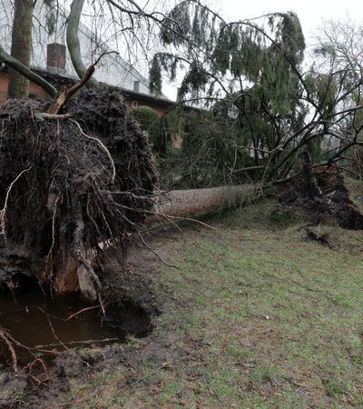](https://www.bothellwa.gov/983/Rain-and-Flooding) 

###  [Wind and Flooding Updates](https://www.bothellwa.gov/983/Rain-and-Flooding) 

 Posted on: November 29, 2022    

###  [Baloo's Barkery Selected to be Newest Pop Shop on Main](https://www.bothellwa.gov/CivicAlerts.aspx?AID=461) 

 Posted on: November 21, 2022    

###  [Bothell Welcomes New Community Development Director](https://www.bothellwa.gov/CivicAlerts.aspx?AID=459) 

 Posted on: November 1, 2022  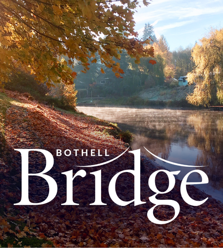  

###  [The Fall Bothell Bridge Newsletter has Arrived! Read the Latest City News](https://www.bothellwa.gov/CivicAlerts.aspx?AID=452) 

 Posted on: September 19, 2022  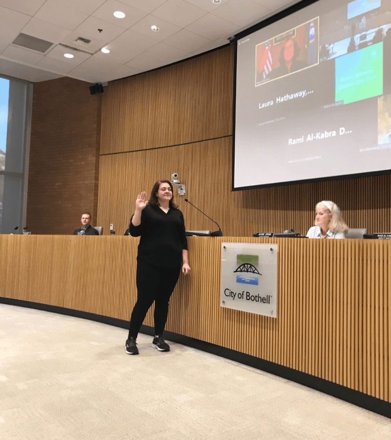  

###  [City of Bothell Welcomes New Councilmember](https://www.bothellwa.gov/CivicAlerts.aspx?AID=454) 

 Posted on: October 4, 2022    

###  [Now Accepting Applications for Pop Shops on Main](https://www.bothellwa.gov/CivicAlerts.aspx?AID=453) 

 Posted on: October 4, 2022    

###  [Bothell and Kenmore Celebrate Orca Recovery Day](https://www.bothellwa.gov/CivicAlerts.aspx?AID=455) 

 Posted on: October 10, 2022    

###  [New City of Bothell Website Coming September 20](https://www.bothellwa.gov/CivicAlerts.aspx?AID=451) 

 Posted on: September 16, 2022  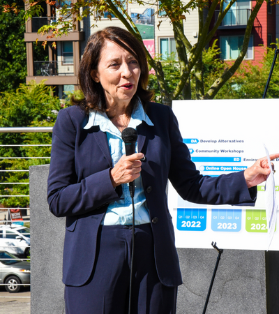  

###  [Senator Cantwell Visits Bothell in Celebration of $19M Grant](https://www.bothellwa.gov/CivicAlerts.aspx?AID=447) 

 Posted on: August 17, 2022  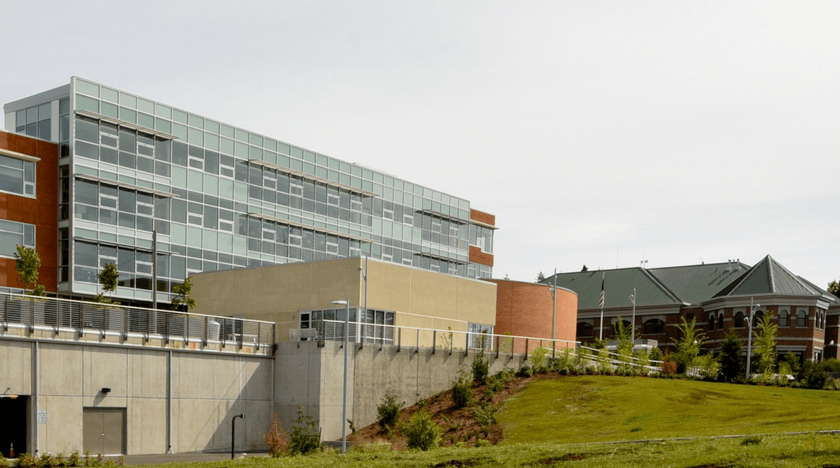  

###  [Council Meetings Move to Hybrid Format](https://www.bothellwa.gov/CivicAlerts.aspx?AID=441) 

 Posted on: June 29, 2022    

###  [Bothell Bridge Newsletter, Summer 22](https://www.bothellwa.gov/CivicAlerts.aspx?AID=440) 

 Posted on: June 23, 2022   

###  [Community Listening Sessions for Diversity, Equity and Inclusion](https://www.bothellwa.gov/CivicAlerts.aspx?AID=427) 

 Posted on: April 21, 2022  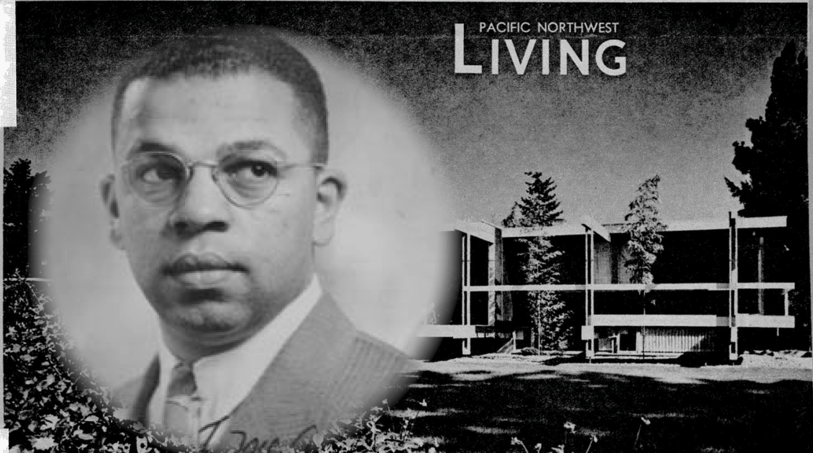  

###  [Black History Month, The Life of Benjamin McAdoo](https://www.bothellwa.gov/CivicAlerts.aspx?AID=410) 

 Posted on: February 3, 2022    

###  [City Manager Recruitment Process](https://www.bothellwa.gov/CivicAlerts.aspx?AID=404) 

 Posted on: December 8, 2021    

###  [Bothell Bridge Newsletter, Winter 21-22](https://www.bothellwa.gov/CivicAlerts.aspx?AID=405) 

 Posted on: January 4, 2022    

###  [Join the Diversity, Equity and Inclusion Advisory Committee](https://www.bothellwa.gov/CivicAlerts.aspx?AID=402) 

 Posted on: December 7, 2021    

###  [City Unveils Veterans Memorial Drive](https://www.bothellwa.gov/CivicAlerts.aspx?AID=398) 

 Posted on: November 12, 2021   

###  [Come enjoy the new gallery exhibition at Bothell City Hall](https://www.bothellwa.gov/CivicAlerts.aspx?AID=212) 

 Posted on: February 1, 2018  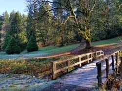  

###  [City Council preserves entire Wayne Golf Course in City’s largest parkland acquisition](https://www.bothellwa.gov/CivicAlerts.aspx?AID=207) 

 Posted on: December 12, 2017    

###  [Mathew Pruitt becomes City of Bothell’s new Human Resources Director](https://www.bothellwa.gov/CivicAlerts.aspx?AID=201) 

 Posted on: November 16, 2017   

###  [Bothell City Council approves purchase of Wayne Golf Course Front 9](https://www.bothellwa.gov/CivicAlerts.aspx?AID=200) 

 Posted on: November 14, 2017 

### Live Edit

    [Utilities](https://www.bothellwa.gov/808/Utilities)   [Permits](https://www.bothellwa.gov/337/Permit-Center)   [Subscribe](https://www.bothellwa.gov/list.aspx)   [Meetings & Agendas](https://www.bothellwa.gov/AgendaCenter)   [Records Request](https://bothellwa.mycusthelp.com/WEBAPP/_rs/(S(pyhfykehjvgohubijgzjgggn))/SupportHome.aspx)   [Jobs](http://agency.governmentjobs.com/bothellwa/default.cfm)   [Maps](https://www.bothellwa.gov/233/Maps-GIS)   [Parks](https://www.bothellwa.gov/249/Parks-Recreation)   [Police](https://www.bothellwa.gov/266/Police-Department)   [Court](https://www.bothellwa.gov/1553/Visit-the-Court)   [Report a Concern](https://www.bothellwa.gov/FormCenter/Customer-Action-Request-12/Customer-Action-Request-286)   [Fire](http://www.ci.bothell.wa.us/415/Fire-Department)      

 Stay Informed, Subscribe Today  [Bothell News](https://www.bothellwa.gov/civicalerts.aspx)   [Emergency Alerts](https://www.bothellwa.gov/1261/Emergency-Alerts)  

 1.    

     

                

### Contact Us

 1.    

 __Bothell City Hall__    

18415 101st Avenue NE   

Bothell, WA 98011   

Phone: [425-806-6100](tel:425-806-6100)    

 [Contact Us](https://www.bothellwa.gov/directory.aspx)    

###  [Quick Links](https://www.bothellwa.gov/QuickLinks.aspx?CID=76,70) 

 1.  [Attend Events](https://www.bothellwa.gov/calendar.aspx?CID=23,)  
 1.  [Boards and Commissions](https://www.bothellwa.gov/263/Boards-Commissions)  
 1.  [City Council](https://www.bothellwa.gov/261/City-Council)  
 1.  [City Services](https://www.bothellwa.gov/101/Services)  
 1.  [Fun Things to Do in Bothell](http://www.explorebothell.com/)  
 1.  [Bothell Municipal Code](http://www.codepublishing.com/WA/Bothell/)  
 /QuickLinks.aspx 

###  [Helpful Links](https://www.bothellwa.gov/QuickLinks.aspx?CID=38) 

 1.  [Home](https://www.bothellwa.gov/)  
 1.  [Site Map](https://www.bothellwa.gov/sitemap)  
 1.  [Accessibility](https://www.bothellwa.gov/Accessibility)  
 1.  [Copyright Notices](https://www.bothellwa.gov/site/copyright)  
 1.  [Employee Access](http://www.bothellwa.gov/72/Intranet)  
 /QuickLinks.aspx Government Websites by [CivicPlus®](https://connect.civicplus.com/referral)  Loading Loading Do Not Show AgainClose [] 