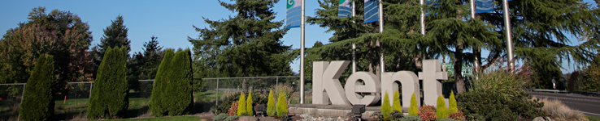
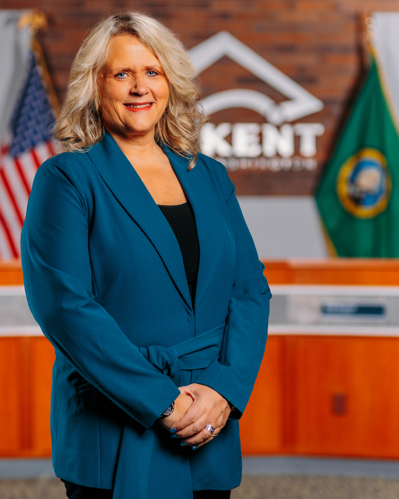

 Please enable JavaScript in your browser for a better user experience.  [Show/Hide](javascript:%20void%20(0))     Select LanguageAbkhazAcehneseAcholiAfarAfrikaansAlbanianAlurAmharicArabicArmenianAssameseAvarAwadhiAymaraAzerbaijaniBalineseBaluchiBambaraBaouléBashkirBasqueBatak KaroBatak SimalungunBatak TobaBelarusianBembaBengaliBetawiBhojpuriBikolBosnianBretonBulgarianBuryatCantoneseCatalanCebuanoChamorroChechenChichewaChinese (Simplified)Chinese (Traditional)ChuukeseChuvashCorsicanCrimean Tatar (Cyrillic)Crimean Tatar (Latin)CroatianCzechDanishDariDhivehiDinkaDogriDombeDutchDyulaDzongkhaEsperantoEstonianEweFaroeseFijianFilipinoFinnishFonFrenchFrench (Canada)FrisianFriulianFulaniGaGalicianGeorgianGermanGreekGuaraniGujaratiHaitian CreoleHakha ChinHausaHawaiianHebrewHiligaynonHindiHmongHungarianHunsrikIbanIcelandicIgboIlocanoIndonesianInuktut (Latin)Inuktut (Syllabics)IrishItalianJamaican PatoisJapaneseJavaneseJingpoKalaallisutKannadaKanuriKapampanganKazakhKhasiKhmerKigaKikongoKinyarwandaKitubaKokborokKomiKonkaniKoreanKrioKurdish (Kurmanji)Kurdish (Sorani)KyrgyzLaoLatgalianLatinLatvianLigurianLimburgishLingalaLithuanianLombardLugandaLuoLuxembourgishMacedonianMadureseMaithiliMakassarMalagasyMalayMalay (Jawi)MalayalamMalteseMamManxMaoriMarathiMarshalleseMarwadiMauritian CreoleMeadow MariMeiteilon (Manipuri)MinangMizoMongolianMyanmar (Burmese)Nahuatl (Eastern Huasteca)NdauNdebele (South)Nepalbhasa (Newari)NepaliNKoNorwegianNuerOccitanOdia (Oriya)OromoOssetianPangasinanPapiamentoPashtoPersianPolishPortuguese (Brazil)Portuguese (Portugal)Punjabi (Gurmukhi)Punjabi (Shahmukhi)QuechuaQʼeqchiʼRomaniRomanianRundiRussianSami (North)SamoanSangoSanskritSantali (Latin)Santali (Ol Chiki)Scots GaelicSepediSerbianSesothoSeychellois CreoleShanShonaSicilianSilesianSindhiSinhalaSlovakSlovenianSomaliSpanishSundaneseSusuSwahiliSwatiSwedishTahitianTajikTamazightTamazight (Tifinagh)TamilTatarTeluguTetumThaiTibetanTigrinyaTivTok PisinTonganTshilubaTsongaTswanaTuluTumbukaTurkishTurkmenTuvanTwiUdmurtUkrainianUrduUyghurUzbekVendaVenetianVietnameseWarayWelshWolofXhosaYakutYiddishYorubaYucatec MayaZapotecZulu Powered by  [Translate](https://translate.google.com)   [Skip to Main Content](https://www.kentwa.gov/government/kent-mayor#pagebody)  

# City of Kent

 [Menu](javascript:void(0);)  [Home](https://www.kentwa.gov/home)   [Careers](https://www.kentwa.gov/departments/human-resources/career-opportunities)  [Online Services](https://www.kentwa.gov/pay-and-apply/online-services)  [Contact Us](https://www.kentwa.gov/government/contact-us)   [Search](javascript:void(0);)   [Go](javascript:void(0);)  

## Popular Searches

 *  [Permits](https://www.kentwa.gov/pay-and-apply/apply-for-a-permit) 
 *  [Jail Inmate Lookup Service](https://www.kentwa.gov/departments/police-department/corrections-facility/jail-inmate-lookup-service-jils) 
 *  [Utility Services & Billing](https://www.kentwa.gov/pay-and-apply/utility-services-and-billing) 
 *  [Bids/Procurement/RFPs](https://www.kentwa.gov/pay-and-apply/bids-procurement-rfps) 
 *  [Municipal Court](https://www.kentwa.gov/departments/municipal-court) 
 *  [COVID-19 Updates](https://www.kentwa.gov/government/covid-19-updates) 
 *  [Photo Enforcement](https://www.kentwa.gov/departments/municipal-court/photo-enforcement) 
 *  [Concealed Pistol License](https://www.kentwa.gov/departments/police-department/concealed-pistol-license) 
  [Service Finder](javascript:void(0);)  [CLOSE](javascript:void(0))  

## Service Finder

### Find A Service

 *  [Search Services](javascript:void(0);)  Search Services [Go](javascript:void(0);)  
 *  [Most Popular Services](javascript:void(0);) 
 *  [By Department](javascript:void(0);) 
   *  [All Departments](javascript:void(0);) 
   *  [Administration](javascript:void(0);) 
   *  [Boards & Commissions](javascript:void(0);) 
   *  [City Clerk](javascript:void(0);) 
   *  [City Council](javascript:void(0);) 
   *  [Economic & Community Dev](javascript:void(0);) 
   *  [Finance](javascript:void(0);) 
   *  [Human Resources](javascript:void(0);) 
   *  [Human Services](javascript:void(0);) 
   *  [Kent Municipal Court](javascript:void(0);) 
   *  [Legal](javascript:void(0);) 
   *  [Parks](javascript:void(0);) 
   *  [Police](javascript:void(0);) 
   *  [Public Works](javascript:void(0);) 
   *  [Public Works Engineering](javascript:void(0);) 
   *  [Public Works Operations](javascript:void(0);) 
 *  [By Category](javascript:void(0);) 
   *  [All Categories](javascript:void(0);) 
   *  [Accessibility](javascript:void(0);) 
   *  [Affordability](javascript:void(0);) 
   *  [Business](javascript:void(0);) 
   *  [City Planning](javascript:void(0);) 
   *  [Civic Engagement](javascript:void(0);) 
   *  [Court & Legal](javascript:void(0);) 
   *  [Emergencies](javascript:void(0);) 
   *  [Environment](javascript:void(0);) 
   *  [Events](javascript:void(0);) 
   *  [Federal](javascript:void(0);) 
   *  [Grants & Funding](javascript:void(0);) 
   *  [Housing](javascript:void(0);) 
   *  [King County](javascript:void(0);) 
   *  [Neighborhood Services](javascript:void(0);) 
   *  [Public Safety](javascript:void(0);) 
   *  [State](javascript:void(0);) 
   *  [Technology](javascript:void(0);) 
   *  [Transportation, Streets & Parking](javascript:void(0);) 
   *  [Utilities](javascript:void(0);) 
   *  [Voting](javascript:void(0);) 

### Search Services

 *  [Accessibility & Accommodation](javascript:void(0);)    

The City of Kent fosters an inclusive and accessible environment for everyone who lives and works here.  

 [Go](https://www.kentwa.gov/departments/public-works/transportation/accessibility)  
 *  [Adaptive Recreation](javascript:void(0);)    

Find adaptive and accessible recreation programs.  

 [Go](https://www.kentwa.gov/departments/kent-parks/programs-activities/adaptive-recreation-programs)  
 *  [Adopt-A-Spot Program](javascript:void(0);)    

Help reduce litter in Kent's public spaces through the Adopt-A-Spot program! Commit to a spot or a block to help keep your city clean and beautiful.  

 [Go](https://www.kentwa.gov/departments/public-works/environmental/talking-trash-recycle-and-clean-up-events-for-residents/adopt-a-spot)  
 *  [Adopt-A-Street Program](javascript:void(0);)    

Keep Kent safe and beautiful by joining efforts to clean up your community. Through the Adopt-a-Street program, your organization helps improve the city's appearance, while preventing pollution from entering the waterways.  

 [Go](https://www.kentwa.gov/departments/public-works/environmental/talking-trash-recycle-and-clean-up-events-for-residents/adopt-a-street)  
 *  [Affordable Housing](javascript:void(0);)    

Finding housing in Kent can be a challenge. Learn how you can find affordable housing.  

 [Go](https://www.kentwa.gov/guides/housing-resources)  
 *  [Apply for a Passport](javascript:void(0);)    

Apply for or renew your passport.  

 [Go](https://www.kentwa.gov/pay-and-apply/apply-for-a-passport)  
 *  [Apply for a Permit](javascript:void(0);)    

Make an appointment with the Permit Center to get Building Permits, Engineering & Utility Permits, Land Use/Environmental Permits, Fire Prevention Permits, and permits for residential work.  

 [Go](https://www.kentwa.gov/pay-and-apply/apply-for-a-permit)  
 *  [Apply for a Pet License](javascript:void(0);)    

Get a new pet license, or renew an existing license. Update your pet's information, or request a replacement tag.  

 [Go](https://www.kentwa.gov/pay-and-apply/apply-for-a-pet-license)  
 *  [Apply for City Jobs](javascript:void(0);)    

View open opportunities in the City of Kent and apply.  

 [Go](https://jobs.kentwa.gov/)  
 *  [Art Exhibits](javascript:void(0);)    

See art from local artists in our very own Centennial Gallery.  

 [Go](https://www.kentwa.gov/departments/kent-parks/arts/art-exhibits)  
 *  [Artist Grants & Opportunities](javascript:void(0);)    

Find opportunities to show your artwork. Apply for a grant to fund your project, or to serve in the Arts Commission.  

 [Go](https://www.kentwa.gov/departments/kent-parks/arts/grants-opportunities-for-artists)  
 *  [Arts Commission](javascript:void(0);)    

Engage with the community by establishing cultural opportunities and arts education. Enrich Kent's aesthetic environment by serving on the Arts Commission.  

 [Go](https://www.kentwa.gov/government/boards-commissions/arts-commission)  
 *  [Bicycle Advisory Board](javascript:void(0);)    

Support better conditions for bicyclists by participating on the Bicycle Advisory Board.  

 [Go](https://www.kentwa.gov/government/boards-commissions/bicycle-advisory-board)  
 *  [Bids/Procurement/RFPs](javascript:void(0);)    

Find information on bids & request for proposals notices, including current RFPs/RFQs and Bid Opportunities.  

 [Go](https://www.kentwa.gov/pay-and-apply/bids-procurement-rfps)  
 *  [Building Services](javascript:void(0);)    

 [Go](https://www.kentwa.gov/pay-and-apply/apply-for-a-permit/commercial-building-permits)  
 *  [Business Licenses](javascript:void(0);)    

All businesses operating in Kent must have a City Business License. Apply online or by mail.  

 [Go](https://www.kentwa.gov/pay-and-apply/apply-for-a-business-license)  
 *  [Cable Franchise Management](javascript:void(0);)    

The City of Kent collects a small franchise fee of gross revenues from the cable companies for using the public's right-of-way.  

 [Go](https://www.kentwa.gov/government/cable-franchise-management)  
 *  [Carpool or vanpool](javascript:void(0);)    

Find your shared ride to work or school through King County's Metro rideshare programs.  

 [Go](https://kingcounty.gov/depts/transportation/metro/travel-options/rideshare.aspx)  
 *  [Certificate of Water Availability/Fire Flow Information](javascript:void(0);)    

You can get information on Hydraulic Modeling, Water Flow Rate, Fire Flow, Water Availability, Certificate of Fire Flow, and PSI data through our Economic Community Development Department.  

 [Go](https://www.kentwa.gov/pay-and-apply/apply-for-a-permit/development-engineering#:~:text=Water%20Permit%20Application,Fire%20Flow%20Certificate)  
 *  [Check Permit Status](javascript:void(0);)    

See where your permit is along the plan review process.  

 [Go](https://www.kentwa.gov/pay-and-apply/apply-for-a-permit/check-your-permit-status)  
 *  [Chief Administrative Officer](javascript:void(0);)    

The Chief Administrative Officer (CAO) oversees the day-to-day operations of the City. The CAO serves between the department directors and the City Council.  

 [Go](https://www.kentwa.gov/government/chief-administrative-officer)  
 *  [Choose Kent Valley](javascript:void(0);)    

Kent Valley is a leading technology and manufacturing hub. Learn more about the specialized workforce, convenient location and advanced manufacturing expertise it offers.  

 [Go](https://www.kentwa.gov/departments/econ-community-dev/choose-kent-valley)  
 *  [Christmas Rush 10K run & 5K run/walk](javascript:void(0);)    

For the holidays, join the fun at the starting line at the Christmas Rush Fun Run and Walk! Run along the scenic Green River. Awards are given out for each age group after the race.  

 [Go](https://www.kentwa.gov/departments/kent-parks/events/christmas-rush-fun-run-and-walk)  
 *  [City Attorney](javascript:void(0);)    

Kent's Law Department is responsible for all litigation involving the City and prosecutes criminal misdemeanor cases, infractions and code violations.  

 [Go](https://www.kentwa.gov/departments/law-department)  
 *  [City Clerk](javascript:void(0);)    

The City Clerk oversees the administration of City Council meetings, including agenda development and recording and preparation of official minutes. The Clerk also provides legal notices, coordinates local elections, and serves as the custodian of the Kent City Code and public records requests.  

 [Go](https://www.kentwa.gov/government/city-clerk)  
 *  [City Contracts and Agendas](javascript:void(0);)    

Search for City contracts, agendas and minutes.  

 [Go](https://documents.kentwa.gov/WebLink/Browse.aspx?dbid=0&cr=1)  
 *  [City Council](javascript:void(0);)    

The seven-member council is the legislative body for the City of Kent. The Council forms policies and regulations, as well as approving the City's budgets.  

 [Go](https://www.kentwa.gov/government/kent-city-council)  
 *  [City Council Meetings](javascript:void(0);)    

Watch City Council workshops, meetings and committes.  

 [Go](http://kentwa.iqm2.com/citizens/Default.aspx?DepartmentID=1001)  
 *  [City Limits Tool](javascript:void(0);)    

Find if your property is within City limits by entering your street address.  

 [Go](https://www.kentwa.gov/?navid=2430)  
 *  [City Planning](javascript:void(0);)    

Learn about development permits, and property and city zoning, plus subarea, comprehensive and long-term housing plans.  

 [Go](https://www.kentwa.gov/departments/econ-community-dev/city-planning)  
 *  [City Taxes](javascript:void(0);)    

The City imposes taxes to fund important City services. Learn about the Business & Occupation, Utility, Admissions and Gambling Taxes.  

 [Go](https://www.kentwa.gov/pay-and-apply/file-city-taxes)  
 *  [Civil Division](javascript:void(0);)    

The Law Department advises and represents all city elected and appointed officials, employees, boards, committees, task forces, and commissions on all civil legal matters pertaining to the City of Kent.  

 [Go](https://www.kentwa.gov/departments/law-department)  
 *  [Civil Service](javascript:void(0);)    

 [Go](https://www.kentwa.gov/Home/Components/ServiceDirectory/ServiceDirectory/254/23)  
 *  [Civil Service Commission](javascript:void(0);)    

Adopt and enforce regulations for police personnel matters by serving on the Civil Service Commission.  

 [Go](https://www.kentwa.gov/government/boards-commissions/civil-service-commission)  
 *  [Code Enforcement](javascript:void(0);)    

Code Enforcement's job is to help keep Kent safe and beautiful.  

 [Go](https://www.kentwa.gov/departments/police-department/code-enforcement)  
 *  [Commercial Building Permits](javascript:void(0);)    

Get permits for new commercial buildings, additions and alterations, as well as plumbing and mechanical permits.  

 [Go](https://www.kentwa.gov/pay-and-apply/apply-for-a-permit/commercial-building-permits)  
 *  [Communications](javascript:void(0);)    

 [Go](https://www.kentwa.gov/Home/Components/ServiceDirectory/ServiceDirectory/276/23)  
 *  [Community Development Block Grant (CDBG) Program](javascript:void(0);)    

The Community Development Block Grant program develops workable urban communities. It funds eligible low/moderate-income activities that benefit Kent residents, such as a suitable living environment and economic opportunities.  

 [Go](https://www.kentwa.gov/departments/kent-parks/human-services/community-development-block-grant-cdbg)  
 *  [Community Education](javascript:void(0);)    

Get involved to prevent crime in your community. Volunteer with the Kent PD. Join a neighborhood Block Watch, Community Police Academy, or get together for National Night Out.  

 [Go](https://www.kentwa.gov/departments/police-department/community-education)  
 *  [Community Garden](javascript:void(0);)    

Reserve a plot in Kent's organic Community Garden! Garden sustainably by using organic methods and products.  

 [Go](https://www.kentwa.gov/departments/kent-parks/parks-places/community-garden)  
 *  [Concealed Pistol License](javascript:void(0);)    

Apply for a Concealed Pistol License online or in-person. If you're applying for an Original CPL, you must make a fingerprinting appointment first.  

 [Go](https://www.kentwa.gov/departments/police-department/concealed-pistol-license)  
 *  [Connect on Social Media](javascript:void(0);)    

Get the latest news, information, events and resources on the City of Kent's social media pages.  

 [Go](https://www.kentwa.gov/government/kent-on-social-media)  
 *  [Court Recordings](javascript:void(0);)    

Listen to audio Court recordings.  

 [Go](https://www.kentwa.gov/departments/municipal-court/court-recordings)  
 *  [COVID-19 Updates](javascript:void(0);)    

Stay safe and healthy. Get the latest vaccination and vaccine verification updates.  

 [Go](https://www.kentwa.gov/government/covid-19-updates)  
 *  [Cultural Communities Board](javascript:void(0);)    

Increase engagement, integration and access to city services for all cultural communities. Apply to serve on the Cultural Communities Board.  

 [Go](https://www.kentwa.gov/government/boards-commissions/cultural-communities-board)  
 *  [Cultural Programs](javascript:void(0);)    

Our Cultural Arts division offers a colorful spectrum of activities and events. There's something for everyone, whether they're concerts or youth art activities.  

 [Go](https://www.kentwa.gov/departments/kent-parks/arts)  
 *  [Current Neighborhood Councils](javascript:void(0);)    

Use this interactive map to see current neighborhood councils.  

 [Go](https://www.kentwa.gov/guides/neighborhood-program/neighborhood-councils)  
 *  [Data and Maps](javascript:void(0);)    

Kent's GeoPortal provides open spatial data and mapping tools.  

 [Go](https://gis-cityofkent.opendata.arcgis.com/)  
 *  [Design & Construction](javascript:void(0);)    

Find the Kent Design & Construction Standards and Surface Water Design manuals. View a list of construction projects in the city.  

 [Go](https://www.kentwa.gov/departments/public-works/design-construction)  
 *  [Disability Board](javascript:void(0);)    

The Disability Board is for Law Enforcement Officers and Fire Fighters (LEOFF1). It reviews and approves all medical and disability claims from the LEOFF1 retirement system.  

 [Go](https://www.kentwa.gov/government/boards-commissions/disability-board)  
 *  [Download Mobile App](javascript:void(0);)    

Report non-emergency issues, request a service, and find information about the City of Kent with the KentWorks app.  

 [Go](https://www.kentwa.gov/pay-and-apply/kentworks)  
 *  [Downtown Parking](javascript:void(0);)    

Find free parking in downtown Kent.  

 [Go](https://www.kentwa.gov/guides/downtown-parking)  
 *  [Drainage Utility and Stormwater Management](javascript:void(0);)    

Learn how pollution in stormwater affects you. Do your part to dispose waste properly and keep your water system safe.  

 [Go](https://www.kentwa.gov/departments/public-works/drainage-flooding)  
 *  [Drinking Water Services](javascript:void(0);)    

Kent's Water division operates the water system to make sure your water is safe to drink and use. It also maintains the water system throughout the City.  

 [Go](https://www.kentwa.gov/departments/public-works/water)  
 *  [DUI Court](javascript:void(0);)    

Find rehabilitation through DUI Court while preventing future DUI offenses.  

 [Go](https://www.kentwa.gov/departments/municipal-court/dui-court)  
 *  [Economic & Community Development](javascript:void(0);)    

 [Go](https://www.kentwa.gov/departments/econ-community-dev)  
 *  [Electronic Permit Applications](javascript:void(0);)    

Make an appointment with the Permit Center to get Building Permits, Engineering & Utility Permits, Land Use/Environmental Permits, Fire Prevention Permits, and permits for residential work.  

 [Go](https://www.kentwa.gov/pay-and-apply/apply-for-a-permit/electronic-permit-applications)  
 *  [Emergency Management](javascript:void(0);)    

Puget Sound Fire provides emergency management services for natural disasters and technological hazards around the City of Kent.  

 [Go](https://www.kentwa.gov/departments/emergency-management)  
 *  [Employee Benefits](javascript:void(0);)    

Find out about employee perks, from medical benefits to retirement and wellness. View holiday closures here.  

 [Go](https://www.kentwa.gov/departments/human-resources/benefits/employee-benefits)  
 *  [Engineering Permits](javascript:void(0);)    

Get permits for utilities, streets and right-of-way, grading and civil construcitons.  

 [Go](https://www.kentwa.gov/pay-and-apply/apply-for-a-permit/development-engineering)  
 *  [Environmental](javascript:void(0);)    

The Environmental division oversees flood control, the City's water quality, and fish and wildlife habitat protection. It also promotes resource conservation and pollution reduction.  

 [Go](https://www.kentwa.gov/departments/public-works/environmental)  
 *  [Event Calendar](javascript:void(0);)    

Find City-wide events on our event calendar.  

 [Go](https://www.kentwa.gov/events/event-calendar)  
 *  [Facility Maintenance](javascript:void(0);)    

 [Go](https://www.kentwa.gov/Home/Components/ServiceDirectory/ServiceDirectory/261/23)  
 *  [Fats, Oils and Grease](javascript:void(0);)    

Dispose fats, oils and greases properly instead of pouring them down the drain. Follow these tips to prevent sewer line blockages.  

 [Go](https://www.kentwa.gov/guides/fats-oils-and-grease-f-o-g)  
 *  [File a Claim for Damages](javascript:void(0);)    

You may file a claim with the City of Kent if you were injured or your property was damaged.  

 [Go](https://www.kentwa.gov/pay-and-apply/file-a-claim-for-damages)  
 *  [File a Police Report Online](javascript:void(0);)    

Fill out an online report for non-emergencies such as Identity Theft/Fraud, Lost Property, Theft, Information Case Report, Hit and Run, Vehicle Tampering, and Vandalism. For emergencies, call 911 immediately.  

 [Go](https://www.kentwa.gov/departments/police-department/file-a-police-report-online)  
 *  [File B&O Taxes online](javascript:void(0);)    

Pay your Business and Occupation taxes online.  

 [Go](https://www.kentwa.gov/pay-and-apply/file-my-b-o-taxes)  
 *  [Filing for divorce](javascript:void(0);)    

View instructions on how to file for a divorce.  

 [Go](https://kingcounty.gov/courts/superior-court/family/family-law-instructions.aspx)  
 *  [Finance](javascript:void(0);)    

The Finance department manages the City of Kent's budget, as well as handling strategies for making business decisions. We provide information on utility rates and billing, as well as city taxes and business licenses, and the City's budget reports.  

 [Go](https://www.kentwa.gov/departments/finance)  
 *  [Find your court date](javascript:void(0);)    

Find out when you need to appear in Court.  

 [Go](https://dw.courts.wa.gov/index.cfm?fa=home.home)  
 *  [Fire Department](javascript:void(0);)    

The Puget Sount Regional Fire Authority serves Kent, Covington, Maple Valley, SeaTac, King County Fire District #37 and King County Fire District #43.  

 [Go](https://www.kentwa.gov/departments/fire-department)  
 *  [Fire Prevention Permits](javascript:void(0);)    

Get fire prevention permits from the Puget Sound Regional Fire Authority for items like fire sprinklers, alarm systems and systems using hazardous materials.  

 [Go](https://www.kentwa.gov/pay-and-apply/apply-for-a-permit/fire-prevention-permits)  
 *  [Flood Warning & Alerts](javascript:void(0);)    

View Green River Flooding Information.  

 [Go](https://green2.kingcounty.gov/rivergagedata/gage-data.aspx?r=green)  
 *  [Floodplains](javascript:void(0);)    

Find flood resources and FEMA elevation certificates.  

 [Go](https://www.kentwa.gov/departments/public-works/environmental/floodplains)  
 *  [Food, Utilities & Medical Resources](javascript:void(0);)    

Find resources for food, utilities assistance and medical care.  

 [Go](https://www.kentwa.gov/departments/kent-parks/human-services)  
 *  [Fourth of July Splash](javascript:void(0);)    

Join the community for games, activties and fun at this annual Fourth of July event! Watch a dazzling display of fireworks to end the night.  

 [Go](https://www.kentwa.gov/departments/kent-parks/events/fourth-of-july-splash)  
 *  [Garbage, Recycling, Food & Yard Waste](javascript:void(0);)    

Your garbage service in Kent is provided by Republic Services. Know what to recycle and put into yard waste.  

 [Go](https://www.kentwa.gov/guides/garbage-recycling-food-and-yard-waste)  
 *  [Getting married](javascript:void(0);)    

Follow these steps to get a marriage license in King County.  

 [Go](https://kingcounty.gov/depts/records-licensing/recorders-office/marriage-licensing.aspx)  
 *  [Graffiti Removal and Prevention](javascript:void(0);)    

The best graffiti prevention is quick removal. It should also be reported so that Kent PD has a record of it. To report graffiti call 253-856-GRAF or file an online report.  

 [Go](https://www.kentwa.gov/departments/police-department/community-education#graffiti)  
 *  [Grants & Opportunities for Artists](javascript:void(0);)    

Find opportunities to show your work. Apply for a grant to fund your project, or to serve in the Arts Commission.  

 [Go](https://www.kentwa.gov/departments/kent-parks/arts/grants-opportunities-for-artists)  
 *  [Green River Natural Resources Area](javascript:void(0);)    

The Green River Natural Resources Area is a wildlife sanctuary in Kent. Access the trails or the viewing towers for some bird-watching.  

 [Go](https://www.kentwa.gov/departments/public-works/environmental/green-river-natural-resources-area)  
 *  [Historical Society Kent](javascript:void(0);)    

Learn about Kent's history.  

 [Go](https://kenthistoricalmuseum.org/)  
 *  [Home Repair](javascript:void(0);)    

Kent's Home Repair program makes small repairs for plumbing, electricity, carpentry, disabled access, furnace service, windows, roofs, smoke detectors, and other small projects. Find out if you're eligible and apply.  

 [Go](https://www.kentwa.gov/departments/kent-parks/human-services/home-repair)  
 *  [Housing Resources](javascript:void(0);)    

Whether you're looking for affordable housing or you're a first-time home buyer, this resource guide is a one-stop shop for your housing needs.  

 [Go](https://www.kentwa.gov/guides/housing-resources)  
 *  [How to start your restaurant](javascript:void(0);)    

Follow these steps to open a restaurant, from planning to getting permits and licenses.  

 [Go](https://www.kentwa.gov/guides/restaurant-success)  
 *  [How to Vote](javascript:void(0);)    

King County sends ballots by mail 20 days before the election. View tips for voting.  

 [Go](https://kingcounty.gov/depts/elections/how-to-vote.aspx)  
 *  [Human Resources](javascript:void(0);)    

Find information related to City jobs.  

 [Go](https://www.kentwa.gov/departments/human-resources)  
 *  [Human Services](javascript:void(0);)    

Find resources such as home repairs, or food, rent and utility assistance.  

 [Go](https://www.kentwa.gov/departments/kent-parks/human-services)  
 *  [Human Services Commission](javascript:void(0);)    

Address human service needs and promote community awareness in Kent. Make human service policy recommendations to the Mayor by serving on the Human Services Commission.  

 [Go](https://www.kentwa.gov/government/boards-commissions/human-services-commission)  
 *  [Interactive Control Map](javascript:void(0);)    

Use the Survey Control Map as a self-serve location or as a initial viewpoint. This map serves as a graphic aid only, and not a survey.  

 [Go](https://www.kentwa.gov/?navid=481)  
 *  [Jail Inmate Lookup Service](javascript:void(0);)    

Find a current jail inmate to determine bail, visiting schedule, and booking information.  

 [Go](https://www.kentwa.gov/departments/police-department/corrections-facility/jail-inmate-lookup-service-jils)  
 *  [Jury Service](javascript:void(0);)    

If you've been summoned to appear as a juror, follow these steps.  

 [Go](https://www.kentwa.gov/departments/municipal-court#Jury%20Service)  
 *  [Kent 101](javascript:void(0);)    

This free eight-week civics course dives into how our City operates as a local government. Apply today!  

 [Go](https://www.kentwa.gov/guides/kent-101)  
 *  [Kent City Code](javascript:void(0);)    

Research City laws, ordinances and resolutions.  

 [Go](https://www.codepublishing.com/WA/Kent/)  
 *  [Kent Commons Community Center](javascript:void(0);)    

Visit Kent Commons and sign up for fitness classes or use our weight room.  

 [Go](https://www.kentwa.gov/departments/kent-parks/parks-places/kent-commons-community-center)  
 *  [Kent Cornucopia Days 5k Run/Walk](javascript:void(0);)    

Run or walk our annual 5k Kent Cornucopia race! Awards are given to the top finishers in each age group, as well as overall winners.  

 [Go](https://www.kentwa.gov/departments/kent-parks/events/kent-cornucopia-days-5k)  
 *  [Kent Housing Options Plan](javascript:void(0);)    

Find out how Kent meets the growing demand for housing.  

 [Go](https://www.kentwa.gov/departments/econ-community-dev/kent-housing-options-plan)  
 *  [Kent Kids' Art Day](javascript:void(0);)    

Young artists from preschool to fourth grade can enjoy a full day of hands-on art projects lead by professional artists.  

 [Go](https://www.kentwa.gov/departments/kent-parks/arts/kent-kids-arts-day)  
 *  [Kent Municipal Jail](javascript:void(0);)    

Find out about how and when to visit inmates, as well as bail/bonds and releases. Learn more about work and home detention programs for non-violent offenders.  

 [Go](https://www.kentwa.gov/departments/police-department/corrections-facility)  
 *  [Kent Student Art Exhibit](javascript:void(0);)    

The annual Kent Student Art Exhibit features artwork by our young creative members of our community.  

 [Go](https://www.kentwa.gov/departments/kent-parks/arts/art-exhibits)  
 *  [Kent Summer Concert Series](javascript:void(0);)    

Find weekly summer concerts in Morrill Meadows Park, Kent Station, and Lake Meridian Park.  

 [Go](https://www.kentwa.gov/departments/kent-parks/arts/summer-concert-series)  
 *  [Kent Traffic School *currently closed*](javascript:void(0);)    

Traffic School is currently closed. Please check back at a later date.  

 [Go](https://www.kentwa.gov/departments/police-department/kent-traffic-school)  
 *  [Kent TV21](javascript:void(0);)    

Watch City council meetings, workshops and committees on our very own Kent TV21 channel! We also highlight events, people, places, and services in Kent.  

 [Go](https://www.kentwa.gov/government/kent-tv21)  
 *  [Kent Youth Call-to-Action](javascript:void(0);)    

The Kent Youth Call to Action is an initiative that ensures that kids are safe and can access to culturally-responsive programs and services.  

 [Go](https://www.kentwa.gov/departments/kent-parks/human-services/kent-youth-call-to-action)  
 *  [Kent's Free Circulating Shuttle](javascript:void(0);)    

The free 914 DART shuttle connects riders from downtown Kent to the East Hill. View stops and schedules.  

 [Go](https://kingcounty.gov/depts/transportation/metro/schedules-maps/hastop/914.aspx)  
 *  [King County Elections](javascript:void(0);)    

Find information on how to vote, election results, and information about candidates and measures.  

 [Go](https://kingcounty.gov/depts/elections.aspx)  
 *  [King County Records](javascript:void(0);)    

Access recorded documents such as survey, condo and plot maps. You can also find real estate documents, such as deeds, mortgage documents, and tax affidavits.  

 [Go](https://kingcounty.gov/services/licenses-permits-records/records.aspx)  
 *  [Land Survey/GIS](javascript:void(0);)    

Use these land surveying and mapping services to support capital improvement projects, resource management, and more.  

 [Go](https://www.kentwa.gov/departments/public-works/land-survey-geographic-information-systems-gis)  
 *  [Land Use & Environmental Permits](javascript:void(0);)    

Find guidelines and applications for land use and environmental permits.  

 [Go](https://www.kentwa.gov/pay-and-apply/apply-for-a-permit/land-use-environmental-permits)  
 *  [Land Use & Planning Board](javascript:void(0);)    

Hold hearings on city codes, comprehensive plan updates, and topics associated with Long Range Planning functions.  

 [Go](https://www.kentwa.gov/government/boards-commissions/land-use-planning-board)  
 *  [Land Use Notices of Application](javascript:void(0);)    

Use this interactive map to see current construction projects and building developments throughout Kent.  

 [Go](https://www.kentwa.gov/departments/econ-community-dev/land-use-notices-of-application)  
 *  [Law Department](javascript:void(0);)    

Kent's Law Department litigates for the City and prosecutes criminal misdeanor cases, infractions and code violations.  

 [Go](https://www.kentwa.gov/departments/law-department)  
 *  [Learn about Zoning or Planning](javascript:void(0);)    

Learn about development permits, and property and city zoning, plus subarea, comprehensive and long-term housing plans.  

 [Go](https://www.kentwa.gov/departments/econ-community-dev/city-planning)  
 *  [LEOFF Benefits](javascript:void(0);)    

Learn about benefits for Law Enforcement Officers and Fire Fighters.  

 [Go](https://www.kentwa.gov/departments/human-resources/benefits/leoff-1-retirees)  
 *  [Lifeline Utility Rate Reduction Program](javascript:void(0);)    

Reduced utility rates are available if you're a senior citizen or permanently disabled. Your household income must be less than federal limits. Find out if you're eligible.  

 [Go](https://www.kentwa.gov/pay-and-apply/utility-services-and-billing)  
 *  [Light Rail & Train](javascript:void(0);)    

Find routes, maps and schedules for the Link light rail and Sounder train.  

 [Go](https://www.soundtransit.org/)  
 *  [Local Rules](javascript:void(0);)    

Review the Munipical Court local rules.  

 [Go](http://www.courts.wa.gov/court_rules/pdf/LCR/17/MUN/Kent/LCR_Kent_MUN.pdf#search=kent%20municipal%20court%20local%20rules)  
 *  [Lodging Tax Advisory Committee](javascript:void(0);)    

The Lodging Tax Advisory Committee reviews grant applications for funding. It also makes recommendations to the Kent City Council about spending the revenue generated from the lodging tax.'  

 [Go](https://www.kentwa.gov/government/boards-commissions/lodging-tax-advisory-committee)  
 *  [Lodging Tax Grant](javascript:void(0);)    

The Lodging Tax Grant funds the marketing, operation and promotion of activities, events or projects that promote Kent both as a business or leisure destination. By doing so, this ultimately brings more people and economic activity to the city.  

 [Go](https://www.kentwa.gov/government/boards-commissions/lodging-tax-grant-application-guidelines)  
 *  [Metro Bus and Shuttle Services](javascript:void(0);)    

Plan a trip with the King County Metro bus system. Find bus routes and advisories, plus fares, how to get an Orca pass, and more.  

 [Go](https://kingcounty.gov/depts/transportation/metro.aspx)  
 *  [Minor Utility Work](javascript:void(0);)    

Contractors performing small projects for Puget Sound Energy, Comcast and Lumen can report upcoming job-starts here.  

 [Go](https://www.kentwa.gov/pay-and-apply/apply-for-a-permit/minor-utility-work)  
 *  [Mitigation by Mail Form](javascript:void(0);)    

Fill this form out if you committed the infraction(s) but you believe the facts or circumstances justify a reduced fine(s).  

 [Go](https://www.kentwa.gov/home/showpublisheddocument/14224/637196061045730000)  
 *  [Municipal Court](javascript:void(0);)    

Pay your fines or view your options to responding to a photo enforcement ticket. Request case record information or listen to court recordings. You can also verify you're qualified for jury service or a public defender.  

 [Go](https://www.kentwa.gov/departments/municipal-court)  
 *  [National Night Out](javascript:void(0);)    

Get together with your neighbors for a night to give crime a going-away party.  

 [Go](https://www.kentwa.gov/departments/police-department/community-education#nno)  
 *  [National Pollutant Discharge Elimination System](javascript:void(0);)    

Learn how the National Pollutant Discharge Elimination Program reduces pollution with stormwater management.  

 [Go](https://www.kentwa.gov/departments/public-works/environmental/national-pollutant-discharge-elimination-system-program)  
 *  [Natural Yard Care](javascript:void(0);)    

Protect your City's water supply with these landscaping and gardening techniques.  

 [Go](https://www.kentwa.gov/guides/natural-yard-care)  
 *  [Neighborhood Councils](javascript:void(0);)    

Use this interactive map to find recognized neighborhood councils.  

 [Go](https://cityofkent.maps.arcgis.com/apps/View/index.html?appid=b93a8b92479946b2ae07fe5264881d45)  
 *  [Neighborhood Grant Program](javascript:void(0);)    

Get matching funds for your neighborhood to improve projects and livability in your community.  

 [Go](https://www.kentwa.gov/guides/neighborhood-program/neighborhood-grant-program)  
 *  [Neighborhood Program](javascript:void(0);)    

Recognized Neighborhood Councils improve communication and livability by giving residents a chance to be a part of the civic process.  

 [Go](https://www.kentwa.gov/guides/neighborhood-program)  
 *  [Office of the Mayor](javascript:void(0);)    

The Mayor of Kent works with a seven-member council to serve residents and businesses, and prepares the biennial operating and capitol budgets.  

 [Go](https://www.kentwa.gov/government/kent-mayor)  
 *  [Open Enrollment](javascript:void(0);)    

Find updates for health insurance plans for the upcoming year.  

 [Go](https://www.kentwa.gov/departments/human-resources/benefits/open-enrollment)  
 *  [Parks & Recreation Commission](javascript:void(0);)    

The Parks and Recreation Commission advocates support and improvement for Kent's park system and recreational activities.  

 [Go](https://www.kentwa.gov/government/boards-commissions/parks-recreation-commission)  
 *  [Parks Open Space Plan](javascript:void(0);)    

Use the Parks and Open Space Plan tool to tell us how you use the parks in Kent.  

 [Go](https://www.engagekentparks.com/posp)  
 *  [Parks Operations](javascript:void(0);)    

We maintain all of Kent's parks and trails, and support other divisions within the Parks, Recreation & Community Services department.  

 [Go](https://www.kentwa.gov/departments/kent-parks/about-kent-parks/parks-maintenance)  
 *  [Parks, Recreation & Community Services](javascript:void(0);)    

Find sports, programs and activities, parks, events, arts, and community services for all ages and abilities.  

 [Go](https://www.kentwa.gov/departments/kent-parks)  
 *  [Pay Water & Sewer Bill Online](javascript:void(0);)    

Pay your utilities bill online.  

 [Go](https://www.kentwa.gov/pay-and-apply/pay-water-and-sewer-bill-online)  
 *  [Pay your fines](javascript:void(0);)    

Pay fines online, or by phone, mail or in person. You can also set up payment plans.  

 [Go](https://www.kentwa.gov/pay-and-apply/pay-my-fines)  
 *  [Permit Center Application Form](javascript:void(0);)    

If you're submitting a new permit application, fill this form out to make an intake appointment.  

 [Go](https://www.kentwa.gov/pay-and-apply/apply-for-a-permit/permit-center-consultation-appointment-application)  
 *  [Permit Logs](javascript:void(0);)    

Find information about issued building and development permits in the City of Kent.  

 [Go](https://www.kentwa.gov/pay-and-apply/apply-for-a-permit/permit-logs)  
 *  [Photo Enforcement](javascript:void(0);)    

Pay the amount due, or request a payment plan. You can also request a mitigation or contested hearing in person or by mail.  

 [Go](https://www.kentwa.gov/departments/municipal-court/photo-enforcement)  
 *  [Plan your next trip](javascript:void(0);)    

Use the King County Metro trip planner to get to your destination.  

 [Go](https://tripplanner.kingcounty.gov/#/app/tripplanning)  
 *  [Plastic Bag Ordinance](javascript:void(0);)    

Banning plastic bags reduces pollution, litter and waste. Find out which bags are okay to use when you shop.  

 [Go](https://www.kentwa.gov/departments/public-works/environmental/plastic-bag-ordinance)  
 *  [Police - Headquarters](javascript:void(0);)    

File a police report, find jail information, or learn about traffic school. Get involved to make your community safer.  

 [Go](https://www.kentwa.gov/departments/police-department)  
 *  [Police - Non-Emergency Number](javascript:void(0);)    

This is the non-emergency phone number for the Kent Police Department. This non-emergency number will connect callers to Valley Communications. This is not the Kent Police Department physical headquarters phone number.  

 [Go](https://www.kentwa.gov/departments/police-department/when-to-call-911)  
 *  [Pothole Repairs](javascript:void(0);)    

Report a pothole by submitting a service request through our KentWorks app.  

 [Go](https://www.kentwa.gov/pay-and-apply/kentworks)  
 *  [Power Outages](javascript:void(0);)    

Find power outages in your area.  

 [Go](https://www.pse.com/outage/outage-map)  
 *  [Pre-hearing Conference by Mail](javascript:void(0);)    

By requesting this type of hearing, you're telling the Court that you didn't commit the infraction(s).  

 [Go](https://www.kentwa.gov/home/showpublisheddocument/14223/637196060755230000)  
 *  [Private Drainage](javascript:void(0);)    

Manage stormwater on your property with routine inspections.  

 [Go](https://www.kentwa.gov/departments/public-works/environmental/private-drainage)  
 *  [Property Parcel Number](javascript:void(0);)    

Use King County's iMap to search for your property. Access ownership and tax records, as well as other geographic information.  

 [Go](https://kingcounty.gov/services/gis/Maps/imap.aspx)  
 *  [Property Tax](javascript:void(0);)    

Pay your property tax online.  

 [Go](https://kingcounty.gov/depts/finance-business-operations/treasury/property-tax.aspx)  
 *  [Prosecution Division](javascript:void(0);)    

 [Go](https://www.kentwa.gov/Home/Components/ServiceDirectory/ServiceDirectory/241/23)  
 *  [Public Art](javascript:void(0);)    

Find public artwork throughout Kent with our interactive map.  

 [Go](https://www.kentwa.gov/departments/kent-parks/arts/public-art)  
 *  [Public Defender Screening](javascript:void(0);)    

If you cannot afford an attorney, find out if you're eligible for a public defender at the Kent Municipal Court.  

 [Go](https://www.kentwa.gov/departments/municipal-court#Public%20Defender)  
 *  [Public Disclosure/Public Records](javascript:void(0);)    

KentWA.gov/PRR  

 [Go](https://cityofkent.mycusthelp.com/WEBAPP/_rs/RequestSelect.aspx)  
 *  [Public Works](javascript:void(0);)    

Public Works maintains the City's infrastructure and transportation network, while protecting the natural environment. We also focus on water quality, wastewater collection and waste disposal.  

 [Go](https://www.kentwa.gov/departments/public-works)  
 *  [Puget Sound Fire](javascript:void(0);)    

The Puget Sount Regional Fire Authority serves Kent, Covington, Maple Valley, SeaTac, King County Fire District #37 and King County Fire District #43.  

 [Go](https://www.kentwa.gov/departments/fire-department)  
 *  [Rebates for water-saving toilets and washing machines](javascript:void(0);)    

Get money back when you save water by replacing your toilet or washing machine.  

 [Go](https://www.kentwa.gov/departments/public-works/water/water-conservation-rebates)  
 *  [Records Request](javascript:void(0);)    

Request case record information or certified documents.  

 [Go](https://www.kentwa.gov/departments/municipal-court/records-request)  
 *  [Recycle & Clean-Up Events](javascript:void(0);)    

Kent hosts several annual events to help keep our city clean and beautiful. From extra waste pickup to team clean-up efforts, find events to improve your community.  

 [Go](https://www.kentwa.gov/departments/public-works/environmental/talking-trash-recycle-and-clean-up-events-for-residents)  
 *  [Recycling Collection Events](javascript:void(0);)    

Dispose your recyclable items that aren't always accepted at the curb for free! Find a recycling collection event every spring, summer, and fall, and drop off your items.  

 [Go](https://www.kentwa.gov/departments/public-works/environmental/talking-trash-recycle-and-clean-up-events-for-residents/recycling-collection-events)  
 *  [Recycling Information Line](javascript:void(0);)    

Your recycling service in Kent is provided by Republic Services. Know what to recycle with this handy guide.  

 [Go](https://www.kentwa.gov/guides/garbage-recycling-food-and-yard-waste)  
 *  [Reduced Transit Fares](javascript:void(0);)    

Get to where you need to with reduced fares using the ORCA Lift card! Find out if you're eligible and apply.  

 [Go](https://kingcounty.gov/depts/transportation/metro/fares-orca/orca-cards/lift.aspx)  
 *  [Register to Vote](javascript:void(0);)    

Register and update your voter information. Learn what candidates and initiatives are on your ballot.  

 [Go](https://kingcounty.gov/depts/elections/how-to-vote.aspx)  
 *  [Rent & Utility Assistance](javascript:void(0);)    

If you're in need, register for rent and utility assitance.  

 [Go](https://www.kentwa.gov/departments/kent-parks/human-services)  
 *  [Rental Housing Inspection Program](javascript:void(0);)    

The Rental Housing Inspection Program ensures that landlords keep their properties safe for tenants to live. Properties must go through periodic health and safety inspections.  

 [Go](https://www.kentwa.gov/departments/econ-community-dev/rental-housing-inspection-program)  
 *  [Rentals – Park Shelters, Rooms, and Fields](javascript:void(0);)    

Rent a park shelter, sports field or athletic complex.  

 [Go](https://www.kentwa.gov/departments/kent-parks/rentals)  
 *  [Report a Pothole, Spill, Water Pollution, or other issue](javascript:void(0);)    

Submit a service request to the City for a pothole.  

 [Go](https://www.kentwa.gov/pay-and-apply/kentworks)  
 *  [Report Street Flooding](javascript:void(0);)    

Report street flooding through our KentWorks app.  

 [Go](https://www.kentwa.gov/pay-and-apply/kentworks)  
 *  [Report traffic safety concerns](javascript:void(0);)    

Our Residential Traffic Calming Program addresses traffic safety concerns and helps reduce speeds in your neighborhood. Learn more about the steps to make residential streets safer for everyone, and submit a request.  

 [Go](https://www.kentwa.gov/departments/public-works/transportation/residential-traffic-calming-program)  
 *  [Reports and Other Documents](javascript:void(0);)    

Explore the City's financial reports and budgets.  

 [Go](https://www.kentwa.gov/departments/finance/reports-and-other-documents)  
 *  [Request Case Record Information](javascript:void(0);)    

Get case record information or certified documents from the Municipal Court.  

 [Go](https://www.kentwa.gov/departments/municipal-court/records-request)  
 *  [Request for Accessibility Accommodation](javascript:void(0);)    

Submit an accessibility request for issues such as curb ramps, plus access to buildings, facilities and programs.  

 [Go](https://www.kentwa.gov/departments/public-works/transportation/accessibility)  
 *  [Request for Accommodation](javascript:void(0);)    

Submit an accessibility request for issues such as curb ramps, plus access to buildings, facilities and programs.  

 [Go](https://www.kentwa.gov/departments/public-works/transportation/accessibility/request-for-accommodation)  
 *  [Residential Building Permits](javascript:void(0);)    

Get permits for new residential buildings, additions and alterations, as well as plumbing, re-roof and mechanical permits.  

 [Go](https://www.kentwa.gov/pay-and-apply/apply-for-a-permit/residential-building-permits)  
 *  [Residential Mechanical Permit Application](javascript:void(0);)    

If you're installing mechanical equipment, including gas piping, fill this permit application form out.  

 [Go](https://www.kentwa.gov/pay-and-apply/apply-for-a-permit/residential-mechanical-permit-application)  
 *  [Residential Parking Zone Permit](javascript:void(0);)    

Apply for a valid parking permit in a designated public area.  

 [Go](https://www.kentwa.gov/guides/neighborhood-program/residential-parking-zone-permit)  
 *  [Residential Parking Zone Permit - Property Management](javascript:void(0);)    

Property management and owners can request residential parking permits for tenants.  

 [Go](https://www.kentwa.gov/guides/neighborhood-program/residential-parking-zone-permit-property-managment)  
 *  [Residential Plumbing Permit Application](javascript:void(0);)    

Fill this permit application form out if you're removing or replacing plumbing or fixtures in the same location without removing any surfaces (gypsum, framing, etc.). This includes hot water tank replacements.  

 [Go](https://www.kentwa.gov/pay-and-apply/apply-for-a-permit/residential-plumbing-permit-application)  
 *  [Residential Reroof Permit Application](javascript:void(0);)    

If you're removing or installing materials on a roof, fill this permit application out.  

 [Go](https://www.kentwa.gov/pay-and-apply/apply-for-a-permit/residential-reroof-permit-application)  
 *  [Riverbend Golf Complex](javascript:void(0);)    

Find recreational activities for every skill level and age group on this 18-hole golf course.  

 [Go](https://www.riverbendgolfcomplex.com/)  
 *  [Schedule an Inspection](javascript:void(0);)    

Request an inspection for construction work.  

 [Go](https://www.kentwa.gov/?navid=2432)  
 *  [School Zone Speed and Red Light Photo Enforcement Program](javascript:void(0);)    

The photo enforcement cameras aims to reduce traffic speeds and collisions, while increasing safety for children, pedestrians, cyclists and other drivers.  

 [Go](https://www.kentwa.gov/departments/police-department/photo-enforcement-program)  
 *  [Senior Activity Center](javascript:void(0);)    

Our Senior Activity Center hosts programs for our senior residents.  

 [Go](https://www.kentwa.gov/departments/kent-parks/parks-places/kent-senior-activity-center)  
 *  [Serve on a Board or Commission](javascript:void(0);)    

Get involved in local government by applying to a Board or Commission.  

 [Go](https://www.kentwa.gov/government/boards-commissions)  
 *  [Sewage backup, sewer main problems](javascript:void(0);)    

Report any sewer backups, odors, or sewer main problems through our KentWorks app.  

 [Go](https://www.kentwa.gov/pay-and-apply/kentworks)  
 *  [Sewer](javascript:void(0);)    

Kent's sewer system disposes wastewater from sinks, toilets, and other fixtures. Learn how sewers work, and do your part to keep them running smoothly.  

 [Go](https://www.kentwa.gov/departments/public-works/sewer)  
 *  [Sewer As-Builts](javascript:void(0);)    

Find record drawings of your home's sewer line by contacting Economic and Community Development.  

 [Go](https://www.kentwa.gov/departments/econ-community-dev)  
 *  [Sewer Service Availability and New Connections](javascript:void(0);)    

 [Go](https://www.kentwa.gov/pay-and-apply/apply-for-a-permit/development-engineering)  
 *  [Special Events Center Public Facilities District (PFD) Board Of Directors](javascript:void(0);)    

The PFD Board ensures the funding directed by the PDF sales tax is used to only pay debt service on accesso ShoWare Center construction bonds.  

 [Go](https://www.kentwa.gov/government/boards-commissions/special-events-center-public-facilities-district-pfd-board-of-directors)  
 *  [Sports Rainout Line](javascript:void(0);)    

Call after 4 p.m. to check the status of ballfields.  

 [Go](https://www.kentwa.gov/Home/Components/ServiceDirectory/ServiceDirectory/268/23)  
 *  [Spotlight Series](javascript:void(0);)    

Find concert and performances.  

 [Go](https://www.kentwa.gov/departments/kent-parks/arts/spotlight-series)  
 *  [Spring/Fall Curbside Clean Up](javascript:void(0);)    

Get rid of extra yard waste and garbage for free! Every spring and fall, you can simply put your extra waste out on the curb for pickup.  

 [Go](https://www.kentwa.gov/departments/public-works/environmental/talking-trash-recycle-and-clean-up-events-for-residents/spring-fall-curbside-clean-up)  
 *  [Storm Drainage and Flooding](javascript:void(0);)    

Kent's Storm Drainage division maintains the City's stormwater and flood drainage systems. Learn how we reduce flood risk while managing stormwater for the City.  

 [Go](https://www.kentwa.gov/departments/public-works/drainage-flooding)  
 *  [Stormwater Best Management Practices](javascript:void(0);)    

Improve our water resources by following stormwater best management practices for your property.  

 [Go](https://www.kentwa.gov/departments/public-works/environmental/stormwater-best-management-practices)  
 *  [Street Light Repair](javascript:void(0);)    

If you find a broken or burnt out street light, submit a service request through our KentWorks app.  

 [Go](https://www.kentwa.gov/pay-and-apply/kentworks)  
 *  [Street Sweeping](javascript:void(0);)    

Visit our Street Maintenance Division page to find information about street sweeping in Kent.  

 [Go](https://www.kentwa.gov/departments/public-works/street-maintenance)  
 *  [Streets](javascript:void(0);)    

Kent's Streets division maintains and repairs all public streets, signs and markings.  

 [Go](https://www.kentwa.gov/departments/public-works/street-maintenance)  
 *  [Traffic Advisories](javascript:void(0);)    

Find road closures, traffic delays, traffic advisories and water over roadways in Kent.  

 [Go](https://www.kentwa.gov/departments/public-works/transportation/traffic-advisories)  
 *  [Transportation](javascript:void(0);)    

The Transportation division is responsible for planning the flow of traffic and developing the local transportation network for our growing city.  

 [Go](https://www.kentwa.gov/departments/public-works/transportation)  
 *  [Transportation Master Plan](javascript:void(0);)    

Learn how the City plans to accommodate transportation needs for our growing community.  

 [Go](https://www.kentwa.gov/departments/public-works/transportation/transportation-planning)  
 *  [Tree blocking a traffic signal or sign](javascript:void(0);)    

Report a tree or other vegetation blocking a traffic light or sign.  

 [Go](https://www.kentwa.gov/pay-and-apply/kentworks)  
 *  [Trees or vegetation in the Power Lines - PSE Puget Sound Energy](javascript:void(0);)    

If you see trees or vegetation in the powerlines, contact Puget Sound Energy.  

 [Go](https://www.pse.com/pages/tree-trimming)  
 *  [Utilities](javascript:void(0);)    

Pay your water and sewer bill online, or by mail, phone or in-person. Learn about utility rates and payment options, water leaks, and setting up service.  

 [Go](https://www.kentwa.gov/pay-and-apply/utility-services-and-billing)  
 *  [VIPS Volunteers in Police Service](javascript:void(0);)    

Assist the Kent Police in community services and events. Join the Volunteers in Police Service!  

 [Go](https://www.kentwa.gov/departments/police-department/community-education#vips)  
 *  [Virtual Court Proceedings](javascript:void(0);)    

Kent Municipal Court uses Zoom for virtual court hearings. Appearing by video is highly encouraged for most matters. View instructions on how to appear by Zoom.  

 [Go](https://www.kentwa.gov/departments/municipal-court)  
 *  [Volunteer Conservation Events with Kent Parks](javascript:void(0);)    

Help keep our City healthy and green by volunteering with Kent Parks! Plant trees and remove weeds to restore Kent's green spaces.  

 [Go](https://www.kentwa.gov/departments/kent-parks/volunteering)  
 *  [Watch City Council Meetings](javascript:void(0);)    

Watch City council meetings, workshops and committees.  

 [Go](http://kentwa.iqm2.com/citizens/Default.aspx?DepartmentID=1001)  
 *  [Water Operations](javascript:void(0);)    

Kent's Water division operates the water system to make sure your water is safe to drink and use. It also maintains the water system throughout the City.  

 [Go](https://www.kentwa.gov/departments/public-works/water)  
 *  [Water Quality Survey](javascript:void(0);)    

Take this survey about Kent's water quality.  

 [Go](https://www.kentwa.gov/departments/public-works/water/water-quality-survey)  
 *  [When to call 911 vs. the non-emergency line](javascript:void(0);)    

Know when to report emergencies and less critical situations.  

 [Go](https://www.kentwa.gov/departments/police-department/when-to-call-911)  
 *  [Winter Weather Plan](javascript:void(0);)    

Find tips on preparing for the winter. Learn what the City does for snow and ice response, maintaining roads, communications and public safety during inclement weather.  

 [Go](https://www.kentwa.gov/guides/winter-weather-plan)  
 *  [Winterfest](javascript:void(0);)    

For an entire month, celebrate the holidays with festivities throughout Kent.  

 [Go](https://www.kentwa.gov/departments/kent-parks/events/kent-winterfest)  
 *  [Youth and Teen Programs](javascript:void(0);)    

We offer engaging youth programs and activities for all ages and abilities. Sign up for an after-school program or a variety of fitness classes.  

 [Go](https://www.kentwa.gov/departments/kent-parks/programs-activities/youth-teen-programs)  
 *  [Zoning Maps](javascript:void(0);)    

Use zoning, utilities and road maps to help plan your project.  

 [Go](https://cityofkent.maps.arcgis.com/apps/MapSeries/index.html?appid=a8cd81ee741e40b0a7e8e7cdf2ed920b)  

### 

 *  [Home](https://www.kentwa.gov/home) 
 *  Expand/close  [Departments]()  
   *  [Econ & Community Dev](https://www.kentwa.gov/departments/econ-community-dev) 
   *  [Emergency Management](https://www.kentwa.gov/departments/emergency-management) 
   *  [Finance Department](https://www.kentwa.gov/departments/finance) 
   *  [Fire Department](https://www.kentwa.gov/departments/fire-department) 
   *  [Human Resources](https://www.kentwa.gov/departments/human-resources) 
   *  [Municipal Court](https://www.kentwa.gov/departments/municipal-court) 
   *  [Law Department](https://www.kentwa.gov/departments/law-department) 
   *  [Parks Department](https://www.kentwa.gov/departments/kent-parks) 
   *  [Police Department](https://www.kentwa.gov/departments/police-department) 
   *  [Public Works Department](https://www.kentwa.gov/departments/public-works)  
 *  Expand/close  [Pay and Apply]()  
   *  [KentWorks](https://www.kentwa.gov/pay-and-apply/kentworks) 
   *  [Sign up for eAlerts](https://www.kentwa.gov/pay-and-apply/sign-up-for-ealerts) 
   *  [Apply for a Business License](https://www.kentwa.gov/pay-and-apply/apply-for-a-business-license) 
   *  [Apply for City Jobs](https://www.kentwa.gov/pay-and-apply/apply-for-city-jobs) 
   *  [Apply for a Passport](https://www.kentwa.gov/pay-and-apply/apply-for-a-passport) 
   *  [Apply for a Permit](https://www.kentwa.gov/pay-and-apply/apply-for-a-permit) 
   *  [Apply for a Pet License](https://www.kentwa.gov/pay-and-apply/apply-for-a-pet-license) 
   *  [Bids/Procurement/RFPs](https://www.kentwa.gov/pay-and-apply/bids-procurement-rfps) 
   *  [File a Claim for Damages](https://www.kentwa.gov/pay-and-apply/file-a-claim-for-damages) 
   *  [File City Taxes](https://www.kentwa.gov/pay-and-apply/file-city-taxes) 
   *  [File My B&O Taxes](https://www.kentwa.gov/pay-and-apply/file-my-b-o-taxes) 
   *  [Find Contact Information for a Department or Program](https://www.kentwa.gov/pay-and-apply/find-contact-information-for-a-department-or-program) 
   *  [Find Volunteer Opportunities](https://www.kentwa.gov/pay-and-apply/find-volunteer-opportunities) 
   *  [Learn About Zoning or Planning](https://www.kentwa.gov/pay-and-apply/learn-about-zoning-or-planning) 
   *  [Make a Public Records Request](https://www.kentwa.gov/pay-and-apply/make-a-public-records-request) 
   *  [Pay Water and Sewer Bill Online](https://www.kentwa.gov/pay-and-apply/pay-water-and-sewer-bill-online) 
   *  [Register to Vote](https://www.kentwa.gov/pay-and-apply/register-to-vote) 
   *  [Report a Pothole](https://www.kentwa.gov/events/to-be-deleted/report-a-pothole) 
   *  [Report a Spill or Water Pollution](https://www.kentwa.gov/events/to-be-deleted/report-a-spill-or-water-pollution) 
   *  [Research the Kent City Code](https://www.kentwa.gov/pay-and-apply/research-the-kent-city-code) 
   *  [Utility Services and Billing](https://www.kentwa.gov/pay-and-apply/utility-services-and-billing)  
 *  Expand/close  [Government]()  
   *  [Kent Mayor](https://www.kentwa.gov/government/kent-mayor) 
   *  [Kent City Council](https://www.kentwa.gov/government/kent-city-council) 
   *  [City Clerk](https://www.kentwa.gov/government/city-clerk) 
   *  [Boards & Commissions](https://www.kentwa.gov/government/boards-commissions) 
   *  [Race & Equity](https://www.kentwa.gov/government/race-equity) 
   *  [Sustainability](https://www.kentwa.gov/government/sustainability) 
   *  [2025 Legislative Priorities](https://www.kentwa.gov/government/2025-legislative-priorities) 
   *  [Contact Us](https://www.kentwa.gov/government/contact-us) 
   *  [Kent on Social Media](https://www.kentwa.gov/government/kent-on-social-media) 
   *  [Kent TV21](https://www.kentwa.gov/government/kent-tv21) 
   *  [Kent in the News](https://www.kentwa.gov/government/kent-in-the-news) 
   *  [Frequently Asked Questions](https://www.kentwa.gov/government/frequently-asked-questions) 
   *  [Kent Employee Charity Committee](https://www.kentwa.gov/government/kent-employee-charity-committee)  
 *  Expand/close  [News](https://www.kentwa.gov/news-2688)  
   *  [City News](https://www.kentwa.gov/news/city-news)  
 *  Expand/close  [Guides]()  
   *  [Downtown Parking](https://www.kentwa.gov/guides/downtown-parking) 
   *  [Business Assistance](https://www.kentwa.gov/guides/business-assistance) 
   *  [Workforce Development](https://www.kentwa.gov/guides/workforce-talent-and-education) 
   *  [Fats, Oils, and Grease (F.O.G.)](https://www.kentwa.gov/guides/fats-oils-and-grease-f-o-g) 
   *  [Garbage, Recycling, Food and Yard Waste](https://www.kentwa.gov/guides/garbage-recycling-food-and-yard-waste) 
   *  [Housing Resources](https://www.kentwa.gov/guides/housing-resources) 
   *  [Kent 101](https://www.kentwa.gov/guides/kent-101) 
   *  [Natural Yard Care](https://www.kentwa.gov/guides/natural-yard-care) 
   *  [Neighborhood Program](https://www.kentwa.gov/guides/neighborhood-program) 
   *  [Kent History](https://www.kentwa.gov/guides/kent-history) 
   *  [Sister Cities](https://www.kentwa.gov/guides/sister-cities) 
   *  [Emergency Preparedness](https://www.kentwa.gov/guides/emergency-preparedness)  
 *  Expand/close  [Events]()  
   *  [Calendar & Submissions](https://www.kentwa.gov/events/event-calendar)  
   

 [Government](https://www.kentwa.gov/government) 

#  Kent Mayor Dana Ralph 

  [Font Size:](javascript:void(0);)  [+](javascript:void(0);)  [-](javascript:void(0);)   [Share & Bookmark](javascript:void(0);)  Share & Bookmark, Press Enter to show all options, press Tab go to next option 

 *  [Email](javascript:void(0);) 
 *  [Facebook](javascript:shareLink('facebook')) 
 *  [LinkedIn](javascript:shareLink('linkedin')) 
 *  [Twitter](javascript:shareLink('twitter')) 
 *  [Reddit](javascript:shareLink('reddit')) 
  [Feedback](javascript:void(0);)  [Print](javascript:window.print();)  

  

## Meet Mayor Dana Ralph

  

Re-elected by Kent voters for her second term in 2021,  __Mayor Dana Ralph __ serves as the Chief Executive Officer of the City of Kent in Washington State.

She along with a  [seven-member City Council]()  and over 730 City employees work to deliver results for the 140,000 people and over 5,000 businesses that call Kent Home.

Mayor Ralph has the sole discretion to appoint the City’s __Executive Leadership Team__ , which consists of the Directors overseeing all city departments

She works with them to develop policy, programs and services to benefit the residents and businesses of Kent. She is also responsible for preparing and transmitting the City’s $884 million-dollar biennial operating and capital budgets.

A Kent native, Mayor Ralph is the __fourth generation__ of her family to call Kent home. After attending Kent public schools, she __graduated from Kent-Meridian High School__.

During high school, she met and later married her high school sweetheart, Shawn. Together, they raised two boys who graduated from Kentridge High School.

Nearly 30 years ago, Mayor Ralph started a small business in Kent, which she still owns, but no longer manages day-to-day operations.

Driven by wanting to make a difference in her hometown, she first became involved in local government about 20 years ago when she volunteered to serve on the City’s Land Use and Planning Board and the City’s Arts Commission.

As she learned more about policy and advocacy and the inner working of local government, she wanted to be more involved to help shape the future of our community that she loves.

She was first elected to the __Kent City Council__ in 2011 and served from 2012 to 2017.

During 2014 and 2015, she served as __Kent City Council President__ where she was responsible for agenda setting and committee assignments.

Knowing there was much more work to be done for Kent, she ran for __Mayor__ while at the same time battling (and later defeating!) breast cancer.

 __She elected by voters in 2017 and sworn into office in January 2018 as Kent’s 27^(th)  Mayor and only the 3^(rd)  woman to ever hold the role.__ 

As mayor, Dana has prioritized bringing good jobs to Kent, improving public safety, investing in the city’s infrastructure, parks and human services programs, expanding housing and transit options, and supporting Kent’s small businesses and industries.

She values communication and transparency, and serving with compassion as we look after vulnerable populations and ensure a principled approach to equity and inclusion.

When not at work, Mayor Ralph is known for her extensive knowledge of Rock N’ Roll, she enjoys camping, spending time with family and friends, attending community events and volunteering.

She is passionate about serving the many needs of our diverse city. She is one of the founders of the Shop with a Cop program that raises funds to buy Christmas gifts for families in-need through Kent Youth and Family Services, and she encourages all City employees to give back to the community whenever possible.

“I am so proud to call Kent home and it is such an honor to serve as your mayor.

Kent has infinite potential. We have all the ingredients to continue being a world-class city for residents and businesses to thrive and make a lasting impact,” said Mayor Ralph.

Our strength is our people, and I am blessed to work side-by-side with some of the best and brightest every day toward a shared vision: to make Kent an even better place to live, work and play for generations.

My hope is that you will join in the passion that drives me—the idea I work toward every day—showing the world Kent’s potential, and making sure our residents, businesses and community organizations have the tools to turn that potential into reality.”

 [__Sign up for Mayor Ralph's weekly newsletter here!__](http://kentwa.gov/subscribe) 

## Reach the Mayor

 *     253-856-5700 
 *      [Mayor@KentWA.gov](mailto:Mayor@KentWA.gov)  
 *     Office of the Mayor  

220 Fourth Ave. S  

Kent, WA 98032 
 *   *State law provides that all correspondence sent to elected officials (including email) is public record. Any correspondence sent to the Mayor will be disclosed to any person who requests it, unless exempt from disclosure under state law.*  

Free viewers are required for some of the attached documents.

They can be downloaded by clicking on the icons below.

 [Acrobat Reader](https://www.kentwa.gov/?splash=http%3a%2f%2fget.adobe.com%2freader%2f&____isexternal=true)  [Windows Media Player](https://www.kentwa.gov/?splash=http%3a%2f%2fwindows.microsoft.com%2fen-us%2fwindows%2fwindows-media-player&____isexternal=true)   [Word Viewer](https://www.kentwa.gov/?splash=https%3a%2f%2fproducts.office.com%2fen-US%2foffice-online%2fdocuments-spreadsheets-presentations-office-online&____isexternal=true)  [Excel Viewer](https://www.kentwa.gov/?splash=https%3a%2f%2fproducts.office.com%2fen-US%2foffice-online%2fdocuments-spreadsheets-presentations-office-online&____isexternal=true)  [PowerPoint Viewer](https://www.kentwa.gov/?splash=https%3a%2f%2fproducts.office.com%2fen-US%2foffice-online%2fdocuments-spreadsheets-presentations-office-online&____isexternal=true)  

## Stay Connected

Sign up for email updates from the City of Kent, including information on big events and upcoming traffic and parking restrictions.

              

### City of Kent

 [220 Fourth Ave. S. Kent, WA 98032](https://www.kentwa.gov/?splash=https%3a%2f%2fgoo.gl%2fmaps%2ffzx8Eo5XFRQWuiXBA&____isexternal=true) 

 [253-856-5200](tel:253-856-5200) 

  [Sitemap](https://www.kentwa.gov/guides/important/site-map)  [Contact Us](https://www.kentwa.gov/government/contact-us)  [Privacy Policy](https://www.kentwa.gov/guides/important/terms-of-use-privacy-policy)       

WEBSITE DESIGN BY [GRANICUS](https://granicus.com/government-website-design?utm_source=customer&utm_medium=footer&utm_campaign=govAccesswebsite) - Connecting People and Government

 Back

To Top  [Careers](https://www.kentwa.gov/departments/human-resources/career-opportunities)  [Online Services](https://www.kentwa.gov/pay-and-apply/online-services)  [Contact Us](https://www.kentwa.gov/government/contact-us)  

Tap the icon to expand or tap the title to go to the page.

 *  [Home](https://www.kentwa.gov/home) 
 *  Expand/close  [Departments]()  
   *  [Econ & Community Dev](https://www.kentwa.gov/departments/econ-community-dev) 
   *  [Emergency Management](https://www.kentwa.gov/departments/emergency-management) 
   *  [Finance Department](https://www.kentwa.gov/departments/finance) 
   *  [Fire Department](https://www.kentwa.gov/departments/fire-department) 
   *  [Human Resources](https://www.kentwa.gov/departments/human-resources) 
   *  [Municipal Court](https://www.kentwa.gov/departments/municipal-court) 
   *  [Law Department](https://www.kentwa.gov/departments/law-department) 
   *  [Parks Department](https://www.kentwa.gov/departments/kent-parks) 
   *  [Police Department](https://www.kentwa.gov/departments/police-department) 
   *  [Public Works Department](https://www.kentwa.gov/departments/public-works)  
 *  Expand/close  [Pay and Apply]()  
   *  [KentWorks](https://www.kentwa.gov/pay-and-apply/kentworks) 
   *  [Sign up for eAlerts](https://www.kentwa.gov/pay-and-apply/sign-up-for-ealerts) 
   *  [Apply for a Business License](https://www.kentwa.gov/pay-and-apply/apply-for-a-business-license) 
   *  [Apply for City Jobs](https://www.kentwa.gov/pay-and-apply/apply-for-city-jobs) 
   *  [Apply for a Passport](https://www.kentwa.gov/pay-and-apply/apply-for-a-passport) 
   *  [Apply for a Permit](https://www.kentwa.gov/pay-and-apply/apply-for-a-permit) 
   *  [Apply for a Pet License](https://www.kentwa.gov/pay-and-apply/apply-for-a-pet-license) 
   *  [Bids/Procurement/RFPs](https://www.kentwa.gov/pay-and-apply/bids-procurement-rfps) 
   *  [File a Claim for Damages](https://www.kentwa.gov/pay-and-apply/file-a-claim-for-damages) 
   *  [File City Taxes](https://www.kentwa.gov/pay-and-apply/file-city-taxes) 
   *  [File My B&O Taxes](https://www.kentwa.gov/pay-and-apply/file-my-b-o-taxes) 
   *  [Find Contact Information for a Department or Program](https://www.kentwa.gov/pay-and-apply/find-contact-information-for-a-department-or-program) 
   *  [Find Volunteer Opportunities](https://www.kentwa.gov/pay-and-apply/find-volunteer-opportunities) 
   *  [Learn About Zoning or Planning](https://www.kentwa.gov/pay-and-apply/learn-about-zoning-or-planning) 
   *  [Make a Public Records Request](https://www.kentwa.gov/pay-and-apply/make-a-public-records-request) 
   *  [Pay Water and Sewer Bill Online](https://www.kentwa.gov/pay-and-apply/pay-water-and-sewer-bill-online) 
   *  [Register to Vote](https://www.kentwa.gov/pay-and-apply/register-to-vote) 
   *  [Report a Pothole](https://www.kentwa.gov/events/to-be-deleted/report-a-pothole) 
   *  [Report a Spill or Water Pollution](https://www.kentwa.gov/events/to-be-deleted/report-a-spill-or-water-pollution) 
   *  [Research the Kent City Code](https://www.kentwa.gov/pay-and-apply/research-the-kent-city-code) 
   *  [Utility Services and Billing](https://www.kentwa.gov/pay-and-apply/utility-services-and-billing)  
 *  Expand/close  [Government]()  
   *  [Kent Mayor](https://www.kentwa.gov/government/kent-mayor) 
   *  [Kent City Council](https://www.kentwa.gov/government/kent-city-council) 
   *  [City Clerk](https://www.kentwa.gov/government/city-clerk) 
   *  [Boards & Commissions](https://www.kentwa.gov/government/boards-commissions) 
   *  [Race & Equity](https://www.kentwa.gov/government/race-equity) 
   *  [Sustainability](https://www.kentwa.gov/government/sustainability) 
   *  [2025 Legislative Priorities](https://www.kentwa.gov/government/2025-legislative-priorities) 
   *  [Contact Us](https://www.kentwa.gov/government/contact-us) 
   *  [Kent on Social Media](https://www.kentwa.gov/government/kent-on-social-media) 
   *  [Kent TV21](https://www.kentwa.gov/government/kent-tv21) 
   *  [Kent in the News](https://www.kentwa.gov/government/kent-in-the-news) 
   *  [Frequently Asked Questions](https://www.kentwa.gov/government/frequently-asked-questions) 
   *  [Kent Employee Charity Committee](https://www.kentwa.gov/government/kent-employee-charity-committee)  
 *  Expand/close  [News](https://www.kentwa.gov/news-2688)  
   *  [City News](https://www.kentwa.gov/news/city-news)  
 *  Expand/close  [Guides]()  
   *  [Downtown Parking](https://www.kentwa.gov/guides/downtown-parking) 
   *  [Business Assistance](https://www.kentwa.gov/guides/business-assistance) 
   *  [Workforce Development](https://www.kentwa.gov/guides/workforce-talent-and-education) 
   *  [Fats, Oils, and Grease (F.O.G.)](https://www.kentwa.gov/guides/fats-oils-and-grease-f-o-g) 
   *  [Garbage, Recycling, Food and Yard Waste](https://www.kentwa.gov/guides/garbage-recycling-food-and-yard-waste) 
   *  [Housing Resources](https://www.kentwa.gov/guides/housing-resources) 
   *  [Kent 101](https://www.kentwa.gov/guides/kent-101) 
   *  [Natural Yard Care](https://www.kentwa.gov/guides/natural-yard-care) 
   *  [Neighborhood Program](https://www.kentwa.gov/guides/neighborhood-program) 
   *  [Kent History](https://www.kentwa.gov/guides/kent-history) 
   *  [Sister Cities](https://www.kentwa.gov/guides/sister-cities) 
   *  [Emergency Preparedness](https://www.kentwa.gov/guides/emergency-preparedness)  
 *  Expand/close  [Events]()  
   *  [Calendar & Submissions](https://www.kentwa.gov/events/event-calendar)  
 Loading...    Original text Rate this translation Your feedback will be used to help improve Google Translate 