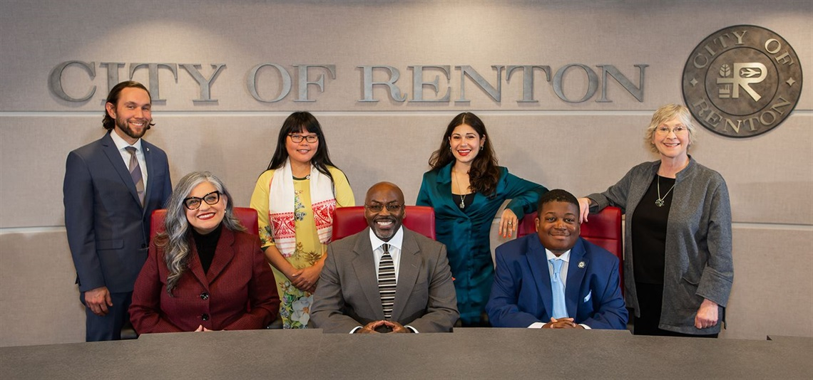
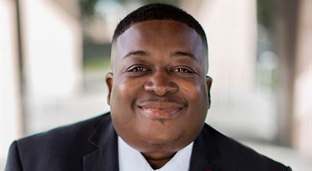

 

# City Council

   

The City Council assesses the needs of the public and sets priorities; develops and adopts the annual budget, ordinances, resolutions, and policy alternatives to meet those needs, consistent with city goals and objectives; and provides coordination and evaluation of programs and service objectives.

 Meet your Renton City Council 

  [## Councilmember James Alberson, Jr.](https://www.rentonwa.gov/Government/City-Council/alberson)   [## Councilmember Ruth Pérez](https://www.rentonwa.gov/Government/City-Council/perez)   [## Councilmember Ryan McIrvin](https://www.rentonwa.gov/Government/City-Council/mcirvin)   [## Councilmember Valerie O'Halloran](https://www.rentonwa.gov/Government/City-Council/ohalloran)   [## Councilmember Ed Prince](https://www.rentonwa.gov/Government/City-Council/prince)   [## Councilmember Carmen Rivera](https://www.rentonwa.gov/Government/City-Council/rivera)   [## Councilmember Kim-Khánh Văn](https://www.rentonwa.gov/Government/City-Council/van)  

 *  [City Council Agendas](https://renton.civicweb.net/Portal/MeetingTypeList.aspx) 
 *  [City Council Calendar](https://renton.civicweb.net/Portal/MeetingTypeList.aspx) 
 *  [City Council Committees](https://www.rentonwa.gov/Government/City-Council/Council-Committees) 
 *  [Next Week with City Council](https://www.rentonwa.gov/Government/City-Council/City-Council-Calendar/weeklyagendas) 
        

## Participate in a meeting

  [## Attending via Zoom**]()  

### Instructions for Virtual Attendance

 * Zoom:  [https://us02web.zoom.us/j/84938072917?pwd=TUNCcnppbjNjbjNRMWpZaXk2bjJnZz09](https://us02web.zoom.us/j/84938072917?pwd=TUNCcnppbjNjbjNRMWpZaXk2bjJnZz09)  (or copy the URL and paste into a web browser)
 * Call-in to the Zoom meeting by dialing 253-215-8782 and entering 849 3807 2917; Passcode 156708
 * Call 425-430-6501 by 5 p.m. on the day of the meeting to request an invite with a link to the meeting.
 * Watch a live stream on  [Renton Community TV](https://cloud.castus.tv/vod/renton/?page=HOME)  or on  [Channel 21](https://cloud.castus.tv/vod/renton/video/62d041a55b10b300097715fa?page=HOME) 

### Virtual Audience Comments

 Speakers providing audience comments through Zoom must complete the  [registration form](https://forms.office.com/pages/responsepage.aspx?id=QUEBcREGhUiOmMyWoF4WdYo4Sq7EkddPr5mxSWwUnxhUQkdFSFBUTEtUUFBPWVBIUjRWVkJVMTZSMi4u)  and submit by 5 p.m. on the day of the Council meeting. 

 Anyone registering after 5 p.m. on the day of the Council meeting will not be called upon to speak and will be required to re-register for the next Council meeting if they wish to speak at that next meeting. 

 The public may also submit comments in writing to  [cityclerk@rentonwa.gov](mailto:cityclerk@rentonwa.gov?subject=Public%20Comment)  by 5 p.m. on the day of the meeting. Registration is not required for those who wish to speak during public hearings. 

 

  [## Audience comments (Virtual and in person)**]()  

### Registration for Audience Comment Period

Registration will be open at all times, but speakers must register by 5 p.m. on the day of a Council meeting in order to be called upon.

 *  [Complete the Request to Speak Registration Form](https://forms.office.com/pages/responsepage.aspx?id=QUEBcREGhUiOmMyWoF4WdYo4Sq7EkddPr5mxSWwUnxhUQkdFSFBUTEtUUFBPWVBIUjRWVkJVMTZSMi4u)  or paste the following link into your browser: https://forms.office.com/g/bTJUj6NrEE
 * Call 425-430-6501
 * Email  [jsubia@rentonwa.gov](mailto:jsubia@rentonwa.gov?subject=Request%20to%20address%20city%20council)  or  [cityclerk@rentonwa.gov](mailto:cityclerk@rentonwa.gov?subject=Request%20to%20address%20city%20council)  to register. Please provide your full name, city of residence, email address and/or phone number, and topic in your message.

### Audience Comments

Audience comments are limited to 3 minutes for each speaker unless an exception is granted by the Council. Attendees will be muted and not audible to the Council except during times they are designated to speak. Advance instructions for how to address the Council will be provided to those who sign up in advance to speak and again during the meeting.

 __Notice to all participants: Pursuant to state law,  [RCW 42.17A.555](https://apps.leg.wa.gov/rcw/default.aspx?cite=42.17A.555) , campaigning for or against any ballot measure or candidate in Renton City Hall and/or during any portion of the council meeting, including the audience comment portion of the meeting, is prohibited.__ 

 

  [## Watch Renton City Council meetings**]()  

Council meetings can be viewed:

 *  [Live on Channel 21,](https://cloud.castus.tv/vod/renton/video/62d041a55b10b300097715fa?page=HOME&type=live)  Renton's cable access channel for Renton residents
 * On demand at at  [Renton Community TV](https://cloud.castus.tv/vod/renton/?page=HOME) 
 * On the city's  [YouTube channel](https://www.youtube.com/channel/UCuYPL89Peh3oH_TIGWtzbvg/videos)  the day after the meeting

 

## Contact Us

### Phone

 425-430-6501 

### Fax

 425-430-6523 

### Email

  [council@rentonwa.gov](mailto:council@rentonwa.gov)  

### Location

 Renton City Council 1055 South Grady Way Renton, WA 98057  [View Map](https://maps.google.com?q=Renton%20City%20Council%201055%20South%20Grady%20Way%20%20Renton,%20WA%2098057)  

## Staff Contact

 __Judith Subia__ 

Chief of Staff

 [cityclerk@rentonwa.gov ](mailto:cityclerk@rentonwa.gov) 

## Related Information

 *  [City Council Agendas](https://renton.civicweb.net/Portal/MeetingTypeList.aspx) 
 *  [City Council Calendar](https://renton.civicweb.net/Portal/MeetingTypeList.aspx) 
 *  [City Council Committees](https://www.rentonwa.gov/Government/City-Council/Council-Committees) 
 *  [Next Week with Council](https://www.rentonwa.gov/Government/City-Council/City-Council-Calendar/weeklyagendas) 
 