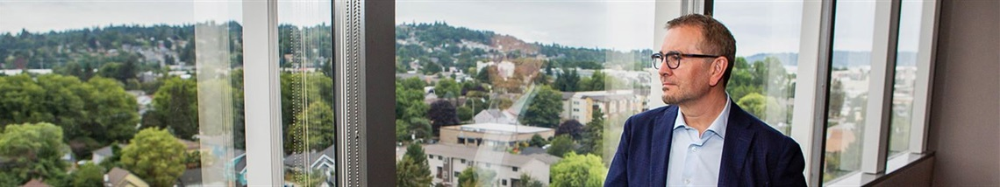

 

# Armondo Pavone

Mayor

    

 * 
   *  [Follow Mayor Pavone on Facebook](https://www.facebook.com/mayorpavone/) 

###  A LETTER FROM MAYOR PAVONE 

 It is my honor and privilege to serve the City of Renton as mayor.   

We all want Renton to be safe, healthy and have a welcoming atmosphere where people choose to live. I am committed to leading us in that endeavor. Together, we have an amazing opportunity to have a hand in Renton’s evolution from a drive-through city to a “drive-to” city.

I first ran for city council in 2013 and for mayor in 2019 to build on the great work accomplished in the decade prior, and to continue to give back to a community that has given so much to me and my family. As a lifelong Renton resident, this is where I live, work, and raise my family. The choices that move us all forward impact my own family as much as each of yours.

Our future lies in building an inclusive, informed city with opportunities for all. Renton is one of the most diverse communities in our region, and our diversity and experience lie our strengths. A trusted, effective, and relevant government is built on strong relationships, working to ensure that each voice is heard and respected.

To accomplish our vision of creating a center of opportunity where families and businesses thrive, we need to tackle the issues we will face in the near future. We must create a city where everyone has a safe place to call home.

Over the past four years, I have been intently focused on public safety, affordable housing, and promoting a vibrant economy to accomplish this. Together with council and our Public Works department, we are aggressively working to alleviate traffic congestion on city streets, to modernize and secure our infrastructure as we continue to grow as a hub of industry and vitality in the Puget Sound Region.

I want each of you to know I am proud of the relationship and partnership I have built with your [city council](https://www.rentonwa.gov/Government/City-Council). As a former councilmember, I understand and respect the role council plays in ensuring you have a responsive and effective government. As elected officials, we are all committed to delivering excellent service through innovation and collaboration.

Our goal is to ensure that all residents experience this every time they interact with a city employee.

I welcome invites and opportunities to be present and connect with the wide range of social and cultural groups here in Renton, and there are several ways to get involved with the city in volunteer capacities or have a direct conversation about issues or concerns. To keep informed on the most up-to-date news and information, I publish a weekly digital newsletter, information is available on the Mayor’s page on Facebook, on television via our public access Channel 21, and our website is also an excellent source of information.

## 2025 Statements & Releases

 *  [2025 Regional Boards and Committees appointments](https://www.rentonwa.gov/Government/News/Current-News/2025-Regional-Boards-and-Committees-appointments) 
 *  [Mayor Armondo Pavone elected as SCA Board VP](https://www.rentonwa.gov/Government/News/Current-News/Mayor-Armondo-Pavone-elected-as-SCA-Board-VP) 

## 2023 / 2024 Statements & Releases

###  2024 

 *   [**September 23, 2024(PDF, 152KB)](https://www.rentonwa.gov/files/assets/city/v/1/elected/mayor/documents/seattle-times-juvenile-crime.pdf)  - A joint statement from the Mayors of Renton, Kent, Auburn, and Federal Way on addressing juvenile crime in a new approach 
 *   [**September 10, 2024(PDF, 156KB)](https://www.rentonwa.gov/files/assets/city/v/1/elected/mayor/documents/september-10.pdf)   - Collective statement from Mayors of Renton, Kent, Auburn, and Everett regarding ongoing Boeing contract negotiations 
 *     [**July 31, 2024(PDF, 293KB)](https://www.rentonwa.gov/files/assets/city/v/1/elected/mayor/documents/press-release-city-elected-officials-launched-washington-collaborative-elected-leaders-institute-wa-celi.pdf)   - Mayor Pavone joins the Washington Collaborative Elected Leaders Institute 
 *     [**July 15, 2024(PDF, 320KB)](https://www.rentonwa.gov/files/assets/city/v/1/elected/mayor/documents/press-release-mayor-pavone-joins-bloomberg-harvard-city-leadership-initiative-1.pdf)   - Mayor Pavone joins Bloomberg Harvard City Leadership Initiative to advance city progress and improve outcomes for residents  [**(PDF, 141KB)](https://www.rentonwa.gov/files/assets/city/v/1/elected/mayor/documents/mayors-statement-plane-speak.pdf)  
 *   [**April 12, 2024(PDF, 141KB)](https://www.rentonwa.gov/files/assets/city/v/1/elected/mayor/documents/mayors-statement-plane-speak.pdf)   - Plane Speak: A statement on the recent updates at the Renton Municipal Airport 

###  2023 

 *     [**October 24, 2023(PDF, 55KB)](https://www.rentonwa.gov/files/assets/city/v/1/elected/mayor/documents/mayor_letterhead_safety.pdf)   - Statement from Renton Mayor on Safety for All Residents 
   *     [**10-24-23 Statement (Chinese)(PDF, 235KB)](https://www.rentonwa.gov/files/assets/city/v/1/elected/mayor/documents/mayor_letterhead_safety_zho-cn.pdf)  
   *   [** (PDF, 235KB)](https://www.rentonwa.gov/files/assets/city/v/1/elected/mayor/documents/mayor_letterhead_safety_zho-cn.pdf)  [**10-24-23 Statement (Spanish)(PDF, 235KB)](https://www.rentonwa.gov/files/assets/city/v/1/elected/mayor/documents/mayor_letterhead_safety_zho-cn.pdf)  
   *   [** (PDF, 235KB)](https://www.rentonwa.gov/files/assets/city/v/1/elected/mayor/documents/mayor_letterhead_safety_zho-cn.pdf)  [**10-24-23 Statement (Tagalog)(PDF, 81KB)](https://www.rentonwa.gov/files/assets/city/v/1/elected/mayor/documents/mayor_letterhead_safety_spa-us.pdf)  
   *   [** (PDF, 81KB)](https://www.rentonwa.gov/files/assets/city/v/1/elected/mayor/documents/mayor_letterhead_safety_spa-us.pdf)  [**10-24-23 Statement (Ukrainian)(PDF, 81KB)](https://www.rentonwa.gov/files/assets/city/v/1/elected/mayor/documents/mayor_letterhead_safety_tgl.pdf)  
   *   [** (PDF, 81KB)](https://www.rentonwa.gov/files/assets/city/v/1/elected/mayor/documents/mayor_letterhead_safety_tgl.pdf)  [**10-24-23 Statement (Vietnamese)(PDF, 89KB)](https://www.rentonwa.gov/files/assets/city/v/1/elected/mayor/documents/mayor_letterhead_safety_ukr.pdf)  

 *  [**June 29, 2023(PDF, 277KB)](https://www.rentonwa.gov/files/assets/city/v/1/elected/mayor/documents/mayor-pavone-earns-cml-from-awc.pdf)   - Mayor Armondo Pavone earns Certificate of Municipal Leadership from Association of Washington Cities 
 *     [**March 31, 2023 - Senseless Acts of Violence in Nashville Tennessee(PDF, 104KB)](https://www.rentonwa.gov/files/assets/city/v/1/elected/mayor/documents/mayor_letterhead_safety_vie.pdf) 
 *  [** (PDF, 104KB)](https://www.rentonwa.gov/files/assets/city/v/1/elected/mayor/documents/mayor_letterhead_safety_vie.pdf)  [**February 9, 2023(PDF, 325KB)](https://www.rentonwa.gov/files/assets/city/v/1/elected/mayor/documents/mayor-pavone-appointed-to-sca-board.pdf)   - Mayor Armondo Pavone appointed to Sound Cities Association Board of Directors 

   

 

  [## Administration](https://www.rentonwa.gov/Government/Mayor/Administration)   [## Business Plan](https://www.rentonwa.gov/Government/Mayor/Business-Plan)   [## Governor's Smart Communities Award](https://www.rentonwa.gov/Government/Mayor/Governors-Smart-Communities-Award)   [## Mayor's Inclusion Task Force](https://www.rentonwa.gov/Government/Mayor/Mayors-Inclusion-Task-Force)   [## Proclamations](https://www.rentonwa.gov/Government/Mayor/Proclamations)   [## Sister Cities](https://www.rentonwa.gov/Government/Mayor/Sister-Cities)  

 

## Contact

Please contact my office any time with your thoughts, comments, questions, or concerns.

 __ __ 

 __Email:__  [mayor@rentonwa.gov](mailto:mayor@rentonwa.gov)  ____ 

 __Phone:__ 425-430-6500

 

 

## About Mayor Pavone

Armondo Pavone is serving in his second term as mayor for the City of Renton. He was first elected as mayor in 2019.

 

## In This Section

 *  [Administration](https://www.rentonwa.gov/Government/Mayor/Administration) 
 *  [Business Plan](https://www.rentonwa.gov/Government/Mayor/Business-Plan) 
 *  [Proclamations](https://www.rentonwa.gov/Government/Mayor/Proclamations) 
 *  [Sister Cities](https://www.rentonwa.gov/Government/Mayor/Sister-Cities) 
 *  [Mayor's Inclusion Task Force](https://www.rentonwa.gov/Government/Mayor/Mayors-Inclusion-Task-Force) 
 *  [Governor's Smart Communities Award](https://www.rentonwa.gov/Government/Mayor/Governors-Smart-Communities-Award) 

## Related Information

 *  [Mayor's priorities](https://yourvoice.rentonwa.gov/mayors-priorities) 
 