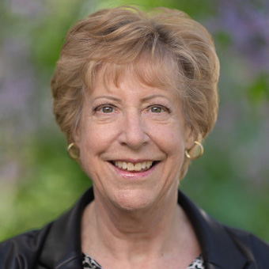
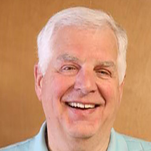

 

# City Council

The City of Yakima operates under the Council-Manager form of government. The Seven (7) member City Council is the City’s governing body. Members of the City Council serve four-year terms.

    

 __ [Leo Roy](https://www.yakimawa.gov/council/leo-roy/)__ 

District 1

Term Expires

December 31, 2027

   

 __ [Patricia Byers](https://www.yakimawa.gov/council/patricia-byers/)__ 

 __Mayor__ 

District 3

Term Expires

December 31, 2027

    

 __ [Rick Glenn](https://www.yakimawa.gov/council/rick-glenn/)__ 

District 5

Term Expires

December 31, 2027

    

 __ [Reedy Berg](https://www.yakimawa.gov/council/reedy-berg/)__ 

District 7

Term Expires

December 31, 2027

    

 __ [Danny Herrera](https://www.yakimawa.gov/council/danny-herrera/)__ 

District 2

Term Expires

December 31, 2025

    

 __ [Janice Deccio](https://www.yakimawa.gov/council/janice-deccio/)__ 

District 4

Term Expires

December 31, 2025

    

 __ [Matt Brown](https://www.yakimawa.gov/council/matt-brown/)__ 

 __Assistant Mayor__ 

District 6

Term Expires

December 31, 2025

