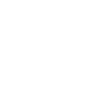

 [Skip to main content](https://bellevuewa.gov/city-government/east-bellevue-community-council#main-content)  Bellevue home 

 *  [Bellevue Home](https://bellevuewa.gov/city-government/east-bellevue-community-council) 
 *  [City Government](https://bellevuewa.gov/city-government)  
   *  [Boards, Commissions and Committees](https://bellevuewa.gov/city-government/boards-commissions-and-committees) 
   *  [City Code, Resolutions and Ordinances](https://bellevuewa.gov/city-government/departments/development/codes-and-guidelines) 
   *  [City Council](https://bellevuewa.gov/city-government/city-council) 
   *  [Communications](https://bellevuewa.gov/city-government/departments/city-managers-office/communications) 
   *  [Departments](https://bellevuewa.gov/city-government/departments) 
   *  [East Bellevue Community Council](https://bellevuewa.gov/city-government/east-bellevue-community-council) 
   *  [Hot Topics and Initiatives](https://bellevuewa.gov/discover-bellevue/about-us/hot-topics-initiatives) 
   *  [Public Records Requests](https://bellevuewa.gov/city-government/Public-Records-Requests) 
   *  [Sister Cities](https://bellevuewa.gov/city-government/sister-cities)  
 *  [Departments](https://bellevuewa.gov/city-government/departments)  
   *  [City Attorney's Office](https://bellevuewa.gov/city-government/departments/city-attorneys-office) 
   *  [City Clerk's Office](https://bellevuewa.gov/city-government/departments/city-clerks-office) 
   *  [City Manager's Office](https://bellevuewa.gov/city-government/departments/city-managers-office) 
   *  [Communications](https://bellevuewa.gov/city-government/departments/city-managers-office/communications) 
   *  [Community Development](https://bellevuewa.gov/city-government/departments/community-development) 
   *  [Development Services](https://bellevuewa.gov/city-government/departments/development) 
   *  [Emergency Management](https://bellevuewa.gov/city-government/departments/fire/emergency-management) 
   *  [Finance & Asset Management](https://bellevuewa.gov/city-government/departments/finance) 
   *  [Fire](https://bellevuewa.gov/city-government/departments/fire) 
   *  [Human Resources](https://bellevuewa.gov/city-government/departments/human-resources) 
   *  [Information Technology](https://bellevuewa.gov/city-government/departments/ITD) 
   *  [Parks & Community Services](https://bellevuewa.gov/city-government/departments/parks) 
   *  [Police](https://bellevuewa.gov/city-government/departments/police) 
   *  [Transportation](https://bellevuewa.gov/city-government/departments/transportation) 
   *  [Utilities](https://bellevuewa.gov/city-government/departments/utilities)  
 *  [Discover Bellevue](https://bellevuewa.gov/discover-bellevue)  
   *  [About Us](https://bellevuewa.gov/discover-bellevue/about-us) 
   *  [Bellevue Television](https://bellevuewa.gov/city-government/departments/city-managers-office/communications/bellevue-television) 
   *  [City News](https://bellevuewa.gov/city-news) 
   *  [Things to Do](https://bellevuewa.gov/discover-bellevue/things-to-do) 
   *  [Arts in Bellevue](https://bellevuewa.gov/discover-bellevue/arts-in-bellevue) 
   *  [Parks and Trails](https://bellevuewa.gov/discover-bellevue/parks-and-trails-link) 
   *  [Economic Development](https://bellevuewa.gov/discover-bellevue/economic-development-link)  
 *  [Doing Business](https://bellevuewa.gov/doing-business)  
   *  [Building and Zoning](https://bellevuewa.gov/city-government/departments/development) 
   *  [Doing Business in Bellevue](https://bellevuewa.gov/city-government/departments/community-development/economic-development) 
   *  [Doing Business with Bellevue](https://bellevuewa.gov/doing-business/doing-business-with-bellevue)  
 *  [Public Safety](https://bellevuewa.gov/public-safety)  
   *  [Police](https://bellevuewa.gov/city-government/departments/police) 
   *  [Fire](https://bellevuewa.gov/city-government/departments/fire) 
   *  [Emergencies and Extreme Weather](https://bellevuewa.gov/city-government/departments/city-managers-office/communications/emergencies-and-extreme-weather) 
   *  [Emergency Preparedness](https://bellevuewa.gov/public-safety/emergency-preparedness) 
   *  [Municipal Court](https://bellevuewa.gov/public-safety/municipal-court) 
   *  [Neighborhood Traffic Safety](https://bellevuewa.gov/public-safety/neighborhood-traffic-safety) 
   *  [Probation](https://bellevuewa.gov/public-safety/probation) 
   *  [Public Defenders](https://bellevuewa.gov/city-government/departments/city-attorneys-office/apply-for-a-public-defender)  
 *  [Resident Resources](https://bellevuewa.gov/resident-resources)  
   *  [ADA and Language Access Resources](https://bellevuewa.gov/resident-resources/adatitle-vi-resources) 
   *  [Customer Assistance](https://bellevuewa.gov/city-government/departments/finance/mybellevue/customer-assistance) 
   *  [Conflict Assistance](https://bellevuewa.gov/city-government/departments/community-development/conflict-assistance) 
   *  [Diversity Advantage](https://bellevuewa.gov/city-government/departments/city-managers-office/diversity) 
   *  [Neighborhoods](https://bellevuewa.gov/city-government/departments/community-development) 
   *  [Newcomers Guide](https://bellevuewa.gov/resident-resources/newcomers-guide) 
   *  [Permits, Parking and Utilities](https://bellevuewa.gov/resident-resources/permits-parking-utilities) 
   *  [Volunteering](https://bellevuewa.gov/volunteering) 
   *  [Local Service Agencies](https://bellevuewa.gov/city-government/departments/parks/community-services/human-services/local-service-agencies)  
  [City of Bellevue, WA](https://bellevuewa.gov/city-government/east-bellevue-community-council)  [City Clerk's Office](https://bellevuewa.gov/city-government/departments/city-clerks-office)   ** Go!  **  Language  [English](https://bellevuewa.gov)  [Español](https://bellevuewa.gov/es/welcome)  [简体中文](https://bellevuewa.gov/zh-hans/welcome)  [繁體中文](https://bellevuewa.gov/zh-hant/welcome)  [日本語](https://bellevuewa.gov/ja/welcome)  [한국어](https://bellevuewa.gov/ko/welcome)  [Pусский](https://bellevuewa.gov/ru/welcome)  [Tiếng Việt](https://bellevuewa.gov/vi/welcome)   **  Menu 

#  Former East Bellevue Community Council 

## Breadcrumb

 1.  [Home](https://bellevuewa.gov/city-government/east-bellevue-community-council) 
 1.  [City Government](https://bellevuewa.gov/city-government) 
 1. Former East Bellevue Community Council
    How may I help you? 

### How may I help you?

This is an artificial-intelligence (AI) chatbot designed to provide general information about various city topics. If you are having an emergency of any kind, please call 911 immediately. The chatbot is still learning about all of our services and may occasionally provide an incorrect answer.

 ×  [Give Feedback](https://bellevuewa.gov/mybellevue-chatbot-feedback)  
 [**](https://bellevuewa.gov/city-government/east-bellevue-community-council#) 
 [**](https://bellevuewa.gov/city-government/east-bellevue-community-council#) 
 [**](https://bellevuewa.gov/city-government/east-bellevue-community-council#)             Expand Menu 

##  [City Government](https://bellevuewa.gov/city-government) 

 *  [Boards, Commissions and Committees](https://bellevuewa.gov/city-government/departments/city-clerks-office/boards-and-commissions) 
 *  [City Code, Resolutions and Ordinances](https://bellevuewa.gov/city-government/departments/development/codes-and-guidelines) 
 *  [City Council](https://bellevuewa.gov/city-government/city-council) 
   *  [Councilmembers](https://bellevuewa.gov/city-government/city-council/councilmembers) 
   *  [Council Meetings](https://bellevuewa.gov/city-government/city-council/council-meetings) 
   *  [City Council Vision](https://bellevuewa.gov/city-government/city-council/council-vision) 
   *  [Proclamation Requests](https://bellevuewa.gov/city-government/city-council/proclamation-requests) 
   *  [State of the City](https://bellevuewa.gov/city-government/city-council/state-of-the-city) 
   *  [Council Pledge](https://bellevuewa.gov/city-government/city-council/council-pledge) 
 *  [Departments](https://bellevuewa.gov/city-government/departments) 
   *  [City Attorney's Office](https://bellevuewa.gov/city-government/departments/city-attorneys-office) 
   *  [City Clerk's Office](https://bellevuewa.gov/city-government/departments/city-clerks-office) 
   *  [City Manager's Office](https://bellevuewa.gov/city-government/departments/city-managers-office) 
   *  [Community Development](https://bellevuewa.gov/city-government/departments/community-development) 
   *  [Development Services](https://bellevuewa.gov/city-government/departments/development) 
   *  [Finance & Asset Management](https://bellevuewa.gov/city-government/departments/finance) 
   *  [Fire](https://bellevuewa.gov/city-government/departments/fire) 
   *  [Human Resources](https://bellevuewa.gov/city-government/departments/human-resources) 
   *  [Information Technology](https://bellevuewa.gov/city-government/departments/ITD) 
   *  [Parks & Community Services](https://bellevuewa.gov/city-government/departments/parks) 
   *  [Police](https://bellevuewa.gov/city-government/departments/police) 
   *  [Transportation](https://bellevuewa.gov/city-government/departments/transportation) 
   *  [Utilities](https://bellevuewa.gov/city-government/departments/utilities) 
 *  [Hot Topics and Initiatives](https://bellevuewa.gov/discover-bellevue/about-us/hot-topics-initiatives) 
 *  [Public Records Requests](https://bellevuewa.gov/city-government/departments/city-clerks-office/public-records) 
 *  [Sister Cities](https://bellevuewa.gov/city-government/sister-cities) 
    Header Image    

 On July 9, 2022, the East Bellevue Community Council was sunset by state law ( [House Bill 1769](https://app.leg.wa.gov/billsummary?BillNumber=1769&Year=2021&Initiative=false) ). The EBCC is dissolved and no longer meets. 

 Established in 1969, the EBCC was empowered by state law with approval/disapproval authority over certain land-use actions in a part of East Bellevue, leading to some differences in regulations in part of East Bellevue. The City Council on July 18, 2022, removed references to the EBCC from the Land Use Code and adopted previously disapproved ordinances within the EBCC jurisdiction area. 

 *  Questions about regulations in the former jurisdiction of the EBCC? Contact a land use planner in Development Services at 425-452-4188 or [landusereview@bellevuewa.gov](mailto:landusereview@bellevuewa.gov). 
 *  Want more information about amendments related to the sunsetting of the EBCC? See [EBCC Sunset Code Amendment](https://bellevuewa.gov/city-government/departments/development/codes-and-guidelines/code-amendments/recent-code-7). 
 *  Want to become more involved or learn more about East Bellevue neighborhoods? Visit [Neighborhood Services](https://bellevuewa.gov/city-government/departments/community-development/neighborhoods). 

## City Clerk's Office

  __Karin Roberts__ 

Deputy City Clerk

  Telephone  [425-452-6806]()  Email  [ebcc@bellevuewa.gov](mailto:ebcc@bellevuewa.gov)  

### Reasonable Accommodation

For alternate formats, interpreters, or reasonable modification requests please phone at least 48 hours in advance [425-452-6806]() (voice) or email [ebcc@bellevuewa.gov](mailto:ebcc@bellevuewa.gov). For complaints regarding modifications, contact the City of Bellevue ADA, Title VI, and Equal Opportunity Officer at [ADATitleVI@bellevuewa.gov](mailto:ADATitleVI@bellevuewa.gov).

###  [City of Bellevue, WA](https://bellevuewa.gov/city-government/east-bellevue-community-council) 

 *  ** 450 110th Avenue NE
 * Bellevue, WA 98004
 *  [**Directions to City Hall](https://www.google.com/maps/place/Bellevue+City+Hall/@47.6144305,-122.1929512,18z) 
 *  **  [425-452-6800]() 
 *  **  [servicefirst@bellevuewa.gov](mailto:servicefirst@bellevuewa.gov) 
 *  **  [Contact Us / City Directory](https://bellevuewa.gov/contact-us) 
 *  ** Monday - Friday 8 a.m. - 4 p.m.

## Footer Menu Contacts

 *  [MyBellevue Customer Assistance](https://bellevuewa.gov/city-government/departments/civic-services/mybellevue/customer-assistance) 
 *  [**Careers](https://www.governmentjobs.com/careers/bellevuewa) 
 *  [**ADA/Title VI Notices](https://bellevuewa.gov/resident-resources/adatitle-vi-resources) 

## Languages

 *  [English](https://bellevuewa.gov) 
 *  [Español](https://bellevuewa.gov/es/welcome) 
 *  [简体中文](https://bellevuewa.gov/zh-hans/welcome) 
 *  [繁體中文](https://bellevuewa.gov/zh-hant/welcome) 
 *  [日本語](https://bellevuewa.gov/ja/welcome) 
 *  [한국어](https://bellevuewa.gov/ko/welcome) 
 *  [Pусский](https://bellevuewa.gov/ru/welcome) 
 *  [Tiếng Việt](https://bellevuewa.gov/vi/welcome) 

## Request a Translation

 *  [Request a Translation](https://bellevuewa.gov/request-translation) 
 *  [اطلب ترجمة](https://bellevuewa.gov/ar/atlb-trjmt) 
 *  [申请翻译](https://bellevuewa.gov/zh-hans/shenqingfanyi) 
 *  [要求翻譯](https://bellevuewa.gov/zh-hant/yaoqiufanyi) 
 *  [अनुवाद का अनुरोध करें](https://bellevuewa.gov/hi/anauvaada-kaa-anauraodha-karaen) 
 *  [翻訳をリクエストする](https://bellevuewa.gov/ja/fanyiworikuesutosuru) 
 *  [번역 요청](https://bellevuewa.gov/ko/beonyeog-yocheong) 
 *  [درخواست ترجمه](https://bellevuewa.gov/fa/drkhwast-trjmh) 
 *  [ਅਨੁਵਾਦ ਦੀ ਬੇਨਤੀ ਕਰੋ](https://bellevuewa.gov/pa/anauvaada-dai-baeenatai-karaoo) 
 *  [Запрос на перевод](https://bellevuewa.gov/ru/zapros-na-perevod) 
 *  [Solicitud de traducción](https://bellevuewa.gov/es/solicitud-de-traduccion) 
 *  [అనువాదం అడగండి](https://bellevuewa.gov/te/anauvaaadam-adagamdai) 
 *  [ترجمےکے لئے ایک درخواست](https://bellevuewa.gov/ur/trjmyky-lyy-ayk-drkhwast) 
 *  [Yêu cầu bản dịch](https://bellevuewa.gov/vi/yeu-cau-ban-dich) 
 *  [ትርጉም መጠየቅ](https://bellevuewa.gov/am/teregume-mathayaqe) 

## Social Media

 *  [**](https://www.facebook.com/bellevuewashington) 
 *  [**](https://www.instagram.com/cityofbellevuewa) 
 *  [**](https://twitter.com/bellevuewa) 
 *  [**](https://www.youtube.com/channel/UCW22suSoHWumwarCbu3NkOg) 

© 2024 City of Bellevue | All Rights Reserved. | [ADA/Title VI Notices](https://bellevuewa.gov/resident-resources/adatitle-vi-resources) | [Terms of Use](https://bellevuewa.gov/terms-of-use) | [Privacy Policy](https://bellevuewa.gov/privacy-security) | [Site Map](https://bellevuewa.gov/sitemap)  

 