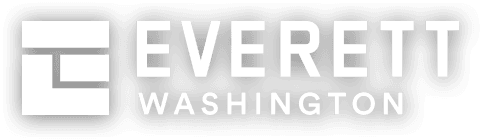
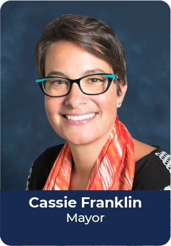
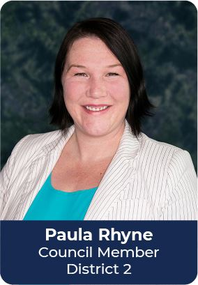
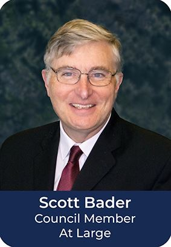
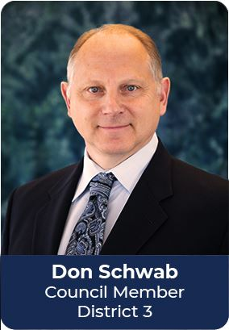
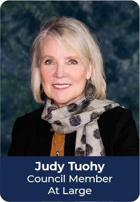
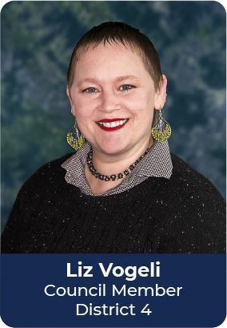
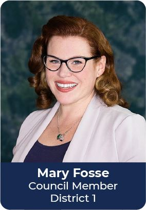
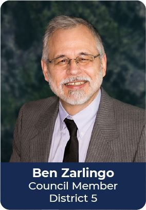

   

Loading

  [Skip to Main Content](https://everettwa.gov/citycouncil#cc79272875-c617-417c-ac68-fd5c98491c72)  

 [Create a Website Account](https://everettwa.gov/MyAccount/ProfileCreate)  - Manage notification subscriptions, save form progress and more.    

 *  [Website Sign In](https://everettwa.gov/MyAccount) 

 1.  [Your City](https://everettwa.gov/27/Your-City) 
 1.  [Services](https://everettwa.gov/31/Services) 
 1.  [Doing Business](https://everettwa.gov/35/Doing-Business) 
 1.  [Live & Visit](https://everettwa.gov/1996/Live-Visit) 
 1.  [I Want To...](https://everettwa.gov/9/I-Want-To) 
      Search    

 1.  [Home](https://everettwa.gov/citycouncil) 
 1.  [Your City](https://everettwa.gov/27/Your-City) 
 1.  [Elected Officials](https://everettwa.gov/1038/Elected-Officials) 
 1. City Council

# Everett City Council

## About Us

Everett City Council is the city's governing body. Council comprises seven non-partisan Councilmembers – two at-large and five district representatives –who are elected to serve four-year terms advocating for Everett residents. 

Together, the Mayor and Councilmembers establish policies, determine goals, objectives and direction for city services and adopt annual operating budgets for all City of Everett departments.

## Mission Statement

As a matter of open government and transparency, the Everett City Council strives to engage the public in a civil and democratic process. As the policy-setting and oversight body for the City, the design of the City's democracy as outlined in the Charter is that the legislative branch sets the policy, and the administrative branch carries it out. 

### Meeting Schedule

The Council meets every Wednesday at 6:30 p.m. Effective Oct. 30, 2024, __the 4th and when applicable, the 5th, Wednesday of each month will start at 12:30 p.m.__ , in the Everett City Council Chambers, located in the Everett Police Department North Precinct at 3002 Wetmore Ave. Meetings are open to the public. In-person and virtual public comments are welcomed and appreciated.

To sign up for in-person public comments, arrive at City Council Chambers before the meeting begins and complete the sign-up sheet. For virtual comment, [sign up online by 6 pm](https://www.everettwa.gov/FormCenter/Council-public-comment-sign-up-34/City-Council-virtual-public-comment-regi-382) (by 12pm on day meetings) on the day of the council meeting to receive a Zoom link and phone number.

Please note that everyone is required to go through a metal detector before entering Everett City Council Chambers. Only City of Everett staff with proper credentials are permitted to bypass the metal detector. The public and city staff are permitted to bring personal items such as purses, bags and laptop computers into City Council Chambers.

### ADA Information and Requests

The City of Everett does not discriminate on the basis of disability in the admission or access to, or treatment in, its programs or activities. [Requests](https://www.everettwa.gov/3129/Americans-with-Disabilities-Act-ADA-and-) for assistance or accommodations can be arranged by contacting the Everett City Council Office at 425.257.8703. 

       

## Meet Your Everett City Councilmembers

We are proud to represent our community. Our Councilmembers prioritize collaborating with city officials and locals to create solutions that make Everett an attractive place to visit, work or live.

Interested in getting to know your City Council? Click the images below to read bios and discover info about districts, neighborhoods and more!

                         

## Additional Resources

Find information on City Council meetings, public comments and more.

 [Council Meeting Documents](https://www.everettwa.gov/1004/Council-Meeting-Documents) 

Read past and current agendas and minutes of City Council meetings.

 [Archived City Council Agendas & Minutes](https://www.everettwa.gov/2830/Archived-City-Council-agendas-minutes) 

Search for and view past City Council meeting minutes in the City's Digital Records Center.

 [Public Comment Sign Up Form](https://www.everettwa.gov/2762/Council-meeting-public-comment-sign-up-f) 

Sign up for public comment at an upcoming a City Council meeting via Zoom.

 [Watch Archived Meetings](https://www.everettwa.gov/1078) 

View videos of past council and committee meetings.

 [City Council Meeting Information](https://www.everettwa.gov/462/Committee-Meeting-Information) 

Find more information about the council's five working committees

 [City Council Districts](https://www.everettwa.gov/1856/City-Council-Districts) 

Explore City Council districting, which was approved by Everett voters in Nov. 2018. Voters selected a total of 5 districts and 2 at-large positions __.__ 

###  [Contact Us](https://everettwa.gov/Directory.aspx) 

 1.    

#### Angela Ely   

 Executive Assistant to City Council  [Email](mailto:aely@everettwa.gov)  Phone: [425-257-8703]()     

 1.    

#### City Council   

  [Email](mailto:council@everettwa.gov)     

  __Physical Address__    

 2930 Wetmore Ave.    

 Suite 9-A    

 Everett , WA 98201    

 Phone: [425-257-8703]()     

 City Council Chambers (Meeting location)     

William E Moore Historic City Hall (Police, North Precinct)   

3002 Wetmore Ave.   

Everett, WA 98201   

  [Directory](https://everettwa.gov/directory.aspx?did=36)     

###  [Quick Links](https://everettwa.gov/QuickLinks.aspx?CID=128) 

 1.  [Find your city council district](https://www.everettwa.gov/DocumentCenter/View/33523/CityCouncilDistrictsandPrecincts24x36_10192022)  
 1.  [Driving Directions](https://www.google.com/maps/place/3002+Wetmore+Ave,+Everett,+WA+98201/@47.9775885,-122.2097973,17z/data=!3m1!4b1!4m5!3m4!1s0x549aaa997c765509:0x389690710e5ea54a!8m2!3d47.9775885!4d-122.2076086?hl=en)  
 1.  [View current and past agendas](https://www.everettwa.gov/AgendaCenter/City-Council-10)  
 1.  [View archived agendas and meeting minutes](https://www.everettwa.gov/1785/Digital-Records-Center)  
 1.  [Watch meetings live via YouTube](https://www.youtube.com/user/TheCityofEverett)  
 1.  [Watch archived meetings](https://www.everettwa.gov/1078)  
 1.  [Get City Council agenda notifications](https://www.everettwa.gov/list.aspx#agendaCenter)  
 1.  [Get City Council meeting notifcations](https://www.everettwa.gov/list.aspx#agendaCenter)  
 1.  [Notify Me](https://www.everettwa.gov/list.aspx)  Subscribe to receive notifications 
 1.  [Subscribe to the City of Everett Newsletter](https://www.everettwa.gov/list.aspx?PRVMSG=304)  
 1.  [Everett at Work](https://seeclickfix.com/web_portal/nMo6doKcKJJUWXMs6nTy8dCy/issues/map?lat=47.97653118674055&lng=-122.20619303096747&max_lat=47.98954379774746&max_lng=-122.17460733760815&min_lat=47.96351529538075&min_lng=-122.2377787243268&zoom=14)  Report an issue/Request service 
  [View All](https://everettwa.gov/QuickLinks.aspx?CID=128)  /QuickLinks.aspx 

 1.   [City Council Districts](https://everettwa.gov/1856/City-Council-Districts)    
    1.   [District 1 - Fosse and At Large](https://everettwa.gov/3061/District-1---Fosse-and-At-Large)  
    1.   [District 2 - Rhyne and At Large](https://everettwa.gov/3062/District-2---Rhyne-and-At-Large)  
    1.   [District 3 - Schwab and At Large](https://everettwa.gov/3063/District-3---Schwab-and-At-Large)  
    1.   [District 4 - Vogeli and At Large](https://everettwa.gov/3064/District-4---Vogeli-and-At-Large)  
    1.   [District 5 - Zarlingo and At Large](https://everettwa.gov/3065/District-5---Zarlingo-and-At-Large)  
    1.   [Council Districts History](https://everettwa.gov/2834/Council-Districts-History)  
    1.   [Archived Districting Meetings](https://everettwa.gov/2580/Archived-Districting-Meetings)  
 1.   [Council Meeting Documents, Agendas and Minutes](https://everettwa.gov/2996/Council-Meeting-Documents-Agendas-and-Mi)    
    1.   [Council Meeting Documents](https://everettwa.gov/AgendaCenter)  
    1.   [City Council Archive](https://everettwa.gov/1078/City-Council-Archive)  
    1.   [Archived City Council Meetings](https://lfportal.everettwa.gov/WebLink/Browse.aspx?startid=24&id=5)  
    1.   [Archived City Council Agendas and Minutes](https://www.everettwa.gov/1785/Digital-Records-Center)  
 1.   [Council Meetings](https://everettwa.gov/462/Council-Meetings)    
    1.   [City Council Meeting Information](https://everettwa.gov/3038/City-Council-Meeting-Information)  
    1.   [Council Committee Meeting Information](https://everettwa.gov/3037/Council-Committee-Meeting-Information)  
    1.   [Council Liaison Assignments & Mayoral Appointments](https://everettwa.gov/3035/Council-Liaison-Assignments-Mayoral-Appo)  
 1.   [Health and Human Services Committee](https://www.everettwa.gov/3028/36065/Health-and-Human-Services-Committee)  
 1.   [Parks and Quality of Life Committee](https://www.everettwa.gov/3026/Parks-and-Quality-of-Life-Committee)  
 1.   [Budget Committee](https://everettwa.gov/477/City-Council-Budget-Committee)  
 1.   [Public Comment Sign Up Form](https://everettwa.gov/FormCenter/Council-public-comment-sign-up-34/City-Council-virtual-public-comment-regi-382)  
 1.   [Mayor's Office](https://www.everettwa.gov/270/Mayors-Office)  
 1.   [Council Connection newsletter](https://everettwa.gov/3216/Council-Connection-newsletter)  
  [Careers Find current employment opportunities and search job descriptions](https://everettwa.gov/1408)   [Pay Online Pay bills, donate and register online.](https://everettwa.gov/928)   [Records & Data 

 Access public records and open data.](https://everettwa.gov/2231)   [Subscribe Stay up to date on news, events, and neighborhood specific information.](https://everettwa.gov/list.aspx)   [News Get the latest news about what's happening in Everett.](https://everettwa.gov/civicalerts.aspx)   [Map Gallery Explore the area through static and interactive maps.](https://everettwa.gov/2205)     

### Contact Us

 1.    

  __City of Everett__ 2930 Wetmore Avenue   

Everett, WA 98201, USA   

Phone: [425.257.8700]()     

###  [Quick Links](https://everettwa.gov/QuickLinks.aspx?CID=299) 

 1.  [Mayor's Office](https://www.everettwa.gov/270/Mayors-Office)  
 1.  [City Council](https://everettwa.gov/citycouncil)  
 1.  [City Newsletter](https://www.everettwa.gov/1697/City-of-Everett-Newsletter)  
 1.  [Employment](https://everettwa.gov/1408/Employment-Opportunities)  
 1.  [Everett Parks](https://everettwa.gov/149/Parks-Recreation)  
 1.  [Festivals and Events](https://everettwa.gov/765/Festivals-Events)  
 /QuickLinks.aspx 

###  [Site Links](https://everettwa.gov/QuickLinks.aspx?CID=391) 

 1.  [Home](https://everettwa.gov/citycouncil)  
 1.  [Site Map](https://everettwa.gov/SiteMap)  
 1.  [Accessibility](https://everettwa.gov/Accessibility)  
 1.  [Copyright Notices](https://everettwa.gov/Copyright)  
 1.  [American Disabilities Act and Title VI Notices](https://everettwa.gov/ADA)  
 /QuickLinks.aspx          Government Websites by [CivicPlus®](https://www.civicplus.com/referral)    Loading Loading Do Not Show Again Close Select LanguageAbkhazAcehneseAcholiAfarAfrikaansAlbanianAlurAmharicArabicArmenianAssameseAvarAwadhiAymaraAzerbaijaniBalineseBaluchiBambaraBaouléBashkirBasqueBatak KaroBatak SimalungunBatak TobaBelarusianBembaBengaliBetawiBhojpuriBikolBosnianBretonBulgarianBuryatCantoneseCatalanCebuanoChamorroChechenChichewaChinese (Simplified)Chinese (Traditional)ChuukeseChuvashCorsicanCrimean Tatar (Cyrillic)Crimean Tatar (Latin)CroatianCzechDanishDariDhivehiDinkaDogriDombeDutchDyulaDzongkhaEsperantoEstonianEweFaroeseFijianFilipinoFinnishFonFrenchFrench (Canada)FrisianFriulianFulaniGaGalicianGeorgianGermanGreekGuaraniGujaratiHaitian CreoleHakha ChinHausaHawaiianHebrewHiligaynonHindiHmongHungarianHunsrikIbanIcelandicIgboIlocanoIndonesianInuktut (Latin)Inuktut (Syllabics)IrishItalianJamaican PatoisJapaneseJavaneseJingpoKalaallisutKannadaKanuriKapampanganKazakhKhasiKhmerKigaKikongoKinyarwandaKitubaKokborokKomiKonkaniKoreanKrioKurdish (Kurmanji)Kurdish (Sorani)KyrgyzLaoLatgalianLatinLatvianLigurianLimburgishLingalaLithuanianLombardLugandaLuoLuxembourgishMacedonianMadureseMaithiliMakassarMalagasyMalayMalay (Jawi)MalayalamMalteseMamManxMaoriMarathiMarshalleseMarwadiMauritian CreoleMeadow MariMeiteilon (Manipuri)MinangMizoMongolianMyanmar (Burmese)Nahuatl (Eastern Huasteca)NdauNdebele (South)Nepalbhasa (Newari)NepaliNKoNorwegianNuerOccitanOdia (Oriya)OromoOssetianPangasinanPapiamentoPashtoPersianPolishPortuguese (Brazil)Portuguese (Portugal)Punjabi (Gurmukhi)Punjabi (Shahmukhi)QuechuaQʼeqchiʼRomaniRomanianRundiRussianSami (North)SamoanSangoSanskritSantali (Latin)Santali (Ol Chiki)Scots GaelicSepediSerbianSesothoSeychellois CreoleShanShonaSicilianSilesianSindhiSinhalaSlovakSlovenianSomaliSpanishSundaneseSusuSwahiliSwatiSwedishTahitianTajikTamazightTamazight (Tifinagh)TamilTatarTeluguTetumThaiTibetanTigrinyaTivTok PisinTonganTshilubaTsongaTswanaTuluTumbukaTurkishTurkmenTuvanTwiUdmurtUkrainianUrduUyghurUzbekVendaVenetianVietnameseWarayWelshWolofXhosaYakutYiddishYorubaYucatec MayaZapotecZulu Powered by  [Translate](https://translate.google.com)  

    Original text Rate this translation Your feedback will be used to help improve Google Translate      