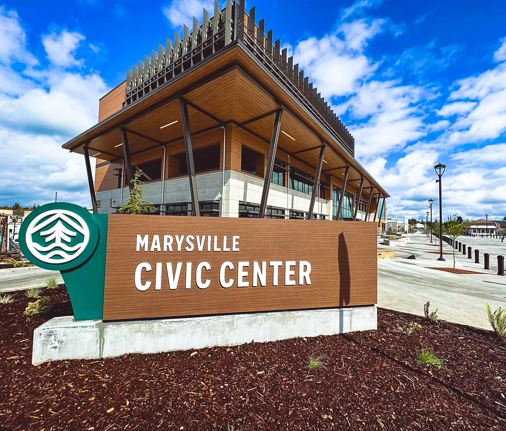

   

Loading

  [Skip to Main Content](http://www.marysvillewa.gov/27/Government#cc8bd5517c-cfc5-4f2e-9df5-9d733e2fa41e)       Search 

 1.  [I Want To...](http://www.marysvillewa.gov/70/I-Want-To) 
 1.  [Government](http://www.marysvillewa.gov/27/Government) 
 1.  [Community](http://www.marysvillewa.gov/31/Community) 
 1.  [Economic Development](http://www.marysvillewa.gov/35/Economic-Development) 
 1.  [Visiting](http://www.marysvillewa.gov/9/Visiting) 
    

 1.  [Home](http://www.marysvillewa.gov/27/Government) 
 1. Government

# Government

The City of Marysville is a mayor-council form of government. Seven residents are elected at-large who make up the city council. The mayor, also a resident, is elected and serves full-time as the chief executive of the city. In this form of government, policy and administration are separated. All legislative and policymaking powers are vested in the city council. The administrative authority, including a veto power (except in towns), is vested in the mayor.

 *  [Boards & commissions](https://marysvillewa.gov/195/Boards-Commissions) 
 *  [City Council](https://marysvillewa.gov/264/City-Council) 
 *  [Departments](https://marysvillewa.gov/8/Departments) 
 *  [Key priorities](https://marysvillewa.gov/678/Key-Priorities) 
 *  [Marysville Civic Center](https://marysvillewa.gov/973/Marysville-Civic-Center) 
 *  [Marysville Digital Records Center](https://marysvillewa.gov/1398/Marysville-Digital-Records-Center) 
 *  [Marysville Municipal](https://marysvillewa.gov/1376/Marysville-Municipal-Code) 
 *  [Municipal Court](https://marysvillewa.gov/732/Municipal-Court) 
 *  [Office of the Mayor](https://marysvillewa.gov/187/Office-of-the-Mayor) 
    

 1.   [Boards & Commissions](http://www.marysvillewa.gov/195/Boards-Commissions)    
    1.   [Civil Service Commission](http://www.marysvillewa.gov/253/Civil-Service-Commission)  
    1.   [Fire District Board of Directors](http://www.marysvillewa.gov/256/Fire-District-Board-of-Directors)    
       1.   [Regional Fire Authority](http://www.marysvillewa.gov/783/Regional-Fire-Authority)    
          1.   [RFA Key Milestones](http://www.marysvillewa.gov/989/RFA-Key-Milestones)  
          1.   [RFA Committee Agendas](http://www.marysvillewa.gov/795/RFA-Committee-Agendas)  
          1.   [RFA Planning Committee](http://www.marysvillewa.gov/985/RFA-Planning-Committee)  
          1.   [City Marysville Fire Services Background](http://www.marysvillewa.gov/796/City-Marysville-Fire-Services-Background)  
          1.   [Fire District 12 Boundary Map](http://www.marysvillewa.gov/986/Fire-District-12-Boundary-Map)  
    1.   [Marysville Hearing Examiner](http://www.marysvillewa.gov/257/Marysville-Hearing-Examiner)  
    1.   [Meeting agendas and minutes](http://www.marysvillewa.gov/1374/Meeting-agendas-and-minutes)  
    1.   [Parks, Culture & Recreation Advisory Board](http://www.marysvillewa.gov/258/Parks-Culture-Recreation-Advisory-Board)  
    1.   [Planning Commission](http://www.marysvillewa.gov/259/Planning-Commission)  
    1.   [Salary Commission](http://www.marysvillewa.gov/319/Salary-Commission)  
 1.   [City Council](http://www.marysvillewa.gov/264/City-Council)    
    1.   [About City Council](http://www.marysvillewa.gov/1106/About-City-Council)  
    1.   [Council meeting agendas and minutes](http://www.marysvillewa.gov/1366/Council-meeting-agendas-and-minutes)  
    1.   [Council meeting procedures](http://www.marysvillewa.gov/262/Council-meeting-procedures)  
    1.   [Meet the Council](http://www.marysvillewa.gov/265/Meet-the-Council)    
       1.   [Michael A. Stevens - Council President (Pos. 4)](http://www.marysvillewa.gov/953/Michael-A-Stevens---Council-President-Po)  
       1.   [Peter Condyles - Pos. 1](http://www.marysvillewa.gov/954/Peter-Condyles---Pos-1)  
       1.   [Mark A. James - Pos. 2](http://www.marysvillewa.gov/951/Mark-A-James---Pos-2)  
       1.   [Tom King - Pos. 3](http://www.marysvillewa.gov/952/Tom-King---Pos-3)  
       1.   [Kelly Richards - Pos. 5](http://www.marysvillewa.gov/955/Kelly-Richards---Pos-5)  
       1.   [Stephen C. Muller - Pos. 6](http://www.marysvillewa.gov/956/Stephen-C-Muller---Pos-6)  
       1.   [Kamille Norton - Pos. 7](http://www.marysvillewa.gov/957/Kamille-Norton---Pos-7)  
 1.   [Departments](http://www.marysvillewa.gov/8/Departments)    
    1.   [City Clerk](http://www.marysvillewa.gov/89/City-Clerk)    
       1.   [Elections and voter registration](https://www.snohomishcountywa.gov/224/Elections-Voter-Registration)  
       1.   [Municipal Code](http://www.codepublishing.com/wa/marysville)  
       1.   [Public forms](http://docs.marysvillewa.gov/htcomnet/Default.aspx?folder=Public%20Forms&username=Visitor&password=Visitor)  
       1.   [Public Notices](https://publicportal.marysvillewa.gov/WebLink/Browse.aspx?id=819861&dbid=0&repo=CoM&cr=1)  
       1.   [Public Records Request](http://www.marysvillewa.gov/94/Public-Records-Request)  
       1.   [Revised Code of Washington (RCW)](https://apps.leg.wa.gov/rcw)  
       1.   [Digital Records Center](http://www.marysvillewa.gov/1375/Digital-Records-Center)  
    1.   [Community Development](http://www.marysvillewa.gov/96/Community-Development)    
       1.   [Permit Portal - Apply for Building Permits or Land Use Applications](https://permits.marysvillewa.gov/default.aspx)  
       1.   [Submitting Building Permits or Land Use Applications ](http://www.marysvillewa.gov/1221/Submitting-Building-Permits-or-Land-Use-)  
       1.   [Building services](http://www.marysvillewa.gov/97/Building-services)  
       1.   [Development review process](http://www.marysvillewa.gov/1224/Development-review-process)  
       1.   [Development services](https://www.marysvillewa.gov/101/Development-Services)  
       1.   [Digital Records Center](http://www.marysvillewa.gov/1375/Digital-Records-Center)  
       1.   [Get involved](http://www.marysvillewa.gov/1272/Get-involved)    
          1.   [2024 Comprehensive Plan Update](http://www.marysvillewa.gov/1211/2024-Comprehensive-Plan-Update)  
          1.   [Current Legislative Agenda](https://www.marysvillewa.gov/DocumentCenter/View/16337/2025-Legislative-Agenda)  
          1.   [Middle Housing (State HB 1110)](http://www.marysvillewa.gov/1388/Middle-Housing-State-HB-1110)  
          1.   [Community Connections neighborhood meetings](http://www.marysvillewa.gov/1271/Community-Connections-neighborhood-meeti)  
       1.   [GIS/Maps](http://www.marysvillewa.gov/295/GISMaps)  
       1.   [Helpful resources](http://www.marysvillewa.gov/1230/Helpful-resources)  
       1.   [Municipal Code](http://www.codepublishing.com/wa/marysville)  
       1.   [Permit Services](http://www.marysvillewa.gov/109/Permit-Services)    
          1.   [Apply for Animal Licenses](http://www.marysvillewa.gov/1269/Apply-for-Animal-Licenses)  
          1.   [Permit turnaround information](http://www.marysvillewa.gov/1263/Permit-turnaround-information)  
       1.   [Permit Turnaround](http://www.marysvillewa.gov/1263/Permit-turnaround-information)  
       1.   [Planning](http://www.marysvillewa.gov/110/Planning)    
          1.   [Community Development Block Grants](http://www.marysvillewa.gov/434/Community-Development-Block-Grants)  
          1.   [Planning Commission](https://www.marysvillewa.gov/259/Planning-Commission)  
       1.   [Plans and standards](http://www.marysvillewa.gov/1226/Plans-and-standards)    
          1.   [Cascade Industrial Center](http://www.marysvillewa.gov/786/Cascade-Industrial-Center)  
          1.   [Comprehensive Plan](http://www.marysvillewa.gov/352/Comprehensive-Plan)  
          1.   [Shoreline Master Program](http://www.marysvillewa.gov/988/Shoreline-Master-Program)  
       1.   [Public Records Center](https://marysvillewa.govqa.us/WEBAPP/_rs/(S(etbflwjat33vhijsgbrk4ovi))/supporthome.aspx)  
       1.   [Temporary Signs](http://www.marysvillewa.gov/1260/Temporary-Signs)  
    1.   [Emergency Management](http://www.marysvillewa.gov/317/Emergency-Management)  
    1.   [Engineering Services](http://www.marysvillewa.gov/1384/Engineering-Services)    
       1.   [Capital Engineering](http://www.marysvillewa.gov/300/Capital-Engineering)    
          1.   [ADA Plan](http://www.marysvillewa.gov/1032/ADA-Plan)  
          1.   [Capital Improvement Division](http://www.marysvillewa.gov/712/Capital-Improvement-Division)  
          1.   [Transportation Benefit District](http://www.marysvillewa.gov/585/Transportation-Benefit-District)  
       1.   [Development Services](http://www.marysvillewa.gov/101/Development-Services)    
          1.   [Permit review process](http://www.marysvillewa.gov/1224/Permit-Review-Process)  
          1.   [Engineering CADD standards](http://www.marysvillewa.gov/1379/Engineering-CADD-standards)  
       1.   [Transportation and streets](http://www.marysvillewa.gov/299/Transportation-and-streets)    
          1.   [Adopt-A-Street](http://www.marysvillewa.gov/310/Adopt-A-Street)  
          1.   [Report a pothole](https://www.marysvillewa.gov/217/6129/Pothole)  
          1.   [Snow and ice removal](http://www.marysvillewa.gov/423/Snow-and-ice-removal)  
          1.   [Street sweeping](http://www.marysvillewa.gov/569/Street-sweeping)  
          1.   [Traffic Engineering](http://www.marysvillewa.gov/359/Traffic)  
          1.   [Transportation Comprehensive Plan](http://www.marysvillewa.gov/939/Transportation-Comprehensive-Plan)  
          1.   [Tree trimming](http://www.marysvillewa.gov/563/Tree-trimming)  
          1.   [Weed control](http://www.marysvillewa.gov/1008/Weed-control)  
          1.   [Winter driving tips](http://www.marysvillewa.gov/421/Winter-driving-tips)  
    1.   [Executive](http://www.marysvillewa.gov/118/Executive)    
       1.   [Community Information](http://www.marysvillewa.gov/331/Community-Information)    
          1.   [Cable TV](http://www.marysvillewa.gov/566/Cable-TV)  
          1.   [City Scene Newsletter](http://www.marysvillewa.gov/495/City-Scene-Newsletter)  
          1.   [City Stories](http://www.marysvillewa.gov/1176/City-Stories)  
          1.   [News Releases](http://www.marysvillewa.gov/CivicAlerts.aspx)  
          1.   [Social Media Policy](http://www.marysvillewa.gov/773/Social-Media-Policy)  
          1.   [Videos](https://www.youtube.com/channel/UCF0ZSamQMXlx0p3Tio9rUVQ)  
       1.   [Emergency Management](http://www.marysvillewa.gov/317/Emergency-Management)    
          1.   [About Emergency Management](http://www.marysvillewa.gov/1219/About-Emergency-Management)  
          1.   [Amateur Radio](http://www.marysvillewa.gov/784/Amateur-Radio)  
          1.   [Community Emergency Response Team (CERT)](http://www.marysvillewa.gov/758/Community-Emergency-Response-Team-CERT)  
          1.   [Emergency information](http://www.marysvillewa.gov/763/Emergency-information)  
          1.   [Manejo de Emergencias](http://www.marysvillewa.gov/1294/Manejo-de-Emergencias)  
          1.   [Marysville Ready Business](http://www.marysvillewa.gov/1212/Marysville-Ready-Business)  
          1.   [Marysville Ready Neighbors](http://www.marysvillewa.gov/1370/Marysville-Ready-Neighbors)  
          1.   [Marysville Alerts](http://www.marysvillewa.gov/1218/Marysville-Alerts)  
          1.   [Prepare for disasters](http://www.marysvillewa.gov/757/Prepare-for-disasters)  
          1.   [Volunteer with us](http://www.marysvillewa.gov/1246/Volunteer-with-us)  
          1.   [Hazard Mitigation Plan](http://www.marysvillewa.gov/1392/Hazard-Mitigation-Plan)  
       1.   [Legal Services](http://www.marysvillewa.gov/140/Legal)  
       1.   [Risk Management](http://www.marysvillewa.gov/292/Risk-Management)  
    1.   [Finance](http://www.marysvillewa.gov/123/Finance)    
       1.   [Annual Financial Reports](http://www.marysvillewa.gov/125/Annual-Financial-Reports)  
       1.   [City Budget](http://www.marysvillewa.gov/124/City-Budget)  
       1.   [Taxes](http://www.marysvillewa.gov/127/Taxes)    
          1.   [City Taxes](http://www.marysvillewa.gov/1147/City-Taxes)  
          1.   [Criminal Justice Tax](http://www.marysvillewa.gov/972/Criminal-Justice-Tax)  
       1.   [Utility Billing](http://www.marysvillewa.gov/340/Utility-Billing)    
          1.   [Discount & Rebate Programs](http://www.marysvillewa.gov/1123/Discount-Rebate-Programs)  
          1.   [Forms](http://www.marysvillewa.gov/942/Forms)  
          1.   [Garbage Information](http://www.marysvillewa.gov/1160/Garbage-Information)  
          1.   [Paying Your Utility Bill](http://www.marysvillewa.gov/1121/Paying-Your-Utility-Bill)  
          1.   [Recycling and Yard Waste Information](http://www.marysvillewa.gov/679/Recycling-and-Yard-Waste-Information)  
          1.   [Temporary Dumpster Rentals](http://www.marysvillewa.gov/1129/Temporary-Dumpster-Rentals)  
          1.   [Utility Customer Support Program](http://www.marysvillewa.gov/1105/Utility-Customer-Support-Program)  
          1.   [Utility Rates](http://www.marysvillewa.gov/1115/Utility-Rates)  
          1.   [Webcheck](http://www.marysvillewa.gov/1125/Webcheck)  
       1.   [Finance Committee](http://www.marysvillewa.gov/1371/Finance-Committee)  
    1.   [Human Resources](http://www.marysvillewa.gov/135/Human-Resources)    
       1.   [City of Marysville jobs and how to apply](http://www.marysvillewa.gov/137/City-of-Marysville-jobs-and-how-to-apply)  
       1.   [Employee Benefits](http://www.marysvillewa.gov/136/Employee-Benefits)  
       1.   [Job descriptions](https://www.governmentjobs.com/careers/marysvillewa/classspecs)  
       1.   [Public safety job openings](http://www.marysvillewa.gov/710/Public-safety-job-openings)    
          1.   [Browse job openings](https://www.governmentjobs.com/careers/marysvillewa?department[0]=Police%20Department&sort=PositionTitle%7CAscending)  
          1.   [Contact a recruiter](http://www.marysvillewa.gov/1231/Contact-a-recruiter)  
       1.   [Union Contracts](http://www.marysvillewa.gov/321/Union-Contracts)  
       1.   [Volunteer](http://www.marysvillewa.gov/429/Volunteer)  
    1.   [Information & Geographic Systems](http://www.marysvillewa.gov/139/Information-Geographic-Systems)    
       1.   [Connected City](http://www.marysvillewa.gov/770/Connected-City)  
       1.   [GIS/Maps](http://www.marysvillewa.gov/295/GISMaps)    
          1.   [Data](http://www.marysvillewa.gov/464/Data)  
          1.   [Links](http://www.marysvillewa.gov/327/Links)  
          1.   [Maps](http://www.marysvillewa.gov/326/Maps)  
    1.   [Jail](https://www.marysvillewa.gov/165/Jail)  
    1.   [Legal](http://www.marysvillewa.gov/140/Legal)    
       1.   [Legal Intern Program](http://www.marysvillewa.gov/771/Legal-Intern-Program)  
       1.   [Municipal Code](http://www.codepublishing.com/wa/marysville)  
       1.   [Prosecution division](http://www.marysvillewa.gov/141/Prosecution-division)    
          1.   [Domestic Violence Services](http://www.marysvillewa.gov/552/Domestic-Violence-Services)  
          1.   [Protection Orders](https://snohomishcountywa.gov/439/Protection-Orders)  
          1.   [U-Visa Program](https://www.marysvillewa.gov/1012/U-Visa)  
          1.   [VINELink](https://www.vinelink.com/vinelink/initMap.do)  
       1.   [RCWS](http://apps.leg.wa.gov/rcw)  
    1.   [Parks, Culture & Recreation](http://www.marysvillewa.gov/147/Parks-Culture-Recreation)    
       1.   [Engage in community events](http://www.marysvillewa.gov/673/Engage-in-community-events)    
          1.   [Entertainment at the Opera House](http://www.marysvillewa.gov/1322/Entertainment-at-the-Opera-House)  
          1.   [EGGstravaganza Egg Hunt](http://www.marysvillewa.gov/696/EGGstravaganza-Egg-Hunt)  
          1.   [Kid's Fishing Derby](http://www.marysvillewa.gov/1163/Kids-Fishing-Derby)  
          1.   [Mother Lovin' Market](http://www.marysvillewa.gov/1203/Mother-Lovin-Market)  
          1.   [Poochella](http://www.marysvillewa.gov/1158/Poochella)  
          1.   [Marysville 4th of July](http://www.marysvillewa.gov/1009/Marysville-4th-of-July)  
          1.   [Junk in the Trunk](http://www.marysvillewa.gov/1213/Junk-in-the-Trunk)  
          1.   [Sounds of Summer Concerts](http://www.marysvillewa.gov/517/Sounds-of-Summer-Concerts)  
          1.   [Outdoor Movies in the Park](http://www.marysvillewa.gov/698/Outdoor-Movies-in-the-Park)  
          1.   [Quilt Walk](http://www.marysvillewa.gov/1237/Quilt-Walk)  
          1.   [Touch-A-Truck](http://www.marysvillewa.gov/674/Touch-A-Truck)  
          1.   [Jennings Memorial Park Classic Pickleball Tournament](http://www.marysvillewa.gov/1367/Jennings-Memorial-Park-Classic-Picklebal)  
          1.   [Halloween](http://www.marysvillewa.gov/1190/Halloween)  
          1.   [Ladies LOL Comedy Show](http://www.marysvillewa.gov/1178/Ladies-LOL-Comedy-Show)  
          1.   [Merrysville for the Holidays](http://www.marysvillewa.gov/689/Merrysville-for-the-Holidays)  
          1.   [Marysville Wedding Show](http://www.marysvillewa.gov/980/Marysville-Wedding-Show)  
          1.   [5K Fun Runs](http://www.marysvillewa.gov/1315/5K-Fun-Runs)  
          1.   [Father-Daughter Valentine's Dance](http://www.marysvillewa.gov/695/Father-Daughter-Valentines-Dance)  
          1.   [Treat Your Self Women's Expo](http://www.marysvillewa.gov/1197/Treat-Your-Self-Womens-Expo)  
          1.   [Marysville's Talent Show](http://www.marysvillewa.gov/1321/Marysvilles-Talent-Show)  
          1.   [Mother-Son Superhero Dance](http://www.marysvillewa.gov/769/Mother-Son-Superhero-Dance)  
          1.   [FREE Family & Senior Bingo, and Senior Trivia](http://www.marysvillewa.gov/1341/FREE-Family-Senior-Bingo-and-Senior-Triv)  
       1.   [Participate in a youth program](http://www.marysvillewa.gov/386/Participate-in-a-youth-program)  
       1.   [Join an adult/55+ activity](http://www.marysvillewa.gov/1073/Join-an-adult55-activity)  
       1.   [Rent a facility](http://www.marysvillewa.gov/762/Rent-a-facility)    
          1.   [Marysville Opera House forms](http://www.marysvillewa.gov/975/Marysville-Opera-House-forms)  
       1.   [Explore a park](http://www.marysvillewa.gov/653/Explore-a-park)    
          1.   [Bayview Trail Connector](http://www.marysvillewa.gov/1220/Bayview-Trail-Connector)  
          1.   [Ebey Waterfront Park Boat Launch](http://www.marysvillewa.gov/1250/Ebey-Waterfront-Park-Boat-Launch)  
          1.   [GIS interactive park map](https://experience.arcgis.com/experience/a536a49349014af799b840245e99366a)  
          1.   [Spray Park](http://www.marysvillewa.gov/657/Spray-Park)  
          1.   [Tree City](http://www.marysvillewa.gov/161/Tree-City)  
       1.   [Get involved](http://www.marysvillewa.gov/1068/Get-involved)    
          1.   [Advisory Board](http://www.marysvillewa.gov/258/Parks-Recreation-Advisory-Board)  
          1.   [Instructor](http://www.marysvillewa.gov/1006/Instructor)  
          1.   [Sponsor](http://www.marysvillewa.gov/1077/Sponsor)  
          1.   [Vendor](http://www.marysvillewa.gov/940/Vendor)  
          1.   [Volunteer](http://www.marysvillewa.gov/429/Volunteer)  
       1.   [Connect with a senior resource](http://www.marysvillewa.gov/1195/Connect-with-a-senior-resource)  
    1.   [Police](http://www.marysvillewa.gov/162/Police)    
       1.   [About Marysville Police](http://www.marysvillewa.gov/314/About-Marysville-Police)    
          1.   [Command Staff](http://www.marysvillewa.gov/1023/Command-Staff)  
       1.   [Administrative Division](http://www.marysvillewa.gov/277/Administrative-Division)    
          1.   [Concealed Pistol License](http://www.marysvillewa.gov/1059/Concealed-Pistol-License)  
          1.   [Public Records Request](http://www.marysvillewa.gov/94/Public-Records-Request)  
          1.   [U-Visa](http://www.marysvillewa.gov/1012/U-Visa)  
       1.   [Annual Reports](http://www.marysvillewa.gov/1311/Annual-Reports)  
       1.   [Behind the Scenes](http://www.marysvillewa.gov/1175/Behind-the-Scenes)  
       1.   [CARE Team](http://www.marysvillewa.gov/1027/CARE-Team)    
          1.   [Embedded social worker partners](http://www.marysvillewa.gov/1028/Embedded-social-worker-partners)  
          1.   [Get involved](http://www.marysvillewa.gov/1030/Get-involved)  
       1.   [Code Enforcement](http://www.marysvillewa.gov/808/Code-Enforcement)  
       1.   [Community Academy](http://www.marysvillewa.gov/1336/Community-Academy)  
       1.   [Crime prevention](http://www.marysvillewa.gov/167/Crime-prevention)    
          1.   [Marysville Volunteer Program](http://www.marysvillewa.gov/282/Marysville-Volunteer-Program)  
          1.   [Neighborhood Watch](http://www.marysvillewa.gov/283/Neighborhood-Watch)  
          1.   [Non-emergency line](http://www.marysvillewa.gov/778/Non-emergency-line)  
          1.   [Police house check request](http://www.marysvillewa.gov/FormCenter/Police-9/Marysville-Police-Department-Request-for-39)  
       1.   [Crisis Support Chaplains Program](http://www.marysvillewa.gov/384/Crisis-Support-Chaplains-Program)  
       1.   [Investigations](http://www.marysvillewa.gov/279/Investigations)    
          1.   [Can you ID this person?](https://www.marysvillewa.gov/470/Can-You-ID-This-Person)  
          1.   [Crimes Against Persons](http://www.marysvillewa.gov/1024/Crimes-Against-Persons)  
          1.   [Crime Analysis Unit](http://www.marysvillewa.gov/416/Crime-Analysis-Unit)  
          1.   [Missing persons](http://www.marysvillewa.gov/1365/Missing-persons)  
          1.   [Pro-Act Team](http://www.marysvillewa.gov/720/Pro-Act-Team)  
          1.   [Unsolved homicides](http://www.marysvillewa.gov/1042/Unsolved-homicides)  
          1.   [Washington's Most Wanted](https://www.wsp.wa.gov/crime/wsp-most-wanted)  
       1.   [Jail](http://www.marysvillewa.gov/165/Jail)    
          1.   [Jail roster](http://jailregister.sno911.org/Marysville)  
          1.   [Marysville City Jail Inmate Handbook](http://www.marysvillewa.gov/1312/Marysville-City-Jail-Inmate-Handbook)  
          1.   [Marysville Municipal Court](https://www.marysvillewa.gov/144/Municipal-Court)  
          1.   [Posting bail](http://www.marysvillewa.gov/290/Posting-bail)  
       1.   [Join MPD](http://www.marysvillewa.gov/710/Public-safety-job-openings)    
          1.   [Public Safety Cadets Program](http://www.marysvillewa.gov/1253/Public-Safety-Cadets-Program)  
       1.   [Office of Professional Standards](http://www.marysvillewa.gov/336/Office-of-Professional-Standards)  
       1.   [Operations Division](http://www.marysvillewa.gov/278/Operations-Division)    
          1.   [Code Enforcement](https://www.marysvillewa.gov/808/13234/Code-Enforcement)  
          1.   [Community Service Unit](http://www.marysvillewa.gov/280/Community-Service-Unit)  
          1.   [K-9 Unit](http://www.marysvillewa.gov/315/K-9-Unit)  
          1.   [Report graffiti](http://www.marysvillewa.gov/FormCenter/Code-violations-8/Graffiti-report-form-40)  
          1.   [Tactical Response and Crisis Negotiation Teams](http://www.marysvillewa.gov/718/Tactical-Response-and-Crisis-Negotiation)  
          1.   [Traffic Unit](http://www.marysvillewa.gov/719/Traffic-Unit)  
          1.   [Uniformed Patrol Officers](http://www.marysvillewa.gov/717/Uniformed-Patrol-Officers)  
       1.   [Online resources](http://www.marysvillewa.gov/694/Online-resources)    
          1.   [Can You ID This Person?](http://canyouid.me)  
          1.   [Child abuse resources](http://www.marysvillewa.gov/1188/Child-abuse-resources)  
          1.   [Community crime mapping](http://www.marysvillewa.gov/504/Community-crime-mapping)  
          1.   [Domestic Violence Information](https://dvs-snoco.org)  
          1.   [Fireworks](http://www.marysvillewa.gov/924/Fireworks)  
          1.   [Internet safety](https://consumer.ftc.gov/articles/are-public-wi-fi-networks-safe-what-you-need-know)  
          1.   [Links to other agencies](http://www.marysvillewa.gov/332/Links-to-other-agencies)  
          1.   [My Crime Report](http://www.marysvillewa.gov/715/My-Crime-Report)  
          1.   [Polar Plunge for Special Olympics](http://www.marysvillewa.gov/1251/Polar-Plunge-for-Special-Olympics)  
          1.   [Safe driving tips](http://www.marysvillewa.gov/764/Safe-driving-tips)  
          1.   [School zone safety](http://www.marysvillewa.gov/760/School-zone-safety)  
          1.   [Sex Offender Registry](http://www.communitynotification.com/cap_safety_1.php?office=54528)  
       1.   [Policies, training, and community response](http://www.marysvillewa.gov/1084/Policies-training-and-community-response)  
       1.   [Special events](http://www.marysvillewa.gov/1361/Special-events)    
          1.   [Polar Plunge for Special Olympics Washington](http://www.marysvillewa.gov/1362/Polar-Plunge-for-Special-Olympics-Washin)  
          1.   [Law Enforcement Torch Run for Special Olympics Washington](http://www.marysvillewa.gov/1363/Law-Enforcement-Torch-Run-for-Special-Ol)  
          1.   [National Night Out](http://www.marysvillewa.gov/933/National-Night-Out)  
          1.   [Tip-A-Cop with MPD](http://www.marysvillewa.gov/1382/Tip-A-Cop-with-MPD)  
          1.   [Heroes and Hoops](http://www.marysvillewa.gov/1383/Heroes-and-Hoops)  
       1.   [View found property](http://www.marysvillewa.gov/1299/View-found-property)  
    1.   [Traffic Engineering](http://www.marysvillewa.gov/359/Traffic-Engineering)    
       1.   [Neighborhood Traffic Safety (NTS) Program](http://www.marysvillewa.gov/990/Neighborhood-Traffic-Safety-NTS-Program)    
          1.   [Traffic Circle Installation Overview](http://www.marysvillewa.gov/991/Traffic-Circle-Installation-Overview)  
          1.   [Traffic Circle vs. Roundabout](http://www.marysvillewa.gov/992/Traffic-Circle-vs-Roundabout)  
          1.   [Speed Table Installation Overview](http://www.marysvillewa.gov/993/Speed-Table-Installation-Overview)  
          1.   [Upcoming NTS Projects](http://www.marysvillewa.gov/994/Upcoming-NTS-Projects)  
    1.   [Utilities & Maintenance Services](http://www.marysvillewa.gov/1385/Utilities-Maintenance-Services)    
       1.   [Parks Maintenance](https://www.marysvillewa.gov/147/Parks-Culture-Recreation)  
       1.   [Solid Waste & Recycling](http://www.marysvillewa.gov/172/Solid-Waste-Recycling)    
          1.   [Change garbage can size](https://www.marysvillewa.gov/FormCenter/Utility-Billing-21/Request-to-change-size-of-garbage-cart-122)  
          1.   [Garbage containers (dumpsters)](http://www.marysvillewa.gov/400/Garbage-containers-dumpsters)  
          1.   [Hazardous waste disposal](http://www.marysvillewa.gov/174/Hazardous-waste-disposal)  
          1.   [Rates](https://www.marysvillewa.gov/1118/Garbage-Recycling-Rates)  
          1.   [Recycling and yard waste](http://www.marysvillewa.gov/311/Recycling-and-yard-waste)  
          1.   [Temporary dumpster rentals](https://www.marysvillewa.gov/1129/Temporary-Dumpster-Rentals)  
       1.   [Storm and Wastewater Services](http://www.marysvillewa.gov/186/Storm-and-Wastewater-Services)    
          1.   [Water conservation](http://www.marysvillewa.gov/410/Water-conservation)  
       1.   [Surface Water](http://www.marysvillewa.gov/179/Surface-Water)    
          1.   [NPDES II Permit](http://www.marysvillewa.gov/294/NPDES-II-Permit)  
          1.   [Mosquito-borne disease prevention](http://www.marysvillewa.gov/775/Mosquito-borne-disease-prevention)  
          1.   [Public education and outreach](http://www.marysvillewa.gov/320/Public-education-and-outreach)  
          1.   [Surface water inspections](http://www.marysvillewa.gov/686/Surface-water-inspections)  
          1.   [Surface water utility billing](http://www.marysvillewa.gov/691/Surface-water-utility-billing)  
          1.   [Quilceda/Allen Watershed water quality](http://www.marysvillewa.gov/329/QuilcedaAllen-Watershed-water-quality)  
       1.   [Water Utility Services](http://www.marysvillewa.gov/397/Water-Utility-Services)    
          1.   [Drinking water quality](http://www.marysvillewa.gov/1185/Drinking-water-quality)  
          1.   [Hydrant permits](http://www.marysvillewa.gov/398/Hydrant-permits)  
          1.   [Water main flushing](http://www.marysvillewa.gov/393/Water-main-flushing)  
          1.   [Water sources](http://www.marysvillewa.gov/1183/Water-sources)  
          1.   [Vehicle Water Fill Station Permit](http://www.marysvillewa.gov/1186/Vehicle-Water-Fill-Station-Permit)  
 1.   [Key Priorities](http://www.marysvillewa.gov/678/Key-Priorities)    
    1.   [Community Connections](https://www.marysvillewa.gov/1271/Community-Connections-Neighborhood-Meeti)  
    1.   [Domestic violence awareness](http://www.marysvillewa.gov/1189/Domestic-violence-awareness)  
    1.   [Legislative priorities](http://www.marysvillewa.gov/960/Legislative-priorities)  
    1.   [Marysville Litter League](http://www.marysvillewa.gov/1264/Marysville-Litter-League)  
 1.   [Marysville Civic Center](http://www.marysvillewa.gov/973/Marysville-Civic-Center)    
    1.   [Civic Center History](https://www.marysvillewa.gov/DocumentCenter/View/5681/Civic-Campus-History-and-Status)  
 1.   [Marysville Digital Records Center](https://marysvillewa.gov/1375/Search-City-Records)  
 1.   [Marysville Municipal Code](https://www.codepublishing.com/WA/Marysville)  
 1.   [Municipal Court](http://www.marysvillewa.gov/732/Municipal-Court)    
    1.   [Access to Records](http://www.marysvillewa.gov/777/Access-to-Records)  
    1.   [Infractions](http://www.marysvillewa.gov/779/Infractions)  
    1.   [Jury Duty](http://www.marysvillewa.gov/492/Jury-Duty)  
    1.   [Municipal Court Hearings LiveStream](http://www.marysvillewa.gov/1062/Municipal-Court-Hearings-LiveStream)  
    1.   [Pay My Fines](http://www.marysvillewa.gov/882/Pay-My-Fines)  
    1.   [Preparing for Court](http://www.marysvillewa.gov/146/Preparing-for-Court)  
    1.   [Probation Services](http://www.marysvillewa.gov/461/Probation-Services)  
    1.   [Public Defender information](http://www.marysvillewa.gov/553/Public-Defender-information)  
    1.   [Rights as Public Defender Client](http://www.marysvillewa.gov/671/Rights-as-Public-Defender-Client)  
    1.   [Security Information](http://www.marysvillewa.gov/465/Security-Information)  
    1.   [Warrants](http://www.marysvillewa.gov/703/Warrants)  
    1.   [Weekly Court Calendars](http://www.marysvillewa.gov/702/Weekly-Court-Calendars)  
 1.   [Office of the Mayor](http://www.marysvillewa.gov/187/Office-of-the-Mayor)    
    1.   [About the Mayor](http://www.marysvillewa.gov/188/About-the-Mayor)  
    1.   [Annual State of the City Address](http://www.marysvillewa.gov/970/Annual-State-of-the-City-Address)  
    1.   [Historical List of Marysville Mayors](http://www.marysvillewa.gov/651/Historical-List-of-Marysville-Mayors)  
    1.   [Mayor's priorities](http://www.marysvillewa.gov/1127/Mayors-priorities)  
    1.   [Welcome from the Mayor](http://www.marysvillewa.gov/342/Welcome-from-the-Mayor)  
  [Pay Bill](https://marysvillewa.billingdoc.net/login)   [We’re Hiring](http://www.marysvillewa.gov/137/City-of-Marysville-jobs-and-how-to-apply)   [Garbage & Recycling](http://www.marysvillewa.gov/172/Solid-Waste-Recycling)   [Parks & Activities](http://www.marysvillewa.gov/147/Parks-Culture-Recreation)   [Report an Issue](http://www.marysvillewa.gov/369/Report)   [Subscribe](http://www.marysvillewa.gov/list.aspx)  

 1.    

     

### Contact Us

 1.    

Marysville City Hall   

 1.    

501 Delta Avenue   

 1.    

Marysville, WA 98270   

 1.    

Phone: [360-363-8000]()    

 1.    

Fax: [360-651-5033]()    

 1. 
 1.    

Hours:   

 1.    

Open Monday through Friday   

 1.    

8 a.m. - 4:30 p.m.   

###  [Helpful Links](http://www.marysvillewa.gov/QuickLinks.aspx?CID=89) 

 1.  [Home](http://www.marysvillewa.gov/27/Government)  
 1.  [Accessibility](http://www.marysvillewa.gov/accessibility)  
 1.  [ADA accommodation](http://www.marysvillewa.gov/724/ADA-Accommodation)  
 1.  [Contact us](http://marysvillewa.gov/748/CommentsQuestions)  

 1.  [Copyright notices](http://www.marysvillewa.gov/site/copyright)  
 1.  [Latest news](http://www.marysvillewa.gov/civicalerts.aspx)  
 1.  [Privacy policy and disclaimer](http://www.marysvillewa.gov/772/Privacy-Policy-and-Disclaimer)  
 /QuickLinks.aspx 

 1.  [Home](http://www.marysvillewa.gov/27/Government)  

 1.  [Accessibility](http://www.marysvillewa.gov/accessibility)  

 1.  [ADA accommodation](http://www.marysvillewa.gov/724/ADA-Accommodation)  

 1.  [Contact us](http://marysvillewa.gov/748/CommentsQuestions)  
 /QuickLinks.aspx Government Websites by [CivicPlus®](https://connect.civicplus.com/referral)  Loading Loading Do Not Show Again Close Select LanguageAbkhazAcehneseAcholiAfarAfrikaansAlbanianAlurAmharicArabicArmenianAssameseAvarAwadhiAymaraAzerbaijaniBalineseBaluchiBambaraBaouléBashkirBasqueBatak KaroBatak SimalungunBatak TobaBelarusianBembaBengaliBetawiBhojpuriBikolBosnianBretonBulgarianBuryatCantoneseCatalanCebuanoChamorroChechenChichewaChinese (Simplified)Chinese (Traditional)ChuukeseChuvashCorsicanCrimean Tatar (Cyrillic)Crimean Tatar (Latin)CroatianCzechDanishDariDhivehiDinkaDogriDombeDutchDyulaDzongkhaEsperantoEstonianEweFaroeseFijianFilipinoFinnishFonFrenchFrench (Canada)FrisianFriulianFulaniGaGalicianGeorgianGermanGreekGuaraniGujaratiHaitian CreoleHakha ChinHausaHawaiianHebrewHiligaynonHindiHmongHungarianHunsrikIbanIcelandicIgboIlocanoIndonesianInuktut (Latin)Inuktut (Syllabics)IrishItalianJamaican PatoisJapaneseJavaneseJingpoKalaallisutKannadaKanuriKapampanganKazakhKhasiKhmerKigaKikongoKinyarwandaKitubaKokborokKomiKonkaniKoreanKrioKurdish (Kurmanji)Kurdish (Sorani)KyrgyzLaoLatgalianLatinLatvianLigurianLimburgishLingalaLithuanianLombardLugandaLuoLuxembourgishMacedonianMadureseMaithiliMakassarMalagasyMalayMalay (Jawi)MalayalamMalteseMamManxMaoriMarathiMarshalleseMarwadiMauritian CreoleMeadow MariMeiteilon (Manipuri)MinangMizoMongolianMyanmar (Burmese)Nahuatl (Eastern Huasteca)NdauNdebele (South)Nepalbhasa (Newari)NepaliNKoNorwegianNuerOccitanOdia (Oriya)OromoOssetianPangasinanPapiamentoPashtoPersianPolishPortuguese (Brazil)Portuguese (Portugal)Punjabi (Gurmukhi)Punjabi (Shahmukhi)QuechuaQʼeqchiʼRomaniRomanianRundiRussianSami (North)SamoanSangoSanskritSantali (Latin)Santali (Ol Chiki)Scots GaelicSepediSerbianSesothoSeychellois CreoleShanShonaSicilianSilesianSindhiSinhalaSlovakSlovenianSomaliSpanishSundaneseSusuSwahiliSwatiSwedishTahitianTajikTamazightTamazight (Tifinagh)TamilTatarTeluguTetumThaiTibetanTigrinyaTivTok PisinTonganTshilubaTsongaTswanaTuluTumbukaTurkishTurkmenTuvanTwiUdmurtUkrainianUrduUyghurUzbekVendaVenetianVietnameseWarayWelshWolofXhosaYakutYiddishYorubaYucatec MayaZapotecZulu Powered by  [Translate](https://translate.google.com)  

    Original text Rate this translation Your feedback will be used to help improve Google Translate 