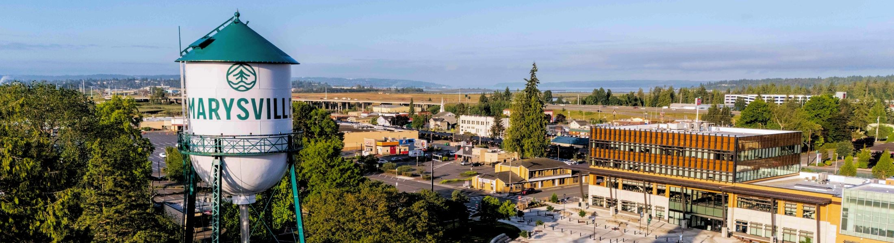
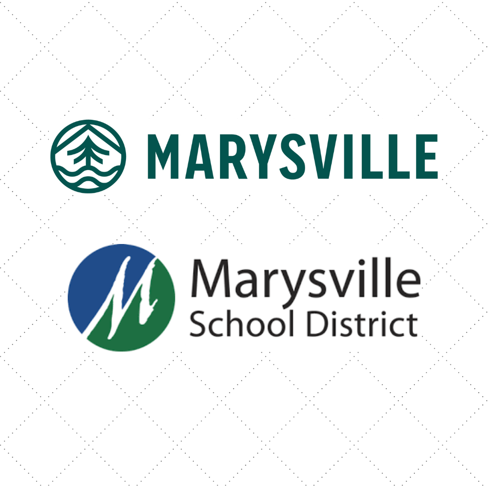
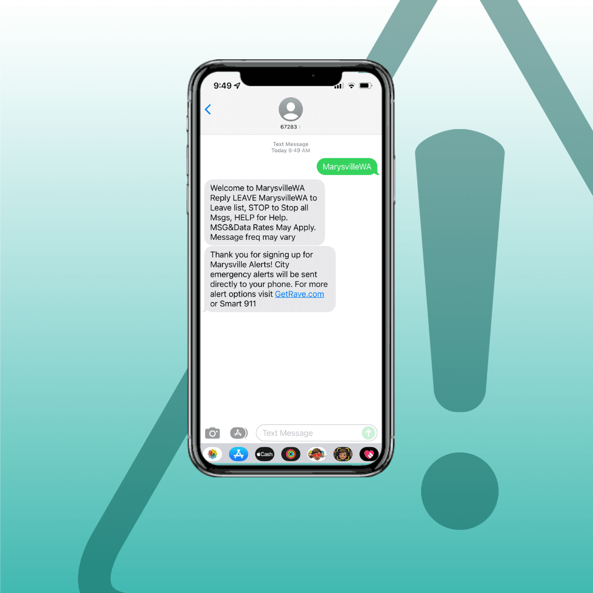

   

Loading

  [Skip to Main Content](http://www.marysvillewa.gov#cce1083f7c-16d3-4955-bda0-8db85dbce2c9)       Search 

 1.  [I Want To...](http://www.marysvillewa.gov/70/I-Want-To) 
 1.  [Government](http://www.marysvillewa.gov/27/Government) 
 1.  [Community](http://www.marysvillewa.gov/31/Community) 
 1.  [Economic Development](http://www.marysvillewa.gov/35/Economic-Development) 
 1.  [Visiting](http://www.marysvillewa.gov/9/Visiting) 

 1.    

     

     [Pay Bill](https://marysvillewa.billingdoc.net/login)   [We’re Hiring](http://www.marysvillewa.gov/137/City-of-Marysville-jobs-and-how-to-apply)   [Garbage & Recycling](http://www.marysvillewa.gov/172/Solid-Waste-Recycling)   [Parks & Activities](http://www.marysvillewa.gov/147/Parks-Culture-Recreation)   [Report an Issue](http://www.marysvillewa.gov/369/Report)   [Subscribe](http://www.marysvillewa.gov/list.aspx)  

 1.    

# LATEST NEWS   

Stay up to date with Marysville   

                      

 1.       

####  [City, school district update on property exchange](http://www.marysvillewa.gov/CivicAlerts.aspx?AID=1212)    

 The City of Marysville and the Marysville School District agreed in May 2024 to a property exchange that benefits both parties. Following review over... [Read on...](http://www.marysvillewa.gov/CivicAlerts.aspx?AID=1212)  
 1.       

####  [Free Seattle Opera event coming to Opera House](http://www.marysvillewa.gov/CivicAlerts.aspx?AID=1208)    

 The Marysville Opera House is set to host a captivating performance by the Seattle Opera, bringing the community together for an unforgettable afterno... [Read on...](http://www.marysvillewa.gov/CivicAlerts.aspx?AID=1208)  
 1.       

####  [Apply now to serve on Marysville Parks Advisory Board](http://www.marysvillewa.gov/CivicAlerts.aspx?AID=1210)    

 Want to help shape the future of Marysville parks? The city has an opening on the Parks, Culture and Recreation Advisory Board to complete a term endi... [Read on...](http://www.marysvillewa.gov/CivicAlerts.aspx?AID=1210)  
 1.       

####  [Celebrate Earth Day at city’s newest park](http://www.marysvillewa.gov/CivicAlerts.aspx?AID=1213)    

 Put your commitment to environmental stewardship into action when you join the Earth Day Cleanup on Tuesday, April 22, from 2 to 6 p.m. at Gissberg Tw... [Read on...](http://www.marysvillewa.gov/CivicAlerts.aspx?AID=1213)  
 1.       

####  [Stabbing death on 2nd Street in Marysville under investigation](http://www.marysvillewa.gov/CivicAlerts.aspx?AID=1211)    

 Marysville Police Detectives are investigating a deadly stabbing that occurred in the 1200 block of Marysville's 2nd Street early Monday morning. [Read on...](http://www.marysvillewa.gov/CivicAlerts.aspx?AID=1211)  
 1.       

####  [Up your business game at Marysville Business Summit](http://www.marysvillewa.gov/CivicAlerts.aspx?AID=1207)    

 Business owners and managers in Marysville and Snohomish County: you don’t want to miss the Marysville Business Summit on Tuesday, April 29, from 8 a.... [Read on...](http://www.marysvillewa.gov/CivicAlerts.aspx?AID=1207)  
 1.       

####  [Spring cleaning? City events can help](http://www.marysvillewa.gov/CivicAlerts.aspx?AID=1203)    

 Hey Marysville! The city is your spring cleaning partner, offering the popular Clean Sweep and Shred-A-Thon again this year. [Read on...](http://www.marysvillewa.gov/CivicAlerts.aspx?AID=1203)  
 1.       

####  [Two Spectacular Tribute Bands Come to Opera House](http://www.marysvillewa.gov/CivicAlerts.aspx?AID=1206)    

 Music lovers, mark your calendars! This spring, the Marysville Opera House is set to light up the stage with two unforgettable nights celebrating the... [Read on...](http://www.marysvillewa.gov/CivicAlerts.aspx?AID=1206)  
 1.       

####  [Nominations open for Marysville Business Awards](http://www.marysvillewa.gov/CivicAlerts.aspx?AID=1196)    

 Help us honor the best of the best! The City of Marysville presents three business awards annually to outstanding local businesses. Nominate your favo... [Read on...](http://www.marysvillewa.gov/CivicAlerts.aspx?AID=1196)  
 1.       

####  [City draft plan open for public review, comment](http://www.marysvillewa.gov/CivicAlerts.aspx?AID=1205)    

 The City of Marysville has opened its draft 2025-2029 Consolidated Plan for public review and comment. The plan includes 2025 recommendations for spen... [Read on...](http://www.marysvillewa.gov/CivicAlerts.aspx?AID=1205)  
 1.       

####  [Mayor Nehring invites you: Coffee Klatch March 24](http://www.marysvillewa.gov/CivicAlerts.aspx?AID=1191)    

 Have questions about your city? Mayor Jon Nehring invites you to join him for a casual conversation on Monday, March 24, from 5:30 to 6:30 p.m. in the... [Read on...](http://www.marysvillewa.gov/CivicAlerts.aspx?AID=1191)  
 1.       

####  [Help shape future of Marysville parks, programs](http://www.marysvillewa.gov/CivicAlerts.aspx?AID=1201)    

 What do you love about Marysville parks and recreation? What do you want to see in the future? Marysville residents are invited to weigh in by taking... [Read on...](http://www.marysvillewa.gov/CivicAlerts.aspx?AID=1201)  
  [VIEW ALL NEWS](http://www.marysvillewa.gov/CivicAlerts.aspx?CID=11,1)  /CivicAlerts.aspx 

 1.    

# UPCOMING EVENTS   

Mark your calendars   

 1.  [#### Lend a hand at Happy Parks   

Help keep Marysville parks beautiful by volunteering on Saturday, Apr. 12, from 9 a.m. to 12 p.m. at Jennings Memorial Park.](https://www.marysvillewa.gov/calendar.aspx?view=list&year=2025&month=4&day=12&CID=29,14,23,21) 
 1.  [#### Madman Across the Water: The Music of Elton John   

Step into a glittering world of grand piano melodies Friday, Apr. 18, from 7 to 9 p.m.](https://anc.apm.activecommunities.com/marysvillewa/activity/search/detail/10166?onlineSiteId=0&from_original_cui=true) 
 1.  [#### EGGstravaganza Egg Hunt   

Springtime fun returns to Jennings Park with the annual EGGstravaganza Egg Hunt on Saturday, Apr. 19, from 10 to 11 a.m.](https://www.marysvillewa.gov/696/EGGstravaganza-Egg-Hunt) 
 1.  [#### Earth Day celebration   

Join the Earth Day Cleanup on Tuesday, April 22, from 2 to 6 p.m. at Gissberg Twin Lakes Park.](https://www.marysvillewa.gov/Calendar.aspx?EID=2767&month=4&year=2025&day=22&calType=0) 
 1.  [#### Clean Sweep   

Dispose of unwanted household items and get free compost! This free event for Marysville residents takes place Saturday, Apr. 26, from 9 a.m. to 2 p.m. at Marysville Public Works, 80 Columbia Ave.](https://www.marysvillewa.gov/900/Clean-Sweep) 
 1.  [#### Marysville Business Summit   

Business owners and professionals across Snohomish County are invited to the Marysville Business Summit on Tuesday, Apr. 29, from 8 a.m. to 12 p.m. at the Marysville Opera House.](https://cca.marysvilletulalipchamber.com/EvtListing.aspx?dbid2=WAMATU&evtid=5020710&class=E&fbclid=IwY2xjawJY-8hleHRuA2FlbQIxMAABHVK7sabzVENRFHQbCEC7cMfBHpB3ztIqMfHU5FgZM5txDLz2otJSqfNYjg_aem_C8uGtsOpKhVF2dZAoIkECA) 
 1.  [#### Shred-A-Thon   

Get rid of unneeded personal paperwork safely and securely at Shred-A-Thon on Saturday, May 3, 9 a.m.-12 p.m. at the Marysville Community Center, 1015 State Ave.](https://www.marysvillewa.gov/1401/Shred-A-Thon) 
 1.  [#### Marysville Fishing Derbies   

Young anglers ages 2–14 are invited to reel in some fun at two free fishing derbies this May!](https://www.marysvillewa.gov/1163/Kids-Fishing-Derby) 
 1.  [#### Mother Lovin' Market   

Show some love to the special moms in your life Sunday, May 4, from 10 a.m. to 3 p.m. at Jennings Memorial Park.](https://www.marysvillewa.gov/1203/Mother-Lovin-Market) 
 1.  [#### Chicago Tribute Authority Seattle Band   

Experience the bold brass, soulful harmonies and chart-topping hits of Chicago Friday, May 9, from 7 to 9 p.m.](https://anc.apm.activecommunities.com/marysvillewa/activity/search/detail/11043?onlineSiteId=0&from_original_cui=true) 
 1.  [#### Hazard Mitigation Plan   

This plan guides local efforts to protect lives, property, businesses and the environment. Take our survey or attend in-person Wednesday, May 21, from 6 to 7 p.m. at the Community Center.](https://www.marysvillewa.gov/HazardSurvey) 
 1.  [#### Help shape the future of Marysville parks   

What do you love about Marysville’s parks, and what would you like to see in the future? Take our short survey!](https://www.surveymonkey.com/r/BDGTZL6) 
 1.       

#### My Marysville mobile app   

Engage with us on the go! Free & now available for iPhone & Android at your app store   

 1.  [#### We need your input!   

We are seeking input for allocating funds from the Community Development Block Grant. Please fill out our survey to provide feedback for Marysville communities in need.](https://www.surveymonkey.com/r/H2D3TB3) 
 1.  [#### Marysville Alerts   

For emergency updates and information, text MarysvilleWA to 67283.](https://www.marysvillewa.gov/1218/Marysville-Alerts) 

###  April 2025 

|Sun|Mon|Tue|Wed|Thu|Fri|Sat|
|---|---|---|---|---|---|---|
|30|31|1|[2](http://www.marysvillewa.gov/calendar.aspx?view=list&year=2025&month=4&day=2&CID=29,14,23,21)|3|4|5|
|[6](http://www.marysvillewa.gov/calendar.aspx?view=list&year=2025&month=4&day=6&CID=29,14,23,21)|[7](http://www.marysvillewa.gov/calendar.aspx?view=list&year=2025&month=4&day=7&CID=29,14,23,21)|[8](http://www.marysvillewa.gov/calendar.aspx?view=list&year=2025&month=4&day=8&CID=29,14,23,21)|9|10|11|[12](http://www.marysvillewa.gov/calendar.aspx?view=list&year=2025&month=4&day=12&CID=29,14,23,21)|
|13|[14](http://www.marysvillewa.gov/calendar.aspx?view=list&year=2025&month=4&day=14&CID=29,14,23,21)|15|[16](http://www.marysvillewa.gov/calendar.aspx?view=list&year=2025&month=4&day=16&CID=29,14,23,21)|17|[18](http://www.marysvillewa.gov/calendar.aspx?view=list&year=2025&month=4&day=18&CID=29,14,23,21)|[19](http://www.marysvillewa.gov/calendar.aspx?view=list&year=2025&month=4&day=19&CID=29,14,23,21)|
|20|21|[22](http://www.marysvillewa.gov/calendar.aspx?view=list&year=2025&month=4&day=22&CID=29,14,23,21)|23|24|25|[26](http://www.marysvillewa.gov/calendar.aspx?view=list&year=2025&month=4&day=26&CID=29,14,23,21)|
|27|[28](http://www.marysvillewa.gov/calendar.aspx?view=list&year=2025&month=4&day=28&CID=29,14,23,21)|[29](http://www.marysvillewa.gov/calendar.aspx?view=list&year=2025&month=4&day=29&CID=29,14,23,21)|[30](http://www.marysvillewa.gov/calendar.aspx?view=list&year=2025&month=4&day=30&CID=29,14,23,21)|1|2|[3](http://www.marysvillewa.gov/calendar.aspx?view=list&year=2025&month=5&day=3&CID=29,14,23,21)|

 1.    

#### Wed, Apr 2   

  __ [Marysville Opera House Open House](http://www.marysvillewa.gov/Calendar.aspx?EID=2801)__  
 1.    

#### Sun, Apr 6   

  __ [Seattle Opera - Earth to Kenzie](http://www.marysvillewa.gov/Calendar.aspx?EID=2788)__  
 1.    

#### Mon, Apr 7   

  __ [City Council Work Session](http://www.marysvillewa.gov/Calendar.aspx?EID=2742)__  

 1.    

#### Tue, Apr 8   

  __ [Planning Commission Meeting](http://www.marysvillewa.gov/Calendar.aspx?EID=2350)__  
 1.    

#### Sat, Apr 12   

  __ [Happy Parks](http://www.marysvillewa.gov/Calendar.aspx?EID=2771)__  
 1.    

#### Mon, Apr 14   

  __ [City Council Regular Meeting](http://www.marysvillewa.gov/Calendar.aspx?EID=2668)__  
  [View All Events](http://www.marysvillewa.gov/calendar.aspx?CID=29,14,23,21)  /Calendar.aspx  [Visit Marysville 

 Explore nature’s playground](http://www.marysvillewa.gov/9/Visiting)   [Economic Development 

 Shaping the future of Marysville](http://www.marysvillewa.gov/35/Economic-Development)   [Emergency Preparedness 

 Stay informed and prepared](http://www.marysvillewa.gov/317/Emergency-Management)   [Parks, Culture & Rec 

 Playgrounds, trails, events & more](http://www.marysvillewa.gov/147/Parks-Culture-Recreation)  

 1.    

     

### Contact Us

 1.    

Marysville City Hall   

 1.    

501 Delta Avenue   

 1.    

Marysville, WA 98270   

 1.    

Phone: [360-363-8000]()    

 1.    

Fax: [360-651-5033]()    

 1. 
 1.    

Hours:   

 1.    

Open Monday through Friday   

 1.    

8 a.m. - 4:30 p.m.   

###  [Helpful Links](http://www.marysvillewa.gov/QuickLinks.aspx?CID=89) 

 1.  [Home](http://www.marysvillewa.gov)  
 1.  [Accessibility](http://www.marysvillewa.gov/accessibility)  
 1.  [ADA accommodation](http://www.marysvillewa.gov/724/ADA-Accommodation)  
 1.  [Contact us](http://marysvillewa.gov/748/CommentsQuestions)  

 1.  [Copyright notices](http://www.marysvillewa.gov/site/copyright)  
 1.  [Latest news](http://www.marysvillewa.gov/civicalerts.aspx)  
 1.  [Privacy policy and disclaimer](http://www.marysvillewa.gov/772/Privacy-Policy-and-Disclaimer)  
 /QuickLinks.aspx 

 1.  [Home](http://www.marysvillewa.gov)  

 1.  [Accessibility](http://www.marysvillewa.gov/accessibility)  

 1.  [ADA accommodation](http://www.marysvillewa.gov/724/ADA-Accommodation)  

 1.  [Contact us](http://marysvillewa.gov/748/CommentsQuestions)  
 /QuickLinks.aspx Government Websites by [CivicPlus®](https://connect.civicplus.com/referral)  Loading Loading Do Not Show Again Close Select LanguageAbkhazAcehneseAcholiAfarAfrikaansAlbanianAlurAmharicArabicArmenianAssameseAvarAwadhiAymaraAzerbaijaniBalineseBaluchiBambaraBaouléBashkirBasqueBatak KaroBatak SimalungunBatak TobaBelarusianBembaBengaliBetawiBhojpuriBikolBosnianBretonBulgarianBuryatCantoneseCatalanCebuanoChamorroChechenChichewaChinese (Simplified)Chinese (Traditional)ChuukeseChuvashCorsicanCrimean Tatar (Cyrillic)Crimean Tatar (Latin)CroatianCzechDanishDariDhivehiDinkaDogriDombeDutchDyulaDzongkhaEsperantoEstonianEweFaroeseFijianFilipinoFinnishFonFrenchFrench (Canada)FrisianFriulianFulaniGaGalicianGeorgianGermanGreekGuaraniGujaratiHaitian CreoleHakha ChinHausaHawaiianHebrewHiligaynonHindiHmongHungarianHunsrikIbanIcelandicIgboIlocanoIndonesianInuktut (Latin)Inuktut (Syllabics)IrishItalianJamaican PatoisJapaneseJavaneseJingpoKalaallisutKannadaKanuriKapampanganKazakhKhasiKhmerKigaKikongoKinyarwandaKitubaKokborokKomiKonkaniKoreanKrioKurdish (Kurmanji)Kurdish (Sorani)KyrgyzLaoLatgalianLatinLatvianLigurianLimburgishLingalaLithuanianLombardLugandaLuoLuxembourgishMacedonianMadureseMaithiliMakassarMalagasyMalayMalay (Jawi)MalayalamMalteseMamManxMaoriMarathiMarshalleseMarwadiMauritian CreoleMeadow MariMeiteilon (Manipuri)MinangMizoMongolianMyanmar (Burmese)Nahuatl (Eastern Huasteca)NdauNdebele (South)Nepalbhasa (Newari)NepaliNKoNorwegianNuerOccitanOdia (Oriya)OromoOssetianPangasinanPapiamentoPashtoPersianPolishPortuguese (Brazil)Portuguese (Portugal)Punjabi (Gurmukhi)Punjabi (Shahmukhi)QuechuaQʼeqchiʼRomaniRomanianRundiRussianSami (North)SamoanSangoSanskritSantali (Latin)Santali (Ol Chiki)Scots GaelicSepediSerbianSesothoSeychellois CreoleShanShonaSicilianSilesianSindhiSinhalaSlovakSlovenianSomaliSpanishSundaneseSusuSwahiliSwatiSwedishTahitianTajikTamazightTamazight (Tifinagh)TamilTatarTeluguTetumThaiTibetanTigrinyaTivTok PisinTonganTshilubaTsongaTswanaTuluTumbukaTurkishTurkmenTuvanTwiUdmurtUkrainianUrduUyghurUzbekVendaVenetianVietnameseWarayWelshWolofXhosaYakutYiddishYorubaYucatec MayaZapotecZulu Powered by  [Translate](https://translate.google.com)  

    Original text Rate this translation Your feedback will be used to help improve Google Translate 