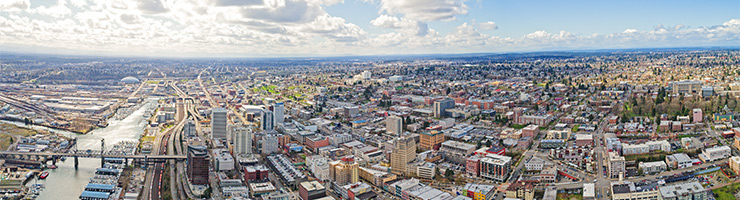

  [Skip navigation](https://cityoftacoma.org/neighborhoodcouncils#skipnav)  

 *  [HOME](https://cityoftacoma.org/neighborhoodcouncils) 

 *      [Select Language​▼](https://cityoftacoma.org/neighborhoodcouncils#)  

 *   
 *   

 *  [**](http://www.facebook.com/cityoftacoma) 
 *   
 *  [**](http://www.instagram.com/cityoftacoma) 
 *  [**](http://www.youtube.com/cityoftacoma) 
 Search   

#   

 [Menu](https://cityoftacoma.org/neighborhoodcouncils#mMenuCMS)  

 *  [Residents](https://cityoftacoma.org/residents)  
   *  [Accessibility](https://cityoftacoma.org/cms/one.aspx?portalId=169&pageId=5662)  Learn about services for persons with disabilities 
   *  [Animal Care and Control](https://cityoftacoma.org/cms/one.aspx?portalId=169&pageId=21205)  License your pets and find resources for animal care 
   *  [Noise Complaints](https://cityoftacoma.org/cms/one.aspx?portalId=169&pageId=38900&rqst=18)  Submit a noise complaint using TacomaFIRST 311 
   *  [City News](https://cityoftacoma.org/in_the_news)  Read City news, watch videos and live webstream 
   *  [Community Cleanups](https://cityoftacoma.org/cleanup)  Get connected with community cleanups 
   *  [Community Gardens](https://cityoftacoma.org/government/city_departments/environmentalservices/community_gardens)  Join a community garden in your neighborhood 
   *  [Contact Us](https://cityoftacoma.org/residents/contact_us)  Contact the City of Tacoma 
   *  [Crime Statistics](https://cityoftacoma.org/residents/crime_statistics)  View crime data in your neighborhood 
   *  [Customer Support Services](https://cityoftacoma.org/tacomafirst)  Your one-stop shop for City services 
   *  [Emergency Management](https://cityoftacoma.org/government/city_departments/fire/divisions/emergency_management)  Learn how to be prepared in an emergency 
   *  [Garbage, Recycling, and Yard Waste](https://cityoftacoma.org/government/city_departments/environmentalservices/solid_waste)  Learn about residential waste management services 
   *  [Neighborhood Council Program](https://cityoftacoma.org/neighborhoodcouncils)  Connect with Tacoma's neighborhood councils 
   *  [Online Citizen Reporting](https://cityoftacoma.org/CityQA)  Make a non-emergency City service request 
   *  [Police Protection](https://cityoftacoma.org/government/city_departments/police)  Learn about Tacoma Police Department services 
   *  [Senior Services](https://cityoftacoma.org/government/city_departments/neighborhood_and_community_services/senior_centers)  Learn about what’s happening at our senior centers 
   *  [TV Tacoma](https://cityoftacoma.org/government/city_departments/city_managers_office/media_and_communications_office/tv_tacoma)  Tune in to your City government access channel 
   *  [Utilities](http://www.mytpu.org)  Pay your bill and get information on utility services 
   *  [Utilities Rebates and Incentives](http://www.mytpu.org/your/ways-to-save)  Learn how to save money on your utilities 
 *  [Services](https://cityoftacoma.org/services)  
   *  [Birth and Death Records](https://cityoftacoma.org/services/birth_and_death_records)  Request a birth or death record 
   *  [Call-2-Haul](https://cityoftacoma.org/government/city_departments/environmentalservices/solid_waste/call_2_haul)  Schedule a collection of large household items 
   *  [Community Based Services](https://cityoftacoma.org/government/city_departments/neighborhood_and_community_services)  Help improve and preserve your neighborhood 
   *  [Community Liaison Officers](https://cityoftacoma.org/government/city_departments/police/operations_bureau/community_policing_division)  Connect with your Community Liaison Officer 
   *  [Fire and EMS Services](https://cityoftacoma.org/government/city_departments/fire)  Learn about Tacoma Fire Department services 
   *  [Graffiti Cleanup](https://cityoftacoma.org/graffiti)  Learn about ways you can help combat graffiti 
   *  [Homelessness Services](https://cityoftacoma.org/cms/One.aspx?portalId=169&pageId=93744)  Learn how we are addressing homelessness 
   *  [Homeowner Assistance Programs](https://cityoftacoma.org/government/city_departments/community_and_economic_development/housing_division)  Home repair, rehab loans, and homebuyer programs 
   *  [Landlord-Tenant Services](https://cityoftacoma.org/government/city_departments/equity_and_human_rights/landlord-tenant_program)  Dispute resolution programs, training and referrals 
   *  [Library Services](http://tacomalibrary.org)  Learn about what's going on at your local Public Library 
   *  [Online Services](https://cityoftacoma.org/services/online_services)  Access an interactive list of City services 
   *  [Parking Services](https://cityoftacoma.org/government/city_departments/public_works/parking)  Get information on parking options around the city 
   *  [Police Protection](https://cityoftacoma.org/government/city_departments/police)  Learn about Tacoma Police Department services 
   *  [Special Event Permits](https://cityoftacoma.org/government/city_departments/community_and_economic_development/economic_development_services/special_event_and_film_permits)  Submit a request for a special event permit 
   *  [Street Operations](https://cityoftacoma.org/government/city_departments/public_works/street_operations)  Street maintenance and other Public Works services 
   *  [Tacoma EnviroNews](https://cityoftacoma.org/government/city_departments/environmentalservices/education_and_involvement/enviro_talk)  Sign up for the environmental news listserv 
   *  [Tacoma Public Utilities](https://www.mytpu.org)  Power and water services 
   *  [TAGRO](https://cityoftacoma.org/government/city_departments/environmentalservices/tagro)  Learn about TAGRO products for your lawn and garden 
 *  [Government](https://cityoftacoma.org/government)  
   *  [Budget and Finance](https://cityoftacoma.org/government/city_departments/finance/office_of_management_and_budget)  View budget document and financial reports 
   *  [Committees, Boards, and Commissions](https://cityoftacoma.org/government/committees_boards_commissions)  Learn about boards and commissions and how to join 
   *  [Ceremonials and Proclamations](https://cityoftacoma.org/government/city_council/CCMeetings/Proclamations)  Request a City proclamation or special recognition 
   *  [City Charter](https://cityoftacoma.org/government/city_departments/CityAttorney/CityClerk/CityCharter)  View the City of Tacoma Charter 
   *  [City Council Meetings](https://cityoftacoma.org/government/city_council/ccmeetings)  Get information about City Council Meetings 
   *  [City Council Offices](https://cityoftacoma.org/government/city_council)  Meet the Tacoma City Council members 
   *  [City Departments and Offices](https://cityoftacoma.org/government/city_departments)  View a list of all City departments and offices 
   *  [City Holidays](https://cityoftacoma.org/government/city_holidays)  View a list of City holiday closures 
   *  [City Manager's Office](https://cityoftacoma.org/government/city_departments/City_Managers_Office)  Meet the Tacoma City Manager 
   *  [Council Standing Committees](https://cityoftacoma.org/government/city_council/CouncilCommittees)  Access meeting agendas, handouts, and audio 
   *  [Mayor's Office](https://cityoftacoma.org/government/mayor)  Meet Tacoma's Mayor 
   *  [Municipal Code](https://cityoftacoma.org/government/city_departments/CityAttorney/CityClerk/TMC)  Search the City's current municipal and ethics codes 
   *  [Municipal Court](https://cityoftacoma.org/government/municipal_court)  Learn about Court services and pay citations online 
   *  [Municipal Election Information](https://cityoftacoma.org/government/municipal_election_information)  Get information, find voting locations, and register to vote 
   *  [Ordinances and Resolutions](https://cityoftacoma.org/government/city_council/ccmeetings/recentlegis)  Access City ordinances and resolutions 
   *  [Other Government Entities](https://cityoftacoma.org/government/other_government_entities)  View a list of municipal organizations and public agencies 
   *  [Public Disclosure Requests](https://cityoftacoma.org/government/city_departments/CityAttorney/CityClerk/PDR)  Request records from the City 
   *  [Title VI](https://cityoftacoma.org/cms/One.aspx?portalId=169&pageId=147721)  Civil Rights Act of 1964 
 *  [Business](https://cityoftacoma.org/business)  
   *  [Available Sites and Buildings](https://cityoftacoma.org/government/city_departments/public_works/facilities_management/real_property_services/current_surplus_properties_for_sale)  Access a list of available surplus properties 
   *  [Building Codes and Permits](https://cityoftacoma.org/government/city_departments/planning_and_development_services)  Building permits, inspections and building codes 
   *  [Business Incentives](https://cityoftacoma.org/government/city_departments/community_and_economic_development/economic_development_services/business_incentives)  Tax credits, loan options, and other business incentives 
   *  [City Capital Projects](https://cityoftacoma.org/cms/One.aspx?portalId=169&pageId=9504)  View and map current and planned construction projects 
   *  [Complete Streets](https://cityoftacoma.org/government/city_departments/planning_and_development_services/planning_services/complete_street_design_guidelines_project)  Complete Streets program and guidelines 
   *  [Film and Movie Location Assistance](https://cityoftacoma.org/government/city_departments/community_and_economic_development/economic_development_services/special_event_and_film_permits)  Apply for a film permit, get assistance on locations 
   *  [GIS Data and Maps](https://data.cityoftacoma.org)  Download maps and demographic information 
   *  [Green Building](https://cityoftacoma.org/government/city_departments/environmentalservices/enviro_house/green_building)  Environment and energy-conscious building design 
   *  [Historic Preservation](https://cityoftacoma.org/government/city_departments/planning_and_development_services/historic_preservation)  View historic districts, apply for a project design review 
   *  [Local Employment & Apprenticeship](https://cityoftacoma.org/government/city_departments/community_and_economic_development/local_employment_apprenticeship_training_program)  Training & support services for apprenticeship programs 
   *  [Neighborhood Business Districts](https://cityoftacoma.org/government/city_departments/community_and_economic_development/neighborhood_business_districts)  View a list of Tacoma's business districts 
   *  [Planning and Development Services](https://cityoftacoma.org/government/city_departments/planning_and_development_services)  Learn about permits, site development and zoning 
   *  [Requests for Bids and Proposals](https://cityoftacoma.org/government/city_departments/finance/procurement_and_payables_division/purchasing/contracting_opportunities)  View the City's bid and contracting opportunities 
   *  [Equity in Contracting Program](https://cityoftacoma.org/government/city_departments/community_and_economic_development/equity_in_contracting)  City of Tacoma Equity in Contracting Program 
   *  [Small Works Roster Program](https://cityoftacoma.org/government/city_departments/finance/procurement_and_payables_division/purchasing/small_works_roster)  Register your business for small public works projects 
   *  [State and Federal Business Resources](https://cityoftacoma.org/business/state_and_federal_business_resources)  State and federal business development resources 
   *  [Make It Tacoma](https://makeittacoma.com)  A one-stop portal for your business needs 
   *  [Tax and License](https://cityoftacoma.org/government/city_departments/finance/tax_and_license)  Pay B&O taxes, establish or renew a business license 
 *  [Visitors](https://cityoftacoma.org/visitors)  
   *  [Arts Program](https://cityoftacoma.org/cms/One.aspx?
portalId=169&pageId=1672)  Take a public art tour or join the TacomaArt listserv 
   *  [Dining and Nightlife](https://cityoftacoma.org/visitors/dining_and_nightlife)  Find dining options, pubs and night spots 
   *  [Farmers Market](https://cityoftacoma.org/cms/One.aspx?portalId=169&pageId=12392)  Plan a trip to purchase fresh, local produce, and goods 
   *  [Golfing](https://cityoftacoma.org/visitors/golfing)  Book a tee time, find a game, or schedule lessons 
   *  [Greater Tacoma Convention Center](http://www.gtctc.org)  Plan your next meeting, conference, or event 
   *  [Hiking and Biking Trails](https://cityoftacoma.org/visitors/hiking_and_biking_trails)  Explore the beauty of Tacoma on an outdoor adventure 
   *  [Parks Tacoma](https://www.parkstacoma.gov)  Find parks and recreational activities for the entire family 
   *  [Museums](https://cityoftacoma.org/visitors/museums)  Visit one of Tacoma's world class museums 
   *  [Performing Arts](https://cityoftacoma.org/visitors/performing_arts)  See a show at Tacoma's performing arts theaters 
   *  [Point Defiance Zoo and Aquarium](http://www.pdza.org)  Explore animal exhibits and more 
   *  [Ruston Way Waterfront](http://www.metroparkstacoma.org/ruston-way)  Enjoy great views of Commencement Bay 
   *  [SeaTac Airport](http://www.portseattle.org/Sea-Tac/Pages/default.aspx)  Flight information, parking, and passenger services 
   *  [Shopping](https://cityoftacoma.org/visitors/shopping)  Discover unique boutiques, specialty shops, and malls 
   *  [Special Events](https://cityoftacoma.org/visitors/special_events)  View Tacoma's major events, festivals, and activities 
   *  [Tacoma Dome](http://www.tacomadome.org)  Get information on upcoming concerts, events, and more 
   *  [Tacoma Rainiers](http://www.tacomarainiers.com)  Check out the Rainers team roster, schedule, and stats 
   *  [Tourism](http://www.traveltacoma.com)  Stay, play, and dine during your visit to Tacoma 
   *  [Transportation](https://cityoftacoma.org/visitors/transportation)  Transportation options to help you get around town 
 [MENU]()  

 *  [Home](https://cityoftacoma.org/cms/One.aspx?portalId=169&pageId=176) 
 *  [Residents](https://cityoftacoma.org/cms/One.aspx?portalId=169&pageId=339)  [Residents]() 
   *  [Animal Control & Pet Licensing](https://cityoftacoma.org/cms/One.aspx?portalId=169&pageId=8673)  [Animal Control & Pet Licensing]() 
     *  [Animal Control](https://cityoftacoma.org/cms/One.aspx?portalId=169&pageId=21205) 
     *  [Tacoma License Fees](https://cityoftacoma.org/cms/One.aspx?portalId=169&pageId=21042) 
     *  [Fircrest License Fees](https://cityoftacoma.org/cms/One.aspx?portalId=169&pageId=21184) 
     *  [Go Paperless](https://cityoftacoma.org/cms/One.aspx?portalId=169&pageId=75711) 
     *  [FAQ](https://cityoftacoma.org/cms/One.aspx?portalId=169&pageId=18765) 
     *  [Update My Pet License](https://cityoftacoma.org/cms/One.aspx?portalId=169&pageId=259930) 
   *  [Contact Us](https://cityoftacoma.org/cms/One.aspx?portalId=169&pageId=32683) 
   *  [Crime Statistics](https://cityoftacoma.org/cms/One.aspx?portalId=169&pageId=18857) 
   *  [Online Customer Reporting](https://cityoftacoma.org/cms/One.aspx?portalId=169&pageId=28453) 
   *  [Report a Pothole](https://cityoftacoma.org/cms/One.aspx?portalId=169&pageId=51447) 
 *  [Services](https://cityoftacoma.org/cms/One.aspx?portalId=169&pageId=519)  [Services]() 
   *  [Birth and Death Records](https://cityoftacoma.org/cms/One.aspx?portalId=169&pageId=12627) 
   *  [Conduct Complaints](https://cityoftacoma.org/cms/One.aspx?portalId=169&pageId=10162)  [Conduct Complaints]() 
     *  [Enter a Conduct Complaint](https://cityoftacoma.org/cms/One.aspx?portalId=169&pageId=51137) 
     *  [Check Status of a Complaint](https://cityoftacoma.org/cms/One.aspx?portalId=169&pageId=65567) 
   *  [Parking Services](https://cityoftacoma.org/cms/One.aspx?portalId=169&pageId=39920) 
   *  [Online Services Catalog](https://cityoftacoma.org/cms/One.aspx?portalId=169&pageId=126271) 
 *  [Government](https://cityoftacoma.org/cms/One.aspx?portalId=169&pageId=522)  [Government]() 
   *  [City Council](https://cityoftacoma.org/cms/One.aspx?portalId=169&pageId=10945)  [City Council]() 
     *  [Appear Before City Council](https://cityoftacoma.org/cms/One.aspx?portalId=169&pageId=27770) 
     *  [City Council Committees](https://cityoftacoma.org/cms/One.aspx?portalId=169&pageId=87355) 
     *  [City Council Meetings](https://cityoftacoma.org/cms/One.aspx?portalId=169&pageId=1972) 
     *  [Office of Mayor Victoria Woodards](https://cityoftacoma.org/cms/One.aspx?portalId=169&pageId=10289) 
     *  [Council Member John Hines](https://cityoftacoma.org/cms/One.aspx?portalId=169&pageId=92913) 
     *  [Council Member Sarah Rumbaugh](https://cityoftacoma.org/cms/One.aspx?portalId=169&pageId=154010) 
     *  [Council Member Jamika Scott](https://cityoftacoma.org/cms/One.aspx?portalId=169&pageId=95019) 
     *  [Council Member Sandesh Sadalge](https://cityoftacoma.org/cms/One.aspx?portalId=169&pageId=92929) 
     *  [Council Member Joe Bushnell](https://cityoftacoma.org/cms/One.aspx?portalId=169&pageId=92933) 
     *  [Deputy Mayor Kiara Daniels](https://cityoftacoma.org/cms/One.aspx?portalId=169&pageId=70230) 
     *  [Council Member Olgy Diaz](https://cityoftacoma.org/cms/One.aspx?portalId=169&pageId=95002) 
     *  [Council Member Kristina Walker](https://cityoftacoma.org/cms/One.aspx?portalId=169&pageId=92937) 
     *  [City Council News Releases](https://cityoftacoma.org/cms/One.aspx?portalId=169&pageId=37661) 
     *  [Notices and Public Hearings](https://cityoftacoma.org/cms/One.aspx?portalId=169&pageId=2283) 
     *  [Transportation Benefit District](https://cityoftacoma.org/cms/One.aspx?portalId=169&pageId=28591) 
     *  [District Map](https://cityoftacoma.org/cms/One.aspx?portalId=169&pageId=34655) 
   *  [City Council Strategic Direction](https://cityoftacoma.org/cms/One.aspx?portalId=169&pageId=48383) 
   *  [City Departments and Offices](https://cityoftacoma.org/cms/One.aspx?portalId=169&pageId=657)  [City Departments and Offices]() 
     *  [City Attorney's Office](https://cityoftacoma.org/cms/One.aspx?portalId=169&pageId=11940) 
     *  [City Manager's Office](https://cityoftacoma.org/cms/One.aspx?portalId=169&pageId=11899) 
     *  [Community and Economic Development](https://cityoftacoma.org/cms/One.aspx?portalId=169&pageId=12095) 
     *  [Environmental Services](https://cityoftacoma.org/cms/One.aspx?portalId=169&pageId=12027) 
     *  [Equity and Human Rights](https://cityoftacoma.org/cms/One.aspx?portalId=169&pageId=115422) 
     *  [Finance](https://cityoftacoma.org/cms/One.aspx?portalId=169&pageId=12085) 
     *  [Fire](https://cityoftacoma.org/cms/One.aspx?portalId=169&pageId=13217) 
     *  [Hearing Examiner](https://cityoftacoma.org/cms/One.aspx?portalId=169&pageId=11963) 
     *  [Human Resources](https://cityoftacoma.org/cms/One.aspx?portalId=169&pageId=12119) 
     *  [Information Technology](https://cityoftacoma.org/cms/One.aspx?portalId=169&pageId=10236) 
     *  [Neighborhood and Community Services](https://cityoftacoma.org/cms/One.aspx?portalId=169&pageId=11929) 
     *  [Office of Management and Budget](https://cityoftacoma.org/cms/One.aspx?portalId=169&pageId=7691) 
     *  [Planning and Development Services](https://cityoftacoma.org/cms/One.aspx?portalId=169&pageId=12002) 
     *  [Police](https://cityoftacoma.org/cms/One.aspx?portalId=169&pageId=11953) 
     *  [Public Works](https://cityoftacoma.org/cms/One.aspx?portalId=169&pageId=12176) 
     *  [Tacoma Employees' Retirement System](https://cityoftacoma.org/cms/One.aspx?portalId=169&pageId=11976) 
     *  [Tacoma Venues & Events](https://cityoftacoma.org/cms/One.aspx?portalId=169&pageId=12154) 
   *  [City Holidays](https://cityoftacoma.org/cms/One.aspx?portalId=169&pageId=12345) 
   *  [City Manager's Office](https://cityoftacoma.org/cms/One.aspx?portalId=169&pageId=11213) 
   *  [Committees, Boards and Commissions](https://cityoftacoma.org/cms/One.aspx?portalId=169&pageId=4810)  [Committees, Boards and Commissions]() 
     *  [How to Apply](https://cityoftacoma.org/cms/One.aspx?portalId=169&pageId=143822) 
     *  [Recruitment Toolkit](https://cityoftacoma.org/cms/One.aspx?portalId=169&pageId=53488) 
   *  [Municipal Court](https://cityoftacoma.org/cms/One.aspx?portalId=169&pageId=12167)  [Municipal Court]() 
     *  [General Information](https://cityoftacoma.org/cms/One.aspx?portalId=169&pageId=3700) 
     *  [Contacts](https://cityoftacoma.org/cms/One.aspx?portalId=169&pageId=3819) 
     *  [Court Dates and Hearings](https://cityoftacoma.org/cms/One.aspx?portalId=169&pageId=3696) 
     *  [Criminal Offenses](https://cityoftacoma.org/cms/One.aspx?portalId=169&pageId=3717) 
     *  [Local Rules](https://cityoftacoma.org/cms/One.aspx?portalId=169&pageId=221225) 
     *  [Municipal Court Judges](https://cityoftacoma.org/cms/One.aspx?portalId=169&pageId=3420) 
     *  [Municipal Court Records Requests](https://cityoftacoma.org/cms/One.aspx?portalId=169&pageId=208211) 
     *  [Payment Options](https://cityoftacoma.org/cms/One.aspx?portalId=169&pageId=3712) 
     *  [Tacoma Municipal Court Forms](https://cityoftacoma.org/cms/One.aspx?portalId=169&pageId=190713) 
     *  [Therapeutic Courts](https://cityoftacoma.org/cms/One.aspx?portalId=169&pageId=250972) 
     *  [Traffic & Parking Infractions](https://cityoftacoma.org/cms/One.aspx?portalId=169&pageId=17056) 
     *  [Virtual Hearings Information](https://cityoftacoma.org/cms/One.aspx?portalId=169&pageId=190709) 
   *  [Municipal Election Information](https://cityoftacoma.org/cms/One.aspx?portalId=169&pageId=12352) 
   *  [The Principles That Guide Us](https://cityoftacoma.org/cms/One.aspx?portalId=169&pageId=114705) 
 *  [Business](https://cityoftacoma.org/cms/One.aspx?portalId=169&pageId=525)  [Business]() 
   *  [Business Incentives](https://cityoftacoma.org/cms/One.aspx?portalId=169&pageId=76852) 
   *  [State and Federal Business Resources](https://cityoftacoma.org/cms/One.aspx?portalId=169&pageId=12379) 
 *  [Visitors](https://cityoftacoma.org/cms/One.aspx?portalId=169&pageId=461)  [Visitors]() 
   *  [Dining and Nightlife](https://cityoftacoma.org/cms/One.aspx?portalId=169&pageId=12387) 
   *  [Farmers Markets](https://cityoftacoma.org/cms/One.aspx?portalId=169&pageId=12392) 
   *  [Golfing](https://cityoftacoma.org/cms/One.aspx?portalId=169&pageId=12396) 
   *  [Hiking and Biking Trails](https://cityoftacoma.org/cms/One.aspx?portalId=169&pageId=12400) 
   *  [Museums](https://cityoftacoma.org/cms/One.aspx?portalId=169&pageId=12404) 
   *  [Performing Arts](https://cityoftacoma.org/cms/One.aspx?portalId=169&pageId=12408) 
   *  [Ruston Way Waterfront](https://cityoftacoma.org/cms/One.aspx?portalId=169&pageId=28449) 
   *  [Shopping](https://cityoftacoma.org/cms/One.aspx?portalId=169&pageId=12417) 
   *  [Special Events](https://cityoftacoma.org/cms/One.aspx?portalId=169&pageId=12422) 
   *  [Tourism](https://cityoftacoma.org/cms/One.aspx?portalId=169&pageId=12430) 
   *  [Transportation](https://cityoftacoma.org/cms/One.aspx?portalId=169&pageId=12437) 
 *  [What's Going On](https://cityoftacoma.org/cms/One.aspx?portalId=169&pageId=363)  [What's Going On]() 
   *  [Second Amended Substitute Ordinance 28831](https://cityoftacoma.org/cms/One.aspx?portalId=169&pageId=228761) 
   *  [Home in Tacoma Phase 2](https://cityoftacoma.org/cms/One.aspx?portalId=169&pageId=237584) 
   *  [Rental Housing Code FAQs](https://cityoftacoma.org/cms/One.aspx?portalId=169&pageId=244653) 
   *  [Update on the Rental Housing Ballot Measures](https://cityoftacoma.org/cms/One.aspx?portalId=169&pageId=244765) 
   *  [Tacoma Open Data](https://cityoftacoma.org/cms/One.aspx?portalId=169&pageId=245844) 
   *  [Bridge Industrial FAQs](https://cityoftacoma.org/cms/One.aspx?portalId=169&pageId=245299) 
   *  [Electric Fences FAQs](https://cityoftacoma.org/cms/One.aspx?portalId=169&pageId=246773) 
   *  [City of Tacoma’s Statement: State of Washington v. TPD Officers Burbank, Collins & Rankine](https://cityoftacoma.org/cms/One.aspx?portalId=169&pageId=247608) 
   *  [2024 Charter Review](https://cityoftacoma.org/cms/One.aspx?portalId=169&pageId=251497) 
   *  [Fishing Wars Memorial Bridge Closure FAQs](https://cityoftacoma.org/cms/One.aspx?portalId=169&pageId=253261) 
   *  [2023-2024 Biennial Budget Modification Process FAQs](https://cityoftacoma.org/cms/One.aspx?portalId=169&pageId=254050) 
   *  [City of Tacoma Statement on the Verdicts in State of Washington v. TPD Officers Burbank, Collins & Rankine](https://cityoftacoma.org/cms/One.aspx?portalId=169&pageId=257089) 
   *  [Gault Middle School Fire and Hazardous Materials Risk: Q&A](https://cityoftacoma.org/cms/One.aspx?portalId=169&pageId=257799) 
   *  [City of Tacoma and Tacoma Police Department Statement: Next Steps Regarding Tacoma Police Department Officers](https://cityoftacoma.org/cms/One.aspx?portalId=169&pageId=257928) 
   *  [Chief Of Police Makes Final Decisions on the Three Tacoma Police Officers](https://cityoftacoma.org/cms/One.aspx?portalId=169&pageId=258165) 
   *  [A Statement From City Manager Pauli on Voluntary Agreement of Tacoma Police Officers Burbank, Collins, and Rankine to Resign From the Tacoma Police Department](https://cityoftacoma.org/cms/One.aspx?portalId=169&pageId=258175) 
   *  [Progress on the Community’s Police Advisory Committee’s Recommendations On Police Oversight](https://cityoftacoma.org/cms/One.aspx?portalId=169&pageId=258914) 
   *  [21 Anti-Displacement Actions for Affordable Housing](https://cityoftacoma.org/cms/One.aspx?portalId=169&pageId=260104) 
   *  [Bridge Industrial Project Quick FAQs](https://cityoftacoma.org/cms/One.aspx?portalId=169&pageId=261532) 
   *  [ShotSpotter FAQs](https://cityoftacoma.org/cms/One.aspx?portalId=169&pageId=263206) 
   *  [Urban Design Project Review: Quick FAQ](https://cityoftacoma.org/cms/One.aspx?portalId=169&pageId=263642) 
   *  [Council Chambers Improvement Project](https://cityoftacoma.org/cms/One.aspx?portalId=169&pageId=263951) 
   *  [Amici House Permitting FAQ - Updated August 29](https://cityoftacoma.org/cms/One.aspx?portalId=169&pageId=266021) 
   *  [Home in Tacoma: FAQ-August 2024](https://cityoftacoma.org/cms/One.aspx?portalId=169&pageId=268444) 
   *  [Watchtower Development Proposal: FAQ](https://cityoftacoma.org/cms/One.aspx?portalId=169&pageId=268653) 
   *  [Tacoma’s Alternative Response Programs: FAQs](https://cityoftacoma.org/cms/One.aspx?portalId=169&pageId=269863) 
   *  [Proposed Changes to Senior Services - UPDATE October 24](https://cityoftacoma.org/cms/One.aspx?portalId=169&pageId=270331) 
   *  [Formation of New Integrated Office to Enhance Effectiveness and Coordination: FAQ](https://cityoftacoma.org/cms/One.aspx?portalId=169&pageId=270373) 
   *  [Home in Tacoma: FAQ - October 2024](https://cityoftacoma.org/cms/One.aspx?portalId=169&pageId=270645) 
   *  [Home in Tacoma: FAQ-November 2024](https://cityoftacoma.org/cms/One.aspx?portalId=169&pageId=270833) 
   *  [Watchtower Housing Development: FAQ – Updated November 2024](https://cityoftacoma.org/cms/One.aspx?portalId=169&pageId=271125) 
   *  [Amici House Permitting: FAQ — Updated November 2024](https://cityoftacoma.org/cms/One.aspx?portalId=169&pageId=271137) 
   *  [Rover Positions in the Tacoma Fire Department: FAQ](https://cityoftacoma.org/cms/One.aspx?portalId=169&pageId=271551) 
   *  [Bridge Industrial Project: Quick FAQ – UPDATED November 2024](https://cityoftacoma.org/cms/One.aspx?portalId=169&pageId=271559) 
   *  [Proposed Changes to Senior Services: UPDATE—December 3, 2024](https://cityoftacoma.org/cms/One.aspx?portalId=169&pageId=271940) 
   *  [Tacoma’s Alternative Response Programs: FAQs—Update December 2024](https://cityoftacoma.org/cms/One.aspx?portalId=169&pageId=273086) 
   *  [Tacoma Police Department's Commitment to Public Safety and Adherence to RCW 10.93.160](https://cityoftacoma.org/cms/One.aspx?portalId=169&pageId=279346) 
   *  [Automated License Plate Reader Technology: FAQs](https://cityoftacoma.org/cms/One.aspx?portalId=169&pageId=279762) 
 *  [In the News](https://cityoftacoma.org/cms/One.aspx?portalId=169&pageId=9083) 
 *  [About Tacoma](https://cityoftacoma.org/cms/One.aspx?portalId=169&pageId=25974) 
 *  [Inclement Weather](https://cityoftacoma.org/cms/One.aspx?portalId=169&pageId=41268)  [Inclement Weather]() 
   *  [Inclement Weather Resources](https://cityoftacoma.org/cms/One.aspx?portalId=169&pageId=196763) 
 *  [Tacoma 2025](https://cityoftacoma.org/cms/One.aspx?portalId=169&pageId=58805) 
 *  [Tacoma FIRST 311](https://cityoftacoma.org/cms/One.aspx?portalId=169&pageId=41280)  [Tacoma FIRST 311]() 
   *  [Visiting the Tacoma Municipal Building](https://cityoftacoma.org/cms/One.aspx?portalId=169&pageId=44447) 
 *  [Community Survey](https://cityoftacoma.org/cms/One.aspx?portalId=169&pageId=60836) 
 *  [Privacy Policy](https://cityoftacoma.org/cms/One.aspx?portalId=169&pageId=86543) 
 *  [Tacoma Open Data](https://cityoftacoma.org/cms/One.aspx?portalId=169&pageId=245236) 
 *  [EBikes](https://cityoftacoma.org/cms/One.aspx?portalId=169&pageId=280059) 
 {1}  [##LOC[OK]##]()  {1}  [##LOC[OK]##]()  [##LOC[Cancel]##]()  {1}  [##LOC[OK]##]()  [##LOC[Cancel]##]()  

 *  [Home](https://cityoftacoma.org/cms/One.aspx?portalId=169&pageId=176) 
 *  [Residents](https://cityoftacoma.org/cms/One.aspx?portalId=169&pageId=339)  
   *  [Animal Control & Pet Licensing](https://cityoftacoma.org/cms/One.aspx?portalId=169&pageId=8673)  
     *  [Animal Control](https://cityoftacoma.org/cms/One.aspx?portalId=169&pageId=21205)  
       *  [Barking or Dangerous Dogs](https://cityoftacoma.org/cms/One.aspx?portalId=169&pageId=21197)  
     *  [Tacoma License Fees](https://cityoftacoma.org/cms/One.aspx?portalId=169&pageId=21042) 
     *  [Fircrest License Fees](https://cityoftacoma.org/cms/One.aspx?portalId=169&pageId=21184) 
     *  [Go Paperless](https://cityoftacoma.org/cms/One.aspx?portalId=169&pageId=75711) 
     *  [FAQ](https://cityoftacoma.org/cms/One.aspx?portalId=169&pageId=18765) 
     *  [Update My Pet License](https://cityoftacoma.org/cms/One.aspx?portalId=169&pageId=259930)  
   *  [Contact Us](https://cityoftacoma.org/cms/One.aspx?portalId=169&pageId=32683) 
   *  [Crime Statistics](https://cityoftacoma.org/cms/One.aspx?portalId=169&pageId=18857) 
   *  [Online Customer Reporting](https://cityoftacoma.org/cms/One.aspx?portalId=169&pageId=28453) 
   *  [Report a Pothole](https://cityoftacoma.org/cms/One.aspx?portalId=169&pageId=51447)  
 *  [Services](https://cityoftacoma.org/cms/One.aspx?portalId=169&pageId=519)  
   *  [Birth and Death Records](https://cityoftacoma.org/cms/One.aspx?portalId=169&pageId=12627) 
   *  [Conduct Complaints](https://cityoftacoma.org/cms/One.aspx?portalId=169&pageId=10162)  
     *  [Enter a Conduct Complaint](https://cityoftacoma.org/cms/One.aspx?portalId=169&pageId=51137) 
     *  [Check Status of a Complaint](https://cityoftacoma.org/cms/One.aspx?portalId=169&pageId=65567)  
   *  [Parking Services](https://cityoftacoma.org/cms/One.aspx?portalId=169&pageId=39920) 
   *  [Online Services Catalog](https://cityoftacoma.org/cms/One.aspx?portalId=169&pageId=126271)  
 *  [Government](https://cityoftacoma.org/cms/One.aspx?portalId=169&pageId=522)  
   *  [City Council](https://cityoftacoma.org/cms/One.aspx?portalId=169&pageId=10945)  
     *  [Appear Before City Council](https://cityoftacoma.org/cms/One.aspx?portalId=169&pageId=27770) 
     *  [City Council Committees](https://cityoftacoma.org/cms/One.aspx?portalId=169&pageId=87355)  
       *  [Committee of the Whole](https://cityoftacoma.org/cms/One.aspx?portalId=169&pageId=87356) 
       *  [Community Vitality and Safety](https://cityoftacoma.org/cms/One.aspx?portalId=169&pageId=87368) 
       *  [Economic Development](https://cityoftacoma.org/cms/One.aspx?portalId=169&pageId=87359) 
       *  [Government Performance and Finance](https://cityoftacoma.org/cms/One.aspx?portalId=169&pageId=87361) 
       *  [Infrastructure, Planning, and Sustainability](https://cityoftacoma.org/cms/One.aspx?portalId=169&pageId=87364)  
     *  [City Council Meetings](https://cityoftacoma.org/cms/One.aspx?portalId=169&pageId=1972)  
       *  [Agendas and Minutes](https://cityoftacoma.org/cms/One.aspx?portalId=169&pageId=47174) 
       *  [Study Sessions](https://cityoftacoma.org/cms/One.aspx?portalId=169&pageId=91840) 
       *  [Recent Legislation and Publishing Report](https://cityoftacoma.org/cms/One.aspx?portalId=169&pageId=2271) 
       *  [Pending Agenda Items](https://cityoftacoma.org/cms/One.aspx?portalId=169&pageId=91841) 
       *  [Written Public Comments](https://cityoftacoma.org/cms/One.aspx?portalId=169&pageId=192414)  
     *  [Office of Mayor Victoria Woodards](https://cityoftacoma.org/cms/One.aspx?portalId=169&pageId=10289)  
       *  [Compassionate Tacoma](https://cityoftacoma.org/cms/One.aspx?portalId=169&pageId=186270)  
         *  [20 is Plenty Campaign](https://cityoftacoma.org/cms/One.aspx?portalId=169&pageId=193012)  
       *  [Mayor Invitations, Proclamations and Recognitions](https://cityoftacoma.org/cms/One.aspx?portalId=169&pageId=221083) 
       *  [Process for Naming Requests](https://cityoftacoma.org/cms/One.aspx?portalId=169&pageId=211185) 
       *  [State of the City Address](https://cityoftacoma.org/cms/One.aspx?portalId=169&pageId=146684)  
     *  [Council Member John Hines](https://cityoftacoma.org/cms/One.aspx?portalId=169&pageId=92913)  
       *  [District 1 Community Newsletter Archives](https://cityoftacoma.org/cms/One.aspx?portalId=169&pageId=197735)  
     *  [Council Member Sarah Rumbaugh](https://cityoftacoma.org/cms/One.aspx?portalId=169&pageId=154010)  
       *  [District 2 Community Newsletter Archive](https://cityoftacoma.org/cms/One.aspx?portalId=169&pageId=218353)  
     *  [Council Member Jamika Scott](https://cityoftacoma.org/cms/One.aspx?portalId=169&pageId=95019)  
       *  [District 3 Community Newsletter Archives](https://cityoftacoma.org/cms/One.aspx?portalId=169&pageId=97269)  
     *  [Council Member Sandesh Sadalge](https://cityoftacoma.org/cms/One.aspx?portalId=169&pageId=92929)  
       *  [District 4 Community Newsletter Archive](https://cityoftacoma.org/cms/One.aspx?portalId=169&pageId=195346)  
     *  [Council Member Joe Bushnell](https://cityoftacoma.org/cms/One.aspx?portalId=169&pageId=92933)  
       *  [District 5 Community Newsletter Archive](https://cityoftacoma.org/cms/One.aspx?portalId=169&pageId=195350)  
     *  [Deputy Mayor Kiara Daniels](https://cityoftacoma.org/cms/One.aspx?portalId=169&pageId=70230)  
       *  [At-Large Position 6 Community Newsletter Archives](https://cityoftacoma.org/cms/One.aspx?portalId=169&pageId=257634)  
     *  [Council Member Olgy Diaz](https://cityoftacoma.org/cms/One.aspx?portalId=169&pageId=95002)  
       *  [District 7 Community Newsletter Archives](https://cityoftacoma.org/cms/One.aspx?portalId=169&pageId=228173)  
     *  [Council Member Kristina Walker](https://cityoftacoma.org/cms/One.aspx?portalId=169&pageId=92937)  
       *  [At-Large Position 8 Community Newsletter Archives](https://cityoftacoma.org/cms/One.aspx?portalId=169&pageId=193147)  
     *  [City Council News Releases](https://cityoftacoma.org/cms/One.aspx?portalId=169&pageId=37661) 
     *  [Notices and Public Hearings](https://cityoftacoma.org/cms/One.aspx?portalId=169&pageId=2283) 
     *  [Transportation Benefit District](https://cityoftacoma.org/cms/One.aspx?portalId=169&pageId=28591)  
       *  [Frequently Asked Questions](https://cityoftacoma.org/cms/One.aspx?portalId=169&pageId=28610)  
     *  [District Map](https://cityoftacoma.org/cms/One.aspx?portalId=169&pageId=34655)  
   *  [City Council Strategic Direction](https://cityoftacoma.org/cms/One.aspx?portalId=169&pageId=48383) 
   *  [City Departments and Offices](https://cityoftacoma.org/cms/One.aspx?portalId=169&pageId=657)  
     *  [City Attorney's Office](https://cityoftacoma.org/cms/One.aspx?portalId=169&pageId=11940)  
       *  [City Attorney Executive Profile](https://cityoftacoma.org/cms/One.aspx?portalId=169&pageId=10373) 
       *  [City Clerk's Office](https://cityoftacoma.org/cms/One.aspx?portalId=169&pageId=1882)  
         *  [City Charter](https://cityoftacoma.org/cms/One.aspx?portalId=169&pageId=2275)  
           *  [Charter Review](https://cityoftacoma.org/cms/One.aspx?portalId=169&pageId=58909)  
         *  [City Council Committees](https://cityoftacoma.org/cms/One.aspx?portalId=169&pageId=12866) 
         *  [City Council Meetings](https://cityoftacoma.org/cms/One.aspx?portalId=169&pageId=12865) 
         *  [Claims](https://cityoftacoma.org/cms/One.aspx?portalId=169&pageId=242223) 
         *  [Initiative and Referendum Process](https://cityoftacoma.org/cms/One.aspx?portalId=169&pageId=167080) 
         *  [Interlocal Agreements](https://cityoftacoma.org/cms/One.aspx?portalId=169&pageId=2287) 
         *  [Notices and Public Hearings](https://cityoftacoma.org/cms/One.aspx?portalId=169&pageId=12867) 
         *  [Public Disclosure Requests](https://cityoftacoma.org/cms/One.aspx?portalId=169&pageId=151868) 
         *  [Purchase a City Flag](https://cityoftacoma.org/cms/One.aspx?portalId=169&pageId=1939) 
         *  [Tacoma Municipal Code](https://cityoftacoma.org/cms/One.aspx?portalId=169&pageId=2255) 
         *  [Transportation Benefit District Governing Board](https://cityoftacoma.org/cms/One.aspx?portalId=169&pageId=12869) 
         *  [City Clerk Executive Profile](https://cityoftacoma.org/cms/One.aspx?portalId=169&pageId=12442)  
       *  [Claims](https://cityoftacoma.org/cms/One.aspx?portalId=169&pageId=240577) 
       *  [Collective Bargaining Agreements](https://cityoftacoma.org/cms/One.aspx?portalId=169&pageId=1637) 
       *  [Crystal Judson Family Justice Center](https://cityoftacoma.org/cms/One.aspx?portalId=169&pageId=2100) 
       *  [Defendant and Defense Counsel Information](https://cityoftacoma.org/cms/One.aspx?portalId=169&pageId=2143) 
       *  [Frequently Asked Questions](https://cityoftacoma.org/cms/One.aspx?portalId=169&pageId=1981) 
       *  [Helpful Phone Numbers](https://cityoftacoma.org/cms/One.aspx?portalId=169&pageId=2092) 
       *  [Legal Resources](https://cityoftacoma.org/cms/One.aspx?portalId=169&pageId=2118) 
       *  [Requests for Case Information](https://cityoftacoma.org/cms/One.aspx?portalId=169&pageId=2142) 
       *  [Subpoenas](https://cityoftacoma.org/cms/One.aspx?portalId=169&pageId=2109)  
     *  [City Manager's Office](https://cityoftacoma.org/cms/One.aspx?portalId=169&pageId=11899)  
       *  [City Manager Executive Profile](https://cityoftacoma.org/cms/One.aspx?portalId=169&pageId=10381) 
       *  [Deputy City Manager of Internal Services Executive Profile](https://cityoftacoma.org/cms/One.aspx?portalId=169&pageId=243877) 
       *  [Deputy City Manager Executive Profile](https://cityoftacoma.org/cms/One.aspx?portalId=169&pageId=278640) 
       *  [Government Relations Office](https://cityoftacoma.org/cms/One.aspx?portalId=169&pageId=12474)  
         *  [Federal Legislative Agenda](https://cityoftacoma.org/cms/One.aspx?portalId=169&pageId=117058) 
         *  [State Legislative Agenda](https://cityoftacoma.org/cms/One.aspx?portalId=169&pageId=117082)  
       *  [Media and Communications Office](https://cityoftacoma.org/cms/One.aspx?portalId=169&pageId=4925)  
         *  [Media Contacts](https://cityoftacoma.org/cms/One.aspx?portalId=169&pageId=28843) 
         *  [Media and Communications Executive Profile](https://cityoftacoma.org/cms/One.aspx?portalId=169&pageId=12466) 
         *  [Social Media](https://cityoftacoma.org/cms/One.aspx?portalId=169&pageId=137487) 
         *  [TV Tacoma](https://cityoftacoma.org/cms/One.aspx?portalId=169&pageId=18251)  
           *  [Regular Programs](https://cityoftacoma.org/cms/One.aspx?portalId=169&pageId=6182)  
             *  [artTown](https://cityoftacoma.org/cms/One.aspx?portalId=169&pageId=35319) 
             *  [Business Matters](https://cityoftacoma.org/cms/One.aspx?portalId=169&pageId=6684) 
             *  [CityLine](https://cityoftacoma.org/cms/One.aspx?portalId=169&pageId=6701) 
             *  [Destiny City Rewind](https://cityoftacoma.org/cms/One.aspx?portalId=169&pageId=260441) 
             *  [Inside Tacoma](https://cityoftacoma.org/cms/One.aspx?portalId=169&pageId=6696) 
             *  [Tacoma Report](https://cityoftacoma.org/cms/One.aspx?portalId=169&pageId=46554) 
             *  [Urban Green](https://cityoftacoma.org/cms/One.aspx?portalId=169&pageId=55748) 
             *  [City Council Meetings](https://cityoftacoma.org/cms/One.aspx?portalId=169&pageId=6734) 
             *  [City Council Study Session](https://cityoftacoma.org/cms/One.aspx?portalId=169&pageId=6735) 
             *  [Public Utility Board](https://cityoftacoma.org/cms/One.aspx?portalId=169&pageId=45838) 
             *  [Other Programming](https://cityoftacoma.org/cms/One.aspx?portalId=169&pageId=9262)  
           *  [Special Presentations](https://cityoftacoma.org/cms/One.aspx?portalId=169&pageId=6538) 
           *  [Meeting Coverage](https://cityoftacoma.org/cms/One.aspx?portalId=169&pageId=6496)  
             *  [City Council Meetings](https://cityoftacoma.org/cms/One.aspx?portalId=169&pageId=6610) 
             *  [Study Sessions](https://cityoftacoma.org/cms/One.aspx?portalId=169&pageId=6614) 
             *  [Budget Work Sessions](https://cityoftacoma.org/cms/One.aspx?portalId=169&pageId=6619) 
             *  [Committee of the Whole](https://cityoftacoma.org/cms/One.aspx?portalId=169&pageId=45797) 
             *  [Tacoma Public Utilities Board](https://cityoftacoma.org/cms/One.aspx?portalId=169&pageId=88548) 
             *  [Transportation Benefit District Governing Board Meetings](https://cityoftacoma.org/cms/One.aspx?portalId=169&pageId=6624)  
           *  [Order Videos](https://cityoftacoma.org/cms/One.aspx?portalId=169&pageId=6519) 
           *  [Watch TV Tacoma Live](https://cityoftacoma.org/cms/One.aspx?portalId=169&pageId=18326)  
         *  [Language Access](https://cityoftacoma.org/cms/One.aspx?portalId=169&pageId=245648) 
         *  [Website Modernization and Redesign](https://cityoftacoma.org/cms/One.aspx?portalId=169&pageId=253575)  
       *  [Office of Strategy](https://cityoftacoma.org/cms/One.aspx?portalId=169&pageId=233943)  
         *  [Chief Strategy Officer Executive Profile](https://cityoftacoma.org/cms/One.aspx?portalId=169&pageId=241495)  
       *  [Affordable Housing Action Strategy](https://cityoftacoma.org/cms/One.aspx?portalId=169&pageId=148642)  
         *  [AHAS: Facts & Figures](https://cityoftacoma.org/cms/One.aspx?portalId=169&pageId=260233)  
       *  [Police and Use of Deadly Force in Tacoma](https://cityoftacoma.org/cms/One.aspx?portalId=169&pageId=191379) 
       *  [Transforming Tacoma](https://cityoftacoma.org/cms/One.aspx?portalId=169&pageId=192679)  
         *  [City Council Priority: Community Safety](https://cityoftacoma.org/cms/One.aspx?portalId=169&pageId=193219)  
           *  [Community Safety Action Strategy](https://cityoftacoma.org/cms/One.aspx?portalId=169&pageId=242029)  
         *  [Heal the Heart](https://cityoftacoma.org/cms/One.aspx?portalId=169&pageId=196441)  
       *  [Student Government Day](https://cityoftacoma.org/cms/One.aspx?portalId=169&pageId=89623) 
       *  [Tacoma Management Fellowship](https://cityoftacoma.org/cms/One.aspx?portalId=169&pageId=72878)  
         *  [Tacoma Management Fellows](https://cityoftacoma.org/cms/One.aspx?portalId=169&pageId=95114)  
     *  [Community and Economic Development](https://cityoftacoma.org/cms/One.aspx?portalId=169&pageId=12095)  
       *  [Administration](https://cityoftacoma.org/cms/One.aspx?portalId=169&pageId=665)  
         *  [Economic Development Strategic Plan 2020 - 2025](https://cityoftacoma.org/cms/One.aspx?portalId=169&pageId=8860) 
         *  [Title VI Notice](https://cityoftacoma.org/cms/One.aspx?portalId=169&pageId=147721)  
       *  [Arts & Cultural Vitality Division](https://cityoftacoma.org/cms/One.aspx?portalId=169&pageId=26307)  
         *  [Opportunities](https://cityoftacoma.org/cms/One.aspx?portalId=169&pageId=1656) 
         *  [Funding](https://cityoftacoma.org/cms/One.aspx?portalId=169&pageId=1660) 
         *  [Programs](https://cityoftacoma.org/cms/One.aspx?portalId=169&pageId=1668)  
           *  [AMOCAT Arts Awards](https://cityoftacoma.org/cms/One.aspx?portalId=169&pageId=227689) 
           *  [artTown](https://cityoftacoma.org/cms/One.aspx?portalId=169&pageId=42527) 
           *  [Spaceworks Tacoma](https://cityoftacoma.org/cms/One.aspx?portalId=169&pageId=2024) 
           *  [Tacoma Arts Month](https://cityoftacoma.org/cms/One.aspx?portalId=169&pageId=2025) 
           *  [Tacoma Poet Laureate](https://cityoftacoma.org/cms/One.aspx?portalId=169&pageId=2129)  
         *  [Public Art](https://cityoftacoma.org/cms/One.aspx?portalId=169&pageId=1672)  
           *  [Current Projects](https://cityoftacoma.org/cms/One.aspx?portalId=169&pageId=104121) 
           *  [Tacoma Murals Project](https://cityoftacoma.org/cms/One.aspx?portalId=169&pageId=2026)  
         *  [Resources](https://cityoftacoma.org/cms/One.aspx?portalId=169&pageId=1676)  
           *  [Arts & Economic Prosperity](https://cityoftacoma.org/cms/One.aspx?portalId=169&pageId=6745) 
           *  [Resources for Creatives](https://cityoftacoma.org/cms/One.aspx?portalId=169&pageId=6797) 
           *  [Related Sites](https://cityoftacoma.org/cms/One.aspx?portalId=169&pageId=6957)  
         *  [Stay Informed](https://cityoftacoma.org/cms/One.aspx?portalId=169&pageId=1680)  
           *  [TacomaArt Listserv](https://cityoftacoma.org/cms/One.aspx?portalId=169&pageId=5892) 
           *  [TACelist](https://cityoftacoma.org/cms/One.aspx?portalId=169&pageId=5964)  
         *  [Tacoma Arts Commission](https://cityoftacoma.org/cms/One.aspx?portalId=169&pageId=79596) 
         *  [Tacoma Creates](https://cityoftacoma.org/cms/One.aspx?portalId=169&pageId=169949)  
       *  [Business Intelligence Tools](https://cityoftacoma.org/cms/One.aspx?portalId=169&pageId=126858)  
         *  [Invest Pierce County](https://cityoftacoma.org/cms/One.aspx?portalId=169&pageId=123158)  
       *  [Community and Economic Development Executive Profile](https://cityoftacoma.org/cms/One.aspx?portalId=169&pageId=10391) 
       *  [Economic Development Services](https://cityoftacoma.org/cms/One.aspx?portalId=169&pageId=26287)  
         *  [Business Climate](https://cityoftacoma.org/cms/One.aspx?portalId=169&pageId=8379) 
         *  [Business Incentives](https://cityoftacoma.org/cms/One.aspx?portalId=169&pageId=23735) 
         *  [Major Employers](https://cityoftacoma.org/cms/One.aspx?portalId=169&pageId=8375) 
         *  [Port of Tacoma](https://cityoftacoma.org/cms/One.aspx?portalId=169&pageId=8320) 
         *  [Development Projects](https://cityoftacoma.org/cms/One.aspx?portalId=169&pageId=8329) 
         *  [Small Business Assistance](https://cityoftacoma.org/cms/One.aspx?portalId=169&pageId=8392)  
           *  [Small Business Loans](https://cityoftacoma.org/cms/One.aspx?portalId=169&pageId=23031)  
         *  [Links](https://cityoftacoma.org/cms/One.aspx?portalId=169&pageId=8361) 
         *  [Economic Development Newsletter](https://cityoftacoma.org/cms/One.aspx?portalId=169&pageId=56145)  
       *  [Geographic Information Systems (GIS)](https://cityoftacoma.org/cms/One.aspx?portalId=169&pageId=935) 
       *  [Housing Division](https://cityoftacoma.org/cms/One.aspx?portalId=169&pageId=32574)  
         *  [Funding Opportunities & Requests for Proposals](https://cityoftacoma.org/cms/One.aspx?portalId=169&pageId=200622) 
         *  [Consolidated Plan](https://cityoftacoma.org/cms/One.aspx?portalId=169&pageId=21936) 
         *  [Home Rehabilitation](https://cityoftacoma.org/cms/One.aspx?portalId=169&pageId=6252) 
         *  [Down Payment Assistance](https://cityoftacoma.org/cms/One.aspx?portalId=169&pageId=21968) 
         *  [Tax Incentives](https://cityoftacoma.org/cms/One.aspx?portalId=169&pageId=21880)  
       *  [International Business Opportunities](https://cityoftacoma.org/cms/One.aspx?portalId=169&pageId=47299) 
       *  [Lincoln Neighborhood Revitalization Project](https://cityoftacoma.org/cms/One.aspx?portalId=169&pageId=85641)  
         *  [Lincoln Streetscape](https://cityoftacoma.org/cms/One.aspx?portalId=169&pageId=125898)  
       *  [Local Employment and Apprenticeship Training Program](https://cityoftacoma.org/cms/One.aspx?portalId=169&pageId=26465)  
         *  [About LEAP](https://cityoftacoma.org/cms/One.aspx?portalId=169&pageId=1132) 
         *  [When Does LEAP Apply?](https://cityoftacoma.org/cms/One.aspx?portalId=169&pageId=1205) 
         *  [LEAP Forms and Tools](https://cityoftacoma.org/cms/One.aspx?portalId=169&pageId=1137) 
         *  [How can I get involved in LEAP?](https://cityoftacoma.org/cms/One.aspx?portalId=169&pageId=5761) 
         *  [Events and Resources](https://cityoftacoma.org/cms/One.aspx?portalId=169&pageId=5795) 
         *  [Grant-Funded Job Training](https://cityoftacoma.org/cms/One.aspx?portalId=169&pageId=32176)  
       *  [Washington Minority Business Development Agency (MBDA) Business Center](https://cityoftacoma.org/cms/One.aspx?portalId=169&pageId=112837)  
         *  [MBDA Questionnaire](https://cityoftacoma.org/cms/One.aspx?portalId=169&pageId=257528)  
       *  [Neighborhood Business Districts](https://cityoftacoma.org/cms/One.aspx?portalId=169&pageId=23903)  
         *  [6th Avenue](https://cityoftacoma.org/cms/One.aspx?portalId=169&pageId=23028) 
         *  [Dome Business District](https://cityoftacoma.org/cms/One.aspx?portalId=169&pageId=23048) 
         *  [Fern Hill](https://cityoftacoma.org/cms/One.aspx?portalId=169&pageId=23066) 
         *  [Hilltop](https://cityoftacoma.org/cms/One.aspx?portalId=169&pageId=23073) 
         *  [Lincoln](https://cityoftacoma.org/cms/One.aspx?portalId=169&pageId=23079) 
         *  [McKinley Hill](https://cityoftacoma.org/cms/One.aspx?portalId=169&pageId=23089) 
         *  [Oakland Madrona](https://cityoftacoma.org/cms/One.aspx?portalId=169&pageId=23098) 
         *  [Old Town](https://cityoftacoma.org/cms/One.aspx?portalId=169&pageId=23109) 
         *  [Pacific Avenue](https://cityoftacoma.org/cms/One.aspx?portalId=169&pageId=23124) 
         *  [Portland Avenue](https://cityoftacoma.org/cms/One.aspx?portalId=169&pageId=23131) 
         *  [Proctor](https://cityoftacoma.org/cms/One.aspx?portalId=169&pageId=23138) 
         *  [Ruston Point Defiance](https://cityoftacoma.org/cms/One.aspx?portalId=169&pageId=23156) 
         *  [South Tacoma](https://cityoftacoma.org/cms/One.aspx?portalId=169&pageId=23164) 
         *  [Stadium](https://cityoftacoma.org/cms/One.aspx?portalId=169&pageId=23174) 
         *  [Tacoma Narrows](https://cityoftacoma.org/cms/One.aspx?portalId=169&pageId=23182)  
       *  [Requests for Information, Qualifications, and Proposals](https://cityoftacoma.org/cms/One.aspx?portalId=169&pageId=47194) 
       *  [Sister Cities](https://cityoftacoma.org/cms/One.aspx?portalId=169&pageId=26527)  
         *  [Tacoma's Sister Cities](https://cityoftacoma.org/cms/One.aspx?portalId=169&pageId=7101)  
           *  [Aalesund, Norway](https://cityoftacoma.org/cms/One.aspx?portalId=169&pageId=7210) 
           *  [Biot, France](https://cityoftacoma.org/cms/One.aspx?portalId=169&pageId=7230) 
           *  [Boca del Rio, Mexico](https://cityoftacoma.org/cms/One.aspx?portalId=169&pageId=106713) 
           *  [Brovary, Ukraine](https://cityoftacoma.org/cms/One.aspx?portalId=169&pageId=135183) 
           *  [Cienfuegos, Cuba](https://cityoftacoma.org/cms/One.aspx?portalId=169&pageId=7242) 
           *  [Davao City, Philippines](https://cityoftacoma.org/cms/One.aspx?portalId=169&pageId=7248) 
           *  [El Jadida, Morocco](https://cityoftacoma.org/cms/One.aspx?portalId=169&pageId=7252) 
           *  [Fuzhou, China](https://cityoftacoma.org/cms/One.aspx?portalId=169&pageId=7265) 
           *  [George, South Africa](https://cityoftacoma.org/cms/One.aspx?portalId=169&pageId=7269) 
           *  [Gunsan, Korea](https://cityoftacoma.org/cms/One.aspx?portalId=169&pageId=7275) 
           *  [Hvar, Croatia](https://cityoftacoma.org/cms/One.aspx?portalId=169&pageId=79187) 
           *  [Kitakyushu, Japan](https://cityoftacoma.org/cms/One.aspx?portalId=169&pageId=7286) 
           *  [Taichung, Taiwan](https://cityoftacoma.org/cms/One.aspx?portalId=169&pageId=7291) 
           *  [Vladivostok, Russia](https://cityoftacoma.org/cms/One.aspx?portalId=169&pageId=7297) 
           *  [Emeritus Sister Cities](https://cityoftacoma.org/cms/One.aspx?portalId=169&pageId=184872)  
         *  [Sister City Council](https://cityoftacoma.org/cms/One.aspx?portalId=169&pageId=93379)  
       *  [Equity in Contracting](https://cityoftacoma.org/cms/One.aspx?portalId=169&pageId=26616)  
         *  [Contracting Opportunities](https://cityoftacoma.org/cms/One.aspx?portalId=169&pageId=131878) 
         *  [Disparity Study](https://cityoftacoma.org/cms/One.aspx?portalId=169&pageId=240289) 
         *  [Equity in Contracting Vendors](https://cityoftacoma.org/cms/One.aspx?portalId=169&pageId=112505) 
         *  [Training and Business Management Assistance](https://cityoftacoma.org/cms/One.aspx?portalId=169&pageId=184520) 
         *  [Additional Business Resources](https://cityoftacoma.org/cms/One.aspx?portalId=169&pageId=127233)  
       *  [Tacoma Training and Employment Program](https://cityoftacoma.org/cms/One.aspx?portalId=169&pageId=182953) 
       *  [Make it Tacoma Website](https://cityoftacoma.org/cms/One.aspx?portalId=169&pageId=29060) 
       *  [Workforce Development Programs](https://cityoftacoma.org/cms/One.aspx?portalId=169&pageId=176658)  
     *  [Environmental Services](https://cityoftacoma.org/cms/One.aspx?portalId=169&pageId=12027)  
       *  [Capital Projects](https://cityoftacoma.org/cms/One.aspx?portalId=169&pageId=176437)  
         *  [CTP Electrical Distribution System Replacement](https://cityoftacoma.org/cms/One.aspx?portalId=169&pageId=176456) 
         *  [Jefferson and Hood Street Surface Water Interceptor](https://cityoftacoma.org/cms/One.aspx?portalId=169&pageId=156506) 
         *  [Puyallup Avenue Sewer Utility Replacement Project](https://cityoftacoma.org/cms/One.aspx?portalId=169&pageId=263973)  
       *  [Center for Urban Waters](https://cityoftacoma.org/cms/One.aspx?portalId=169&pageId=16938) 
       *  [Community Gardens](https://cityoftacoma.org/cms/One.aspx?portalId=169&pageId=17030) 
       *  [Contact Us](https://cityoftacoma.org/cms/One.aspx?portalId=169&pageId=13494) 
       *  [Customer Service](https://cityoftacoma.org/cms/One.aspx?portalId=169&pageId=13904) 
       *  [Education and Involvement](https://cityoftacoma.org/cms/One.aspx?portalId=169&pageId=3100)  
         *  [EnviroNews Listserv](https://cityoftacoma.org/cms/One.aspx?portalId=169&pageId=19619) 
         *  [EnviroTalk](https://cityoftacoma.org/cms/One.aspx?portalId=169&pageId=19645) 
         *  [Get to Know the Salmon](https://cityoftacoma.org/cms/One.aspx?portalId=169&pageId=11706) 
         *  [Green Event & Environmental Services Event Support](https://cityoftacoma.org/cms/One.aspx?portalId=169&pageId=144180)  
       *  [EnviroHouse](https://cityoftacoma.org/cms/One.aspx?portalId=169&pageId=215718)  
         *  [Green Building](https://cityoftacoma.org/cms/One.aspx?portalId=169&pageId=216160) 
         *  [Products and Furnishings](https://cityoftacoma.org/cms/One.aspx?portalId=169&pageId=216168) 
         *  [Stormwater Management](https://cityoftacoma.org/cms/One.aspx?portalId=169&pageId=216211) 
         *  [Workshops](https://cityoftacoma.org/cms/One.aspx?portalId=169&pageId=17243) 
         *  [Driving Directions](https://cityoftacoma.org/cms/One.aspx?portalId=169&pageId=17205)  
       *  [Environmental and Sustainability Management System](https://cityoftacoma.org/cms/One.aspx?portalId=169&pageId=77565) 
       *  [Environmental Services Commission](https://cityoftacoma.org/cms/One.aspx?portalId=169&pageId=21466) 
       *  [Environmental Services Executive Profile](https://cityoftacoma.org/cms/One.aspx?portalId=169&pageId=10400) 
       *  [Environmental Services Strategic Plan 2018-2025](https://cityoftacoma.org/cms/One.aspx?portalId=169&pageId=150627) 
       *  [Grants and Sponsorships](https://cityoftacoma.org/cms/One.aspx?portalId=169&pageId=140777)  
         *  [Sustainability Small Grant](https://cityoftacoma.org/cms/One.aspx?portalId=169&pageId=140797) 
         *  [ES Event Support](https://cityoftacoma.org/cms/One.aspx?portalId=169&pageId=56017) 
         *  [Make a Splash Stormwater Project Funding](https://cityoftacoma.org/cms/One.aspx?portalId=169&pageId=141087)  
       *  [Office of Environmental Policy and Sustainability](https://cityoftacoma.org/cms/One.aspx?portalId=169&pageId=18996)  
         *  [Air Quality Monitoring](https://cityoftacoma.org/cms/One.aspx?portalId=169&pageId=18831)  
           *  [Air Quality Pilot Program](https://cityoftacoma.org/cms/One.aspx?portalId=169&pageId=186432)  
         *  [Climate Action](https://cityoftacoma.org/cms/One.aspx?portalId=169&pageId=141059)  
           *  [2030 Climate Action Plan](https://cityoftacoma.org/cms/One.aspx?portalId=169&pageId=193914)  
             *  [A Better Tacoma](https://cityoftacoma.org/cms/One.aspx?portalId=169&pageId=213251) 
             *  [Climate Justice](https://cityoftacoma.org/cms/One.aspx?portalId=169&pageId=213259) 
             *  [Targets](https://cityoftacoma.org/cms/One.aspx?portalId=169&pageId=213263) 
             *  [Actions](https://cityoftacoma.org/cms/One.aspx?portalId=169&pageId=213267) 
             *  [What You Can Do](https://cityoftacoma.org/cms/One.aspx?portalId=169&pageId=213271)  
               *  [Climate Civics](https://cityoftacoma.org/cms/One.aspx?portalId=169&pageId=218088)  
                 *  [2022 Climate Leadership Cohort](https://cityoftacoma.org/cms/One.aspx?portalId=169&pageId=224444) 
                 *  [Coordinator Team](https://cityoftacoma.org/cms/One.aspx?portalId=169&pageId=224448)  
           *  [Climate Impacts and Adaptation](https://cityoftacoma.org/cms/One.aspx?portalId=169&pageId=213008) 
           *  [Greenhouse Gas Emissions](https://cityoftacoma.org/cms/One.aspx?portalId=169&pageId=141062)  
         *  [Education & Outreach](https://cityoftacoma.org/cms/One.aspx?portalId=169&pageId=13589)  
           *  [EnviroChallenger](https://cityoftacoma.org/cms/One.aspx?portalId=169&pageId=3666)  
             *  [Booking Lessons](https://cityoftacoma.org/cms/One.aspx?portalId=169&pageId=17016) 
             *  [Lesson Descriptions](https://cityoftacoma.org/cms/One.aspx?portalId=169&pageId=177280) 
             *  [EnviroArt Lessons](https://cityoftacoma.org/cms/One.aspx?portalId=169&pageId=177275) 
             *  [High School Programs](https://cityoftacoma.org/cms/One.aspx?portalId=169&pageId=265813) 
             *  [Meet the EnviroChallengers](https://cityoftacoma.org/cms/One.aspx?portalId=169&pageId=177292) 
             *  [Resources](https://cityoftacoma.org/cms/One.aspx?portalId=169&pageId=177297) 
             *  [Take the Challenge](https://cityoftacoma.org/cms/One.aspx?portalId=169&pageId=177303) 
             *  [EnviroChallenger - Video](https://cityoftacoma.org/cms/One.aspx?portalId=169&pageId=202113)  
           *  [South Sound Sustainability Expo](https://cityoftacoma.org/cms/One.aspx?portalId=169&pageId=50420) 
           *  [EnviroShorts](https://cityoftacoma.org/cms/One.aspx?portalId=169&pageId=72941)  
         *  [Green Event & ES Event Support](https://cityoftacoma.org/cms/One.aspx?portalId=169&pageId=141192) 
         *  [Green Living Map and Resources](https://cityoftacoma.org/cms/One.aspx?portalId=169&pageId=45231)  
           *  [Energy, Water and Recycling](https://cityoftacoma.org/cms/One.aspx?portalId=169&pageId=13749) 
           *  [Green Building](https://cityoftacoma.org/cms/One.aspx?portalId=169&pageId=9473) 
           *  [Green Infrastructure](https://cityoftacoma.org/cms/One.aspx?portalId=169&pageId=49155) 
           *  [Green Living Map](https://cityoftacoma.org/cms/One.aspx?portalId=169&pageId=50225) 
           *  [Open Spaces](https://cityoftacoma.org/cms/One.aspx?portalId=169&pageId=49159) 
           *  [Sustainable Agriculture](https://cityoftacoma.org/cms/One.aspx?portalId=169&pageId=9560) 
           *  [Sustainable Purchasing](https://cityoftacoma.org/cms/One.aspx?portalId=169&pageId=49163) 
           *  [Transportation](https://cityoftacoma.org/cms/One.aspx?portalId=169&pageId=9443)  
             *  [Electric Vehicles](https://cityoftacoma.org/cms/One.aspx?portalId=169&pageId=9615)  
               *  [Downtown Charging](https://cityoftacoma.org/cms/One.aspx?portalId=169&pageId=259097)  
             *  [GreenRoads](https://cityoftacoma.org/cms/One.aspx?portalId=169&pageId=9638)  
               *  [Complete Streets](https://cityoftacoma.org/cms/One.aspx?portalId=169&pageId=9644)  
             *  [Mobility Master Plan](https://cityoftacoma.org/cms/One.aspx?portalId=169&pageId=14186) 
             *  [Mobility Options](https://cityoftacoma.org/cms/One.aspx?portalId=169&pageId=148240)  
         *  [Meet the Team](https://cityoftacoma.org/cms/One.aspx?portalId=169&pageId=176826) 
         *  [Policies](https://cityoftacoma.org/cms/One.aspx?portalId=169&pageId=36813) 
         *  [Sustainability Small Grant](https://cityoftacoma.org/cms/One.aspx?portalId=169&pageId=163377) 
         *  [Sustainable Tacoma Commission](https://cityoftacoma.org/cms/One.aspx?portalId=169&pageId=109789) 
         *  [Sustainable Material Management Plan](https://cityoftacoma.org/cms/One.aspx?portalId=169&pageId=146509) 
         *  [Tacoma EnviroStars](https://cityoftacoma.org/cms/One.aspx?portalId=169&pageId=184455)  
       *  [Rates](https://cityoftacoma.org/cms/One.aspx?portalId=169&pageId=9205)  
         *  [Stormwater Rates](https://cityoftacoma.org/cms/One.aspx?portalId=169&pageId=13353) 
         *  [Wastewater Rates](https://cityoftacoma.org/cms/One.aspx?portalId=169&pageId=14421) 
         *  [Solid Waste Rates](https://cityoftacoma.org/cms/One.aspx?portalId=169&pageId=76903) 
         *  [Climate Risk Assessment -OEPS](https://cityoftacoma.org/cms/One.aspx?portalId=169&pageId=114163)  
       *  [Sewer Conservation Loan Program](https://cityoftacoma.org/cms/One.aspx?portalId=169&pageId=15093) 
       *  [Solid Waste](https://cityoftacoma.org/cms/One.aspx?portalId=169&pageId=53543)  
         *  [Call-2-Haul](https://cityoftacoma.org/cms/One.aspx?portalId=169&pageId=53611) 
         *  [Collection Schedule](https://cityoftacoma.org/cms/One.aspx?portalId=169&pageId=53562) 
         *  [Construction & Demolition Waste](https://cityoftacoma.org/cms/One.aspx?portalId=169&pageId=185769) 
         *  [Community Cleanup Program](https://cityoftacoma.org/cms/One.aspx?portalId=169&pageId=190422) 
         *  [Food/Yard Waste](https://cityoftacoma.org/cms/One.aspx?portalId=169&pageId=53606) 
         *  [Garbage](https://cityoftacoma.org/cms/One.aspx?portalId=169&pageId=60729) 
         *  [Hazardous Waste](https://cityoftacoma.org/cms/One.aspx?portalId=169&pageId=54800) 
         *  [Hours and Driving Directions](https://cityoftacoma.org/cms/One.aspx?portalId=169&pageId=53557) 
         *  [Rates](https://cityoftacoma.org/cms/One.aspx?portalId=169&pageId=53551) 
         *  [Recycling](https://cityoftacoma.org/cms/One.aspx?portalId=169&pageId=53584)  
           *  [Glass Recycling Drop-Off Stations](https://cityoftacoma.org/cms/One.aspx?portalId=169&pageId=197776) 
           *  [Recycling Changes](https://cityoftacoma.org/cms/One.aspx?portalId=169&pageId=166678) 
           *  [Recycling Games and Activities](https://cityoftacoma.org/cms/One.aspx?portalId=169&pageId=210613) 
           *  [Styrofoam](https://cityoftacoma.org/cms/One.aspx?portalId=169&pageId=210807)  
         *  [Setout Guidelines](https://cityoftacoma.org/cms/One.aspx?portalId=169&pageId=53567) 
         *  [Special Permits](https://cityoftacoma.org/cms/One.aspx?portalId=169&pageId=257171) 
         *  [Sustainable Material Management Plan](https://cityoftacoma.org/cms/One.aspx?portalId=169&pageId=134428) 
         *  [Tidy-Up Tacoma](https://cityoftacoma.org/cms/One.aspx?portalId=169&pageId=238785)  
           *  [Adopt-A-Spot and Neighborhood Litter Patrol](https://cityoftacoma.org/cms/One.aspx?portalId=169&pageId=146841) 
           *  [Business District Program](https://cityoftacoma.org/cms/One.aspx?portalId=169&pageId=239106) 
           *  [Graffiti Cleanup](https://cityoftacoma.org/cms/One.aspx?portalId=169&pageId=18911)  
         *  [Waste Free 253](https://cityoftacoma.org/cms/One.aspx?portalId=169&pageId=195003)  
           *  [Bring Your Own Mug](https://cityoftacoma.org/cms/One.aspx?portalId=169&pageId=155727) 
           *  [Bring Your Own Bag](https://cityoftacoma.org/cms/One.aspx?portalId=169&pageId=195099)  
       *  [Stormwater](https://cityoftacoma.org/cms/One.aspx?portalId=169&pageId=19495)  
         *  [Thea Foss Waterway Cleanup](https://cityoftacoma.org/cms/One.aspx?portalId=169&pageId=7283)  
           *  [PCB Investigation](https://cityoftacoma.org/cms/One.aspx?portalId=169&pageId=41852) 
           *  [Ten Years of Clean Water - Thea Foss Waterway](https://cityoftacoma.org/cms/One.aspx?portalId=169&pageId=94839) 
           *  [Turning the Tide](https://cityoftacoma.org/cms/One.aspx?portalId=169&pageId=205209)  
         *  [Stormwater System](https://cityoftacoma.org/cms/One.aspx?portalId=169&pageId=2860)  
           *  [Street Sweeping](https://cityoftacoma.org/cms/One.aspx?portalId=169&pageId=11713)  
         *  [Natural Resource Damage Assessment (NRDA)](https://cityoftacoma.org/cms/One.aspx?portalId=169&pageId=14349) 
         *  [Surface Water Studies](https://cityoftacoma.org/cms/One.aspx?portalId=169&pageId=7427) 
         *  [Stormwater Management Program](https://cityoftacoma.org/cms/One.aspx?portalId=169&pageId=11789)  
           *  [Source Control and Stormwater Monitoring Report](https://cityoftacoma.org/cms/One.aspx?portalId=169&pageId=12065)  
         *  [Schuster Slope Landscape Management](https://cityoftacoma.org/cms/One.aspx?portalId=169&pageId=80338) 
         *  [Exception Requests & Decisions](https://cityoftacoma.org/cms/One.aspx?portalId=169&pageId=197367) 
         *  [Mason Gulch Landscape Management](https://cityoftacoma.org/cms/One.aspx?portalId=169&pageId=86600) 
         *  [Green Stormwater Infrastructure (GSI)](https://cityoftacoma.org/cms/One.aspx?portalId=169&pageId=3318)  
           *  [GSI Projects](https://cityoftacoma.org/cms/One.aspx?portalId=169&pageId=90303)  
             *  [Asotin, 45th and Cushman Improvements](https://cityoftacoma.org/cms/One.aspx?portalId=169&pageId=58260) 
             *  [Cheney Sustainable Stormwater Project](https://cityoftacoma.org/cms/One.aspx?portalId=169&pageId=68039) 
             *  [East 40th Street GSI and Utility Improvements](https://cityoftacoma.org/cms/One.aspx?portalId=169&pageId=120527) 
             *  [Gravel Detention Facility & Public Trail](https://cityoftacoma.org/cms/One.aspx?portalId=169&pageId=104663) 
             *  [iDEA School – Advancing Permeable Pavement Project](https://cityoftacoma.org/cms/One.aspx?portalId=169&pageId=173692) 
             *  [Madison District Green Infrastructure Project](https://cityoftacoma.org/cms/One.aspx?portalId=169&pageId=201695) 
             *  [Oakland Neighborhood Permeable Pavement Project](https://cityoftacoma.org/cms/One.aspx?portalId=169&pageId=132124) 
             *  [Point Defiance Regional Stormwater Treatment Facility](https://cityoftacoma.org/cms/One.aspx?portalId=169&pageId=104681) 
             *  [Sprague Enhancement Project](https://cityoftacoma.org/cms/One.aspx?portalId=169&pageId=38854) 
             *  [Manitou District Green Infrastructure Project](https://cityoftacoma.org/cms/One.aspx?portalId=169&pageId=229779)  
           *  [Permeable Pavement Specifications](https://cityoftacoma.org/cms/One.aspx?portalId=169&pageId=81563) 
           *  [Rain Gardens](https://cityoftacoma.org/cms/One.aspx?portalId=169&pageId=7123)  
         *  [Make a Splash Stormwater Project Funding](https://cityoftacoma.org/cms/One.aspx?portalId=169&pageId=9827)  
           *  [Application and Reporting](https://cityoftacoma.org/cms/One.aspx?portalId=169&pageId=9834) 
           *  [Frequently Asked Questions](https://cityoftacoma.org/cms/One.aspx?portalId=169&pageId=9855) 
           *  [Awarded Make a Splash Projects](https://cityoftacoma.org/cms/One.aspx?portalId=169&pageId=86777)  
         *  [Stormwater Management Manual](https://cityoftacoma.org/cms/One.aspx?portalId=169&pageId=3092)  
           *  [Business Source Control](https://cityoftacoma.org/cms/One.aspx?portalId=169&pageId=8219) 
           *  [Stormwater Site Plan Templates](https://cityoftacoma.org/cms/One.aspx?portalId=169&pageId=144265)  
         *  [Prevent Stormwater Pollution](https://cityoftacoma.org/cms/One.aspx?portalId=169&pageId=3084)  
           *  [Stormwater Pollution Prevention Campaign](https://cityoftacoma.org/cms/One.aspx?portalId=169&pageId=237629)  
         *  [Flooding](https://cityoftacoma.org/cms/One.aspx?portalId=169&pageId=3096) 
         *  [Contact Us](https://cityoftacoma.org/cms/One.aspx?portalId=169&pageId=3104) 
         *  [First Creek Action Plan](https://cityoftacoma.org/cms/One.aspx?portalId=169&pageId=36492) 
         *  [Stormwater and Wastewater Permits](https://cityoftacoma.org/cms/One.aspx?portalId=169&pageId=47228) 
         *  [Open Space Program](https://cityoftacoma.org/cms/One.aspx?portalId=169&pageId=99396)  
           *  [Purple Bag Program](https://cityoftacoma.org/cms/One.aspx?portalId=169&pageId=195961) 
           *  [Green Tacoma Day](https://cityoftacoma.org/cms/One.aspx?portalId=169&pageId=243408) 
           *  [Green Tacoma Partnership](https://cityoftacoma.org/cms/One.aspx?portalId=169&pageId=243409)  
         *  [Operations and Maintenance Staff Best Management Practices Training](https://cityoftacoma.org/cms/One.aspx?portalId=169&pageId=147435) 
         *  [Watershed Planning](https://cityoftacoma.org/cms/One.aspx?portalId=169&pageId=195196)  
       *  [TAGRO](https://cityoftacoma.org/cms/One.aspx?portalId=169&pageId=16884)  
         *  [TAGRO Awards](https://cityoftacoma.org/cms/One.aspx?portalId=169&pageId=11650) 
         *  [TAGRO Commercial Users](https://cityoftacoma.org/cms/One.aspx?portalId=169&pageId=18202) 
         *  [TAGRO Environmental Benefits](https://cityoftacoma.org/cms/One.aspx?portalId=169&pageId=11627) 
         *  [TAGRO Home Users](https://cityoftacoma.org/cms/One.aspx?portalId=169&pageId=18302)  
           *  [Purchase Locations](https://cityoftacoma.org/cms/One.aspx?portalId=169&pageId=59624)  
         *  [TAGRO Nutrients](https://cityoftacoma.org/cms/One.aspx?portalId=169&pageId=11485) 
         *  [TAGRO Prices and Hours](https://cityoftacoma.org/cms/One.aspx?portalId=169&pageId=11474) 
         *  [TAGRO FAQ](https://cityoftacoma.org/cms/One.aspx?portalId=169&pageId=11601) 
         *  [TAGRO Safety](https://cityoftacoma.org/cms/One.aspx?portalId=169&pageId=11453) 
         *  [Contact TAGRO](https://cityoftacoma.org/cms/One.aspx?portalId=169&pageId=11588)  
       *  [Urban Forestry](https://cityoftacoma.org/cms/One.aspx?portalId=169&pageId=7258)  
         *  [Canopy Cover](https://cityoftacoma.org/cms/One.aspx?portalId=169&pageId=35885) 
         *  [Community Forestry Map](https://cityoftacoma.org/cms/One.aspx?portalId=169&pageId=209594) 
         *  [Community Tree Program](https://cityoftacoma.org/cms/One.aspx?portalId=169&pageId=246898) 
         *  [Get Involved with Trees](https://cityoftacoma.org/cms/One.aspx?portalId=169&pageId=13937) 
         *  [Grit City Trees](https://cityoftacoma.org/cms/One.aspx?portalId=169&pageId=111377) 
         *  [Green Tacoma Day](https://cityoftacoma.org/cms/One.aspx?portalId=169&pageId=111708) 
         *  [Hazardous Tree Assistance](https://cityoftacoma.org/cms/One.aspx?portalId=169&pageId=223041) 
         *  [Heritage Tree Program](https://cityoftacoma.org/cms/One.aspx?portalId=169&pageId=260241) 
         *  [Planting and Growing](https://cityoftacoma.org/cms/One.aspx?portalId=169&pageId=13064) 
         *  [Proper Tree Placement](https://cityoftacoma.org/cms/One.aspx?portalId=169&pageId=12283) 
         *  [Right-of-Way - Tree Planting](https://cityoftacoma.org/cms/One.aspx?portalId=169&pageId=67324) 
         *  [What is Right-of-Way?](https://cityoftacoma.org/cms/One.aspx?portalId=169&pageId=13161) 
         *  [Right-of-Way - Tree Pruning](https://cityoftacoma.org/cms/One.aspx?portalId=169&pageId=11657) 
         *  [Right-of-Way - Tree Removals](https://cityoftacoma.org/cms/One.aspx?portalId=169&pageId=33054) 
         *  [Stop Tree Topping](https://cityoftacoma.org/cms/One.aspx?portalId=169&pageId=13050) 
         *  [Tree Coupon Program](https://cityoftacoma.org/cms/One.aspx?portalId=169&pageId=66710) 
         *  [Tree FAQs](https://cityoftacoma.org/cms/One.aspx?portalId=169&pageId=11675) 
         *  [Tacoma Mall Neighborhood Greening Project](https://cityoftacoma.org/cms/One.aspx?portalId=169&pageId=242485) 
         *  [Urban Forest Management Plan](https://cityoftacoma.org/cms/One.aspx?portalId=169&pageId=179775)  
           *  [Urban Forest Management Plan Progress Reports](https://cityoftacoma.org/cms/One.aspx?portalId=169&pageId=223037)  
         *  [Urban Forest Manual](https://cityoftacoma.org/cms/One.aspx?portalId=169&pageId=64782) 
         *  [Urban Forestry Code](https://cityoftacoma.org/cms/One.aspx?portalId=169&pageId=260237)  
       *  [Wastewater](https://cityoftacoma.org/cms/One.aspx?portalId=169&pageId=19415)  
         *  [Dentistry: Guide to New Dental Amalgam Rule](https://cityoftacoma.org/cms/One.aspx?portalId=169&pageId=176196) 
         *  [In Lieu of Assessment or Connection Charge](https://cityoftacoma.org/cms/One.aspx?portalId=169&pageId=127057) 
         *  [Pharmaceutical Waste](https://cityoftacoma.org/cms/One.aspx?portalId=169&pageId=179941) 
         *  [Sewer Backups and Flooding](https://cityoftacoma.org/cms/One.aspx?portalId=169&pageId=13789) 
         *  [Wastewater Permits and Manuals](https://cityoftacoma.org/cms/One.aspx?portalId=169&pageId=13841) 
         *  [Wastewater Services](https://cityoftacoma.org/cms/One.aspx?portalId=169&pageId=13796)  
           *  [Where the Water Goes](https://cityoftacoma.org/cms/One.aspx?portalId=169&pageId=15050) 
           *  [Septic Systems](https://cityoftacoma.org/cms/One.aspx?portalId=169&pageId=15313)  
             *  [Tips for Septic Systems](https://cityoftacoma.org/cms/One.aspx?portalId=169&pageId=15493)  
           *  [What Not to Flush](https://cityoftacoma.org/cms/One.aspx?portalId=169&pageId=15549) 
           *  [Fats, Oils, and Grease (FOG)](https://cityoftacoma.org/cms/One.aspx?portalId=169&pageId=15602)  
         *  [Wastewater System](https://cityoftacoma.org/cms/One.aspx?portalId=169&pageId=13781)  
           *  [Central Wastewater Treatment Plant](https://cityoftacoma.org/cms/One.aspx?portalId=169&pageId=14648) 
           *  [North End Wastewater Treatment Plant](https://cityoftacoma.org/cms/One.aspx?portalId=169&pageId=14654) 
           *  [Private Side Sewers](https://cityoftacoma.org/cms/One.aspx?portalId=169&pageId=15675) 
           *  [Tacoma's Wastewater History](https://cityoftacoma.org/cms/One.aspx?portalId=169&pageId=14086) 
           *  [Sewer Conservation Loan Program](https://cityoftacoma.org/cms/One.aspx?portalId=169&pageId=46814)  
       *  [Working for Environmental Services](https://cityoftacoma.org/cms/One.aspx?portalId=169&pageId=135195)  
     *  [Equity and Human Rights](https://cityoftacoma.org/cms/One.aspx?portalId=169&pageId=115422)  
       *  [Why Equity?](https://cityoftacoma.org/cms/One.aspx?portalId=169&pageId=115423) 
       *  [Equity and Empowerment Framework](https://cityoftacoma.org/cms/One.aspx?portalId=169&pageId=115424) 
       *  [Equity Index](https://cityoftacoma.org/cms/One.aspx?portalId=169&pageId=175030) 
       *  [Employment Discrimination in Tacoma](https://cityoftacoma.org/cms/One.aspx?portalId=169&pageId=208006) 
       *  [Facilitating Change](https://cityoftacoma.org/cms/One.aspx?portalId=169&pageId=115428) 
       *  [Fair Housing](https://cityoftacoma.org/cms/One.aspx?portalId=169&pageId=164611) 
       *  [Human Rights](https://cityoftacoma.org/cms/One.aspx?portalId=169&pageId=115430) 
       *  [Immigrant and Refugee Affairs](https://cityoftacoma.org/cms/One.aspx?portalId=169&pageId=136139) 
       *  [Landlord-Tenant Program](https://cityoftacoma.org/cms/One.aspx?portalId=169&pageId=115434)  
         *  [Additional Resources](https://cityoftacoma.org/cms/One.aspx?portalId=169&pageId=115436) 
         *  [Landlord-Tenant Code Compliance Inspection](https://cityoftacoma.org/cms/One.aspx?portalId=169&pageId=115437)  
       *  [Renting in Tacoma](https://cityoftacoma.org/cms/One.aspx?portalId=169&pageId=163295)  
         *  [Relocation](https://cityoftacoma.org/cms/One.aspx?portalId=169&pageId=163335) 
         *  [Landlord Resources](https://cityoftacoma.org/cms/One.aspx?portalId=169&pageId=167934) 
         *  [Tenant Resources](https://cityoftacoma.org/cms/One.aspx?portalId=169&pageId=167941)  
       *  [Single-Occupancy Restroom Ordinance](https://cityoftacoma.org/cms/One.aspx?portalId=169&pageId=175376)  
     *  [Finance](https://cityoftacoma.org/cms/One.aspx?portalId=169&pageId=12085)  
       *  [Financial Reports](https://cityoftacoma.org/cms/One.aspx?portalId=169&pageId=7559) 
       *  [Investors](https://cityoftacoma.org/cms/One.aspx?portalId=169&pageId=216423) 
       *  [Minimum Employment Standards](https://cityoftacoma.org/cms/One.aspx?portalId=169&pageId=93477)  
         *  [Paid Sick Leave Enforcement](https://cityoftacoma.org/cms/One.aspx?portalId=169&pageId=87944) 
         *  [Paid Sick Leave](https://cityoftacoma.org/cms/One.aspx?portalId=169&pageId=75860)  
           *  [Employers](https://cityoftacoma.org/cms/One.aspx?portalId=169&pageId=87922)  
             *  [FAQs for Employers](https://cityoftacoma.org/cms/One.aspx?portalId=169&pageId=87929) 
             *  [Workplace Notices](https://cityoftacoma.org/cms/One.aspx?portalId=169&pageId=87935) 
             *  [Paid Sick Leave Policy Checklists](https://cityoftacoma.org/cms/One.aspx?portalId=169&pageId=97408)  
           *  [Employees](https://cityoftacoma.org/cms/One.aspx?portalId=169&pageId=87938)  
             *  [FAQs for Employees](https://cityoftacoma.org/cms/One.aspx?portalId=169&pageId=87941)  
           *  [Paid Sick Leave Changes for 2018](https://cityoftacoma.org/cms/One.aspx?portalId=169&pageId=137144)  
         *  [Minimum Wage](https://cityoftacoma.org/cms/One.aspx?portalId=169&pageId=89891) 
         *  [Address Check](https://cityoftacoma.org/cms/One.aspx?portalId=169&pageId=279618) 
         *  [Posters and Publications](https://cityoftacoma.org/cms/One.aspx?portalId=169&pageId=137151)  
       *  [Office of Management and Budget](https://cityoftacoma.org/cms/One.aspx?portalId=169&pageId=75252) 
       *  [Procurement and Payables Division](https://cityoftacoma.org/cms/One.aspx?portalId=169&pageId=1269)  
         *  [Purchasing](https://cityoftacoma.org/cms/One.aspx?portalId=169&pageId=22848)  
           *  [Contracting Opportunities](https://cityoftacoma.org/cms/One.aspx?portalId=169&pageId=898)  
             *  [Supplies Solicitations](https://cityoftacoma.org/cms/One.aspx?portalId=169&pageId=2121) 
             *  [Services Solicitations](https://cityoftacoma.org/cms/One.aspx?portalId=169&pageId=2249) 
             *  [Public Works and Improvements Solicitations](https://cityoftacoma.org/cms/One.aspx?portalId=169&pageId=2259) 
             *  [Surplus Solicitations](https://cityoftacoma.org/cms/One.aspx?portalId=169&pageId=21571)  
           *  [Bid Results](https://cityoftacoma.org/cms/One.aspx?portalId=169&pageId=971)  
             *  [Archived Bid Results](https://cityoftacoma.org/cms/One.aspx?portalId=169&pageId=194095)  
           *  [Surplus Property](https://cityoftacoma.org/cms/One.aspx?portalId=169&pageId=1043) 
           *  [SAP Ariba](https://cityoftacoma.org/cms/One.aspx?portalId=169&pageId=110797) 
           *  [Architectural and Engineering (A&E) Roster](https://cityoftacoma.org/cms/One.aspx?portalId=169&pageId=110765) 
           *  [Small Works Roster](https://cityoftacoma.org/cms/One.aspx?portalId=169&pageId=1055) 
           *  [Prequalification of Electrical Contractors](https://cityoftacoma.org/cms/One.aspx?portalId=169&pageId=23116) 
           *  [Interlocal Purchasing Agreements](https://cityoftacoma.org/cms/One.aspx?portalId=169&pageId=23120) 
           *  [Procurement Card Program](https://cityoftacoma.org/cms/One.aspx?portalId=169&pageId=23122) 
           *  [Board of Contracts and Awards](https://cityoftacoma.org/cms/One.aspx?portalId=169&pageId=1020)  
             *  [Archived Board Agendas](https://cityoftacoma.org/cms/One.aspx?portalId=169&pageId=95673)  
           *  [Purchasing Policy](https://cityoftacoma.org/cms/One.aspx?portalId=169&pageId=23128) 
           *  [Purchasing Glossary](https://cityoftacoma.org/cms/One.aspx?portalId=169&pageId=208659) 
           *  [Standard Terms & Conditions](https://cityoftacoma.org/cms/One.aspx?portalId=169&pageId=128631) 
           *  [Protest Policy](https://cityoftacoma.org/cms/One.aspx?portalId=169&pageId=23130) 
           *  [Contact Us](https://cityoftacoma.org/cms/One.aspx?portalId=169&pageId=1128)  
         *  [Payables](https://cityoftacoma.org/cms/One.aspx?portalId=169&pageId=18902)  
           *  [Procurement Card Program](https://cityoftacoma.org/cms/One.aspx?portalId=169&pageId=18930) 
           *  [Electronic Payments](https://cityoftacoma.org/cms/One.aspx?portalId=169&pageId=18984)  
       *  [Tax and License](https://cityoftacoma.org/cms/One.aspx?portalId=169&pageId=6130)  
         *  [Animal Licensing](https://cityoftacoma.org/cms/One.aspx?portalId=169&pageId=148371) 
         *  [Business License](https://cityoftacoma.org/cms/One.aspx?portalId=169&pageId=123414)  
           *  [New Businesses](https://cityoftacoma.org/cms/One.aspx?portalId=169&pageId=123426)  
             *  [General Business License](https://cityoftacoma.org/cms/One.aspx?portalId=169&pageId=123454) 
             *  [Rental Business](https://cityoftacoma.org/cms/One.aspx?portalId=169&pageId=123464)  
               *  [Provisional Rental Property License](https://cityoftacoma.org/cms/One.aspx?portalId=169&pageId=141071)  
             *  [File & Pay Online with FileLocal](https://cityoftacoma.org/cms/One.aspx?portalId=169&pageId=124395)  
           *  [Existing Businesses](https://cityoftacoma.org/cms/One.aspx?portalId=169&pageId=123431)  
             *  [Late Filers](https://cityoftacoma.org/cms/One.aspx?portalId=169&pageId=124413)  
               *  [Request Waiver of Penalties](https://cityoftacoma.org/cms/One.aspx?portalId=169&pageId=261421)  
             *  [Close Your Tax & License Account](https://cityoftacoma.org/cms/One.aspx?portalId=169&pageId=144638)  
           *  [Other License Information](https://cityoftacoma.org/cms/One.aspx?portalId=169&pageId=123447)  
             *  [Business License Fees](https://cityoftacoma.org/cms/One.aspx?portalId=169&pageId=124431) 
             *  [Alarms](https://cityoftacoma.org/cms/One.aspx?portalId=169&pageId=145080)  
           *  [Specific Business Activity](https://cityoftacoma.org/cms/One.aspx?portalId=169&pageId=124381)  
         *  [City Taxes](https://cityoftacoma.org/cms/One.aspx?portalId=169&pageId=129246)  
           *  [Tax Types](https://cityoftacoma.org/cms/One.aspx?portalId=169&pageId=135454) 
           *  [Tax Credits](https://cityoftacoma.org/cms/One.aspx?portalId=169&pageId=130125)  
             *  [Multiple Activities Tax Credit (MATC)](https://cityoftacoma.org/cms/One.aspx?portalId=169&pageId=130251) 
             *  [Job Credits](https://cityoftacoma.org/cms/One.aspx?portalId=169&pageId=130148) 
             *  [Small Business Tax Credit](https://cityoftacoma.org/cms/One.aspx?portalId=169&pageId=130163)  
           *  [Other Tax Information](https://cityoftacoma.org/cms/One.aspx?portalId=169&pageId=135461)  
             *  [Before I File](https://cityoftacoma.org/cms/One.aspx?portalId=169&pageId=135489) 
             *  [File and Pay Tax](https://cityoftacoma.org/cms/One.aspx?portalId=169&pageId=135482) 
             *  [Late Filers](https://cityoftacoma.org/cms/One.aspx?portalId=169&pageId=141600) 
             *  [Amend my Tax Return](https://cityoftacoma.org/cms/One.aspx?portalId=169&pageId=135498)  
         *  [Chronic Nuisance Code](https://cityoftacoma.org/cms/One.aspx?portalId=169&pageId=154942) 
         *  [Contact Us](https://cityoftacoma.org/cms/One.aspx?portalId=169&pageId=144697) 
         *  [Update My Rental Properties](https://cityoftacoma.org/cms/One.aspx?portalId=169&pageId=268137)  
       *  [Finance Executive Profile](https://cityoftacoma.org/cms/One.aspx?portalId=169&pageId=10408)  
     *  [Fire](https://cityoftacoma.org/cms/One.aspx?portalId=169&pageId=13217)  
       *  [About](https://cityoftacoma.org/cms/One.aspx?portalId=169&pageId=13270)  
         *  [Chief's Welcome](https://cityoftacoma.org/cms/One.aspx?portalId=169&pageId=13271) 
         *  [Command Staff](https://cityoftacoma.org/cms/One.aspx?portalId=169&pageId=13272) 
         *  [Fire Stations](https://cityoftacoma.org/cms/One.aspx?portalId=169&pageId=13278) 
         *  [Annual Report](https://cityoftacoma.org/cms/One.aspx?portalId=169&pageId=13276) 
         *  [Employment Opportunities](https://cityoftacoma.org/cms/One.aspx?portalId=169&pageId=13279) 
         *  [Request a Report](https://cityoftacoma.org/cms/One.aspx?portalId=169&pageId=13485) 
         *  [Fireworks](https://cityoftacoma.org/cms/One.aspx?portalId=169&pageId=28444) 
         *  [EMS Levy Lid Lift](https://cityoftacoma.org/cms/One.aspx?portalId=169&pageId=229760) 
         *  [Fire Facilities, Fleet & Operations Levy](https://cityoftacoma.org/cms/One.aspx?portalId=169&pageId=262609)  
       *  [Divisions](https://cityoftacoma.org/cms/One.aspx?portalId=169&pageId=19275)  
         *  [Fire Suppression](https://cityoftacoma.org/cms/One.aspx?portalId=169&pageId=6059)  
           *  [After the Fire is Out](https://cityoftacoma.org/cms/One.aspx?portalId=169&pageId=217717)  
         *  [Emergency Medical Services](https://cityoftacoma.org/cms/One.aspx?portalId=169&pageId=6068)  
           *  [CPR](https://cityoftacoma.org/cms/One.aspx?portalId=169&pageId=8824) 
           *  [TFD Cares](https://cityoftacoma.org/cms/One.aspx?portalId=169&pageId=8021) 
           *  [Non-Emergent Lift Assist Fine](https://cityoftacoma.org/cms/One.aspx?portalId=169&pageId=168454) 
           *  [Opioid Response Plan](https://cityoftacoma.org/cms/One.aspx?portalId=169&pageId=171538) 
           *  [Paramedic Training Program](https://cityoftacoma.org/cms/One.aspx?portalId=169&pageId=94041) 
           *  [EMS Billing and Financial Assistance](https://cityoftacoma.org/cms/One.aspx?portalId=169&pageId=206697) 
           *  [HOPE Program](https://cityoftacoma.org/cms/One.aspx?portalId=169&pageId=245576)  
         *  [Special Operations](https://cityoftacoma.org/cms/One.aspx?portalId=169&pageId=7986) 
         *  [Tacoma Fire Communications](https://cityoftacoma.org/cms/One.aspx?portalId=169&pageId=6078) 
         *  [Fire Prevention](https://cityoftacoma.org/cms/One.aspx?portalId=169&pageId=16013)  
           *  [Fire Code Information](https://cityoftacoma.org/cms/One.aspx?portalId=169&pageId=16031) 
           *  [Operational Permits](https://cityoftacoma.org/cms/One.aspx?portalId=169&pageId=16037)  
             *  [Permit Fee Formula](https://cityoftacoma.org/cms/One.aspx?portalId=169&pageId=16477)  
           *  [Fire False Alarm](https://cityoftacoma.org/cms/One.aspx?portalId=169&pageId=168458) 
           *  [Fire Protection System Permits](https://cityoftacoma.org/cms/One.aspx?portalId=169&pageId=16066) 
           *  [Fire Protection License](https://cityoftacoma.org/cms/One.aspx?portalId=169&pageId=16084) 
           *  [Confidence Testing](https://cityoftacoma.org/cms/One.aspx?portalId=169&pageId=16093) 
           *  [Special Events](https://cityoftacoma.org/cms/One.aspx?portalId=169&pageId=16111) 
           *  [Inspection Services](https://cityoftacoma.org/cms/One.aspx?portalId=169&pageId=16117)  
             *  [Request an Inspection](https://cityoftacoma.org/cms/One.aspx?portalId=169&pageId=16207)  
           *  [Licensed Care Facilities](https://cityoftacoma.org/cms/One.aspx?portalId=169&pageId=16130) 
           *  [Information Bulletin Index](https://cityoftacoma.org/cms/One.aspx?portalId=169&pageId=16142) 
           *  [Fire Investigations](https://cityoftacoma.org/cms/One.aspx?portalId=169&pageId=16222) 
           *  [Fire and Injury Safety](https://cityoftacoma.org/cms/One.aspx?portalId=169&pageId=16294)  
             *  [Home Fire Safety](https://cityoftacoma.org/cms/One.aspx?portalId=169&pageId=19829) 
             *  [Smoke Alarms](https://cityoftacoma.org/cms/One.aspx?portalId=169&pageId=19839) 
             *  [Injury Prevention](https://cityoftacoma.org/cms/One.aspx?portalId=169&pageId=19848)  
           *  [Report a Hazard](https://cityoftacoma.org/cms/One.aspx?portalId=169&pageId=166539) 
           *  [Public Education Programs](https://cityoftacoma.org/cms/One.aspx?portalId=169&pageId=16308)  
             *  [Engine Visit](https://cityoftacoma.org/cms/One.aspx?portalId=169&pageId=17066) 
             *  [Station Tour](https://cityoftacoma.org/cms/One.aspx?portalId=169&pageId=17071)  
           *  [Fire Extinguisher Self-Inspection Program](https://cityoftacoma.org/cms/One.aspx?portalId=169&pageId=80978) 
           *  [Building Inspection Program](https://cityoftacoma.org/cms/One.aspx?portalId=169&pageId=80992) 
           *  [Burn Ban Information](https://cityoftacoma.org/cms/One.aspx?portalId=169&pageId=86114)  
         *  [Training](https://cityoftacoma.org/cms/One.aspx?portalId=169&pageId=6118)  
       *  [News and Information](https://cityoftacoma.org/cms/One.aspx?portalId=169&pageId=13289) 
       *  [Frequently Asked Questions](https://cityoftacoma.org/cms/One.aspx?portalId=169&pageId=1374) 
       *  [Contact Us](https://cityoftacoma.org/cms/One.aspx?portalId=169&pageId=1380) 
       *  [Emergency Management](https://cityoftacoma.org/cms/One.aspx?portalId=169&pageId=17613)  
         *  [Air Quality](https://cityoftacoma.org/cms/One.aspx?portalId=169&pageId=176332) 
         *  [Business Preparedness](https://cityoftacoma.org/cms/One.aspx?portalId=169&pageId=15606) 
         *  [Personal and Family Preparedness](https://cityoftacoma.org/cms/One.aspx?portalId=169&pageId=15586) 
         *  [Community Emergency Response Team](https://cityoftacoma.org/cms/One.aspx?portalId=169&pageId=15619) 
         *  [Comprehensive Emergency Management Plan](https://cityoftacoma.org/cms/One.aspx?portalId=169&pageId=15516) 
         *  [Phases of EM](https://cityoftacoma.org/cms/One.aspx?portalId=169&pageId=15568) 
         *  [Additional Resources](https://cityoftacoma.org/cms/One.aspx?portalId=169&pageId=16417) 
         *  [Port Emergency Notification System](https://cityoftacoma.org/cms/One.aspx?portalId=169&pageId=48182) 
         *  [Smoke Alerts](https://cityoftacoma.org/cms/One.aspx?portalId=169&pageId=262605) 
         *  [Tacoma’s Emergency Notification System](https://cityoftacoma.org/cms/One.aspx?portalId=169&pageId=231921)  
       *  [Fire Chief's Executive Profile](https://cityoftacoma.org/cms/One.aspx?portalId=169&pageId=10416)  
     *  [Hearing Examiner](https://cityoftacoma.org/cms/One.aspx?portalId=169&pageId=11963)  
       *  [Frequently Asked Questions](https://cityoftacoma.org/cms/One.aspx?portalId=169&pageId=26272) 
       *  [Hearing Examiner Executive Profile](https://cityoftacoma.org/cms/One.aspx?portalId=169&pageId=10424) 
       *  [Hearing Schedule](https://cityoftacoma.org/cms/One.aspx?portalId=169&pageId=188241)  
         *  [Hearing Examiner Decisions](https://cityoftacoma.org/cms/One.aspx?portalId=169&pageId=254464)  
     *  [Human Resources](https://cityoftacoma.org/cms/One.aspx?portalId=169&pageId=12119)  
       *  [Civil Service Board](https://cityoftacoma.org/cms/One.aspx?portalId=169&pageId=12131) 
       *  [Continuous Improvement](https://cityoftacoma.org/cms/One.aspx?portalId=169&pageId=260630) 
       *  [Employee Benefits](https://cityoftacoma.org/cms/One.aspx?portalId=169&pageId=36092)  
         *  [Benefits Forms](https://cityoftacoma.org/cms/One.aspx?portalId=169&pageId=36100) 
         *  [Benefits Guide for Employees](https://cityoftacoma.org/cms/One.aspx?portalId=169&pageId=234233) 
         *  [Deferred Compensation](https://cityoftacoma.org/cms/One.aspx?portalId=169&pageId=254659) 
         *  [Dependents](https://cityoftacoma.org/cms/One.aspx?portalId=169&pageId=36129) 
         *  [FAQs and Information](https://cityoftacoma.org/cms/One.aspx?portalId=169&pageId=36121) 
         *  [Life Events](https://cityoftacoma.org/cms/One.aspx?portalId=169&pageId=36116) 
         *  [Long-Term Care](https://cityoftacoma.org/cms/One.aspx?portalId=169&pageId=208736) 
         *  [Notices](https://cityoftacoma.org/cms/One.aspx?portalId=169&pageId=36104) 
         *  [Plan Information](https://cityoftacoma.org/cms/One.aspx?portalId=169&pageId=36112) 
         *  [Wellness](https://cityoftacoma.org/cms/One.aspx?portalId=169&pageId=74591) 
         *  [Family Medical Leave Act (FMLA)](https://cityoftacoma.org/cms/One.aspx?portalId=169&pageId=133432) 
         *  [Mandatory Paid Sick Leave (MPSL)](https://cityoftacoma.org/cms/One.aspx?portalId=169&pageId=160242) 
         *  [Paid Family Medical Leave (PFML)](https://cityoftacoma.org/cms/One.aspx?portalId=169&pageId=160234) 
         *  [Reasonable Accommodation/ADA](https://cityoftacoma.org/cms/One.aspx?portalId=169&pageId=133684) 
         *  [Shared Leave](https://cityoftacoma.org/cms/One.aspx?portalId=169&pageId=202375)  
       *  [Employee Separation](https://cityoftacoma.org/cms/One.aspx?portalId=169&pageId=161034) 
       *  [Equal Employment Opportunity](https://cityoftacoma.org/cms/One.aspx?portalId=169&pageId=13417) 
       *  [Human Resources Executive Profile](https://cityoftacoma.org/cms/One.aspx?portalId=169&pageId=10432) 
       *  [Job Hub](https://cityoftacoma.org/cms/One.aspx?portalId=169&pageId=14046)  
         *  [Job Opportunities](https://cityoftacoma.org/cms/One.aspx?portalId=169&pageId=105717) 
         *  [Application Process and Tips](https://cityoftacoma.org/cms/One.aspx?portalId=169&pageId=230442) 
         *  [Promotional & Internal Jobs](https://cityoftacoma.org/cms/One.aspx?portalId=169&pageId=106129) 
         *  [Classification Specifications](https://cityoftacoma.org/cms/One.aspx?portalId=169&pageId=106130) 
         *  [Job Interest Card](https://cityoftacoma.org/cms/One.aspx?portalId=169&pageId=106131) 
         *  [Applicant Login](https://cityoftacoma.org/cms/One.aspx?portalId=169&pageId=18070) 
         *  [Frequently Asked Questions](https://cityoftacoma.org/cms/One.aspx?portalId=169&pageId=18143)  
     *  [Information Technology](https://cityoftacoma.org/cms/One.aspx?portalId=169&pageId=10236)  
       *  [Digital Equity](https://cityoftacoma.org/cms/One.aspx?portalId=169&pageId=110771) 
       *  [Cyber Security](https://cityoftacoma.org/cms/One.aspx?portalId=169&pageId=22289)  
         *  [Security Tips](https://cityoftacoma.org/cms/One.aspx?portalId=169&pageId=22296)  
       *  [Information Technology Executive Profile](https://cityoftacoma.org/cms/One.aspx?portalId=169&pageId=10441)  
     *  [Neighborhood and Community Services](https://cityoftacoma.org/cms/One.aspx?portalId=169&pageId=11929)  
       *  [Contracting Services](https://cityoftacoma.org/cms/One.aspx?portalId=169&pageId=5755)  
         *  [Funding Opportunities](https://cityoftacoma.org/cms/One.aspx?portalId=169&pageId=5901)  
       *  [Domestic Violence](https://cityoftacoma.org/cms/One.aspx?portalId=169&pageId=136594) 
       *  [Homelessness Services](https://cityoftacoma.org/cms/One.aspx?portalId=169&pageId=93744)  
         *  [City Authorized Emergency Shelter Sites](https://cityoftacoma.org/cms/One.aspx?portalId=169&pageId=181803) 
         *  [Encampment Cleanups and Site Reclamation](https://cityoftacoma.org/cms/One.aspx?portalId=169&pageId=94667)  
           *  [Encampment Removal](https://cityoftacoma.org/cms/One.aspx?portalId=169&pageId=133588) 
           *  [Encampment Response Map](https://cityoftacoma.org/cms/One.aspx?portalId=169&pageId=153621)  
         *  [Temporary Shelters](https://cityoftacoma.org/cms/One.aspx?portalId=169&pageId=94673)  
       *  [Human Services Commission](https://cityoftacoma.org/cms/One.aspx?portalId=169&pageId=16697)  
         *  [Agenda and Minutes 2025](https://cityoftacoma.org/cms/One.aspx?portalId=169&pageId=273703) 
         *  [Agenda and Minutes 2024](https://cityoftacoma.org/cms/One.aspx?portalId=169&pageId=254845) 
         *  [Agenda and Minutes 2023](https://cityoftacoma.org/cms/One.aspx?portalId=169&pageId=234005) 
         *  [Agenda and Minutes 2022](https://cityoftacoma.org/cms/One.aspx?portalId=169&pageId=214430) 
         *  [Agenda and Minutes 2021](https://cityoftacoma.org/cms/One.aspx?portalId=169&pageId=200408) 
         *  [Agendas and Minutes 2020](https://cityoftacoma.org/cms/One.aspx?portalId=169&pageId=195980) 
         *  [Agendas and Minutes 2019](https://cityoftacoma.org/cms/One.aspx?portalId=169&pageId=195974)  
       *  [Mental Health and Substance Use Disorders](https://cityoftacoma.org/cms/One.aspx?portalId=169&pageId=5716) 
       *  [Neighborhood and Community Services Executive Profile](https://cityoftacoma.org/cms/One.aspx?portalId=169&pageId=10457) 
       *  [Neighborhood Council Program](https://cityoftacoma.org/cms/One.aspx?portalId=169&pageId=21111) 
       *  [Senior Centers](https://cityoftacoma.org/cms/One.aspx?portalId=169&pageId=5944) 
       *  [Youth and Young Adult Violence Reduction](https://cityoftacoma.org/cms/One.aspx?portalId=169&pageId=5732)  
         *  [Links to Surveys and Assessments](https://cityoftacoma.org/cms/One.aspx?portalId=169&pageId=5742)  
     *  [Office of Management and Budget](https://cityoftacoma.org/cms/One.aspx?portalId=169&pageId=7691)  
       *  [2025-2026 Biennial Budget Development](https://cityoftacoma.org/cms/One.aspx?portalId=169&pageId=109596)  
         *  [Balancing Act](https://cityoftacoma.org/cms/One.aspx?portalId=169&pageId=222380)  
       *  [Community Survey](https://cityoftacoma.org/cms/One.aspx?portalId=169&pageId=140937) 
       *  [Contact Us](https://cityoftacoma.org/cms/One.aspx?portalId=169&pageId=38372) 
       *  [Monthly Financial Dashboard](https://cityoftacoma.org/cms/One.aspx?portalId=169&pageId=205495) 
       *  [Participatory Budgeting](https://cityoftacoma.org/cms/One.aspx?portalId=169&pageId=244704) 
       *  [Capital Facility Upgrades and Improvements](https://cityoftacoma.org/cms/One.aspx?portalId=169&pageId=254410)  
     *  [Planning and Development Services](https://cityoftacoma.org/cms/One.aspx?portalId=169&pageId=12002)  
       *  [Executive Profile](https://cityoftacoma.org/cms/One.aspx?portalId=169&pageId=10465) 
       *  [Development Services](https://cityoftacoma.org/cms/One.aspx?portalId=169&pageId=22941)  
         *  [Affordable Housing Permit Program](https://cityoftacoma.org/cms/One.aspx?portalId=169&pageId=209684) 
         *  [Bridge Industrial BNSF](https://cityoftacoma.org/cms/One.aspx?portalId=169&pageId=217517) 
         *  [Critical Areas Program](https://cityoftacoma.org/cms/One.aspx?portalId=169&pageId=226025) 
         *  [Curbside Cafe Program](https://cityoftacoma.org/cms/One.aspx?portalId=169&pageId=191314) 
         *  [Development and Housing Incentives](https://cityoftacoma.org/cms/One.aspx?portalId=169&pageId=231917) 
         *  [Permit Site History](https://cityoftacoma.org/cms/One.aspx?portalId=169&pageId=139576) 
         *  [Sustainable Development/Green Building Permit Program](https://cityoftacoma.org/cms/One.aspx?portalId=169&pageId=210495) 
         *  [Tacoma Permits](https://cityoftacoma.org/cms/One.aspx?portalId=169&pageId=90322) 
         *  [Tacoma Permit Advisory Group](https://cityoftacoma.org/cms/One.aspx?portalId=169&pageId=148215)  
           *  [Agendas and Minutes](https://cityoftacoma.org/cms/One.aspx?portalId=169&pageId=148216)  
         *  [Seaport Plant Modernization Project](https://cityoftacoma.org/cms/One.aspx?portalId=169&pageId=222229)  
       *  [Planning Services](https://cityoftacoma.org/cms/One.aspx?portalId=169&pageId=15609)  
         *  [Current Initiatives and Projects](https://cityoftacoma.org/cms/One.aspx?portalId=169&pageId=116852)  
           *  [Cushman and Adams Substations](https://cityoftacoma.org/cms/One.aspx?portalId=169&pageId=159129)  
         *  [One Tacoma: Comprehensive Plan](https://cityoftacoma.org/cms/One.aspx?portalId=169&pageId=15801)  
           *  [One Tacoma: Map Index](https://cityoftacoma.org/cms/One.aspx?portalId=169&pageId=114888) 
           *  [One Tacoma: Relationship to Other Plans & Programs](https://cityoftacoma.org/cms/One.aspx?portalId=169&pageId=116250) 
           *  [One Tacoma Plan Update](https://cityoftacoma.org/cms/One.aspx?portalId=169&pageId=258888)  
         *  [Recent and Completed Projects](https://cityoftacoma.org/cms/One.aspx?portalId=169&pageId=25995) 
         *  [Residential Infill Pilot Program](https://cityoftacoma.org/cms/One.aspx?portalId=169&pageId=101912) 
         *  [Annexations](https://cityoftacoma.org/cms/One.aspx?portalId=169&pageId=116870)  
           *  [Manitou Annexation Area](https://cityoftacoma.org/cms/One.aspx?portalId=169&pageId=148027)  
         *  [Regulatory Tools and Incentives](https://cityoftacoma.org/cms/One.aspx?portalId=169&pageId=119290)  
           *  [Current Use Assessment](https://cityoftacoma.org/cms/One.aspx?portalId=169&pageId=119480) 
           *  [Development Regulation Agreements](https://cityoftacoma.org/cms/One.aspx?portalId=169&pageId=119501) 
           *  [Transfer of Development Rights](https://cityoftacoma.org/cms/One.aspx?portalId=169&pageId=119543)  
         *  [Planning Team](https://cityoftacoma.org/cms/One.aspx?portalId=169&pageId=120307) 
         *  [Plan and Code Amendments](https://cityoftacoma.org/cms/One.aspx?portalId=169&pageId=146038)  
           *  [2023 Amendment](https://cityoftacoma.org/cms/One.aspx?portalId=169&pageId=213368)  
         *  [2022 Amendment](https://cityoftacoma.org/cms/One.aspx?portalId=169&pageId=199003)  
       *  [Historic Preservation](https://cityoftacoma.org/cms/One.aspx?portalId=169&pageId=67700)  
         *  [About](https://cityoftacoma.org/cms/One.aspx?portalId=169&pageId=67708) 
         *  [Cultural Resources](https://cityoftacoma.org/cms/One.aspx?portalId=169&pageId=223599) 
         *  [Design Review](https://cityoftacoma.org/cms/One.aspx?portalId=169&pageId=67729) 
         *  [Projects](https://cityoftacoma.org/cms/One.aspx?portalId=169&pageId=163353) 
         *  [Financial Incentives](https://cityoftacoma.org/cms/One.aspx?portalId=169&pageId=67741) 
         *  [Heritage Project Grant Program](https://cityoftacoma.org/cms/One.aspx?portalId=169&pageId=94894) 
         *  [Historic Preservation Code Amendments](https://cityoftacoma.org/cms/One.aspx?portalId=169&pageId=154867) 
         *  [Historic Preservation Month](https://cityoftacoma.org/cms/One.aspx?portalId=169&pageId=240794) 
         *  [Historic Preservation Awards](https://cityoftacoma.org/cms/One.aspx?portalId=169&pageId=241071) 
         *  [Historic Preservation Events](https://cityoftacoma.org/cms/One.aspx?portalId=169&pageId=56093) 
         *  [Landmarks Preservation Commission](https://cityoftacoma.org/cms/One.aspx?portalId=169&pageId=67712) 
         *  [Nominating a Landmark](https://cityoftacoma.org/cms/One.aspx?portalId=169&pageId=67717) 
         *  [Prairie Line Trail Interpretive Plan](https://cityoftacoma.org/cms/One.aspx?portalId=169&pageId=103402) 
         *  [Resources and Helpful Links](https://cityoftacoma.org/cms/One.aspx?portalId=169&pageId=67749) 
         *  [Standards for Historic Projects](https://cityoftacoma.org/cms/One.aspx?portalId=169&pageId=67733) 
         *  [Tacoma’s Historic Districts](https://cityoftacoma.org/cms/One.aspx?portalId=169&pageId=67725)  
           *  [Proposed College Park Historic District](https://cityoftacoma.org/cms/One.aspx?portalId=169&pageId=208514)  
         *  [Tacoma Landmarks](https://cityoftacoma.org/cms/One.aspx?portalId=169&pageId=67713) 
         *  [Walking Tours](https://cityoftacoma.org/cms/One.aspx?portalId=169&pageId=119654)  
           *  [Walking Tour Calendar](https://cityoftacoma.org/cms/One.aspx?portalId=169&pageId=120263)  
       *  [Events Calendar](https://cityoftacoma.org/cms/One.aspx?portalId=169&pageId=119507) 
       *  [Neighborhood Planning Program](https://cityoftacoma.org/cms/One.aspx?portalId=169&pageId=211475)  
         *  [McKinley Hill Neighborhood](https://cityoftacoma.org/cms/One.aspx?portalId=169&pageId=211491) 
         *  [Proctor District Neighborhood](https://cityoftacoma.org/cms/One.aspx?portalId=169&pageId=212932) 
         *  [South Tacoma Neighborhood](https://cityoftacoma.org/cms/One.aspx?portalId=169&pageId=250221)  
     *  [Police](https://cityoftacoma.org/cms/One.aspx?portalId=169&pageId=11953)  
       *  [Leadership Team](https://cityoftacoma.org/cms/One.aspx?portalId=169&pageId=221612) 
       *  [Administrative Services Bureau](https://cityoftacoma.org/cms/One.aspx?portalId=169&pageId=6450)  
         *  [Internal Affairs](https://cityoftacoma.org/cms/One.aspx?portalId=169&pageId=7808)  
       *  [Animal Control and Compliance](https://cityoftacoma.org/cms/One.aspx?portalId=169&pageId=3372) 
       *  [Body Cameras](https://cityoftacoma.org/cms/One.aspx?portalId=169&pageId=192848) 
       *  [Burglary Reduction Initiative](https://cityoftacoma.org/cms/One.aspx?portalId=169&pageId=86096)  
         *  [Residential Burglary Prevention - Tips and Strategies](https://cityoftacoma.org/cms/One.aspx?portalId=169&pageId=86022) 
         *  [Prevent Vehicle Prowling and Break-Ins](https://cityoftacoma.org/cms/One.aspx?portalId=169&pageId=93354)  
       *  [Community Programs](https://cityoftacoma.org/cms/One.aspx?portalId=169&pageId=33376)  
         *  [Tacoma-Pierce County Chaplaincy](https://cityoftacoma.org/cms/One.aspx?portalId=169&pageId=33381) 
         *  [Tacoma Police Explorers](https://cityoftacoma.org/cms/One.aspx?portalId=169&pageId=33746) 
         *  [Tacoma Police Volunteers](https://cityoftacoma.org/cms/One.aspx?portalId=169&pageId=33756) 
         *  [Shop With A Tacoma Cop](https://cityoftacoma.org/cms/One.aspx?portalId=169&pageId=33509) 
         *  [Law Enforcement Youth Camp](https://cityoftacoma.org/cms/One.aspx?portalId=169&pageId=33765) 
         *  [Community Police Academy](https://cityoftacoma.org/cms/One.aspx?portalId=169&pageId=33769) 
         *  [Project PEACE](https://cityoftacoma.org/cms/One.aspx?portalId=169&pageId=86290) 
         *  [Safe Place](https://cityoftacoma.org/cms/One.aspx?portalId=169&pageId=226971)  
       *  [Violent Crime Reduction Plan](https://cityoftacoma.org/cms/One.aspx?portalId=169&pageId=224055) 
       *  [Employment](https://cityoftacoma.org/cms/One.aspx?portalId=169&pageId=217674) 
       *  [Incident Notification Information](https://cityoftacoma.org/cms/One.aspx?portalId=169&pageId=268682) 
       *  [Investigations Bureau](https://cityoftacoma.org/cms/One.aspx?portalId=169&pageId=14164)  
         *  [Cold Cases](https://cityoftacoma.org/cms/One.aspx?portalId=169&pageId=18809) 
         *  [Major Crimes](https://cityoftacoma.org/cms/One.aspx?portalId=169&pageId=14287) 
         *  [Violent Crimes](https://cityoftacoma.org/cms/One.aspx?portalId=169&pageId=14260)  
       *  [News Releases](https://cityoftacoma.org/cms/One.aspx?portalId=169&pageId=179615) 
       *  [Operations Bureau](https://cityoftacoma.org/cms/One.aspx?portalId=169&pageId=901)  
         *  [Community Policing Division](https://cityoftacoma.org/cms/One.aspx?portalId=169&pageId=2541)  
           *  [Sector 1](https://cityoftacoma.org/cms/One.aspx?portalId=169&pageId=2545) 
           *  [Sector 2](https://cityoftacoma.org/cms/One.aspx?portalId=169&pageId=2604) 
           *  [Sector 3](https://cityoftacoma.org/cms/One.aspx?portalId=169&pageId=2676) 
           *  [Sector 4](https://cityoftacoma.org/cms/One.aspx?portalId=169&pageId=2687)  
         *  [K-9s](https://cityoftacoma.org/cms/One.aspx?portalId=169&pageId=13725) 
         *  [Marine Services and Dive Unit](https://cityoftacoma.org/cms/One.aspx?portalId=169&pageId=15291) 
         *  [Patrol Division](https://cityoftacoma.org/cms/One.aspx?portalId=169&pageId=12040)  
           *  [Traffic Unit](https://cityoftacoma.org/cms/One.aspx?portalId=169&pageId=12962)  
       *  [Policing Accountability & Transparency](https://cityoftacoma.org/cms/One.aspx?portalId=169&pageId=192840) 
       *  [Report A Crime](https://cityoftacoma.org/cms/One.aspx?portalId=169&pageId=185466) 
       *  [Roll Call of Honor](https://cityoftacoma.org/cms/One.aspx?portalId=169&pageId=3684) 
       *  [Tacoma Police Department Statements](https://cityoftacoma.org/cms/One.aspx?portalId=169&pageId=256844)  
     *  [Public Works](https://cityoftacoma.org/cms/One.aspx?portalId=169&pageId=12176)  
       *  [Abandoned Autos](https://cityoftacoma.org/cms/One.aspx?portalId=169&pageId=13988) 
       *  [Commercial Vehicle Enforcement](https://cityoftacoma.org/cms/One.aspx?portalId=169&pageId=13997)  
         *  [Oversize Load Information and Permits](https://cityoftacoma.org/cms/One.aspx?portalId=169&pageId=24268)  
       *  [Engineering](https://cityoftacoma.org/cms/One.aspx?portalId=169&pageId=13283)  
         *  [ADA Design Guidance](https://cityoftacoma.org/cms/One.aspx?portalId=169&pageId=129218) 
         *  [Bridges](https://cityoftacoma.org/cms/One.aspx?portalId=169&pageId=206270) 
         *  [Capital Projects](https://cityoftacoma.org/cms/One.aspx?portalId=169&pageId=9504) 
         *  [City of Tacoma Right-of-Way Design Manual](https://cityoftacoma.org/cms/One.aspx?portalId=169&pageId=95081) 
         *  [Land Survey Data](https://cityoftacoma.org/cms/One.aspx?portalId=169&pageId=123603)  
           *  [Survey Monuments](https://cityoftacoma.org/cms/One.aspx?portalId=169&pageId=123613) 
           *  [City Datum](https://cityoftacoma.org/cms/One.aspx?portalId=169&pageId=123629)  
         *  [Local Improvement Districts](https://cityoftacoma.org/cms/One.aspx?portalId=169&pageId=11548)  
           *  [Broadway L.I.D.](https://cityoftacoma.org/cms/One.aspx?portalId=169&pageId=125390)  
         *  [Neighborhood Programs](https://cityoftacoma.org/cms/One.aspx?portalId=169&pageId=14443)  
           *  [Safe Routes to School](https://cityoftacoma.org/cms/One.aspx?portalId=169&pageId=112613)  
             *  [Education](https://cityoftacoma.org/cms/One.aspx?portalId=169&pageId=178361) 
             *  [Engineering](https://cityoftacoma.org/cms/One.aspx?portalId=169&pageId=214944) 
             *  [Walk and Roll to School Day](https://cityoftacoma.org/cms/One.aspx?portalId=169&pageId=145667) 
             *  [Suggested Walking Route Maps](https://cityoftacoma.org/cms/One.aspx?portalId=169&pageId=218808) 
             *  [Traffic Gardens](https://cityoftacoma.org/cms/One.aspx?portalId=169&pageId=230305)  
           *  [Park Avenue Diverter](https://cityoftacoma.org/cms/One.aspx?portalId=169&pageId=221500)  
         *  [Sidewalks](https://cityoftacoma.org/cms/One.aspx?portalId=169&pageId=14804) 
         *  [Six-Year Comprehensive Transportation Program](https://cityoftacoma.org/cms/One.aspx?portalId=169&pageId=9455) 
         *  [Signal and Streetlights](https://cityoftacoma.org/cms/One.aspx?portalId=169&pageId=11488)  
           *  [Adding New Streetlights](https://cityoftacoma.org/cms/One.aspx?portalId=169&pageId=197590) 
           *  [Streetlight Copper Wire Theft](https://cityoftacoma.org/cms/One.aspx?portalId=169&pageId=47408) 
           *  [Streetlight Replacement Project](https://cityoftacoma.org/cms/One.aspx?portalId=169&pageId=133439)  
         *  [Standard Plans and GSI Typical Details](https://cityoftacoma.org/cms/One.aspx?portalId=169&pageId=104178)  
           *  [Notes, Borders and Design Reference Plans](https://cityoftacoma.org/cms/One.aspx?portalId=169&pageId=115663) 
           *  [Pavement, Street and Utility Plans](https://cityoftacoma.org/cms/One.aspx?portalId=169&pageId=115681) 
           *  [Traffic Signal and Streetlight Plans](https://cityoftacoma.org/cms/One.aspx?portalId=169&pageId=115685) 
           *  [Landscaping](https://cityoftacoma.org/cms/One.aspx?portalId=169&pageId=115608) 
           *  [Green Stormwater Plans & Typical Details](https://cityoftacoma.org/cms/One.aspx?portalId=169&pageId=115690) 
           *  [Channelization and Miscellaneous](https://cityoftacoma.org/cms/One.aspx?portalId=169&pageId=115696) 
           *  [District Specific Plans](https://cityoftacoma.org/cms/One.aspx?portalId=169&pageId=115709)  
         *  [Transportation Master Plan](https://cityoftacoma.org/cms/One.aspx?portalId=169&pageId=60030) 
         *  [Transportation Planning and Engineering](https://cityoftacoma.org/cms/One.aspx?portalId=169&pageId=114878)  
           *  [Street Use](https://cityoftacoma.org/cms/One.aspx?portalId=169&pageId=114528) 
           *  [Impact Fees](https://cityoftacoma.org/cms/One.aspx?portalId=169&pageId=187888)  
         *  [Traffic Engineering](https://cityoftacoma.org/cms/One.aspx?portalId=169&pageId=115830)  
           *  [Traffic Control Handbook](https://cityoftacoma.org/cms/One.aspx?portalId=169&pageId=115844) 
           *  [Traffic Counts](https://cityoftacoma.org/cms/One.aspx?portalId=169&pageId=131326) 
           *  [Traffic Incidents to Present](https://cityoftacoma.org/cms/One.aspx?portalId=169&pageId=132479) 
           *  [Automated Traffic Safety Cameras](https://cityoftacoma.org/cms/One.aspx?portalId=169&pageId=204970)  
       *  [Event Road Closures](https://cityoftacoma.org/cms/One.aspx?portalId=169&pageId=32945) 
       *  [Facilities Management](https://cityoftacoma.org/cms/One.aspx?portalId=169&pageId=11763)  
         *  [Real Property Services](https://cityoftacoma.org/cms/One.aspx?portalId=169&pageId=12018)  
           *  [Real Property Services Contacts](https://cityoftacoma.org/cms/One.aspx?portalId=169&pageId=1081) 
           *  [Current Surplus Properties for Sale](https://cityoftacoma.org/cms/One.aspx?portalId=169&pageId=12057) 
           *  [Surplus Property Policy](https://cityoftacoma.org/cms/One.aspx?portalId=169&pageId=229700)  
         *  [Facilities Contacts](https://cityoftacoma.org/cms/One.aspx?portalId=169&pageId=40956)  
       *  [Heavy Haul Industrial Corridor](https://cityoftacoma.org/cms/One.aspx?portalId=169&pageId=24259) 
       *  [Mobility Options](https://cityoftacoma.org/cms/One.aspx?portalId=169&pageId=147267)  
         *  [Bike Month](https://cityoftacoma.org/cms/One.aspx?portalId=169&pageId=99163) 
         *  [Bicycling](https://cityoftacoma.org/cms/One.aspx?portalId=169&pageId=9633)  
           *  [E-Bike Programs](https://cityoftacoma.org/cms/One.aspx?portalId=169&pageId=280054) 
           *  [This Lane is Your Lane Campaign](https://cityoftacoma.org/cms/One.aspx?portalId=169&pageId=72640)  
         *  [Bicycles and Scooters: Rules of the Road](https://cityoftacoma.org/cms/One.aspx?portalId=169&pageId=204389) 
         *  [Micromobility](https://cityoftacoma.org/cms/One.aspx?portalId=169&pageId=158101) 
         *  [Transit](https://cityoftacoma.org/cms/One.aspx?portalId=169&pageId=14173) 
         *  [Downtown to Defiance](https://cityoftacoma.org/cms/One.aspx?portalId=169&pageId=178162) 
         *  [Walking and Rolling](https://cityoftacoma.org/cms/One.aspx?portalId=169&pageId=204385)  
       *  [Parking](https://cityoftacoma.org/cms/One.aspx?portalId=169&pageId=27869)  
         *  [Residential Parking Program](https://cityoftacoma.org/cms/One.aspx?portalId=169&pageId=171617)  
           *  [Residential Parking Zones](https://cityoftacoma.org/cms/One.aspx?portalId=169&pageId=171619)  
             *  [RPZ Application](https://cityoftacoma.org/cms/One.aspx?portalId=169&pageId=172644)  
           *  [Residential Permits](https://cityoftacoma.org/cms/One.aspx?portalId=169&pageId=172615) 
           *  [FAQS](https://cityoftacoma.org/cms/One.aspx?portalId=169&pageId=171776)  
         *  [On Street Parking Changes](https://cityoftacoma.org/cms/One.aspx?portalId=169&pageId=178745)  
           *  [3 Hour Unpaid 2019](https://cityoftacoma.org/cms/One.aspx?portalId=169&pageId=178749) 
           *  [Phase 2 Of Recommendation 15](https://cityoftacoma.org/cms/One.aspx?portalId=169&pageId=261002)  
         *  [Parking Options](https://cityoftacoma.org/cms/One.aspx?portalId=169&pageId=218817) 
         *  [Residential ADA Parking Program](https://cityoftacoma.org/cms/One.aspx?portalId=169&pageId=265940)  
       *  [Public Works Executive Profile](https://cityoftacoma.org/cms/One.aspx?portalId=169&pageId=10489) 
       *  [Public Works Summit 2024](https://cityoftacoma.org/cms/One.aspx?portalId=169&pageId=261822) 
       *  [Right-of-Way](https://cityoftacoma.org/cms/One.aspx?portalId=169&pageId=134091) 
       *  [Street Operations](https://cityoftacoma.org/cms/One.aspx?portalId=169&pageId=2844)  
         *  [Contacts and Services](https://cityoftacoma.org/cms/One.aspx?portalId=169&pageId=11779) 
         *  [Community Service Work Crew](https://cityoftacoma.org/cms/One.aspx?portalId=169&pageId=183541) 
         *  [Pothole Palooza](https://cityoftacoma.org/cms/One.aspx?portalId=169&pageId=263465)  
       *  [Transportation Benefit District](https://cityoftacoma.org/cms/One.aspx?portalId=169&pageId=92550) 
       *  [Tacoma Streets Initiative](https://cityoftacoma.org/cms/One.aspx?portalId=169&pageId=105019) 
       *  [Tacoma Streets Initiative II](https://cityoftacoma.org/cms/One.aspx?portalId=169&pageId=126671) 
       *  [Vision Zero](https://cityoftacoma.org/cms/One.aspx?portalId=169&pageId=190027)  
         *  [20 is Plenty](https://cityoftacoma.org/cms/One.aspx?portalId=169&pageId=190031)  
           *  [Driver Safety Campaign](https://cityoftacoma.org/cms/One.aspx?portalId=169&pageId=218724)  
     *  [Tacoma Employees' Retirement System](https://cityoftacoma.org/cms/One.aspx?portalId=169&pageId=11976)  
       *  [Tacoma Employees' Retirement System](https://cityoftacoma.org/cms/One.aspx?portalId=169&pageId=1354)  
         *  [Announcements](https://cityoftacoma.org/cms/One.aspx?portalId=169&pageId=1409) 
         *  [Forms](https://cityoftacoma.org/cms/One.aspx?portalId=169&pageId=40583) 
         *  [Benefits Calculator](https://cityoftacoma.org/cms/One.aspx?portalId=169&pageId=30242) 
         *  [Board of Administration](https://cityoftacoma.org/cms/One.aspx?portalId=169&pageId=1417)  
           *  [Retirement Board Meetings](https://cityoftacoma.org/cms/One.aspx?portalId=169&pageId=16544) 
           *  [Policies](https://cityoftacoma.org/cms/One.aspx?portalId=169&pageId=16548)  
         *  [Frequently Asked Questions](https://cityoftacoma.org/cms/One.aspx?portalId=169&pageId=1423) 
         *  [Medical and Dental](https://cityoftacoma.org/cms/One.aspx?portalId=169&pageId=47185) 
         *  [Member Handbook](https://cityoftacoma.org/cms/One.aspx?portalId=169&pageId=25840) 
         *  [Reports](https://cityoftacoma.org/cms/One.aspx?portalId=169&pageId=1432) 
         *  [Unclaimed Contributions](https://cityoftacoma.org/cms/One.aspx?portalId=169&pageId=1437) 
         *  [Contact Us](https://cityoftacoma.org/cms/One.aspx?portalId=169&pageId=1441) 
         *  [Current Employees and Deferred Members](https://cityoftacoma.org/cms/One.aspx?portalId=169&pageId=1459)  
           *  [Benefits Calculator](https://cityoftacoma.org/cms/One.aspx?portalId=169&pageId=12219) 
           *  [Disability Retirement](https://cityoftacoma.org/cms/One.aspx?portalId=169&pageId=1500) 
           *  [Divorce](https://cityoftacoma.org/cms/One.aspx?portalId=169&pageId=1505) 
           *  [Estimate Requests](https://cityoftacoma.org/cms/One.aspx?portalId=169&pageId=1522) 
           *  [Forms](https://cityoftacoma.org/cms/One.aspx?portalId=169&pageId=40710) 
           *  [Portability/Dual Membership](https://cityoftacoma.org/cms/One.aspx?portalId=169&pageId=1537) 
           *  [Helpful Links](https://cityoftacoma.org/cms/One.aspx?portalId=169&pageId=1541)  
         *  [Retired Members](https://cityoftacoma.org/cms/One.aspx?portalId=169&pageId=1463)  
           *  [Divorce](https://cityoftacoma.org/cms/One.aspx?portalId=169&pageId=1469) 
           *  [Medical and Dental](https://cityoftacoma.org/cms/One.aspx?portalId=169&pageId=1481) 
           *  [Helpful Links](https://cityoftacoma.org/cms/One.aspx?portalId=169&pageId=1491) 
           *  [Forms](https://cityoftacoma.org/cms/One.aspx?portalId=169&pageId=40711)  
       *  [LEOFF 1 Police & Fire Pension](https://cityoftacoma.org/cms/One.aspx?portalId=169&pageId=770)  
         *  [Police LEOFF 1](https://cityoftacoma.org/cms/One.aspx?portalId=169&pageId=29034) 
         *  [Fire LEOFF 1](https://cityoftacoma.org/cms/One.aspx?portalId=169&pageId=29038)  
           *  [Board Meetings](https://cityoftacoma.org/cms/One.aspx?portalId=169&pageId=203744)  
       *  [Retirement Director Executive Profile](https://cityoftacoma.org/cms/One.aspx?portalId=169&pageId=10497)  
     *  [Tacoma Venues & Events](https://cityoftacoma.org/cms/One.aspx?portalId=169&pageId=12154)  
       *  [Executive Profile](https://cityoftacoma.org/cms/One.aspx?portalId=169&pageId=21892) 
       *  [Special Event and Film Permits](https://cityoftacoma.org/cms/One.aspx?portalId=169&pageId=26409)  
         *  [Requirements](https://cityoftacoma.org/cms/One.aspx?portalId=169&pageId=23002) 
         *  [Fee Schedules](https://cityoftacoma.org/cms/One.aspx?portalId=169&pageId=19642) 
         *  [Forms and Documents](https://cityoftacoma.org/cms/One.aspx?portalId=169&pageId=23006) 
         *  [Stay Informed](https://cityoftacoma.org/cms/One.aspx?portalId=169&pageId=19679) 
         *  [Partner Organizations](https://cityoftacoma.org/cms/One.aspx?portalId=169&pageId=23448) 
         *  [Frequently Asked Questions](https://cityoftacoma.org/cms/One.aspx?portalId=169&pageId=9624)  
           *  [The Special Event Application Process](https://cityoftacoma.org/cms/One.aspx?portalId=169&pageId=23342) 
           *  [The Event Location](https://cityoftacoma.org/cms/One.aspx?portalId=169&pageId=23329) 
           *  [Insurance and Risk Management](https://cityoftacoma.org/cms/One.aspx?portalId=169&pageId=23352) 
           *  [Food and Beverages](https://cityoftacoma.org/cms/One.aspx?portalId=169&pageId=23362) 
           *  [Green Events and Waste Management](https://cityoftacoma.org/cms/One.aspx?portalId=169&pageId=23370) 
           *  [The Master Film Permit Application Process](https://cityoftacoma.org/cms/One.aspx?portalId=169&pageId=23388)  
         *  [Resources and Links](https://cityoftacoma.org/cms/One.aspx?portalId=169&pageId=23575)  
   *  [City Holidays](https://cityoftacoma.org/cms/One.aspx?portalId=169&pageId=12345) 
   *  [City Manager's Office](https://cityoftacoma.org/cms/One.aspx?portalId=169&pageId=11213) 
   *  [Committees, Boards and Commissions](https://cityoftacoma.org/cms/One.aspx?portalId=169&pageId=4810)  
     *  [How to Apply](https://cityoftacoma.org/cms/One.aspx?portalId=169&pageId=143822)  
       *  [Online CBC Application](https://cityoftacoma.org/cms/One.aspx?portalId=169&pageId=143825) 
       *  [Hard Copy CBC Applications](https://cityoftacoma.org/cms/One.aspx?portalId=169&pageId=143828)  
     *  [Recruitment Toolkit](https://cityoftacoma.org/cms/One.aspx?portalId=169&pageId=53488)  
   *  [Municipal Court](https://cityoftacoma.org/cms/One.aspx?portalId=169&pageId=12167)  
     *  [General Information](https://cityoftacoma.org/cms/One.aspx?portalId=169&pageId=3700)  
       *  [Courtroom Information](https://cityoftacoma.org/cms/One.aspx?portalId=169&pageId=18593)  
     *  [Contacts](https://cityoftacoma.org/cms/One.aspx?portalId=169&pageId=3819)  
       *  [Driving Directions](https://cityoftacoma.org/cms/One.aspx?portalId=169&pageId=18491)  
     *  [Court Dates and Hearings](https://cityoftacoma.org/cms/One.aspx?portalId=169&pageId=3696) 
     *  [Criminal Offenses](https://cityoftacoma.org/cms/One.aspx?portalId=169&pageId=3717) 
     *  [Local Rules](https://cityoftacoma.org/cms/One.aspx?portalId=169&pageId=221225) 
     *  [Municipal Court Judges](https://cityoftacoma.org/cms/One.aspx?portalId=169&pageId=3420) 
     *  [Municipal Court Records Requests](https://cityoftacoma.org/cms/One.aspx?portalId=169&pageId=208211) 
     *  [Payment Options](https://cityoftacoma.org/cms/One.aspx?portalId=169&pageId=3712) 
     *  [Tacoma Municipal Court Forms](https://cityoftacoma.org/cms/One.aspx?portalId=169&pageId=190713) 
     *  [Therapeutic Courts](https://cityoftacoma.org/cms/One.aspx?portalId=169&pageId=250972) 
     *  [Traffic & Parking Infractions](https://cityoftacoma.org/cms/One.aspx?portalId=169&pageId=17056)  
       *  [Community Service Work Crew](https://cityoftacoma.org/cms/One.aspx?portalId=169&pageId=186466)  
     *  [Virtual Hearings Information](https://cityoftacoma.org/cms/One.aspx?portalId=169&pageId=190709)  
   *  [Municipal Election Information](https://cityoftacoma.org/cms/One.aspx?portalId=169&pageId=12352) 
   *  [The Principles That Guide Us](https://cityoftacoma.org/cms/One.aspx?portalId=169&pageId=114705)  
 *  [Business](https://cityoftacoma.org/cms/One.aspx?portalId=169&pageId=525)  
   *  [Business Incentives](https://cityoftacoma.org/cms/One.aspx?portalId=169&pageId=76852) 
   *  [State and Federal Business Resources](https://cityoftacoma.org/cms/One.aspx?portalId=169&pageId=12379)  
 *  [Visitors](https://cityoftacoma.org/cms/One.aspx?portalId=169&pageId=461)  
   *  [Dining and Nightlife](https://cityoftacoma.org/cms/One.aspx?portalId=169&pageId=12387) 
   *  [Farmers Markets](https://cityoftacoma.org/cms/One.aspx?portalId=169&pageId=12392) 
   *  [Golfing](https://cityoftacoma.org/cms/One.aspx?portalId=169&pageId=12396) 
   *  [Hiking and Biking Trails](https://cityoftacoma.org/cms/One.aspx?portalId=169&pageId=12400) 
   *  [Museums](https://cityoftacoma.org/cms/One.aspx?portalId=169&pageId=12404) 
   *  [Performing Arts](https://cityoftacoma.org/cms/One.aspx?portalId=169&pageId=12408) 
   *  [Ruston Way Waterfront](https://cityoftacoma.org/cms/One.aspx?portalId=169&pageId=28449) 
   *  [Shopping](https://cityoftacoma.org/cms/One.aspx?portalId=169&pageId=12417) 
   *  [Special Events](https://cityoftacoma.org/cms/One.aspx?portalId=169&pageId=12422) 
   *  [Tourism](https://cityoftacoma.org/cms/One.aspx?portalId=169&pageId=12430) 
   *  [Transportation](https://cityoftacoma.org/cms/One.aspx?portalId=169&pageId=12437)  
 *  [What's Going On](https://cityoftacoma.org/cms/One.aspx?portalId=169&pageId=363)  
   *  [Second Amended Substitute Ordinance 28831](https://cityoftacoma.org/cms/One.aspx?portalId=169&pageId=228761) 
   *  [Home in Tacoma Phase 2](https://cityoftacoma.org/cms/One.aspx?portalId=169&pageId=237584) 
   *  [Rental Housing Code FAQs](https://cityoftacoma.org/cms/One.aspx?portalId=169&pageId=244653) 
   *  [Update on the Rental Housing Ballot Measures](https://cityoftacoma.org/cms/One.aspx?portalId=169&pageId=244765) 
   *  [Tacoma Open Data](https://cityoftacoma.org/cms/One.aspx?portalId=169&pageId=245844) 
   *  [Bridge Industrial FAQs](https://cityoftacoma.org/cms/One.aspx?portalId=169&pageId=245299) 
   *  [Electric Fences FAQs](https://cityoftacoma.org/cms/One.aspx?portalId=169&pageId=246773) 
   *  [City of Tacoma’s Statement: State of Washington v. TPD Officers Burbank, Collins & Rankine](https://cityoftacoma.org/cms/One.aspx?portalId=169&pageId=247608) 
   *  [2024 Charter Review](https://cityoftacoma.org/cms/One.aspx?portalId=169&pageId=251497) 
   *  [Fishing Wars Memorial Bridge Closure FAQs](https://cityoftacoma.org/cms/One.aspx?portalId=169&pageId=253261) 
   *  [2023-2024 Biennial Budget Modification Process FAQs](https://cityoftacoma.org/cms/One.aspx?portalId=169&pageId=254050) 
   *  [City of Tacoma Statement on the Verdicts in State of Washington v. TPD Officers Burbank, Collins & Rankine](https://cityoftacoma.org/cms/One.aspx?portalId=169&pageId=257089) 
   *  [Gault Middle School Fire and Hazardous Materials Risk: Q&A](https://cityoftacoma.org/cms/One.aspx?portalId=169&pageId=257799) 
   *  [City of Tacoma and Tacoma Police Department Statement: Next Steps Regarding Tacoma Police Department Officers](https://cityoftacoma.org/cms/One.aspx?portalId=169&pageId=257928) 
   *  [Chief Of Police Makes Final Decisions on the Three Tacoma Police Officers](https://cityoftacoma.org/cms/One.aspx?portalId=169&pageId=258165) 
   *  [A Statement From City Manager Pauli on Voluntary Agreement of Tacoma Police Officers Burbank, Collins, and Rankine to Resign From the Tacoma Police Department](https://cityoftacoma.org/cms/One.aspx?portalId=169&pageId=258175) 
   *  [Progress on the Community’s Police Advisory Committee’s Recommendations On Police Oversight](https://cityoftacoma.org/cms/One.aspx?portalId=169&pageId=258914) 
   *  [21 Anti-Displacement Actions for Affordable Housing](https://cityoftacoma.org/cms/One.aspx?portalId=169&pageId=260104) 
   *  [Bridge Industrial Project Quick FAQs](https://cityoftacoma.org/cms/One.aspx?portalId=169&pageId=261532) 
   *  [ShotSpotter FAQs](https://cityoftacoma.org/cms/One.aspx?portalId=169&pageId=263206) 
   *  [Urban Design Project Review: Quick FAQ](https://cityoftacoma.org/cms/One.aspx?portalId=169&pageId=263642) 
   *  [Council Chambers Improvement Project](https://cityoftacoma.org/cms/One.aspx?portalId=169&pageId=263951) 
   *  [Amici House Permitting FAQ - Updated August 29](https://cityoftacoma.org/cms/One.aspx?portalId=169&pageId=266021) 
   *  [Home in Tacoma: FAQ-August 2024](https://cityoftacoma.org/cms/One.aspx?portalId=169&pageId=268444) 
   *  [Watchtower Development Proposal: FAQ](https://cityoftacoma.org/cms/One.aspx?portalId=169&pageId=268653) 
   *  [Tacoma’s Alternative Response Programs: FAQs](https://cityoftacoma.org/cms/One.aspx?portalId=169&pageId=269863) 
   *  [Proposed Changes to Senior Services - UPDATE October 24](https://cityoftacoma.org/cms/One.aspx?portalId=169&pageId=270331) 
   *  [Formation of New Integrated Office to Enhance Effectiveness and Coordination: FAQ](https://cityoftacoma.org/cms/One.aspx?portalId=169&pageId=270373) 
   *  [Home in Tacoma: FAQ - October 2024](https://cityoftacoma.org/cms/One.aspx?portalId=169&pageId=270645) 
   *  [Home in Tacoma: FAQ-November 2024](https://cityoftacoma.org/cms/One.aspx?portalId=169&pageId=270833) 
   *  [Watchtower Housing Development: FAQ – Updated November 2024](https://cityoftacoma.org/cms/One.aspx?portalId=169&pageId=271125) 
   *  [Amici House Permitting: FAQ — Updated November 2024](https://cityoftacoma.org/cms/One.aspx?portalId=169&pageId=271137) 
   *  [Rover Positions in the Tacoma Fire Department: FAQ](https://cityoftacoma.org/cms/One.aspx?portalId=169&pageId=271551) 
   *  [Bridge Industrial Project: Quick FAQ – UPDATED November 2024](https://cityoftacoma.org/cms/One.aspx?portalId=169&pageId=271559) 
   *  [Proposed Changes to Senior Services: UPDATE—December 3, 2024](https://cityoftacoma.org/cms/One.aspx?portalId=169&pageId=271940) 
   *  [Tacoma’s Alternative Response Programs: FAQs—Update December 2024](https://cityoftacoma.org/cms/One.aspx?portalId=169&pageId=273086) 
   *  [Tacoma Police Department's Commitment to Public Safety and Adherence to RCW 10.93.160](https://cityoftacoma.org/cms/One.aspx?portalId=169&pageId=279346) 
   *  [Automated License Plate Reader Technology: FAQs](https://cityoftacoma.org/cms/One.aspx?portalId=169&pageId=279762)  
 *  [In the News](https://cityoftacoma.org/cms/One.aspx?portalId=169&pageId=9083) 
 *  [About Tacoma](https://cityoftacoma.org/cms/One.aspx?portalId=169&pageId=25974) 
 *  [Inclement Weather](https://cityoftacoma.org/cms/One.aspx?portalId=169&pageId=41268)  
   *  [Inclement Weather Resources](https://cityoftacoma.org/cms/One.aspx?portalId=169&pageId=196763)  
 *  [Tacoma 2025](https://cityoftacoma.org/cms/One.aspx?portalId=169&pageId=58805) 
 *  [Tacoma FIRST 311](https://cityoftacoma.org/cms/One.aspx?portalId=169&pageId=41280)  
   *  [Visiting the Tacoma Municipal Building](https://cityoftacoma.org/cms/One.aspx?portalId=169&pageId=44447)  
 *  [Community Survey](https://cityoftacoma.org/cms/One.aspx?portalId=169&pageId=60836) 
 *  [Privacy Policy](https://cityoftacoma.org/cms/One.aspx?portalId=169&pageId=86543) 
 *  [Tacoma Open Data](https://cityoftacoma.org/cms/One.aspx?portalId=169&pageId=245236) 
 *  [EBikes](https://cityoftacoma.org/cms/One.aspx?portalId=169&pageId=280059) 
  [Neighborhood and Community Services](https://cityoftacoma.org/cms/One.aspx?portalId=169&pageId=11929)   [Contracting Services](https://cityoftacoma.org/cms/One.aspx?portalId=169&pageId=5755)   [Domestic Violence](https://cityoftacoma.org/cms/One.aspx?portalId=169&pageId=136594)   [Homelessness Services](https://cityoftacoma.org/cms/One.aspx?portalId=169&pageId=93744)   [Human Services Commission](https://cityoftacoma.org/cms/One.aspx?portalId=169&pageId=16697)   [Mental Health and Substance Use Disorders](https://cityoftacoma.org/cms/One.aspx?portalId=169&pageId=5716)   [Neighborhood and Community Services Executive Profile](https://cityoftacoma.org/cms/One.aspx?portalId=169&pageId=10457)   [Neighborhood Council Program](https://cityoftacoma.org/cms/One.aspx?portalId=169&pageId=21111)   [Senior Centers](https://cityoftacoma.org/cms/One.aspx?portalId=169&pageId=5944)   [Youth and Young Adult Violence Reduction](https://cityoftacoma.org/cms/One.aspx?portalId=169&pageId=5732)      

# Neighborhood Council Program

  [City of Tacoma](https://cityoftacoma.org/cms/One.aspx?portalId=169)  »  [Government](https://cityoftacoma.org/cms/One.aspx?portalId=169&pageId=522)  »  [City Departments and Offices](https://cityoftacoma.org/cms/One.aspx?portalId=169&pageId=657)  »  [Neighborhood and Community Services](https://cityoftacoma.org/cms/One.aspx?portalId=169&pageId=11929)  »  Neighborhood Council Program  [Print Friendly](http://www.cityoftacoma.org#)  

   

 Neighborhood Council Program Overview 

There are eight Neighborhood Councils and one overarching Community Council that support Tacoma’s diverse communities by engaging with City staff on neighborhood issues, concerns, and priorities identified by community members. The Neighborhood Council Program aims to create an environment in which community members have an opportunity to:

 * Meaningfully discuss City programs and policies that affect their neighborhoods.
 * Bring neighborhood concerns, priorities, and goals to the attention of the city.
 * Encourage diverse relationships and representative participation where residents feel they positively impact and improve the livability of their communities.

Each Neighborhood Council serves as an independent, non-profit organization to promote community-based efforts for neighborhood improvement. The program is committed to racial equity in all operations and is focused on increasing board representation of underrepresented communities. Any resident, business owner, employee, property owner or member of an existing neighborhood group within a Neighborhood Council area can join a Neighborhood Council.

 

To learn more about the program, you can view  [Tacoma Municipal Code 1.45](https://www.cityoftacoma.org/UserFiles/Servers/Server_6/File/cms/NeighborhoodCouncils/TMC%201.45%20-%20Adopted%2012.17.2019.pdf)  and the Neighborhood Council Program  [Standards and Guidelines document](https://www.cityoftacoma.org/UserFiles/Servers/Server_6/File/cms/NCS/NeighborhoodCouncils/NC%20Standards%20and%20Guidelines%20-%20updated%2012.17.2019.pdf).

 

 

#### 2024 Neighborhood Council Program Review

 

The City of Tacoma Neighborhood Council Program is undergoing its five-year review to update the Neighborhood Council Program [Standards and Guidelines](https://www.cityoftacoma.org/UserFiles/Servers/Server_6/File/cms/NCS/NeighborhoodCouncils/NC%20Standards%20and%20Guidelines%20-%20updated%2012.17.2019.pdf) document and [Tacoma Municipal Code 1.45](https://www.cityoftacoma.org/UserFiles/Servers/Server_6/File/cms/NeighborhoodCouncils/TMC%201.45%20-%20Adopted%2012.17.2019.pdf).

 

#### Program Review Timeline

 __2025__ 

 *  [January 9, 2025 Presentation on Standards and Guidelines Updates to the City Council Community Vitality & Safety Committee](https://cityoftacoma.granicus.com/player/clip/6935?view_id=2&redirect=true)  – Complete 

 * TBD Present first reading of an ordinance to City Council to update “TMC 1.45 Neighborhood Councils”- Planned 
 * TBD Present second reading of an ordinance to City Council to update “TMC 1.45 Neighborhood Councils”- Planned 
 * TDB Update “Section 2: Neighborhood Council Program and Tacoma 2025” within six months of Tacoma 2035 adoption- Planned  

 __ __ 

 __ __ 

 __2024__ 

 

 __Q4: October-December__ 

 * Develop and Complete Recommended Changes - *Completed* 

 *  __December 12, 2024__ Presentation on Recommended Changes to City Council [Community Vitality & Safety Committee](https://www.cityoftacoma.org/cms/One.aspx?portalId=169&pageId=87368) - *Completed* 

 TMC 1.45 Recommendations moved forward by the Community Vitality and Safety Committee to be presented to City Council for consideration.  

 * Community Council of Tacoma (CCOT) Adoption and Presentation to Neighborhood Councils - *Completed* 

 * * 

  __Q3: July-September__  

 * Stakeholder Engagement - Complete

 *  [September 12, 2024 Presentation on Outreach and Engagement to City Council Community Vitality & Safety Committee](https://cityoftacoma.granicus.com/player/clip/6784?view_id=2&redirect=true) - Complete

 * Partner with Neighborhood Council Champions to Recommend Edits to the Standards & Guidelines/Tacoma Municipal Code 1.45 - Complete

 

 __Q2: April -June__ 

 *  [April 11, 2024 Presentation on Project Overview, Plan and Timeline to City Council Community Vitality & Safety Committee](https://cityoftacoma.granicus.com/player/clip/6533?view_id=2&redirect=true) - Complete

 * Stakeholder Engagement: Neighborhood Council Members, Neighborhood Council Liaisons, & Community Members - Complete

 

 __Q1: January-March__ 

 * Internal Project Planning - Complete

 To learn more, explore the  [Neighborhood Council Review Engagement Survey Report,](https://cityoftacoma.sharepoint.com/:w:/r/sites/NCS-SW/SectionProjects/NeighborhoodCouncilProgram-Standards%26GuidelinesReview-2024/EngagementSurveyData-NCReview-2024-08-19.docx?d=w58d47b597a1b485982ae108b19c0c109&csf=1&web=1&e=HxXqF8)  which shows high level results from the feedback and data provided by community members, Neighborhood Council Members, partner agency liaisons, and City of Tacoma liaisons. 

 

###  

### 

### 

### 

### 

### 

### 

### 

### 

### Connect Directly with your Neighborhood Council

Find out more from your neighborhood council by navigating directly to the website, social media page, or email address provided below:

 *  [Central Tacoma Neighborhood Council](https://cnc-tacoma.com) 
 *  [Eastside Neighborhood Council](http://www.easttacoma.org) 
 *  [New Tacoma Neighborhood Council](https://www.facebook.com/newtacomaneighbors) 
 *  [North End Neighborhood Council](http://nenc.org) 
 *  [Northeast Neighborhood Council](https://www.netnc.org) 
 *  [South End Neighborhood Council](https://senco253.org) 
 *  [South Tacoma Neighborhood Council](https://www.facebook.com/SouthTacomaNC) 
 *  [West End Neighborhood Council](https://sites.google.com/we-tacoma.org/we-tacoma/home) 

### Neighborhood Council District Map

Search your address in the search bar on the map below to find the Neighborhood Council in your area.

#### 

We are committed to supporting Neighborhood Council volunteers in expanding their leadership skills, operational effectiveness  and inclusive outreach. 

 

Below is a compilation of City offered trainings and resource recommendations from program staff and Neighborhood Council members.

 

General Resources:

 *  [Community Toolbox, University of Kansas](https://ctb.ku.edu/en/toolkits) 
 *  [Neighborhoods USA](https://www.nusa.org) 

Neighborhood Council Program Offerings:

 *  [R](https://zoom.us/rec/share/pR_7EfKN6tfe03jO3UC29NQVfUdDqSRQDBsFGBmH4k9zw3LSr1TD0pgeoyfrGKQg.OI1FHhEP1UHBXPx4?startTime=1618423588000)  [isk Mitigation Training](https://zoom.us/rec/share/pR_7EfKN6tfe03jO3UC29NQVfUdDqSRQDBsFGBmH4k9zw3LSr1TD0pgeoyfrGKQg.OI1FHhEP1UHBXPx4?startTime=1618423588000) ( [presentation slides](https://cityoftacoma.org/UserFiles/Servers/Server_6/File/cms/NCS/NeighborhoodCouncils/NC%20Standards%20and%20Guidelines%20-%20updated%2012.17.2019.pdf) )

 

 

 [Contact the Program Coordinator ](mailto:neighborhoodcouncils@cityoftacoma.org?subject=Neighborhood%20Council%20Inquiry) 

#### Access

 *  [About Tacoma](https://cityoftacoma.org/about_tacoma) 
 *  [Jobs](https://cityoftacoma.org/government/city_departments/human_resources/employment_information) 
 *  [Disclaimer](https://cityoftacoma.org/disclaimer) 
 *  [Privacy Policy](https://cityoftacoma.org/cms/One.aspx?portalId=169&pageId=86543) 
 *  [ADA Policy](https://cityoftacoma.org/cms/One.aspx?portalId=169&pageId=28176) 
 *  [Site Map](https://cityoftacoma.org/site_map) 

 All content ©2020 City of Tacoma [*](https://cityoftacoma.org/gateway/Logout.aspx)  

#### Social Media

 [**](http://www.facebook.com/cityoftacoma)    [**](http://www.instagram.com/cityoftacoma)  [**](http://www.youtube.com/cityoftacoma)  

#### Contact the City

City of Tacoma 747 Market Street Tacoma, WA 98402 (253) 591-5000 

#### Relay Services

 TTY or ASCII (800) 833-6388 VCO (800) 833-6386 STS (877) 833-6341 ]]>    Original text Rate this translation Your feedback will be used to help improve Google Translate 