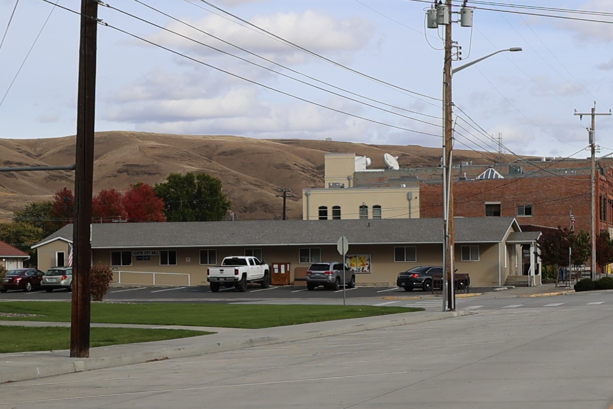

 Contact Us  [kim](https://cityofasotin.org/author/kim/)  2024-12-06T20:40:56+00:00 

 __ City of Asotin__ 

Email:  [cityclerk@cityofasotin.org](mailto:cityclerk@cityofasotin.org) 

Phone: (509) 243-4411

Fax: (509) 243-1223

Street Address: 121 Cleveland Street, Asotin, WA ( [map](https://goo.gl/maps/eC81ngahNbjSQgcH7) )

Mailing Address: PO Box 517 Asotin, WA 99402

Hours: 9:00am – 5:00pm, Monday – Friday

##### 

##### 

##### 

##### 

    

####  [**  **City Hall Directory](#4801d345ad75cdd86) 

|__Title__|__Name__|__Email__|
|---|---|---|
|Mayor:|Dwayne Paris|Term Expires 12/2024|[dparis@cityofasotin.org](mailto:dparis@cityofasotin.org)| |---||
||||
|Mayor Pro Tem:|Lori Loseth|Term Expires 12/2024|[lloseth@cityofasotin.org](mailto:lloseth@cityofasotin.org)| |---||
||||
|City Clerk Treasurer:|Tina Davidson||[cityclerk@cityofasotin.org](mailto:cityclerk@cityofasotin.org)| |---||
||||
|Deputy Clerk:|Dessa Myrick||[deputyclerk@cityofasotin.org](mailto:deputyclerk@cityofasotin.org)| |---||
||||
|Waste WaterTreatment Plant:|Bill Frye||[bfrye@cityofasotin.org](mailto:bfrye@cityofasotin.org)| |---||
||||
|Building Inspector:|Bill Frye||[bfrye@cityofasotin.org](mailto:bfrye@cityofasotin.org)| |---||
||||
|Public WorksSuperintendent:|Bob Portlock||[bportlock@cityofasotin.org](mailto:bportlock@cityofasotin.org)| |---||
||||
|Maintenance Technician:|Wes Rains||[wrains@cityofasotin.org](mailto:wrains@cityofasotin.org)| |---||
||||
|Chief of Police:|Monte Renzelman||[mrenzelman@cityofasotin.org](mailto:mrenzelman@cityofasotin.org)| |---||
||||
|Reserves:|Blake Richards||[brichards@cityofasotin.org](mailto:dmanchester@cityofasotin.org)| |---||
||||
|Council Members:Position #1|David Weakland|Term Expires 12/2024|[dweakland@cityofasotin.org](mailto:dweakland@cityofasotin.org)| |---||
||||
|Council Members:Position #2|Lori Loseth|Term Expires 12/2024|[lloseth@cityofasotin.org](mailto:lloseth@cityofasotin.org)| |---||
||||
|Council Members:Position #3|Steve Cowdrey|Term Expires 12/2026|[scowdrey@cityofasotin.org](mailto:scowdrey@cityofasotin.org)| |---||
||||
|Council Members:Position #4|Craig Stein|Term Expires 12/2024|[cstein@cityofasotin.org](mailto:cstein@cityofasotin.org)| |---||
||||
|Council Members:Position #5|Tim Ottmar|Term Expires 12/2026|[tottmar@cityofasotin.org](mailto:tottmar@cityofasotin.org)| |---||
||||
|Fire Chief|Shawn Balzer||[asotinfire@gmail.com](https://cityofasotin.org/city-hall-directory/)| |---||
||||
|<City Attorney|Adam W. Papini||[cityattorney@cityofasotin.org](mailto:cityattorney@cityofasotin.org)| |---||

####  [**  **Directory of Committee Members](#17f3f0a63f566f144) 

|__Title__|__Name__|__Email__|
|---|---|---|
|Mayor Pro Term|Council MemberLori Loseth|[lloseth@cityofasotin.org](mailto:lloseth@cityofasotin.org)|
||||
|Administrative & Personnel|Council MemberSteve Cowdrey|[scowdrey@cityofasotin.org](mailto:scowdrey@cityofasotin.org)|
||Council MemberLori Loseth|[lloseth@cityofasotin.org](mailto:lloseth@cityofasotin.org)|
||||
|Public Safety & Fire Safety &Law Enforcement & Emergency|Council MemberDavid Weakland|[dweakland@cityofasotin.org](mailto:dweakland@cityofasotin.org)|
||Council MemberTim Ottmar|[tottmar@cityofasotin.org](mailto:tottmar@cityofasotin.org)|
||||
|Public Works: Water, Sewer, Utility Franchises|Council MemberSteve Cowdrey|[scowdrey@cityofasotin.org](mailto:scowdrey@cityofasotin.org)|
||Council MemberCraig Stein|[cstein@cityofasotin.org](mailto:cstein@cityofasotin.org)|
||||
|Transportation: Streets, DOT liaison|Council MemberCraig Stein|[cstein@cityofasotin.org](mailto:cstein@cityofasotin.org)|
||Mayor Paris|[dparis@cityofasotin.org](mailto:dparis@cityofasotin.org)|
||||
|Park and Recreation:Parks, Cemetery, Historical|Council Member Craig Stein|[cstein@cityofasotin.org](mailto:cstein@cityofasotin.org)|
||Council Member Tim Ottmar|[tottmar@cityofasotin.org](mailto:tottmar@cityofasotin.org)|
||||
|Finance:|Council Member: Craig Stein|[cstein@cityofasotin.org](mailto:cstein@cityofasotin.org)|
||Mayor Paris|[dparis@cityofasotin.org](mailto:dparis@cityofasotin.org)|
||||
|Planning Commission:|Mercia Neace|Chair|
||Elaine Greene|V-Chair|
||Anne Beste|Secretary|
||Bryson Stein||
||Angela Nightingale||
||Gary Bourassa||
||Sam Hill||
|EMS Council:|Council Member Lori Loseth|[lloseth@cityofasotin.org](mailto:lloseth@cityofasotin.org)|
||||
|Asotin County Health District:|Council Member Lori Loseth|[lloseth@cityofasotin.org](mailto:lloseth@cityofasotin.org)|
||Council Member VACANT||
||||
|Public Transportation Benefit Area|Council Member: Craig Stein|[cstein@cityofasotin.org](mailto:cstein@cityofasotin.org)|
||||
|MPO Technical Advisory Committee|Public Works, Bob Portlock|[bportlock@cityofasotin.org](mailto:bportlock@cityofasotin.org)|
||||
|MPO Policy Board|Mayor Paris|[dparis@cityofasotin.org]()|
||||
|Stormwater|Council MemberDavid Weakland|[dweakland@cityofasotin.org](mailto:dweakland@cityofasotin.org)|
||Public WorksBob Portlock|[bportlock@cityofasotin.org](mailto:bportlock@cityofasotin.org)|
||||
|Asotin Days|Council Member Lori Loseth|[lloseth@cityofasotin.org](mailto:lloseth@cityofasotin.org)|
||Council Member David Weakland|[dweakland@cityofasotin.org](mailto:dweakland@cityofasotin.org)|
||||
|Asotin County Solid Waste Advisory|ON-HOLD|Vacant|
||||

 